# x402 v2-development Branch Guide

This document provides comprehensive guidance for working with the x402 v2-development branch, focusing on the reference implementations in the `/e2e` directory.

## Table of Contents

- [Overview](#overview)
- [Environment Management](#environment-management)
- [Development Tools](#development-tools)
- [Architecture](#architecture)
- [Reference Implementations](#reference-implementations)
- [Test Harness](#test-harness)
- [Development Workflow](#development-workflow)
- [Git Best Practices](#git-best-practices)

---

## Overview

### Branch Purpose

The `v2-development` branch contains the next generation of the x402 payment protocol implementation. This branch places legacy code into `/legacy` directories which should be largely ignored when working on v2 features.

### Key Directories

```
x402/
├── e2e/                    # v2 reference implementations and test suite
│   ├── clients/           # Reference client implementations
│   │   └── fetch/        # TypeScript fetch client (reference)
│   ├── servers/          # Reference server implementations
│   │   └── express/      # TypeScript Express server (reference)
│   ├── src/              # Shared test infrastructure
│   │   ├── clients/      # Generic client proxy
│   │   ├── servers/      # Generic server proxy
│   │   ├── discovery.ts  # Test discovery system
│   │   ├── types.ts      # Shared type definitions
│   │   ├── proxy-base.ts # Base proxy implementation
│   │   └── logger.ts     # Test logging utilities
│   ├── legacy/           # v1 implementations (IGNORE for v2 work)
│   ├── test.ts           # Main test runner
│   ├── README.md         # E2E test documentation
│   └── TODO.md           # Implementation roadmap
└── legacy/               # Legacy code (IGNORE for v2 work)
```


### What to Focus On

**✅ Focus on:**
- `/e2e` directory (excluding `/e2e/legacy`)
- Reference implementations: `e2e/clients/fetch` and `e2e/servers/express`
- Test harness infrastructure in `e2e/src/`
- v2 protocol specifications

**❌ Ignore:**
- `/e2e/legacy/` directory
- Any `/legacy/` directories throughout the project
- v1 protocol implementations

---

## Environment Management

### Using mise

This project uses [mise](https://mise.jdx.dev/) for managing development tool versions. The `.mise.toml` file at the project root defines all required tool versions:

- **Node.js**: 22.x (>=18.0.0 required)
- **pnpm**: 10.7.0 (exact version required)
- **Python**: 3.13.x (>=3.10 required)
- **Go**: 1.23.3
- **Java**: 17.x (>=17 required)
- **Maven**: latest

#### mise Commands

```bash
# Install all tools defined in .mise.toml
mise install

# Check currently active versions
mise current

# Trust the config file (required on first setup)
mise trust
```

mise automatically activates the correct tool versions when you `cd` into the project directory.

### Environment Variables

The e2e test suite requires the following environment variables:

```bash
# Required for running tests
SERVER_EVM_ADDRESS=0x...      # Address to receive payments
SERVER_SVM_ADDRESS=...        # Solana address for SVM tests
CLIENT_EVM_PRIVATE_KEY=0x...  # Private key for test client
CLIENT_SVM_PRIVATE_KEY=...    # Solana private key for test client

# Optional
SERVER_PORT=4021              # Server port (default: 4021)
CDP_API_KEY_ID=...           # For CDP facilitator tests
CDP_API_KEY_SECRET=...       # For CDP facilitator tests
```

---

## Development Tools

### MCP Mermaid Server

This repository is configured with the [MCP Mermaid](https://github.com/modelcontextprotocol/servers) server for creating professional diagrams in documentation.

**Configuration**: `.cursor/mcp.json`

```json
{
  "mcpServers": {
    "mcp-mermaid": {
      "command": "npx",
      "args": ["-y", "mcp-mermaid"]
    }
  }
}
```

#### Creating Diagrams

When working on documentation (especially CLAUDE.md or README files), use Mermaid diagrams for:

**Sequence Diagrams** - Perfect for showing protocol flows and interactions:


**Flowcharts** - Great for decision trees and process flows:


**Class Diagrams** - Useful for showing code structure:


**State Diagrams** - For showing state machines:


**Architecture Diagrams** - Component relationships:


#### Best Practices for Diagrams

1. **Use Mermaid for all diagrams** - They render on GitHub and are version-controllable
2. **Keep diagrams focused** - One concept per diagram
3. **Add clear labels** - Every arrow and node should be self-explanatory
4. **Use consistent styling** - Follow the patterns in existing diagrams
5. **Test rendering** - Preview diagrams before committing

#### When to Create Diagrams

- **Architecture changes** - Document new component interactions
- **Protocol flows** - Show request/response sequences
- **Test scenarios** - Illustrate test execution flow
- **Decision processes** - Show branching logic and conditions
- **System states** - Document state transitions

#### MCP Mermaid Tool Reminder

**IMPORTANT**: When Claude Code needs to create or update diagrams in this repository:
- The mcp-mermaid server provides tools for generating Mermaid diagram syntax
- Use these tools to create professional, consistent diagrams
- All diagrams should use Mermaid format for GitHub compatibility
- Prefer visual diagrams over ASCII art for complex flows

---

## Architecture

### x402 Protocol v2 Overview

The x402 protocol enables HTTP endpoints to require micropayments for access. The v2 architecture consists of three main components:

1. **Client** - Makes HTTP requests and handles payment requirements
2. **Server** - Protects endpoints and validates payments
3. **Facilitator** - Verifies payments and handles settlement

### Payment Flow


### Protocol Families

The x402 protocol supports multiple blockchain networks organized into protocol families:

- **EVM** (Ethereum Virtual Machine) - Base, Base Sepolia, etc.
- **SVM** (Solana Virtual Machine) - Solana, Solana Devnet

Each implementation can support one or more protocol families.

### Payment Schemes

- **exact** - Exact payment amount using EIP-712 typed signatures
- More schemes may be added in future versions

---

## Reference Implementations

### TypeScript Fetch Client

**Location**: `e2e/clients/fetch/`

The reference client demonstrates how to integrate x402 payment handling into HTTP client libraries.

#### Key Files

- `index.ts` - Main client implementation
- `test.config.json` - Client configuration and capabilities
- `run.sh` - Execution script for test harness

#### Architecture

```typescript
// Core flow in e2e/clients/fetch/index.ts

// 1. Setup wallet and payment client
const account = privateKeyToAccount(process.env.EVM_PRIVATE_KEY as `0x${string}`);
const fetchWithPayment = wrapFetchWithPayment(fetch, {
  schemes: [
    {
      network: "eip155:*",
      client: new ExactEvmClient(account),
    },
  ],
});

// 2. Make request - payment handling is automatic
const response = await fetchWithPayment(url, { method: "GET" });

// 3. Process response and payment details
const data = await response.json();
const paymentResponse = response.headers.get("PAYMENT-RESPONSE");
```

#### Configuration

The `test.config.json` defines client capabilities:

```json
{
  "name": "fetch",
  "type": "client",
  "language": "typescript",
  "protocolFamilies": ["evm"],
  "x402Versions": [1, 2],
  "environment": {
    "required": ["EVM_PRIVATE_KEY", "RESOURCE_SERVER_URL", "ENDPOINT_PATH"],
    "optional": []
  }
}
```

### TypeScript Express Server

**Location**: `e2e/servers/express/`

The reference server demonstrates how to protect HTTP endpoints with x402 payment middleware.

#### Key Files

- `index.ts` - Express server with payment middleware
- `facilitator.ts` - Local facilitator configuration
- `test.config.json` - Server configuration and endpoints
- `run.sh` - Execution script for test harness

#### Architecture

```typescript
// Core flow in e2e/servers/express/index.ts

// 1. Initialize Express app
const app = express();

// 2. Configure payment middleware
app.use(
  paymentMiddleware(
    {
      // Route configuration
      "GET /protected": {
        payTo: PAYEE_ADDRESS,
        scheme: "exact",
        price: "$0.001",
        network: NETWORK,
      },
    },
    // Facilitator client
    localFacilitatorClient,
    // Payment scheme handlers
    [
      {
        network: NETWORK,
        server: new ExactEvmService()
      }
    ]
  )
);

// 3. Define protected endpoints
app.get("/protected", (req, res) => {
  res.json({
    message: "Protected endpoint accessed successfully",
    timestamp: new Date().toISOString(),
  });
});
```

#### Local Facilitator

The server includes a local facilitator for testing (`facilitator.ts`):

```typescript
// Facilitator setup in e2e/servers/express/facilitator.ts

// 1. Initialize facilitator
const facilitator = new x402Facilitator();

// 2. Register payment scheme
facilitator.registerScheme(
  NETWORK,
  new ExactEvmFacilitator(viemSigner)
);

// 3. Wrap as FacilitatorClient
export class LocalFacilitatorClient implements FacilitatorClient {
  verify(payload, requirements) { /* ... */ }
  settle(payload, requirements) { /* ... */ }
  getSupported() { /* ... */ }
}
```

### Proxy System

The test harness uses a proxy system to manage client and server processes consistently across different languages and frameworks.

#### BaseProxy (`e2e/src/proxy-base.ts`)

Provides common process management functionality:
- Starting/stopping processes via `run.sh` scripts
- Capturing stdout/stderr for debugging
- Handling timeouts and cleanup

#### GenericClientProxy (`e2e/src/clients/generic-client.ts`)

Manages client execution:
- Runs client as one-shot process
- Parses JSON output from stdout
- Returns structured `ClientCallResult`

#### GenericServerProxy (`e2e/src/servers/generic-server.ts`)

Manages server lifecycle:
- Starts server and waits for ready signal
- Provides health check endpoint access
- Handles graceful shutdown via `/close` endpoint

---

## Test Harness

### Overview

The e2e test harness automatically discovers clients and servers, generates test scenarios, and validates the complete payment flow.

**Location**: `e2e/test.ts`

### Test Discovery

The discovery system (`e2e/src/discovery.ts`) automatically finds and configures implementations:

```typescript
// Discovery process
const discovery = new TestDiscovery('.', includeLegacy);

// 1. Discover servers
const servers = discovery.discoverServers();
// Finds: e2e/servers/*/test.config.json

// 2. Discover clients
const clients = discovery.discoverClients();
// Finds: e2e/clients/*/test.config.json

// 3. Generate scenarios
const scenarios = discovery.generateTestScenarios();
// Creates: client × server × endpoint × network combinations
```



```mermaid
flowchart TD
    Start([Test Discovery]) --> ScanClients[Scan e2e/clients/]
    Start --> ScanServers[Scan e2e/servers/]

    ScanClients --> LoadClientConfigs[Load test.config.json<br/>files]
    ScanServers --> LoadServerConfigs[Load test.config.json<br/>files]

    LoadClientConfigs --> ParseClients[Parse Client Metadata<br/>- Protocol families<br/>- x402 versions<br/>- Language]
    LoadServerConfigs --> ParseServers[Parse Server Metadata<br/>- Protocol families<br/>- x402 version<br/>- Endpoints]

    ParseClients --> ClientList[(Client List)]
    ParseServers --> ServerList[(Server List)]

    ClientList --> GenerateScenarios{Generate Test<br/>Scenarios}
    ServerList --> GenerateScenarios

    GenerateScenarios --> CheckVersions{Version<br/>Compatible?}
    CheckVersions -->|No| Skip[Skip Combination]
    CheckVersions -->|Yes| CheckProtocol{Protocol<br/>Family Match?}

    CheckProtocol -->|No| Skip
    CheckProtocol -->|Yes| CreateScenario[Create Test Scenario<br/>Client × Server × Endpoint<br/>× Network × Facilitator]

    CreateScenario --> ScenarioList[(Test Scenarios)]
    Skip --> NextCombo{More<br/>Combinations?}
    NextCombo -->|Yes| GenerateScenarios
    NextCombo -->|No| ScenarioList

    ScenarioList --> RunTests[Execute Test Suite]

    style Start fill:#87CEEB
    style ClientList fill:#90EE90
    style ServerList fill:#90EE90
    style ScenarioList fill:#FFD700
    style RunTests fill:#87CEEB
```

### Test Configuration

Each implementation requires a `test.config.json` file:

```json
{
  "name": "implementation-name",
  "type": "client" | "server",
  "language": "typescript" | "python" | "go",
  "protocolFamilies": ["evm", "svm"],
  "x402Versions": [1, 2],  // For clients: supported versions
  "x402Version": 2,         // For servers: implemented version
  "endpoints": [            // For servers only
    {
      "path": "/protected",
      "method": "GET",
      "requiresPayment": true,
      "protocolFamily": "evm"
    }
  ],
  "environment": {
    "required": ["ENV_VAR_1", "ENV_VAR_2"],
    "optional": ["OPTIONAL_VAR"]
  }
}
```

### Running Tests

```bash
# Full suite
pnpm test                     # Run all tests

# Development mode (recommended)
pnpm test -d                  # Test on testnet
pnpm test -d -v               # Test with verbose logging

# Language filters
pnpm test -d -ts              # Test TypeScript implementations
pnpm test -d -py              # Test Python implementations
pnpm test -d -go              # Test Go implementations

# Implementation filters
pnpm test -d --client=fetch   # Test specific client
pnpm test -d --server=express # Test specific server

# Protocol family filters
pnpm test -d -f evm           # Test EVM protocol family
pnpm test -d -f svm           # Test SVM protocol family

# Network filters
pnpm test --network=base-sepolia  # Test on Base Sepolia

# Legacy compatibility
pnpm test --legacy            # Include legacy implementations
```

### Test Scenarios

The harness generates scenarios by combining:

1. **Client** - One of the discovered clients
2. **Server** - One of the discovered servers
3. **Endpoint** - A payment-protected endpoint
4. **Protocol Family** - EVM or SVM
5. **Network** - Test network or mainnet
6. **Facilitator** - Local or remote facilitator

Version compatibility is enforced:
- Client's `x402Versions` must include server's `x402Version`
- Both must support the endpoint's `protocolFamily`

### Test Flow

For each scenario, the harness:

1. Starts the server with appropriate configuration
2. Waits for server health check to pass
3. Runs the client against the protected endpoint
4. Validates the payment flow completed successfully
5. Cleans up server and client processes


### Adding New Implementations

To add a new client or server implementation:

1. **Create implementation directory**
   ```bash
   mkdir -p e2e/clients/my-client
   # or
   mkdir -p e2e/servers/my-server
   ```

2. **Add test.config.json**
   ```json
   {
     "name": "my-client",
     "type": "client",
     "language": "typescript",
     "protocolFamilies": ["evm"],
     "x402Versions": [2],
     "environment": {
       "required": ["EVM_PRIVATE_KEY", "RESOURCE_SERVER_URL", "ENDPOINT_PATH"]
     }
   }
   ```

3. **Create run.sh**
   ```bash
   #!/bin/bash
   pnpm tsx index.ts
   ```

4. **Implement the client/server**
   - For clients: Output JSON result to stdout
   - For servers: Implement `/health` and `/close` endpoints

5. **Run tests**
   ```bash
   pnpm test -d --client=my-client
   ```

---

## Development Workflow

### Initial Setup

```bash
# 1. Switch to v2-development branch
git fetch upstream
git checkout -b your-branch upstream/v2-development

# 2. Install dependencies
mise install
pnpm install

# 3. Set up environment variables
cp .env.example .env
# Edit .env with your keys

# 4. Run tests to verify setup
cd e2e
pnpm test -d -ts
```

### Development Cycle

```bash
# 1. Make changes to implementation

# 2. Run focused tests
pnpm test -d --client=fetch --server=express -v

# 3. Run full test suite
pnpm test -d -ts

# 4. Commit changes (see Git Best Practices below)
```

### Debugging

```bash
# Verbose logging
pnpm test -d -v

# Save logs to file
pnpm test -d -v --log-file=test-output.log

# Test specific combination
pnpm test -d --client=fetch --server=express -v

# Run server manually for debugging
cd e2e/servers/express
pnpm install
EVM_PRIVATE_KEY=0x... EVM_ADDRESS=0x... pnpm start

# In another terminal, run client
cd e2e/clients/fetch
pnpm install
EVM_PRIVATE_KEY=0x... RESOURCE_SERVER_URL=http://localhost:4021 ENDPOINT_PATH=/protected pnpm dev
```

---

## Git Best Practices

### CRITICAL: Staging Files

**NEVER use `git add .`** - Always stage files explicitly and only those related to your work:

```bash
# ✅ Good - stage specific files
git add e2e/clients/fetch/index.ts
git add e2e/clients/fetch/test.config.json

# ✅ Good - stage specific directories for your feature
git add e2e/clients/fetch/

# ❌ Bad - stages everything including unrelated changes
git add .
```

### Commit Messages

**NEVER include AI assistant advertisements or attributions** in commit messages. Write clean, informative commits following conventional commit format:

```bash
# ✅ Good commit messages
git commit -m "feat: add payment verification timeout handling"
git commit -m "fix: resolve race condition in settlement flow"
git commit -m "docs: update README with v2 architecture changes"
git commit -m "test: add integration tests for express middleware"
git commit -m "refactor: simplify payment payload encoding"

# ❌ Bad commit messages - NEVER do this
git commit -m "feat: add feature 🤖 Generated with Claude Code"
git commit -m "fix: bug fix

Co-Authored-By: Claude <noreply@anthropic.com>"
```

### Conventional Commit Format

Use the format: `<type>: <description>`

**Types**:
- `feat:` - New feature
- `fix:` - Bug fix
- `docs:` - Documentation changes
- `test:` - Adding or updating tests
- `refactor:` - Code refactoring without feature changes
- `chore:` - Maintenance tasks (dependencies, config, etc.)
- `perf:` - Performance improvements
- `style:` - Code style changes (formatting, whitespace)

### Git Configuration

**CRITICAL: Configure your git identity BEFORE making commits:**

```bash
# Set your GitHub username and email
git config user.name "Your GitHub Username"
git config user.email "your.github.email@example.com"

# Verify configuration
git config user.name
git config user.email
```

**Why this matters**: Git will use your machine hostname if not configured, resulting in commits like `Signed-off-by: Ryan R. Fox <fox@Foxs-MBP-M4.local>` which exposes your machine name and is not your GitHub identity.

**For this repository specifically**:
```bash
# Set identity for x402 repository only
cd /path/to/x402
git config user.name "YourGitHubUsername"
git config user.email "your-github-email@example.com"
```

### Before Committing

1. **Verify git config**: Ensure `git config user.email` returns your GitHub email (not hostname)
2. Review what you're staging: `git status` and `git diff --staged`
3. Only stage files related to the specific change you're making
4. Write a clear, concise commit message describing WHY the change was made

### Creating Pull Requests

```bash
# 1. Ensure your branch is up to date
git fetch upstream
git rebase upstream/v2-development

# 2. Push to your fork
git push origin your-branch

# 3. Create PR via GitHub
# - Target: upstream/v2-development
# - Title: Clear, descriptive title following conventional commit format
# - Description: Explain what, why, and how
# - Link any related issues

# 4. Address review feedback
# - Make requested changes
# - Add new commits (don't force push during review)
# - Request re-review when ready
```

---

## Additional Resources

### Documentation Files

- `/e2e/README.md` - E2E test suite documentation
- `/e2e/TODO.md` - Implementation roadmap and pending work
- `/e2e/clients/fetch/README.md` - Fetch client usage guide
- `/e2e/servers/express/README.md` - Express server usage guide

### Key Type Definitions

See `e2e/src/types.ts` for:
- `TestConfig` - Implementation configuration schema
- `TestScenario` - Generated test scenario structure
- `ClientConfig` / `ServerConfig` - Runtime configuration
- `ClientProxy` / `ServerProxy` - Proxy interfaces

### Protocol Specifications

Protocol specifications should be referenced from the main x402 documentation (location TBD on this branch).

---

## Troubleshooting

### Common Issues

**"No test scenarios found"**
- Check that `test.config.json` files exist in implementation directories
- Verify `type`, `x402Version(s)`, and `protocolFamilies` are set correctly
- Ensure `endpoints` array includes `requiresPayment: true` for servers

**"Version mismatch" warnings**
- Client's `x402Versions` array must include the server's `x402Version`
- Update client or server to support compatible versions

**"Server failed to become healthy"**
- Check server logs with `-v` flag
- Verify environment variables are set correctly
- Ensure port is not already in use
- Try running server manually to debug

**"Payment verification fails"**
- Verify private key matches expected account
- Check network configuration matches between client and server
- Ensure sufficient balance for gas fees
- Verify facilitator is configured correctly

**mise command not found**
- Install mise: `curl https://mise.jdx.dev/install.sh | sh`
- Or follow installation instructions at https://mise.jdx.dev/

### Getting Help

- Check existing issues in the x402 repository
- Review test output with `-v` flag for detailed logs
- Run components manually to isolate issues
- Consult the implementation README files in `/e2e/clients/` and `/e2e/servers/`

---

## Contributing

When contributing to the v2-development branch:

1. **Focus on v2** - Ignore legacy implementations
2. **Follow conventions** - Use existing reference implementations as templates
3. **Test thoroughly** - Run the full e2e test suite
4. **Document changes** - Update READMEs and this guide as needed
5. **Follow Git practices** - See "Git Best Practices" section above

The goal is to build a robust, well-tested v2 protocol with clear reference implementations that serve as examples for all language integrations.
