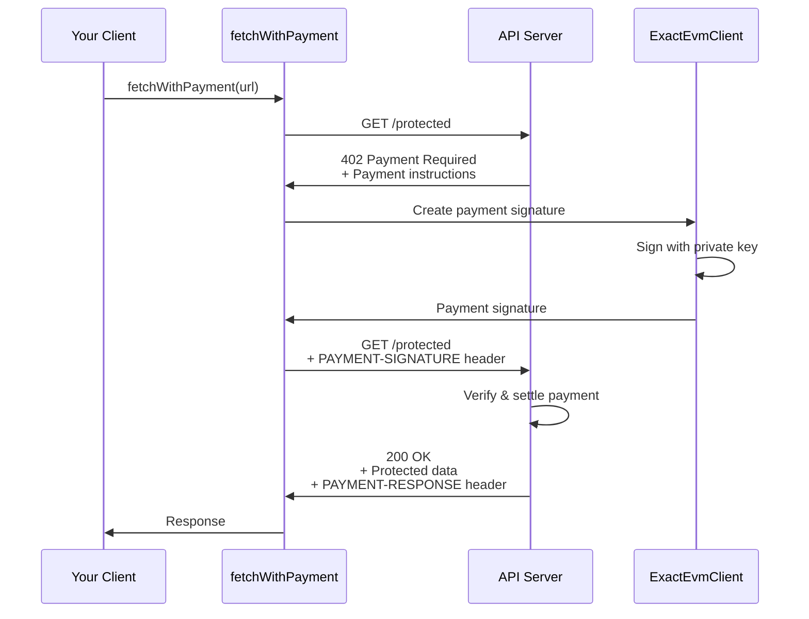

# Client Quick Start

Build your first x402 payment client in under 10 minutes. This guide walks you through making a paid API request using the x402 SDK.

## Table of Contents

- [What You'll Build](#what-youll-build)
- [Prerequisites](#prerequisites)
- [Step 1: Create Project](#step-1-create-project)
- [Step 2: Install Dependencies](#step-2-install-dependencies)
- [Step 3: Configure Environment](#step-3-configure-environment)
- [Step 4: Create the Client](#step-4-create-the-client)
- [Step 5: Run and Test](#step-5-run-and-test)
- [Understanding the Code](#understanding-the-code)
- [Error Handling](#error-handling)
- [Troubleshooting](#troubleshooting)
- [Next Steps](#next-steps)

---

## What You'll Build

A simple client that:
1. Connects to a paid API endpoint
2. Automatically handles the 402 Payment Required response
3. Signs and submits a payment
4. Receives and displays the protected data

**Expected result:**
```json
{
  "success": true,
  "data": {
    "message": "Protected endpoint accessed successfully",
    "timestamp": "2024-10-24T12:00:00.000Z"
  },
  "payment": {
    "amount": "1000",
    "token": "USDC",
    "network": "eip155:84532"
  }
}
```

---

## Prerequisites

Before you begin:

- ✅ [Installation & Setup](./installation.md) completed
- ✅ Node.js >= 18.0.0 installed
- ✅ Wallet with private key ready
- ✅ Testnet USDC available (for Base Sepolia)

**Don't have a setup yet?** Start with [Installation & Setup](./installation.md).

---

## Step 1: Create Project

Create a new directory and initialize your project:

```bash
# Create project directory
mkdir x402-client-demo
cd x402-client-demo

# Initialize package.json
pnpm init

# Create source file
mkdir src
touch src/client.ts
```

**Update package.json to use ES modules:**
```json
{
  "name": "x402-client-demo",
  "version": "1.0.0",
  "type": "module",
  "scripts": {
    "start": "tsx src/client.ts"
  }
}
```

---

## Step 2: Install Dependencies

Install the x402 client SDK and required dependencies:

```bash
pnpm add @x402/fetch @x402/evm viem dotenv
pnpm add -D tsx typescript @types/node
```

**What each package does:**
- `@x402/fetch` - Wraps native fetch with payment handling
- `@x402/evm` - EVM payment scheme implementation
- `viem` - Ethereum account and signature utilities
- `dotenv` - Environment variable management
- `tsx` - TypeScript execution (dev dependency)

---

## Step 3: Configure Environment

Create a `.env` file with your configuration:

```bash
# .env
EVM_PRIVATE_KEY=0x1234567890abcdef...  # Your wallet private key
RESOURCE_SERVER_URL=http://localhost:4021
ENDPOINT_PATH=/protected
```

**Important:** Add `.env` to `.gitignore`:
```bash
echo ".env" >> .gitignore
```

**Don't have a private key?** See [Wallet Setup](./installation.md#wallet-setup) in the installation guide.

---

## Step 4: Create the Client

Open `src/client.ts` and add the complete client implementation:

```typescript
// src/client.ts
import { config } from 'dotenv';
import { wrapFetchWithPayment, decodePaymentResponseHeader } from '@x402/fetch';
import { privateKeyToAccount } from 'viem/accounts';
import { ExactEvmClient } from '@x402/evm';

// Load environment variables
config();

// Validate required environment variables
const requiredEnvVars = ['EVM_PRIVATE_KEY', 'RESOURCE_SERVER_URL', 'ENDPOINT_PATH'];
for (const envVar of requiredEnvVars) {
  if (!process.env[envVar]) {
    console.error(`Error: ${envVar} is not set in .env file`);
    process.exit(1);
  }
}

// Configuration
const baseURL = process.env.RESOURCE_SERVER_URL as string;
const endpointPath = process.env.ENDPOINT_PATH as string;
const url = `${baseURL}${endpointPath}`;

// Create account from private key
const account = privateKeyToAccount(process.env.EVM_PRIVATE_KEY as `0x${string}`);

console.log('x402 Client Demo');
console.log('================\n');
console.log('Configuration:');
console.log(`  Wallet Address: ${account.address}`);
console.log(`  Target URL: ${url}`);
console.log(`  Network: eip155:* (supports all EVM chains)\n`);

// Wrap fetch with x402 payment handling
const fetchWithPayment = wrapFetchWithPayment(fetch, {
  schemes: [
    {
      network: "eip155:*",  // Match any EVM network
      client: new ExactEvmClient(account),
    },
  ],
});

// Make the request
console.log('Making request to paid endpoint...\n');

fetchWithPayment(url, {
  method: "GET"
})
  .then(async response => {
    // Get the response data
    const data = await response.json();

    // Parse payment response header
    const paymentResponseHeader = response.headers.get("PAYMENT-RESPONSE");
    const paymentResponse = paymentResponseHeader
      ? decodePaymentResponseHeader(paymentResponseHeader)
      : null;

    // Display results
    console.log('✅ Request successful!\n');
    console.log('Response Status:', response.status);
    console.log('\nResponse Data:');
    console.log(JSON.stringify(data, null, 2));

    if (paymentResponse) {
      console.log('\nPayment Details:');
      console.log(JSON.stringify(paymentResponse, null, 2));
    }

    // Create structured result
    const result = {
      success: true,
      statusCode: response.status,
      data: data,
      payment: paymentResponse
    };

    console.log('\n✅ Payment completed successfully');
    return result;
  })
  .catch(error => {
    console.error('❌ Request failed:\n');

    if (error.response) {
      // HTTP error response
      console.error('Status:', error.response.status);
      console.error('Message:', error.message);
    } else if (error.code === 'ECONNREFUSED') {
      // Connection error
      console.error('Cannot connect to server at', url);
      console.error('Make sure the server is running at', baseURL);
    } else {
      // Other error
      console.error('Error:', error.message);
    }

    process.exit(1);
  });
```

---

## Step 5: Run and Test

### Start a Test Server (Optional)

If you don't have a server running, you can use the x402 reference implementation:

```bash
# In a new terminal window
cd /path/to/x402/e2e/servers/express
pnpm install
EVM_ADDRESS=0x742d35Cc6634C0532925a3b844Bc454e4438f44e EVM_PRIVATE_KEY=0xac0974bec39a17e36ba4a6b4d238ff944bacb478cbed5efcae784d7bf4f2ff80 pnpm start
```

**Or follow the [Server Quick Start](./quick-start-server.md) to build your own.**

### Run Your Client

```bash
pnpm start
```

**Expected output:**

```
x402 Client Demo
================

Configuration:
  Wallet Address: 0x742d35Cc6634C0532925a3b844Bc454e4438f44e
  Target URL: http://localhost:4021/protected
  Network: eip155:* (supports all EVM chains)

Making request to paid endpoint...

✅ Request successful!

Response Status: 200

Response Data:
{
  "message": "Protected endpoint accessed successfully",
  "timestamp": "2024-10-24T12:00:00.000Z"
}

Payment Details:
{
  "success": true,
  "amount": "1000",
  "token": "USDC",
  "network": "eip155:84532",
  "txHash": "0xabc123..."
}

✅ Payment completed successfully
```

---

## Understanding the Code

Let's break down the key parts of the client:

### 1. Account Setup

```typescript
const account = privateKeyToAccount(process.env.EVM_PRIVATE_KEY as `0x${string}`);
```

Creates a viem account from your private key. This account will sign payment transactions.

### 2. Fetch Wrapper

```typescript
const fetchWithPayment = wrapFetchWithPayment(fetch, {
  schemes: [
    {
      network: "eip155:*",
      client: new ExactEvmClient(account),
    },
  ],
});
```

**What happens here:**
- `wrapFetchWithPayment` wraps the native `fetch` function
- It adds payment handling middleware
- `network: "eip155:*"` means "support all EVM chains"
- `ExactEvmClient` implements the exact payment scheme for EVM

### 3. Payment Flow



**The magic:** The fetch wrapper automatically:
1. Detects the 402 Payment Required response
2. Reads payment requirements from headers
3. Creates and signs the payment
4. Retries the request with payment included
5. Returns the successful response

### 4. Response Handling

```typescript
const paymentResponse = decodePaymentResponseHeader(paymentResponseHeader);
```

The `PAYMENT-RESPONSE` header contains payment details including:
- Settlement status
- Transaction hash
- Amount paid
- Network used

---

## Error Handling

### Common Errors and Solutions

#### 402 Payment Required (Payment Failed)

```typescript
// Error: Payment signature invalid
```

**Solutions:**
- Verify your private key is correct
- Ensure you have sufficient USDC balance
- Check the network matches (Base Sepolia)

#### ECONNREFUSED

```
Error: connect ECONNREFUSED 127.0.0.1:4021
```

**Solutions:**
- Make sure the server is running
- Verify the URL in your `.env` file
- Check the port is correct

#### Invalid Private Key

```
Error: Invalid private key format
```

**Solutions:**
- Ensure private key starts with `0x`
- Verify it's 66 characters long (0x + 64 hex)
- Check for typos in `.env` file

#### Insufficient Funds

```
Error: Insufficient funds for gas
```

**Solutions:**
- Get testnet ETH for gas fees
- Get testnet USDC for payments
- See [Getting Testnet Funds](./installation.md#getting-testnet-funds)

---

## Troubleshooting

### Enable Debug Logging

Add debug output to understand the payment flow:

```typescript
// Add before wrapFetchWithPayment
const originalFetch = fetch;
fetch = async (url, init) => {
  console.log('🔍 Fetch:', url, init?.headers);
  const response = await originalFetch(url, init);
  console.log('📥 Response:', response.status, Object.fromEntries(response.headers));
  return response;
};
```

### Check Network Configuration

Verify your client's network matches the server:

```typescript
console.log('Client network:', "eip155:*");  // Matches any EVM network
```

### Inspect Payment Headers

```typescript
fetchWithPayment(url, { method: "GET" })
  .then(async response => {
    // Log all headers
    console.log('Response Headers:');
    for (const [key, value] of response.headers) {
      console.log(`  ${key}: ${value}`);
    }
  });
```

### Test Without Payment

To verify the server is working, test the health endpoint (no payment required):

```typescript
fetch(`${baseURL}/health`)
  .then(res => res.json())
  .then(data => console.log('Health check:', data))
  .catch(err => console.error('Health check failed:', err));
```

---

## Next Steps

### Customize Your Client

**Add error retry logic:**
```typescript
async function fetchWithRetry(url: string, options: any, retries = 3) {
  for (let i = 0; i < retries; i++) {
    try {
      return await fetchWithPayment(url, options);
    } catch (error) {
      if (i === retries - 1) throw error;
      console.log(`Retry ${i + 1}/${retries}...`);
      await new Promise(resolve => setTimeout(resolve, 1000));
    }
  }
}
```

**Support multiple networks:**
```typescript
const fetchWithPayment = wrapFetchWithPayment(fetch, {
  schemes: [
    {
      network: "eip155:*",  // All EVM chains
      client: new ExactEvmClient(evmAccount),
    },
    {
      network: "solana:*",  // All Solana networks
      client: new ExactSvmClient(svmKeypair),
    },
  ],
});
```

**Cache payment responses:**
```typescript
const paymentCache = new Map();

fetchWithPayment(url, options)
  .then(response => {
    const payment = decodePaymentResponseHeader(
      response.headers.get("PAYMENT-RESPONSE")
    );
    if (payment) {
      paymentCache.set(url, payment);
    }
    return response;
  });
```

### Explore More

- **Build a complete app**: [Next.js Paywall Tutorial](../07-tutorials/tutorial-basic-paywall.md)
- **Understand the protocol**: [Protocol Flows](../02-protocol-flows/happy-path.md)
- **API Reference**: [@x402/fetch Documentation](../03-sdk-reference/http-adapters/fetch.md)
- **Advanced patterns**: [Implementation Guide](../05-implementation-guide/client-implementation.md)

### Try Different Frameworks

The same payment logic works with other HTTP clients:

**Axios:**
```typescript
import { createPaymentInterceptor } from '@x402/axios';
import axios from 'axios';

createPaymentInterceptor(axios, {
  schemes: [{ network: "eip155:*", client: new ExactEvmClient(account) }]
});

const response = await axios.get(url);
```

**Node.js built-in:**
```typescript
import { createServer } from 'http';
// Use @x402/core directly for custom implementations
```

---

## Additional Resources

- [SDK Reference](../03-sdk-reference/README.md) - Complete API documentation
- [Server Quick Start](./quick-start-server.md) - Build a paid API
- [Tutorials](../07-tutorials/README.md) - Complete example applications
- [Reference Implementation](../04-reference-implementation/client-architecture.md) - Production patterns
- [GitHub Repository](https://github.com/coinbase/x402) - Source code and examples
