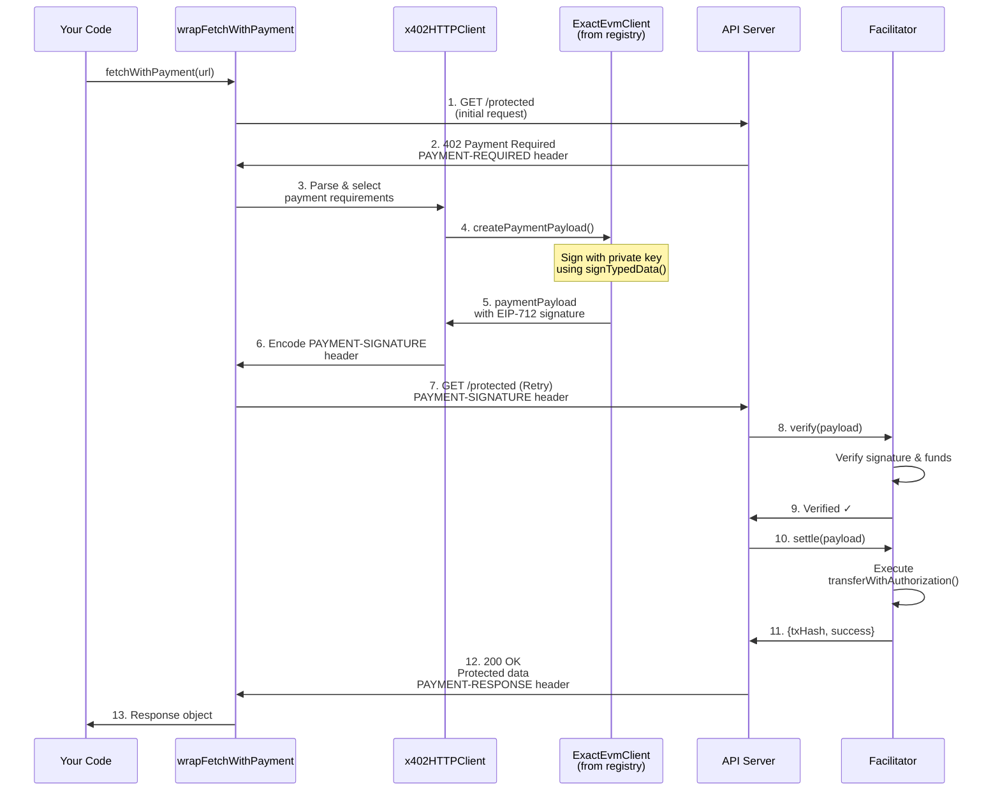

# Client Quick Start

Build your first x402 payment client in under 10 minutes. This guide walks you through making a paid API request using the x402 SDK.

## Table of Contents

- [What You'll Build](#what-youll-build)
- [Prerequisites](#prerequisites)
- [Step 1: Create Project](#step-1-create-project)
- [Step 2: Install Dependencies](#step-2-install-dependencies)
- [Step 3: Configure Environment](#step-3-configure-environment)
- [Step 4: Create the Client](#step-4-create-the-client)
- [Step 5: Run and Test](#step-5-run-and-test)
- [Understanding the Code](#understanding-the-code)
- [Error Handling](#error-handling)
- [Troubleshooting](#troubleshooting)
- [Next Steps](#next-steps)

---

## What You'll Build

A simple client that:
1. Connects to a paid API endpoint
2. Automatically handles the 402 Payment Required response
3. Signs and submits a payment
4. Receives and displays the protected data

**Expected result:**
```json
{
  "success": true,
  "data": {
    "message": "Protected endpoint accessed successfully",
    "timestamp": "2024-10-24T12:00:00.000Z"
  },
  "payment": {
    "amount": "1000",
    "token": "USDC",
    "network": "eip155:84532"
  }
}
```

---

## Prerequisites

Before you begin:

- ✅ [Installation & Setup](./installation.md) completed
- ✅ Node.js >= 18.0.0 installed
- ✅ Wallet with private key ready
- ✅ **Testnet funds on Base Sepolia** - ETH for gas fees and USDC for payments
- ✅ **x402 payment server running** - Follow the [Server Quick Start](./quick-start-server.md) first

**Don't have testnet funds?** Get them from the [Base Sepolia Faucet](https://docs.base.org/base-chain/tools/network-faucets).

**Don't have a setup yet?** Start with [Installation & Setup](./installation.md), then set up a server using the [Server Quick Start](./quick-start-server.md).

---

## Step 1: Create Project

Create a new directory and initialize your project:

```bash
# Create project directory
mkdir x402-client-demo
cd x402-client-demo

# Initialize package.json
pnpm init

# Create source file
mkdir src
touch src/client.ts
```

**Update package.json to use ES modules:**
```json
{
  "name": "x402-client-demo",
  "version": "1.0.0",
  "type": "module",
  "scripts": {
    "start": "tsx src/client.ts"
  }
}
```

---

## Step 2: Install Dependencies

Install the x402 client SDK and required dependencies using local file paths:

```bash
# ⚠️ IMPORTANT: x402 v2 packages are NOT on npm
# Use file: paths to reference local packages in your x402 repository

npm install \
  file:../typescript/packages/http/fetch \
  file:../typescript/packages/mechanisms/evm \
  viem dotenv

npm install -D \
  tsx typescript @types/node
```

**Why file: paths?** The x402 v2 SDK packages are not yet published to npm. They exist only in the local repository. Once v2.0.0 is officially released, these will be available on npm and you can use standard `npm install @x402/fetch` syntax.

**What each package does:**
- `@x402/fetch` - Wraps native fetch with payment handling
- `@x402/evm` - EVM payment scheme implementation
- `viem` - Ethereum account and signature utilities
- `dotenv` - Environment variable management
- `tsx` - TypeScript execution (dev dependency)

**Note**: Adjust the file paths if your project is in a different location relative to the x402 repository. The above example assumes you have:
```
x402/
├── typescript/packages/
│   ├── http/fetch/
│   └── mechanisms/evm/
└── x402-client-demo/        ← Your project here
```

---

## Step 3: Configure Environment

Create a `.env` file with your configuration:

```bash
# .env
EVM_PRIVATE_KEY=0x1234567890abcdef...  # Your wallet private key
RESOURCE_SERVER_URL=http://localhost:4021
ENDPOINT_PATH=/protected
```

**Important:** Add `.env` to `.gitignore`:
```bash
echo ".env" >> .gitignore
```

**Don't have a private key?** See [Wallet Setup](./installation.md#wallet-setup) in the installation guide.

---

## Step 4: Create the Client

Open `src/client.ts` and add the complete client implementation:

```typescript
// src/client.ts
import { config } from 'dotenv';
import { wrapFetchWithPayment, decodePaymentResponseHeader } from '@x402/fetch';
import { privateKeyToAccount } from 'viem/accounts';
import { ExactEvmClient } from '@x402/evm';

// Load environment variables
config();

// Validate required environment variables
const requiredEnvVars = ['EVM_PRIVATE_KEY', 'RESOURCE_SERVER_URL', 'ENDPOINT_PATH'];
for (const envVar of requiredEnvVars) {
  if (!process.env[envVar]) {
    console.error(`Error: ${envVar} is not set in .env file`);
    process.exit(1);
  }
}

// Configuration
const baseURL = process.env.RESOURCE_SERVER_URL as string;
const endpointPath = process.env.ENDPOINT_PATH as string;
const url = `${baseURL}${endpointPath}`;

// Create account from private key
const account = privateKeyToAccount(process.env.EVM_PRIVATE_KEY as `0x${string}`);

console.log('x402 Client Demo');
console.log('================\n');
console.log('Configuration:');
console.log(`  Wallet Address: ${account.address}`);
console.log(`  Target URL: ${url}`);
console.log(`  Network: eip155:* (supports all EVM chains)\n`);

// Wrap fetch with x402 payment handling
const fetchWithPayment = wrapFetchWithPayment(fetch, {
  schemes: [
    {
      network: "eip155:*",  // Match any EVM network
      client: new ExactEvmClient(account),
    },
  ],
});

// Make the request
console.log('Making request to paid endpoint...\n');

fetchWithPayment(url, {
  method: "GET"
})
  .then(async response => {
    // Get the response data
    const data = await response.json();

    // Parse payment response header
    const paymentResponseHeader = response.headers.get("PAYMENT-RESPONSE");
    const paymentResponse = paymentResponseHeader
      ? decodePaymentResponseHeader(paymentResponseHeader)
      : null;

    // Display results
    console.log('✅ Request successful!\n');
    console.log('Response Status:', response.status);
    console.log('\nResponse Data:');
    console.log(JSON.stringify(data, null, 2));

    if (paymentResponse) {
      console.log('\nPayment Details:');
      console.log(JSON.stringify(paymentResponse, null, 2));
    }

    // Create structured result
    const result = {
      success: true,
      statusCode: response.status,
      data: data,
      payment: paymentResponse
    };

    console.log('\n✅ Payment completed successfully');
    return result;
  })
  .catch(error => {
    console.error('❌ Request failed:\n');

    if (error.response) {
      // HTTP error response
      console.error('Status:', error.response.status);
      console.error('Message:', error.message);
    } else if (error.code === 'ECONNREFUSED') {
      // Connection error
      console.error('Cannot connect to server at', url);
      console.error('Make sure the server is running at', baseURL);
    } else {
      // Other error
      console.error('Error:', error.message);
    }

    process.exit(1);
  });
```

---

## Step 5: Run and Test

### Start a Test Server (Optional)

If you don't have a server running, you can use the x402 reference implementation:

```bash
# In a new terminal window
cd /path/to/x402/e2e/servers/express
pnpm install
EVM_ADDRESS=0x742d35Cc6634C0532925a3b844Bc454e4438f44e EVM_PRIVATE_KEY=0xac0974bec39a17e36ba4a6b4d238ff944bacb478cbed5efcae784d7bf4f2ff80 pnpm start
```

**Or follow the [Server Quick Start](./quick-start-server.md) to build your own.**

### Run Your Client

```bash
npm start
```

**Expected output (with funded account):**

```
x402 Client Demo
================

Configuration:
  Wallet Address: 0x742d35Cc6634C0532925a3b844Bc454e4438f44e
  Target URL: http://localhost:4021/protected
  Network: eip155:* (supports all EVM chains)

Making request to paid endpoint...

✅ Request successful!

Response Status: 200

Response Data:
{
  "message": "Protected endpoint accessed successfully",
  "timestamp": "2024-10-24T12:00:00.000Z"
}

Payment Details:
{
  "success": true,
  "amount": "1000",
  "token": "USDC",
  "network": "eip155:84532",
  "txHash": "0xabc123..."
}

✅ Payment completed successfully
```

**Note:** If your account doesn't have USDC funds on Base Sepolia, the payment will fail but the request will still complete. You'll see:
```json
{
  "success": false,
  "errorReason": "transaction_failed",
  "network": "eip155:84532"
}
```

**Get testnet funds:** Visit the [Base Sepolia Faucet](https://docs.base.org/base-chain/tools/network-faucets) to fund your account with testnet ETH and USDC.

---

## Understanding the Code

Let's break down the key parts of the client:

### 1. Account Setup

```typescript
const account = privateKeyToAccount(process.env.EVM_PRIVATE_KEY as `0x${string}`);
```

Creates a viem account from your private key. This account will sign payment transactions.

### 2. Fetch Wrapper

```typescript
const fetchWithPayment = wrapFetchWithPayment(fetch, {
  schemes: [
    {
      network: "eip155:*",
      client: new ExactEvmClient(account),
    },
  ],
});
```

**What happens here:**
- `wrapFetchWithPayment` wraps the native `fetch` function with payment interceptor logic
- The wrapper registers your `ExactEvmClient` instance for the `eip155:*` network (all EVM chains)
- The wrapper **doesn't know upfront** which endpoints require payment - it discovers this when the server responds with `402 Payment Required`
- When a 402 is detected, the wrapper automatically:
  - Extracts payment requirements from the response header
  - Looks up the appropriate scheme client (your `ExactEvmClient`) from its registry
  - Calls `createPaymentPayload()` on that client to create the signature
  - Retries the request with the payment signature header
- `network: "eip155:*"` means "support all EVM chains" (wildcard matching)
- `ExactEvmClient` implements the exact payment scheme for EVM (creates EIP-712 signatures)

### 3. Payment Flow

The `wrapFetchWithPayment` wrapper handles the complete payment flow automatically:



**How it works (by step number in diagram):**

1. **Your code calls wrapper** - You call `fetchWithPayment(url)` from your code
2. **Initial request** - Wrapper makes first request without payment
3. **402 response** - Server responds with payment requirements
4. **Parse & select** - Wrapper delegates to `x402HTTPClient` to parse the 402 response and select which payment method to use
5. **Create payment** - `x402HTTPClient` looks up your registered `ExactEvmClient` from its scheme registry and calls `createPaymentPayload()`
6. **Sign with private key** - `ExactEvmClient` creates an EIP-712 signature using your account's private key via `signTypedData()`
7. **Encode header** - `x402HTTPClient` encodes the signature as a `PAYMENT-SIGNATURE` header
8. **Retry request** - Wrapper makes second request with the `PAYMENT-SIGNATURE` header
9. **Server verification** - Server sends the payload to Facilitator to verify the signature
10. **Verify signature** - Facilitator checks that only the payment owner could have created this signature
11. **Settlement** - Facilitator executes the on-chain transaction to move funds
12. **Settlement result** - Facilitator returns transaction hash to server
13. **Success response** - Server returns 200 OK with `PAYMENT-RESPONSE` header containing details
14. **Return to caller** - Wrapper returns the successful response to your code

**Key insight:** The payment flow is completely transparent to your code - `wrapFetchWithPayment` handles all steps including scheme lookup, private key signing, and retry automatically!

### 3b. How the Wrapper Works Internally

When you call `wrapFetchWithPayment()`, here's exactly what happens:

**Setup Phase (when you create the wrapper):**

```typescript
const fetchWithPayment = wrapFetchWithPayment(fetch, {
  schemes: [
    {
      network: "eip155:*",
      client: new ExactEvmClient(account),  // ← Your client is registered
    },
  ],
});
```

The wrapper:
1. Creates an internal `x402HTTPClient` registry
2. Registers your `ExactEvmClient` for the `eip155:*` network
3. Stores this registry for later use
4. Returns a wrapped `fetch` function that intercepts 402 responses

**Runtime Phase (when you call the wrapped function):**

```typescript
const response = await fetchWithPayment(url, { method: "GET" });
```

Step-by-step execution:

1. **Initial request** (line 102 of wrapper)
   ```typescript
   const response = await fetch(input, init);  // Call original fetch
   ```
   - Makes the request without any payment header
   - Server responds with `402 Payment Required`

2. **Check status** (lines 104-106)
   ```typescript
   if (response.status !== 402) return response;  // Not payment required
   ```
   - If not 402, returns immediately

3. **Parse requirements** (lines 108-130)
   ```typescript
   const paymentRequired = client.getPaymentRequiredResponse(responseHeaders, body);
   ```
   - Extracts `PAYMENT-REQUIRED` header from response
   - Decodes base64 to get payment details (network, amount, asset, etc.)

4. **Select scheme** (lines 133-136)
   ```typescript
   const selectedPaymentRequirements = client.selectPaymentRequirements(
     paymentRequired.x402Version,
     paymentRequired.accepts
   );
   ```
   - Determines which payment scheme to use based on network

5. **⭐ CREATE PAYMENT** (lines 141-144) - **This is where your private key is used**
   ```typescript
   paymentPayload = await client.createPaymentPayload(
     paymentRequired.x402Version,
     selectedPaymentRequirements
   );
   ```
   - Calls your `ExactEvmClient.createPaymentPayload()`
   - Your client calls `signAuthorization()`
   - Which calls `this.signer.signTypedData(domain, types, message)`
   - Which uses your viem `account`'s private key to create an EIP-712 signature
   - **Result:** A cryptographic proof that only you could create

6. **Encode header** (lines 149-150)
   ```typescript
   const paymentHeaders = client.encodePaymentSignatureHeader(paymentPayload);
   ```
   - Converts the signature to a `PAYMENT-SIGNATURE` header (base64-encoded)

7. **Prepare retry request** (lines 163-171)
   ```typescript
   const newInit = {
     ...init,
     headers: {
       ...(init.headers || {}),
       ...paymentHeaders,  // Add PAYMENT-SIGNATURE header
     },
     __is402Retry: true,  // Prevent infinite loops
   };
   ```
   - Creates a new request identical to the first one
   - But adds the `PAYMENT-SIGNATURE` header with your proof

8. **Retry with payment** (lines 174-175)
   ```typescript
   const secondResponse = await fetch(input, newInit);
   return secondResponse;
   ```
   - Makes the request again, this time WITH the payment proof
   - Server verifies the signature
   - If valid, processes the request and sends 200 OK with `PAYMENT-RESPONSE` header
   - Returns the successful response to your code

**The Scheme Registry:**

The key insight is that `wrapFetchWithPayment` maintains a registry of scheme clients:

```
Network Pattern → SchemeNetworkClient
eip155:*      → ExactEvmClient (your instance)
solana:*      → ExactSvmClient (if you added it)
```

When a 402 comes back with `network: "eip155:84532"`, the wrapper:
- Matches it against registered networks ("eip155:*" matches!)
- Looks up the corresponding scheme client (your `ExactEvmClient`)
- Calls that client to create the payment

If you register multiple scheme clients:

```typescript
const fetchWithPayment = wrapFetchWithPayment(fetch, {
  schemes: [
    { network: "eip155:*", client: new ExactEvmClient(evmAccount) },
    { network: "solana:*", client: new ExactSvmClient(solanaKeypair) },
  ],
});
```

The wrapper can handle payments on both EVM chains AND Solana!

### 4. Response Handling

```typescript
const paymentResponse = decodePaymentResponseHeader(paymentResponseHeader);
```

The `PAYMENT-RESPONSE` header contains payment details including:
- Settlement status
- Transaction hash
- Amount paid
- Network used

---

## Error Handling

### Common Errors and Solutions

#### 402 Payment Required (Payment Failed)

```typescript
// Error: Payment signature invalid
```

**Solutions:**
- Verify your private key is correct
- Ensure you have sufficient USDC balance
- Check the network matches (Base Sepolia)

#### ECONNREFUSED

```
Error: connect ECONNREFUSED 127.0.0.1:4021
```

**Solutions:**
- Make sure the server is running
- Verify the URL in your `.env` file
- Check the port is correct

#### Invalid Private Key

```
Error: Invalid private key format
```

**Solutions:**
- Ensure private key starts with `0x`
- Verify it's 66 characters long (0x + 64 hex)
- Check for typos in `.env` file

#### Insufficient Funds

```
Error: Insufficient funds for gas
```

**Solutions:**
- Get testnet ETH for gas fees
- Get testnet USDC for payments
- See [Getting Testnet Funds](./installation.md#getting-testnet-funds)

---

## Troubleshooting

### Enable Debug Logging

Add detailed logging to trace the complete payment flow (initial request → 402 response → retry with payment):

```typescript
import { config } from 'dotenv';
import { wrapFetchWithPayment, decodePaymentResponseHeader } from '@x402/fetch';
import { privateKeyToAccount } from 'viem/accounts';
import { ExactEvmClient } from '@x402/evm';

config();

const account = privateKeyToAccount(process.env.EVM_PRIVATE_KEY as `0x${string}`);
const url = `${process.env.RESOURCE_SERVER_URL}${process.env.ENDPOINT_PATH}`;

// Intercept fetch to log all requests/responses
const originalFetch = fetch;
let requestCount = 0;

const loggingFetch = async (url: string, init?: RequestInit) => {
  requestCount++;
  const requestNum = requestCount;

  console.log(`\n[REQUEST ${requestNum}] → ${init?.method || 'GET'} ${url}`);
  if (init?.headers) {
    console.log('Headers:', init.headers);
  }

  const response = await originalFetch(url, init);

  console.log(`[RESPONSE ${requestNum}] ← Status: ${response.status}`);
  console.log('Response Headers:');
  for (const [key, value] of response.headers) {
    if (key.toLowerCase().includes('payment')) {
      console.log(`  ${key}: ${value.substring(0, 80)}...`);
    } else {
      console.log(`  ${key}: ${value}`);
    }
  }

  // Decode payment headers if present
  const paymentRequired = response.headers.get('PAYMENT-REQUIRED');
  if (paymentRequired) {
    try {
      const decoded = JSON.parse(Buffer.from(paymentRequired, 'base64').toString());
      console.log('  Decoded PAYMENT-REQUIRED:', JSON.stringify(decoded, null, 2));
    } catch (e) {
      console.log('  (Could not decode PAYMENT-REQUIRED)');
    }
  }

  const paymentResponse = response.headers.get('PAYMENT-RESPONSE');
  if (paymentResponse) {
    try {
      const decoded = decodePaymentResponseHeader(paymentResponse);
      console.log('  Decoded PAYMENT-RESPONSE:', JSON.stringify(decoded, null, 2));
    } catch (e) {
      console.log('  (Could not decode PAYMENT-RESPONSE)');
    }
  }

  return response.clone();
};

const fetchWithPayment = wrapFetchWithPayment(loggingFetch, {
  schemes: [
    {
      network: "eip155:*",
      client: new ExactEvmClient(account),
    },
  ],
});

// Make request - will log all steps
console.log('Starting payment flow...\n');

fetchWithPayment(url, { method: "GET" })
  .then(async response => {
    const data = await response.json();
    console.log('\n[FINAL RESULT]');
    console.log('Status:', response.status);
    console.log('Data:', JSON.stringify(data, null, 2));
  })
  .catch(error => {
    console.error('\n[ERROR]', error.message);
  });
```

**Expected output:**
```
Starting payment flow...

[REQUEST 1] → GET http://localhost:4021/protected
Headers: undefined
[RESPONSE 1] ← Status: 402
Response Headers:
  payment-required: eyJ4NDAyVmVyc2lvbiI6MiwgInNjaGVtZSI6ICJleGFjdCIs...
  Decoded PAYMENT-REQUIRED: {
    "x402Version": 2,
    "scheme": "exact",
    "network": "eip155:84532",
    "amount": "1000",
    ...
  }

[REQUEST 2] → GET http://localhost:4021/protected
Headers: payment-signature: eyJzaWduYXR1cmUiOiAiMHhhYmMxMjMuLi4iLCAicGF5bG9hZCI6IH...
[RESPONSE 2] ← Status: 200
Response Headers:
  payment-response: eyJzdWNjZXNzIjogdHJ1ZSwgInRyYW5zYWN0aW9uIjog...
  Decoded PAYMENT-RESPONSE: {
    "success": true,
    "transaction": "0xef210f1b...",
    "network": "eip155:84532",
    ...
  }

[FINAL RESULT]
Status: 200
Data: {
  "message": "Protected endpoint accessed successfully",
  ...
}
```

**Key observations:**
- Request 1: No payment header → receives 402 with payment requirements
- Request 2: Payment signature header added → receives 200 with payment confirmation
- Both requests logged showing the complete flow

### Check Network Configuration

Verify your client's network matches the server:

```typescript
console.log('Client network:', "eip155:*");  // Matches any EVM network
```

### Inspect Payment Headers

```typescript
fetchWithPayment(url, { method: "GET" })
  .then(async response => {
    // Log all headers
    console.log('Response Headers:');
    for (const [key, value] of response.headers) {
      console.log(`  ${key}: ${value}`);
    }
  });
```

### Test Without Payment

To verify the server is working, test the health endpoint (no payment required):

```typescript
fetch(`${baseURL}/health`)
  .then(res => res.json())
  .then(data => console.log('Health check:', data))
  .catch(err => console.error('Health check failed:', err));
```

---

## Next Steps

### Customize Your Client

**Add error retry logic:**
```typescript
async function fetchWithRetry(url: string, options: any, retries = 3) {
  for (let i = 0; i < retries; i++) {
    try {
      return await fetchWithPayment(url, options);
    } catch (error) {
      if (i === retries - 1) throw error;
      console.log(`Retry ${i + 1}/${retries}...`);
      await new Promise(resolve => setTimeout(resolve, 1000));
    }
  }
}
```

**Support multiple networks:**
```typescript
const fetchWithPayment = wrapFetchWithPayment(fetch, {
  schemes: [
    {
      network: "eip155:*",  // All EVM chains
      client: new ExactEvmClient(evmAccount),
    },
    {
      network: "solana:*",  // All Solana networks
      client: new ExactSvmClient(svmKeypair),
    },
  ],
});
```

**Cache payment responses:**
```typescript
const paymentCache = new Map();

fetchWithPayment(url, options)
  .then(response => {
    const payment = decodePaymentResponseHeader(
      response.headers.get("PAYMENT-RESPONSE")
    );
    if (payment) {
      paymentCache.set(url, payment);
    }
    return response;
  });
```

### Explore More

- **Build a complete app**: [Next.js Paywall Tutorial](../07-tutorials/tutorial-basic-paywall.md)
- **Understand the protocol**: [Protocol Flows](../02-protocol-flows/happy-path.md)
- **API Reference**: [@x402/fetch Documentation](../03-sdk-reference/http-adapters/fetch.md)
- **Advanced patterns**: [Implementation Guide](../05-implementation-guide/client-implementation.md)

### Try Different Frameworks

The same payment logic works with other HTTP clients:

**Axios:**
```typescript
import { createPaymentInterceptor } from '@x402/axios';
import axios from 'axios';

createPaymentInterceptor(axios, {
  schemes: [{ network: "eip155:*", client: new ExactEvmClient(account) }]
});

const response = await axios.get(url);
```

**Node.js built-in:**
```typescript
import { createServer } from 'http';
// Use @x402/core directly for custom implementations
```

---

## Additional Resources

- [SDK Reference](../03-sdk-reference/README.md) - Complete API documentation
- [Server Quick Start](./quick-start-server.md) - Build a paid API
- [Tutorials](../07-tutorials/README.md) - Complete example applications
- [Reference Implementation](../04-reference-implementation/client-architecture.md) - Production patterns
- [GitHub Repository](https://github.com/coinbase/x402) - Source code and examples
