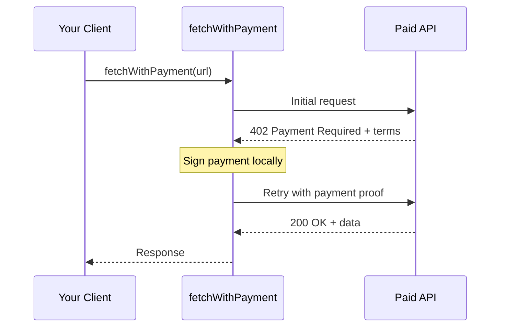

<!-- VERIFIED: 3c3e2168 -->
# Client Quick Start

This guide walks you through building a payment-enabled HTTP client. By the end, you'll be making requests to paid APIs where payments are handled automatically.

## What You'll Build

A Node.js application that:
- Makes HTTP requests to paid APIs
- Automatically handles x402 payment flows
- Uses USDC on Base Sepolia testnet

## Prerequisites

Before you begin, ensure you have:

- **Node.js 18+** installed
- **A funded wallet** with USDC on Base Sepolia testnet
  - Get testnet ETH from [Base Sepolia faucet](https://www.coinbase.com/faucets/base-ethereum-goerli-faucet)
  - Get testnet USDC from [Circle faucet](https://faucet.circle.com/)
- **Private key** for your wallet (never commit this to version control)

## Installation

Install the required packages:

```bash
pnpm add @x402/fetch @x402/evm viem dotenv
```

Package overview:
- `@x402/fetch` - Fetch API wrapper for automatic payments
- `@x402/evm` - EVM payment mechanism (USDC on Base)
- `viem` - Ethereum wallet and signing utilities
- `dotenv` - Environment variable loading

## Implementation

### Step 1: Create Your Client

Create a file named `client.ts`:

```typescript
import { config } from "dotenv";
import { x402Client } from "@x402/core/client";
import { registerExactEvmScheme } from "@x402/evm/exact/client";
import { wrapFetchWithPayment } from "@x402/fetch";
import { privateKeyToAccount } from "viem/accounts";

config();

// Load your private key from environment variables
const privateKey = process.env.PRIVATE_KEY as `0x${string}`;
const account = privateKeyToAccount(privateKey);

// Create and configure the x402 client
const client = new x402Client();
registerExactEvmScheme(client, { signer: account });

// Wrap the native fetch with payment capabilities
const fetchWithPayment = wrapFetchWithPayment(fetch, client);

// Make a paid request
async function main() {
  const url = process.env.API_URL || "http://localhost:3000/protected";

  try {
    const response = await fetchWithPayment(url);

    if (!response.ok) {
      throw new Error(`HTTP error! status: ${response.status}`);
    }

    const data = await response.json();
    console.log("Response:", data);
  } catch (error) {
    console.error("Error:", error);
  }
}

main();
```

### Step 2: Configure Environment Variables

Create a `.env` file (add to `.gitignore`):

```bash
PRIVATE_KEY=0xYourPrivateKeyHere
API_URL=http://localhost:3000/protected
```

### Step 3: Run Your Client

```bash
npx tsx client.ts
```

## Understanding the Code

### Payment Flow


```mermaid
sequenceDiagram
    participant Client as Your Client
    participant Wrapper as fetchWithPayment
    participant Server as Paid API

    Client->>Wrapper: fetchWithPayment(url)
    Wrapper->>Server: Initial request
    Server-->>Wrapper: 402 Payment Required + terms

    Note over Wrapper: Sign payment locally

    Wrapper->>Server: Retry with payment proof
    Server-->>Wrapper: 200 OK + data
    Wrapper-->>Client: Response
```

### Key Components

**x402Client**: Core payment coordinator that manages payment schemes.

```typescript
const client = new x402Client();
```

**registerExactEvmScheme**: Registers the EVM payment mechanism for exact-amount USDC payments.

```typescript
registerExactEvmScheme(client, { signer: account });
```

**wrapFetchWithPayment**: Intercepts HTTP requests and handles the payment flow transparently.

```typescript
const fetchWithPayment = wrapFetchWithPayment(fetch, client);
```

When a server returns `402 Payment Required`, the wrapper:
1. Parses payment terms from the response
2. Signs the payment locally with your wallet
3. Retries the request with payment proof
4. Returns the final response to your code

## Testing

To test your client, you need an x402-enabled server. Options:

### Run a Local Server

Follow the [Server Quick Start](./quick-start-server.md) to set up a local paid API:

```typescript
const response = await fetchWithPayment("http://localhost:3000/protected");
```

## Troubleshooting

### "Insufficient funds" Error

Your wallet doesn't have enough USDC or ETH for gas.

**Solution**:
- Get testnet USDC from [Circle faucet](https://faucet.circle.com/)
- Get testnet ETH for gas from [Base faucet](https://www.coinbase.com/faucets/base-ethereum-goerli-faucet)

### "No payment scheme registered" Error

The client doesn't support the payment method the server requires.

**Solution**: Ensure you called `registerExactEvmScheme` before making requests:

```typescript
const client = new x402Client();
registerExactEvmScheme(client, { signer: account }); // Must be registered first
const fetchWithPayment = wrapFetchWithPayment(fetch, client);
```

### "Payment verification failed" Error

The server couldn't verify your payment.

**Solution**:
- Verify your signer address matches the payment sender
- Check the transaction on [Base Sepolia explorer](https://sepolia.basescan.org/)

## Advanced Usage

### Using with Axios

If you prefer Axios over Fetch:

```typescript
import axios from "axios";
import { wrapAxiosWithPayment } from "@x402/axios";

const client = new x402Client();
registerExactEvmScheme(client, { signer: account });

const axiosWithPayment = wrapAxiosWithPayment(axios.create(), client);
const response = await axiosWithPayment.get("https://api.example.com/data");
```

### Multiple Payment Schemes

Support both EVM and Solana:

```typescript
import { registerExactEvmScheme } from "@x402/evm/exact/client";
import { registerExactSvmScheme } from "@x402/svm/exact/client";

const client = new x402Client();
registerExactEvmScheme(client, { signer: evmAccount });
registerExactSvmScheme(client, { signer: svmKeypair });
```

The client automatically selects the appropriate scheme based on server requirements.

## Next Steps

- [Server Quick Start](./quick-start-server.md) - Create your own paid API
- [Architecture Overview](../01-overview/architecture-overview.md) - Learn how x402 works
- [SDK Reference](../03-sdk-reference/README.md) - Complete API documentation
