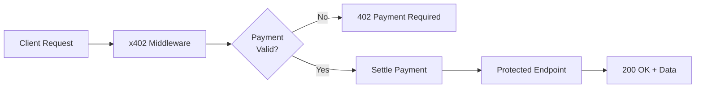
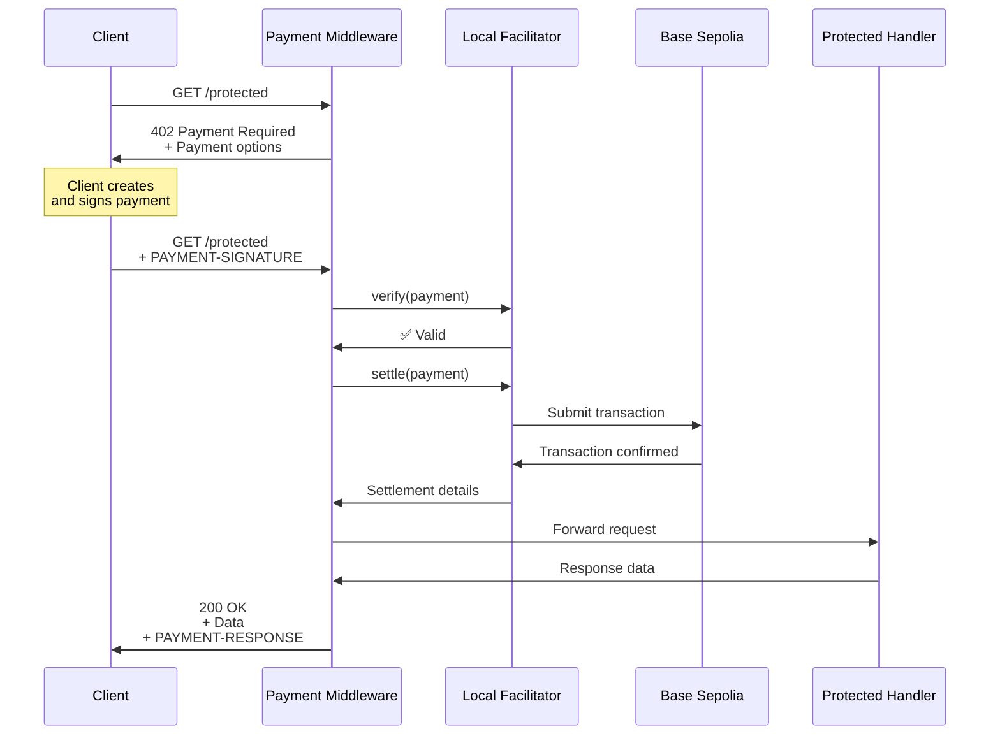

# Server Quick Start

Build your first x402 payment-protected API in under 10 minutes. This guide walks you through creating an Express server that requires micropayments for access.

## Table of Contents

- [What You'll Build](#what-youll-build)
- [Prerequisites](#prerequisites)
- [Step 1: Create Project](#step-1-create-project)
- [Step 2: Install Dependencies](#step-2-install-dependencies)
- [Step 3: Configure Environment](#step-3-configure-environment)
- [Step 4: Set Up the Facilitator](#step-4-set-up-the-facilitator)
- [Step 5: Create the Server](#step-5-create-the-server)
- [Step 6: Run and Test](#step-6-run-and-test)
- [Understanding the Code](#understanding-the-code)
- [Testing with a Client](#testing-with-a-client)
- [Troubleshooting](#troubleshooting)
- [Next Steps](#next-steps)

---

## What You'll Build

An Express server that:
1. Protects an endpoint with a $0.001 USDC payment requirement
2. Automatically handles payment verification
3. Settles payments on-chain
4. Returns protected data only after successful payment

**Architecture:**



---

## Prerequisites

Before you begin:

- ✅ [Installation & Setup](./installation.md) completed
- ✅ Node.js >= 18.0.0 installed
- ✅ Wallet with private key ready
- ✅ Wallet address to receive payments

**Don't have a setup yet?** Start with [Installation & Setup](./installation.md).

---

## Step 1: Create Project

Create a new directory and initialize your project:

```bash
# Create project directory
mkdir x402-server-demo
cd x402-server-demo

# Initialize package.json
pnpm init

# Create source files
mkdir src
touch src/server.ts
touch src/facilitator.ts
```

**Update package.json to use ES modules:**
```json
{
  "name": "x402-server-demo",
  "version": "1.0.0",
  "type": "module",
  "scripts": {
    "start": "tsx src/server.ts",
    "dev": "tsx watch src/server.ts"
  }
}
```

---

## Step 2: Install Dependencies

Install the x402 server SDK and required dependencies using local file paths:

```bash
# ⚠️ IMPORTANT: x402 v2 packages are NOT on npm
# Use file: paths to reference local packages in your x402 repository

npm install \
  file:../typescript/packages/http/express \
  file:../typescript/packages/core \
  file:../typescript/packages/mechanisms/evm \
  express viem dotenv

npm install -D \
  tsx typescript @types/node @types/express
```

**Why file: paths?** The x402 v2 SDK packages are not yet published to npm. They exist only in the local repository. Once v2.0.0 is officially released, these will be available on npm and you can use standard `npm install @x402/express` syntax.

**What each package does:**
- `@x402/express` - Express middleware for payment handling
- `@x402/core` - Core protocol implementation
- `@x402/evm` - EVM payment scheme implementation
- `express` - Web framework
- `viem` - Ethereum blockchain interaction
- `dotenv` - Environment variable management

**Note**: Adjust the file paths if your project is in a different location relative to the x402 repository. The above example assumes you have:
```
x402/
├── typescript/packages/
│   ├── core/
│   ├── http/express/
│   └── mechanisms/evm/
└── x402-server-demo/        ← Your project here
```

---

## Step 3: Configure Environment

Create a `.env` file with your configuration:

```bash
# .env
EVM_PRIVATE_KEY=0x1234567890abcdef...  # Facilitator wallet private key
EVM_ADDRESS=0x742d35Cc6634C0532925a3b844Bc454e4438f44e  # Address to receive payments
PORT=4021
```

**Important:** Add `.env` to `.gitignore`:
```bash
echo ".env" >> .gitignore
```

**Configuration notes:**
- `EVM_PRIVATE_KEY` - Used by the facilitator to settle payments (can be different from payment recipient)
- `EVM_ADDRESS` - The address that will receive USDC payments
- `PORT` - Server port (default: 4021)

---

## Step 4: Set Up the Facilitator

The facilitator handles payment verification and settlement. Create `src/facilitator.ts`:

```typescript
// src/facilitator.ts
import { x402Facilitator } from "@x402/core/facilitator";
import { FacilitatorClient } from "@x402/core/server";
import {
  PaymentPayload,
  PaymentRequirements,
  SettleResponse,
  SupportedResponse,
  VerifyResponse
} from "@x402/core/types";
import { ExactEvmFacilitator, toFacilitatorEvmSigner } from "@x402/evm";
import { createWalletClient, http, publicActions } from "viem";
import { privateKeyToAccount } from "viem/accounts";
import { baseSepolia } from "viem/chains";
import dotenv from "dotenv";

dotenv.config();

// Network configuration - Base Sepolia testnet
export const NETWORK = "eip155:84532" as const;

// Validate required environment variables
if (!process.env.EVM_PRIVATE_KEY) {
  throw new Error("EVM_PRIVATE_KEY environment variable is required");
}

if (!process.env.EVM_ADDRESS) {
  throw new Error("EVM_ADDRESS environment variable is required");
}

// Initialize the EVM account from private key
const account = privateKeyToAccount(process.env.EVM_PRIVATE_KEY as `0x${string}`);
console.log(`Facilitator account: ${account.address}`);

// Create a Viem client with wallet and public capabilities
const viemClient = createWalletClient({
  account,
  chain: baseSepolia,
  transport: http()
}).extend(publicActions);

// Initialize the x402 Facilitator
const facilitator = new x402Facilitator();

// Register the EVM scheme handler
facilitator.registerScheme(
  NETWORK,
  new ExactEvmFacilitator(
    toFacilitatorEvmSigner({
      readContract: (args: any) => viemClient.readContract({
        ...args,
        args: args.args || []
      }),
      verifyTypedData: (args: any) => viemClient.verifyTypedData(args),
      writeContract: (args: any) => viemClient.writeContract({
        ...args,
        args: args.args || []
      }),
      waitForTransactionReceipt: (args: any) =>
        viemClient.waitForTransactionReceipt(args),
    })
  )
);

/**
 * LocalFacilitatorClient wraps the x402Facilitator to implement
 * the FacilitatorClient interface.
 *
 * In production, you would use a remote facilitator client instead.
 */
export class LocalFacilitatorClient implements FacilitatorClient {
  readonly scheme = "exact";
  readonly x402Version = 2;

  constructor(private readonly facilitator: x402Facilitator) {}

  verify(
    paymentPayload: PaymentPayload,
    paymentRequirements: PaymentRequirements
  ): Promise<VerifyResponse> {
    return this.facilitator.verify(paymentPayload, paymentRequirements);
  }

  settle(
    paymentPayload: PaymentPayload,
    paymentRequirements: PaymentRequirements
  ): Promise<SettleResponse> {
    return this.facilitator.settle(paymentPayload, paymentRequirements);
  }

  getSupported(): Promise<SupportedResponse> {
    return Promise.resolve({
      kinds: [{
        x402Version: this.x402Version,
        scheme: this.scheme,
        network: NETWORK,
        extra: {},
      }],
      extensions: [],
    });
  }
}

// Export pre-configured facilitator client
export const localFacilitatorClient = new LocalFacilitatorClient(facilitator);

// Export the payee address
export const PAYEE_ADDRESS = process.env.EVM_ADDRESS as `0x${string}`;
```

**What this does:**
- Creates a local facilitator for payment verification and settlement
- Configures it for Base Sepolia testnet
- Registers the exact payment scheme for EVM
- In production, replace this with a remote facilitator service

---

## Step 5: Create the Server

Create `src/server.ts` with the complete server implementation:

```typescript
// src/server.ts
import express from "express";
import { paymentMiddleware } from "@x402/express";
import { ExactEvmService } from "@x402/evm";
import { localFacilitatorClient, NETWORK, PAYEE_ADDRESS } from "./facilitator";

const PORT = process.env.PORT || "4021";

// Initialize Express app
const app = express();

// Add JSON body parser for POST endpoints
app.use(express.json());

/**
 * Configure x402 payment middleware
 *
 * This middleware protects specified endpoints with payment requirements.
 */
app.use(
  paymentMiddleware(
    // Route configuration
    {
      "GET /protected": {
        payTo: PAYEE_ADDRESS,
        scheme: "exact",
        price: "$0.001",  // 0.001 USDC
        network: NETWORK,
      },
    },
    // Facilitator client for verification and settlement
    localFacilitatorClient,
    // Payment scheme handlers
    [
      {
        network: NETWORK,
        server: new ExactEvmService()
      }
    ]
  )
);

/**
 * Protected endpoint - requires $0.001 USDC payment
 */
app.get("/protected", (req, res) => {
  res.json({
    message: "Protected endpoint accessed successfully",
    timestamp: new Date().toISOString(),
    data: {
      secret: "This data requires payment to access",
      userId: "demo-user"
    }
  });
});

/**
 * Public endpoint - no payment required
 */
app.get("/public", (req, res) => {
  res.json({
    message: "Public endpoint - no payment required",
    timestamp: new Date().toISOString()
  });
});

/**
 * Health check endpoint - used for monitoring
 */
app.get("/health", (req, res) => {
  res.json({
    status: "ok",
    network: NETWORK,
    payee: PAYEE_ADDRESS,
    version: "2.0.0"
  });
});

/**
 * Shutdown endpoint - for graceful shutdown in tests
 */
app.post("/close", (req, res) => {
  res.json({ message: "Server shutting down gracefully" });
  setTimeout(() => process.exit(0), 100);
});

// Start the server
app.listen(parseInt(PORT), () => {
  console.log(`
+========================================================+
|              x402 Payment Server Demo                  |
+========================================================+
|  Server:     http://localhost:${PORT}                      |
|  Network:    ${NETWORK}                       |
|  Payee:      ${PAYEE_ADDRESS}     |
|                                                        |
|  Endpoints:                                            |
|  * GET  /protected  (requires $0.001 USDC)            |
|  * GET  /public     (free access)                     |
|  * GET  /health     (server status)                   |
+========================================================+
  `);
  console.log('Ready to accept payments!\n');
});
```

---

## Step 6: Run and Test

### Start Your Server

```bash
pnpm start
```

**Expected output:**

```
Facilitator account: 0x742d35Cc6634C0532925a3b844Bc454e4438f44e

+========================================================+
|              x402 Payment Server Demo                  |
+========================================================+
|  Server:     http://localhost:4021                     |
|  Network:    eip155:84532                              |
|  Payee:      0x742d35Cc6634C0532925a3b844Bc454e4438f44e|
|                                                        |
|  Endpoints:                                            |
|  * GET  /protected  (requires $0.001 USDC)            |
|  * GET  /public     (free access)                     |
|  * GET  /health     (server status)                   |
+========================================================+

Ready to accept payments!
```

### Test the Public Endpoint

```bash
curl http://localhost:4021/public
```

**Response:**
```json
{
  "message": "Public endpoint - no payment required",
  "timestamp": "2024-10-24T12:00:00.000Z"
}
```

### Test the Protected Endpoint (Without Payment)

```bash
curl -i http://localhost:4021/protected
```

**Response:**
```
HTTP/1.1 402 Payment Required
PAYMENT-OPTIONS: {"scheme":"exact","payTo":"0x742d35Cc...","price":...}

{
  "error": "Payment required"
}
```

**Success!** The server correctly requires payment for the protected endpoint.

---

## Understanding the Code

Let's break down the key components:

### 1. Payment Middleware Configuration

```typescript
paymentMiddleware(
  {
    "GET /protected": {
      payTo: PAYEE_ADDRESS,    // Recipient address
      scheme: "exact",          // Payment scheme
      price: "$0.001",          // Amount in USDC
      network: NETWORK,         // Base Sepolia
    },
  },
  localFacilitatorClient,
  [{ network: NETWORK, server: new ExactEvmService() }]
)
```

**Route format:** `"METHOD /path"`
- Only matching routes require payment
- Other routes are unaffected

### 2. Payment Flow



### 3. Payment Requirements

The middleware automatically:
1. **Intercepts requests** to protected routes
2. **Checks for payment** in request headers
3. **Verifies payment** against requirements
4. **Settles payment** on-chain
5. **Forwards request** to handler if successful
6. **Returns 402** if payment is missing or invalid

### 4. Payment Options Header

When payment is required, the server responds with:

```
PAYMENT-OPTIONS: {
  "scheme": "exact",
  "payTo": "0x742d35Cc6634C0532925a3b844Bc454e4438f44e",
  "price": "1000",          // 1000 = 0.001 USDC (6 decimals)
  "token": "USDC",
  "network": "eip155:84532"
}
```

Clients use this to construct the payment.

---

## Testing with a Client

### Option 1: Use the x402 Client Quick Start

Follow the [Client Quick Start](./quick-start-client.md) to build a client that can pay for your endpoint.

### Option 2: Use curl + Manual Payment

For testing, you can manually construct payment signatures:

```bash
# 1. Get payment requirements
curl -i http://localhost:4021/protected

# 2. Create payment signature (using x402 SDK or viem)
# 3. Make request with signature
curl -H "PAYMENT-SIGNATURE: <signature>" http://localhost:4021/protected
```

### Option 3: Use the Reference Client

```bash
cd /path/to/x402/e2e/clients/fetch
pnpm install
RESOURCE_SERVER_URL=http://localhost:4021 \
ENDPOINT_PATH=/protected \
EVM_PRIVATE_KEY=0xac09... \
pnpm dev
```

---

## Troubleshooting

### "EVM_PRIVATE_KEY environment variable is required"

**Solution:** Create a `.env` file with your private key:
```bash
echo "EVM_PRIVATE_KEY=0x..." > .env
echo "EVM_ADDRESS=0x..." >> .env
```

### "Cannot find module '@x402/express'"

**Solution:** Install dependencies:
```bash
pnpm install
```

### Server starts but returns 500 on payment

**Solutions:**
- Verify your private key is valid
- Check you have sufficient ETH for gas fees
- Ensure network configuration matches (Base Sepolia)
- Check facilitator logs for errors

### Port already in use

```
Error: listen EADDRINUSE: address already in use :::4021
```

**Solutions:**
- Change the port in `.env`: `PORT=4022`
- Kill the process using the port: `lsof -ti:4021 | xargs kill`

### Client gets 402 but payment doesn't work

**Debug checklist:**
1. Verify network matches between client and server
2. Check client has USDC balance
3. Verify payment signature is correct
4. Enable debug logging (see below)

### Enable Debug Logging

Add debug output to the middleware:

```typescript
app.use((req, res, next) => {
  console.log(`${req.method} ${req.path}`);
  console.log('Headers:', req.headers);
  next();
});

// Then add payment middleware
app.use(paymentMiddleware(...));
```

---

## Next Steps

### Customize Your Server

**Add multiple protected endpoints:**
```typescript
paymentMiddleware(
  {
    "GET /protected": {
      payTo: PAYEE_ADDRESS,
      scheme: "exact",
      price: "$0.001",
      network: NETWORK,
    },
    "GET /premium": {
      payTo: PAYEE_ADDRESS,
      scheme: "exact",
      price: "$0.01",  // Higher price
      network: NETWORK,
    },
    "POST /api/analyze": {
      payTo: PAYEE_ADDRESS,
      scheme: "exact",
      price: "$0.05",  // Even higher price
      network: NETWORK,
    },
  },
  // ... rest of config
)
```

**Dynamic pricing:**
```typescript
app.get("/dynamic/:itemId", async (req, res) => {
  // Price can vary based on item
  const item = await getItem(req.params.itemId);
  // Payment already verified by middleware
  res.json({ item });
});
```

**Add authentication:**
```typescript
import { authMiddleware } from "./auth";

app.use(authMiddleware);  // Add before payment middleware
app.use(paymentMiddleware(...));
```

**Usage tracking:**
```typescript
app.use((req, res, next) => {
  if (req.paymentVerified) {
    logPayment({
      user: req.user,
      endpoint: req.path,
      amount: req.paymentAmount,
      timestamp: new Date()
    });
  }
  next();
});
```

### Use a Remote Facilitator

For production, use a hosted facilitator service:

```typescript
import { HTTPFacilitatorClient } from "@x402/core/facilitator-client";

const remoteFacilitatorClient = new HTTPFacilitatorClient({
  url: "https://facilitator.x402.dev"
});

app.use(
  paymentMiddleware(
    routeConfig,
    remoteFacilitatorClient,  // Use remote instead of local
    [{ network: NETWORK, server: new ExactEvmService() }]
  )
);
```

### Explore More

- **Complete tutorials**: [API Monetization Tutorial](../07-tutorials/tutorial-api-monetization.md)
- **Understand the protocol**: [Server Architecture](../04-reference-implementation/server-architecture.md)
- **API Reference**: [@x402/express Documentation](../03-sdk-reference/http-adapters/express.md)
- **Production deployment**: [Production Guide](../09-appendix/production.md)
- **Advanced patterns**: [Implementation Guide](../05-implementation-guide/server-implementation.md)

### Try Different Frameworks

The same payment logic works with other frameworks:

**Hono:**
```typescript
import { Hono } from 'hono';
import { paymentMiddleware } from '@x402/hono';

const app = new Hono();
app.use(paymentMiddleware(...));
```

**Next.js:**
```typescript
// app/api/protected/route.ts
import { withPayment } from '@x402/next';

export const GET = withPayment(
  async (req) => {
    return Response.json({ message: "Protected" });
  },
  {
    payTo: PAYEE_ADDRESS,
    price: "$0.001",
    network: NETWORK,
  }
);
```

---

## Additional Resources

- [SDK Reference](../03-sdk-reference/README.md) - Complete API documentation
- [Client Quick Start](./quick-start-client.md) - Build a client for your server
- [Tutorials](../07-tutorials/README.md) - Complete example applications
- [Reference Implementation](../04-reference-implementation/server-architecture.md) - Production patterns
- [GitHub Repository](https://github.com/coinbase/x402) - Source code and examples
