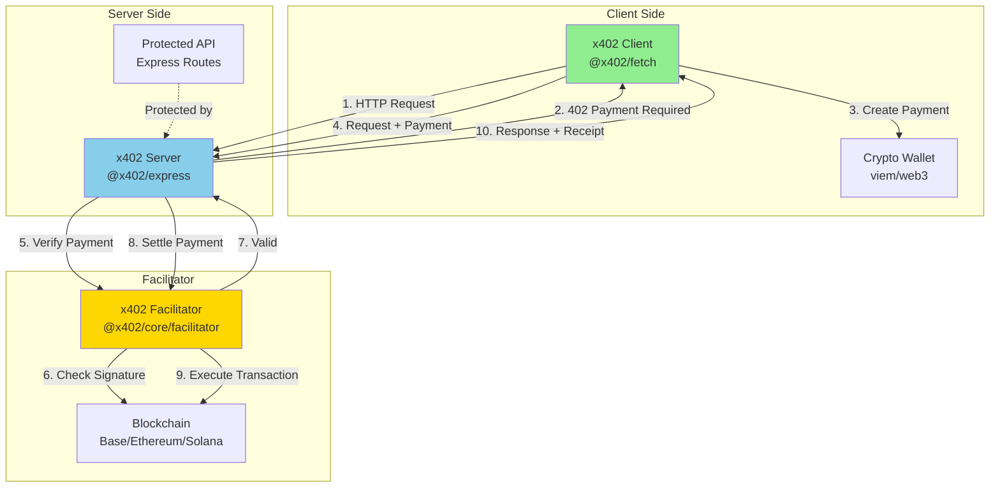
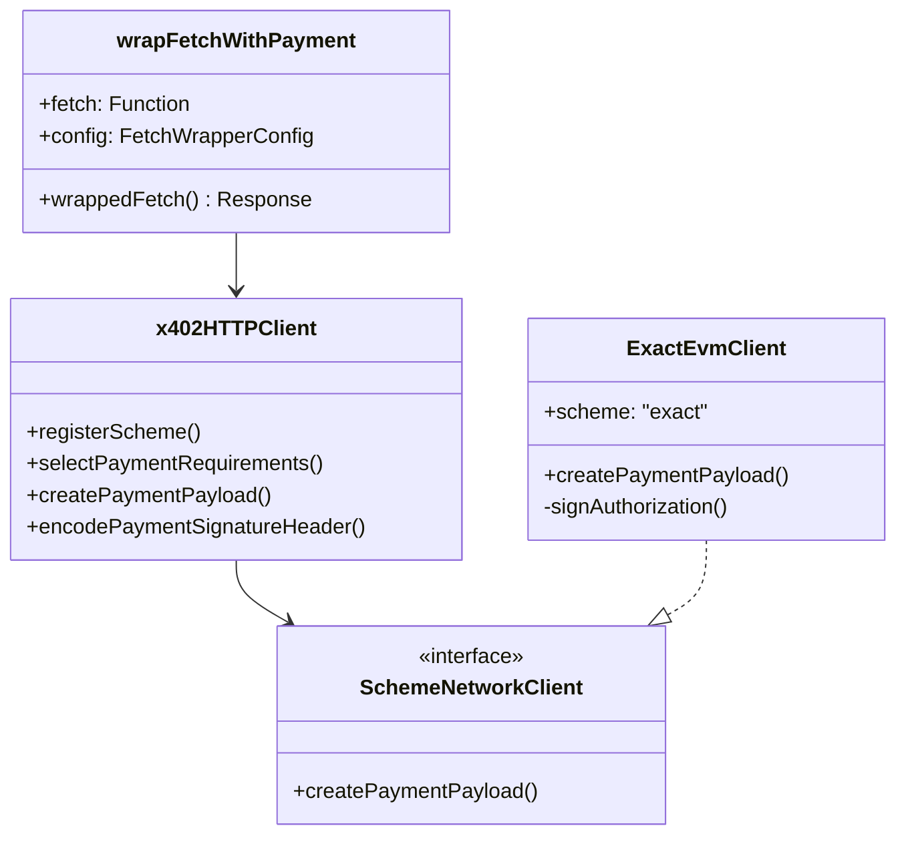
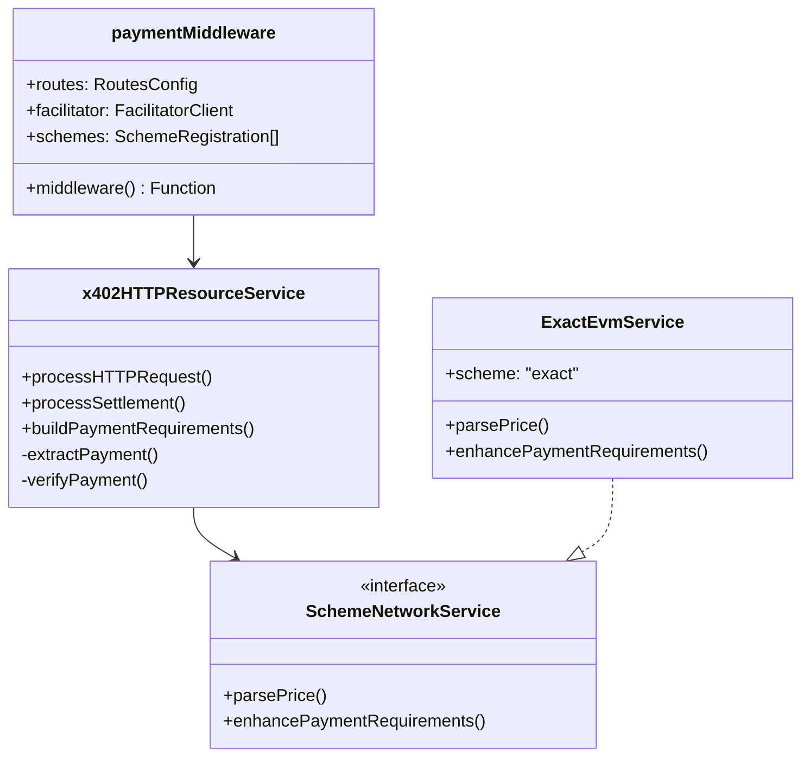
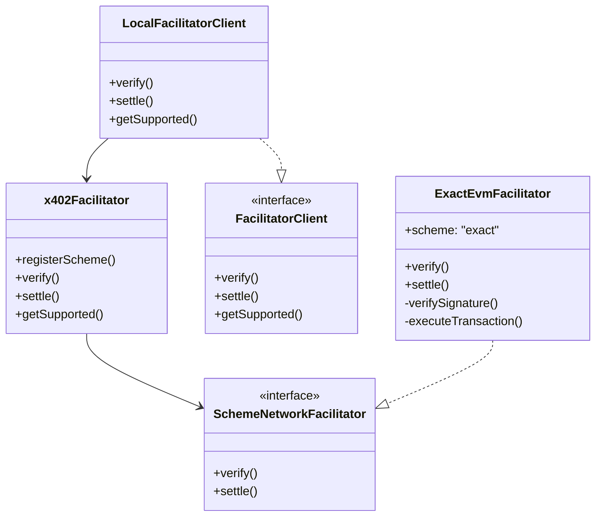
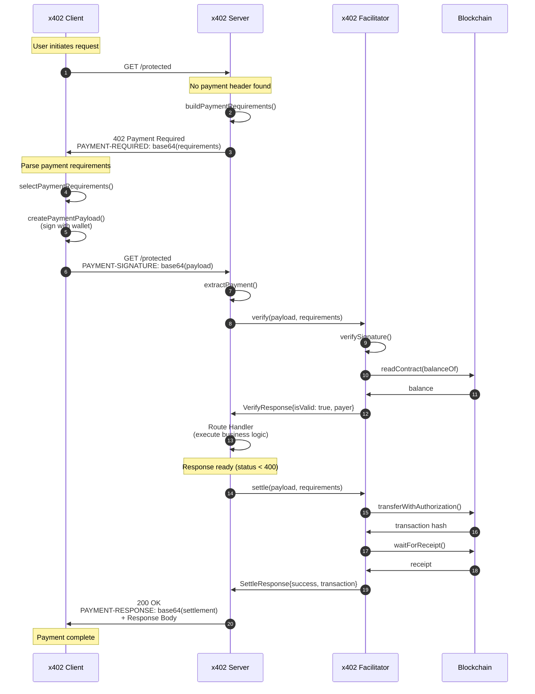
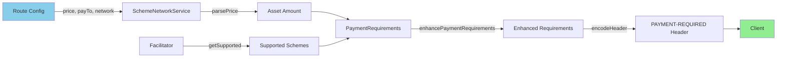
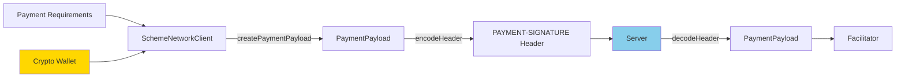

# Architecture Overview

The x402 protocol v2 consists of three core components that work together to enable payment-required HTTP endpoints. This document provides a high-level overview of how these components interact.

## The Three Components



## 1. Client

**Purpose**: Makes HTTP requests and handles payment requirements automatically.

### Responsibilities

- Detect 402 Payment Required responses
- Parse payment requirements from headers
- Create cryptographic payment signatures using wallet
- Retry requests with payment proofs
- Handle payment responses

### Reference Implementation

**Location**: `e2e/clients/fetch/`
**Package**: `@x402/fetch`
**Key File**: `typescript/packages/http/fetch/src/index.ts`

### Core Components



### Key Operations

1. **Intercept 402 Responses**
   ```typescript
   if (response.status !== 402) {
     return response;  // Normal response
   }
   // Handle payment requirement
   ```

2. **Select Payment Method**
   ```typescript
   const selected = client.selectPaymentRequirements(
     paymentRequired.x402Version,
     paymentRequired.accepts
   );
   ```

3. **Create Payment**
   ```typescript
   const paymentPayload = await client.createPaymentPayload(
     x402Version,
     selectedRequirements
   );
   ```

4. **Retry with Payment**
   ```typescript
   const paymentHeaders = client.encodePaymentSignatureHeader(paymentPayload);
   const secondResponse = await fetch(input, {
     ...init,
     headers: { ...init.headers, ...paymentHeaders }
   });
   ```

## 2. Server

**Purpose**: Protects HTTP endpoints and enforces payment requirements.

### Responsibilities

- Define payment requirements for routes
- Return 402 responses when payment is missing/invalid
- Verify payments via facilitator
- Settle payments on successful responses
- Return settlement receipts to clients

### Reference Implementation

**Location**: `e2e/servers/express/`
**Package**: `@x402/express`
**Key File**: `typescript/packages/http/express/src/index.ts`

### Core Components



### Key Operations

1. **Route Matching**
   ```typescript
   const routeConfig = server.getRouteConfig(path, method);
   if (!routeConfig) {
     return next();  // No payment required
   }
   ```

2. **Build Requirements**
   ```typescript
   const requirements = await server.buildPaymentRequirements({
     scheme: "exact",
     payTo: "0x...",
     price: "$0.001",
     network: "eip155:84532"
   });
   ```

3. **Verify Payment**
   ```typescript
   const verifyResult = await facilitator.verify(
     paymentPayload,
     requirements
   );
   ```

4. **Settle Payment**
   ```typescript
   const settleResult = await facilitator.settle(
     paymentPayload,
     requirements
   );
   ```

## 3. Facilitator

**Purpose**: Verifies payment signatures and settles transactions on the blockchain.

### Responsibilities

- Verify cryptographic payment signatures
- Check payment validity (amount, recipient, expiration)
- Execute blockchain transactions to settle payments
- Return verification and settlement results
- Support multiple payment schemes and networks

### Reference Implementation

**Location**: `e2e/servers/express/facilitator.ts`
**Package**: `@x402/core/facilitator` and `@x402/evm`
**Key Files**:
- `typescript/packages/core/src/facilitator/x402Facilitator.ts`
- `typescript/packages/mechanisms/evm/src/exact/index.ts`

### Core Components



### Key Operations

1. **Verify Payment**
   ```typescript
   // Check signature
   const valid = await signer.verifyTypedData({
     address: authorization.from,
     domain, types, message,
     signature
   });

   // Check amount
   if (amount < required) return { isValid: false };

   // Check expiration
   if (validBefore < now) return { isValid: false };

   return { isValid: true, payer: address };
   ```

2. **Settle Payment**
   ```typescript
   // Execute on-chain transaction
   const tx = await signer.writeContract({
     address: tokenAddress,
     abi: eip3009ABI,
     functionName: "transferWithAuthorization",
     args: [from, to, value, validAfter, validBefore, nonce, signature]
   });

   // Wait for confirmation
   const receipt = await signer.waitForTransactionReceipt({ hash: tx });

   return { success: true, transaction: tx, network, payer };
   ```

## Component Interaction Flow

### Complete Request Flow



## Data Flow

### Payment Requirements Flow



### Payment Payload Flow



## Package Structure

### Core Package (`@x402/core`)

```
@x402/core/
├── types/          # Type definitions
│   ├── payments.ts       # PaymentRequired, PaymentPayload, PaymentRequirements
│   ├── facilitator.ts    # VerifyRequest/Response, SettleRequest/Response
│   └── mechanisms.ts     # SchemeNetworkClient/Facilitator/Service
├── client/         # Base client logic
│   └── x402Client.ts     # Scheme registration, payment creation
├── server/         # Base server logic
│   └── x402ResourceService.ts  # Payment verification, settlement
├── facilitator/    # Facilitator implementation
│   └── x402Facilitator.ts      # Multi-scheme facilitator
└── http/           # HTTP-specific logic
    ├── x402HTTPClient.ts       # HTTP client with header encoding
    └── x402HTTPResourceService.ts  # HTTP server with request processing
```

### HTTP Packages

```
@x402/fetch         # Fetch API wrapper (client)
@x402/express       # Express middleware (server)
@x402/hono          # Hono middleware (server)
@x402/next          # Next.js integration (server)
```

### Mechanism Packages

```
@x402/evm           # EVM payment schemes (exact)
@x402/svm           # Solana payment schemes
```

## Design Principles

### 1. Framework Agnostic Core

The core (`@x402/core`) is framework-agnostic. HTTP packages provide framework-specific adapters:

```typescript
// Core defines interfaces
interface HTTPAdapter {
  getHeader(name: string): string | undefined;
  getMethod(): string;
  getPath(): string;
}

// Express implements adapter
class ExpressAdapter implements HTTPAdapter {
  constructor(private req: Request) {}
  getHeader(name: string) { return this.req.header(name); }
  // ...
}
```

### 2. Multi-Scheme Support

Each payment scheme implements standard interfaces:

```typescript
interface SchemeNetworkClient {
  createPaymentPayload(x402Version, requirements): Promise<PaymentPayload>;
}

interface SchemeNetworkFacilitator {
  verify(payload, requirements): Promise<VerifyResponse>;
  settle(payload, requirements): Promise<SettleResponse>;
}

interface SchemeNetworkService {
  parsePrice(price, network): AssetAmount;
  enhancePaymentRequirements(...): Promise<PaymentRequirements>;
}
```

### 3. Local or Remote Facilitators

Facilitators can be:
- **Local**: Run in the same process as the server (reference implementation)
- **Remote**: External service via HTTP (production)

```typescript
// Local facilitator
const localFacilitator = new LocalFacilitatorClient(
  new x402Facilitator()
);

// Remote facilitator (theoretical)
const remoteFacilitator = new HTTPFacilitatorClient(
  "https://facilitator.x402.org"
);

// Both implement the same interface
paymentMiddleware(routes, localFacilitator);
```

### 4. Type-Safe Throughout

TypeScript types ensure correctness:

```typescript
type Network = `${string}:${string}`;  // "eip155:8453"
type Price = string | number | AssetAmount;

interface PaymentRequirements {
  scheme: string;
  network: Network;
  asset: string;
  amount: string;
  payTo: string;
  maxTimeoutSeconds: number;
  extra: Record<string, any>;
}
```

## Next Steps

- **See the Protocol in Action**: [Payment Flow Overview](../02-protocol-flows/payment-flow-overview.md)
- **Understand Each Component**: [Reference Implementation](../04-reference-implementation/architecture.md)
- **Deep Dive**: [Types and Interfaces](../05-implementation-guide/types-and-interfaces.md)

---

*Reference implementation: `/e2e/` and `typescript/packages/`*
