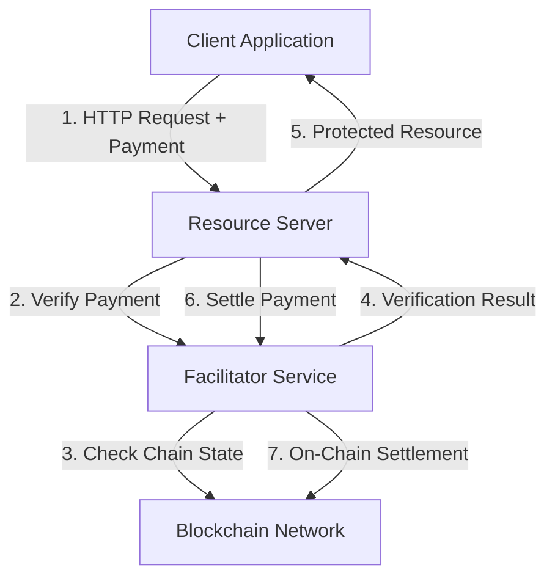
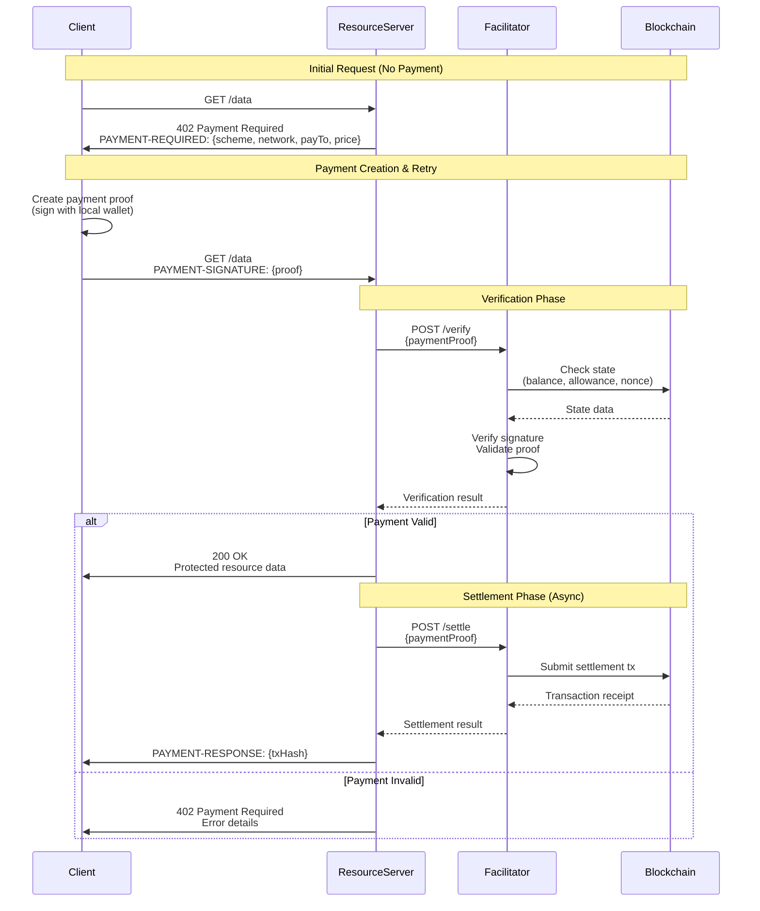
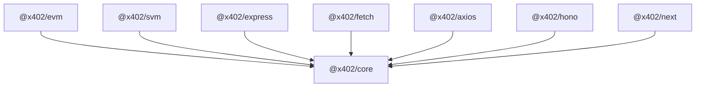

<!-- VERIFIED: 3c3e2168 -->
# Architecture Overview

The x402 protocol consists of three core components that work together to enable machine-to-machine (M2M) payments for API access:

1. **Client** - Initiates requests and creates cryptographic payment proofs locally
2. **Resource Server** - Validates payments and serves protected resources
3. **Facilitator** - Verifies and settles payments on-chain

## Component Architecture


```mermaid
flowchart TB
    Client[Client Application]
    RS[Resource Server]
    Fac[Facilitator Service]
    Chain[Blockchain Network]

    Client -->|1. HTTP Request + Payment| RS
    RS -->|2. Verify Payment| Fac
    Fac -->|3. Check Chain State| Chain
    Fac -->|4. Verification Result| RS
    RS -->|5. Protected Resource| Client
    RS -->|6. Settle Payment| Fac
    Fac -->|7. On-Chain Settlement| Chain
```

> [!NOTE]
> **Roadmap: Protocol Enhancements**
> Planned integrations that will extend the architecture:
> - **MCP Support** - Model Context Protocol integration patterns (Q4 2025)
> - **XMTP Support** - First-class XMTP messaging integration (Q2 2026)
>
> [View Roadmap](../09-appendix/roadmap.md#now-in-progress)

## Component Responsibilities

### Client (`@x402/core/client`)

The client component handles payment creation and HTTP request enrichment. It operates entirely locally, never contacting the Facilitator directly.

**Core Classes:**

- `x402Client` - Main client class that manages payment scheme registration
- `x402HTTPClient` - HTTP wrapper that encodes payment information into request headers

**Key Functions:**

```typescript
import { x402Client } from "@x402/core/client";
import { registerExactEvmScheme } from "@x402/evm/exact/client";
import { wrapFetchWithPayment } from "@x402/fetch";

// Initialize client and register payment schemes
const client = new x402Client();
registerExactEvmScheme(client, { signer: evmAccount });

// Wrap HTTP client with payment capabilities
const fetchWithPayment = wrapFetchWithPayment(fetch, client);

// Make payment-enabled requests
const response = await fetchWithPayment("https://api.example.com/data");
```

**Responsibilities:**

- Register payment schemes (e.g., EVM exact, SVM exact)
- Generate cryptographic payment proofs using local wallet/signer
- Encode payment information into HTTP headers (`PAYMENT-SIGNATURE`)
- Parse payment requirements from server responses (`PAYMENT-REQUIRED`)
- Handle payment-related HTTP status codes (402 Payment Required)

**Design Principle:** The client creates all payment proofs locally using the user's wallet. It never sends private keys or contacts the Facilitator, ensuring maximum security and decentralization.

### Resource Server (`@x402/core/server`)

The Resource Server protects API endpoints and delegates payment verification to the Facilitator.

**Core Classes:**

- `x402ResourceServer` - Main server class that handles payment verification logic
- `HTTPFacilitatorClient` - HTTP client for communicating with Facilitator service

**Key Functions:**

```typescript
import { paymentMiddleware } from "@x402/express";
import { x402ResourceServer, HTTPFacilitatorClient } from "@x402/core/server";
import { registerExactEvmScheme } from "@x402/evm/exact/server";

// Initialize facilitator client
const facilitatorClient = new HTTPFacilitatorClient({
  url: "https://facilitator.x402.org"
});

// Initialize server and register payment schemes
const server = new x402ResourceServer(facilitatorClient);
registerExactEvmScheme(server);

// Configure protected routes
const routes = {
  "GET /data": {
    accepts: {
      scheme: "exact",
      network: "eip155:84532",
      payTo: "0x742d35Cc6634C0532925a3b844Bc9e7595f0bEb",
      price: "$0.01",
    },
    description: "Protected data endpoint",
  },
};

// Apply payment middleware
app.use(paymentMiddleware(routes, server));
```

**Responsibilities:**

- Define payment requirements for protected routes
- Extract payment information from request headers
- Delegate verification to Facilitator via `HTTPFacilitatorClient`
- Return `402 Payment Required` with payment details when payment is missing/invalid
- Serve protected resources when payment is verified
- Trigger settlement requests to Facilitator after successful access
- Encode settlement responses in `PAYMENT-RESPONSE` header

**Route Configuration Format:**

```typescript
{
  "METHOD /path": {
    accepts: {
      scheme: "exact",           // Payment scheme (e.g., "exact")
      network: "eip155:84532",   // CAIP-2 network identifier
      payTo: "0xAddress",        // Payment recipient address
      price: "$0.01",            // Price in fiat or native token
    },
    description: "Route description",
  }
}
```

### Facilitator (`@x402/core/facilitator`)

The Facilitator is a stateless service that verifies payment proofs and executes on-chain settlements.

**Core Classes:**

- `x402Facilitator` - Main facilitator class that orchestrates verification and settlement

**Key Functions:**

```typescript
import { x402Facilitator } from "@x402/core/facilitator";
import { registerExactEvmScheme } from "@x402/evm/exact/facilitator";

// Initialize facilitator with signer and supported networks
const facilitator = new x402Facilitator();
registerExactEvmScheme(facilitator, {
  signer: evmSigner,
  networks: "eip155:84532" // Can use wildcards like "eip155:*"
});

// Verify payment (called by Resource Server)
const verifyResult = await facilitator.verify(paymentProof);

// Settle payment on-chain (called by Resource Server)
const settleResult = await facilitator.settle(paymentProof);
```

**Responsibilities:**

- Verify cryptographic payment proofs
- Check on-chain state (balances, allowances, nonces)
- Execute on-chain settlement transactions
- Support multiple payment schemes and blockchain networks
- Provide verification and settlement results to Resource Server

**Network Configuration:** Networks are specified using CAIP-2 format (e.g., `eip155:84532` for Base Sepolia). Wildcards are supported (e.g., `eip155:*` for all EVM networks).

## Interaction Flow

The following sequence diagram shows the complete payment flow from client request through settlement:


```mermaid
sequenceDiagram
    participant Client
    participant ResourceServer
    participant Facilitator
    participant Blockchain

    Note over Client,Blockchain: Initial Request (No Payment)

    Client->>ResourceServer: GET /data
    ResourceServer->>Client: 402 Payment Required<br/>PAYMENT-REQUIRED: {scheme, network, payTo, price}

    Note over Client,Blockchain: Payment Creation & Retry

    Client->>Client: Create payment proof<br/>(sign with local wallet)
    Client->>ResourceServer: GET /data<br/>PAYMENT-SIGNATURE: {proof}

    Note over ResourceServer,Blockchain: Verification Phase

    ResourceServer->>Facilitator: POST /verify<br/>{paymentProof}
    Facilitator->>Blockchain: Check state<br/>(balance, allowance, nonce)
    Blockchain-->>Facilitator: State data
    Facilitator->>Facilitator: Verify signature<br/>Validate proof
    Facilitator-->>ResourceServer: Verification result

    alt Payment Valid
        ResourceServer->>Client: 200 OK<br/>Protected resource data

        Note over ResourceServer,Blockchain: Settlement Phase (Async)

        ResourceServer->>Facilitator: POST /settle<br/>{paymentProof}
        Facilitator->>Blockchain: Submit settlement tx
        Blockchain-->>Facilitator: Transaction receipt
        Facilitator-->>ResourceServer: Settlement result
        ResourceServer->>Client: PAYMENT-RESPONSE: {txHash}
    else Payment Invalid
        ResourceServer->>Client: 402 Payment Required<br/>Error details
    end
```

## Data Flow

### HTTP Headers

x402 uses three custom HTTP headers for payment coordination:

1. **`PAYMENT-REQUIRED`** (Server to Client)
   - Sent in 402 responses
   - Contains payment requirements for the requested resource

2. **`PAYMENT-SIGNATURE`** (Client to Server)
   - Sent in paid requests
   - Contains cryptographic payment proof

3. **`PAYMENT-RESPONSE`** (Server to Client)
   - Sent after successful settlement
   - Contains settlement transaction details

### Payment Proof Structure

Payment proofs are scheme-specific but generally contain:

- **Signature**: Cryptographic signature from payer
- **Payment Details**: From, to, amount, network
- **Nonce/Deadline**: Replay protection
- **Scheme Metadata**: Additional scheme-specific fields

## Key Design Decisions

### Client Never Contacts Facilitator

The client creates all payment proofs locally and never communicates directly with the Facilitator. This design choice provides:

- **Privacy**: Client doesn't reveal which resources it's accessing to Facilitator
- **Decentralization**: No single point of failure for payment creation
- **Security**: Private keys remain local, never transmitted
- **Simplicity**: Fewer network dependencies for client applications

The Resource Server acts as the sole intermediary between client and Facilitator.

### Stateless Facilitator

The Facilitator maintains no persistent state beyond what exists on-chain. This enables:

- **Horizontal Scaling**: Multiple Facilitator instances can run without coordination
- **Reliability**: No risk of lost state or database corruption
- **Verifiability**: All payment history is on-chain and auditable
- **Simplicity**: No complex state synchronization logic

### Asynchronous Settlement

Settlement occurs after the resource is served, not before. This provides:

- **Low Latency**: Clients receive resources without waiting for blockchain confirmation
- **Better UX**: Users aren't blocked by network congestion
- **Flexibility**: Settlement can be batched or optimized separately

The Resource Server trusts the Facilitator's verification and serves the resource immediately, triggering settlement asynchronously.

### Route-Based Configuration

Payment requirements are defined per-route rather than globally:

```typescript
const routes = {
  "GET /free-endpoint": {}, // No payment required
  "GET /cheap-data": {
    accepts: { scheme: "exact", network: "eip155:84532", payTo: "0x...", price: "$0.01" }
  },
  "POST /expensive-compute": {
    accepts: { scheme: "exact", network: "eip155:84532", payTo: "0x...", price: "$1.00" }
  },
};
```

This enables:
- **Granular Pricing**: Different prices for different operations
- **Mixed Access**: Free and paid endpoints in same API
- **Multi-Tenant**: Different `payTo` addresses per route

## Package Structure

The x402 SDK is organized into modular packages:

### Core Packages

- **`@x402/core`** - Base abstractions and interfaces
  - `/client` - Client implementation
  - `/server` - Resource Server implementation
  - `/facilitator` - Facilitator implementation
  - `/types` - Shared TypeScript types

### Payment Schemes

- **`@x402/evm`** - EVM-based payment mechanisms
  - `/exact/client` - Client-side proof creation
  - `/exact/server` - Server-side verification logic
  - `/exact/facilitator` - On-chain settlement
- **`@x402/svm`** - Solana VM payment mechanisms
  - `/exact/client` - Client-side proof creation
  - `/exact/server` - Server-side verification logic
  - `/exact/facilitator` - On-chain settlement

### HTTP Integrations

- **`@x402/express`** - Express.js middleware
- **`@x402/fetch`** - Fetch API wrapper
- **`@x402/axios`** - Axios interceptor
- **`@x402/hono`** - Hono framework middleware
- **`@x402/next`** - Next.js integration

### Package Dependencies


```mermaid
flowchart TB
    Core["@x402/core"]
    EVM["@x402/evm"]
    SVM["@x402/svm"]
    Express["@x402/express"]
    Fetch["@x402/fetch"]
    Axios["@x402/axios"]
    Hono["@x402/hono"]
    Next["@x402/next"]

    EVM --> Core
    SVM --> Core
    Express --> Core
    Fetch --> Core
    Axios --> Core
    Hono --> Core
    Next --> Core
```

All HTTP and mechanism packages depend on `@x402/core` but are independent of each other, allowing developers to install only what they need.
