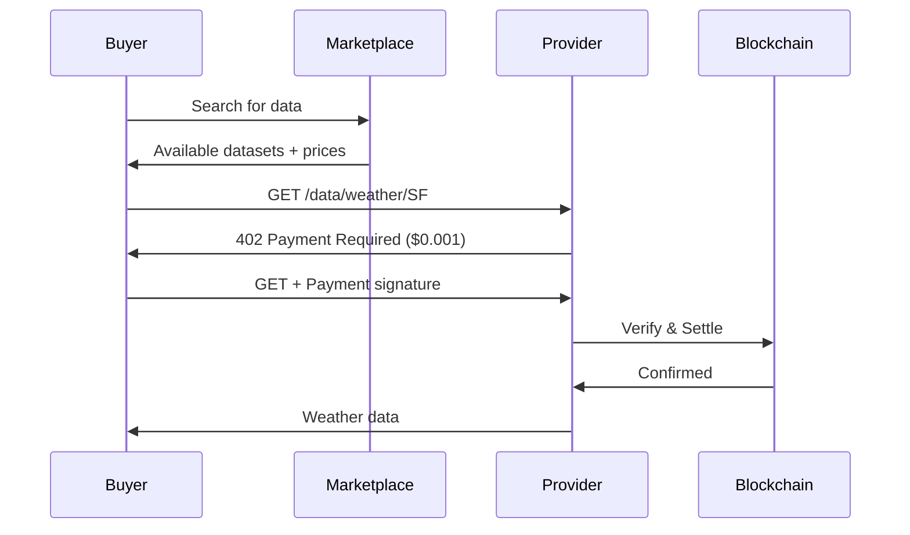

# Use Cases

This document explores real-world applications of the x402 protocol, with examples drawn from patterns that would work with the reference implementation.

## 1. AI API Monetization

### Problem
AI model providers want to monetize API access but face challenges:
- High

 per-request costs
- Users don't want monthly subscriptions for occasional use
- Traditional payment processors eat profits with fees

### x402 Solution

```typescript
// Server: e2e/servers/express/index.ts pattern
app.use(paymentMiddleware({
  "POST /ai/generate": {
    payTo: AI_PROVIDER_ADDRESS,
    scheme: "exact",
    price: "$0.01",  // Pay per generation
    network: "eip155:8453"
  }
}));

// Client: e2e/clients/fetch/index.ts pattern
const response = await fetchWithPayment('/ai/generate', {
  method: 'POST',
  body: JSON.stringify({ prompt: "Write a poem" })
});
```

### Benefits
- ✅ Pay-per-use model
- ✅ No monthly fees
- ✅ Instant monetization
- ✅ Low transaction costs on Base/L2s

## 2. Premium Content Access

### Problem
Publishers want to monetize individual articles without paywalls or subscriptions.

### x402 Solution

**Tiered Pricing**
```typescript
const routes = {
  "GET /articles/free/*": {
    // No payment required - omit from routes
  },
  "GET /articles/premium/*": {
    payTo: PUBLISHER_ADDRESS,
    price: "$0.25",
    network: "eip155:8453"
  },
  "GET /articles/exclusive/*": {
    payTo: PUBLISHER_ADDRESS,
    price: "$1.00",
    network: "eip155:8453"
  }
};
```

### Benefits
- ✅ Granular pricing per content type
- ✅ No user accounts needed
- ✅ Instant revenue
- ✅ Works with any x402-enabled reader app

## 3. API Rate Limit Bypass

### Problem
Free tier users hit rate limits but don't need full paid plans.

### x402 Solution

```typescript
// Free requests: Check rate limit first
// Paid requests: Always allowed with payment

async function handleRequest(req, res) {
  const hasPayment = req.headers['payment-signature'];

  if (!hasPayment) {
    // Check free tier rate limit
    if (await rateLimiter.isExceeded(req.ip)) {
      return res.status(429).json({
        error: 'Rate limit exceeded',
        hint: 'Include payment to bypass rate limits'
      });
    }
  }

  // Process request (with payment verification if provided)
  next();
}

// Configure middleware to require payment on rate limit
app.use('/api/*', rateLimitMiddleware);
app.use('/api/*', paymentMiddleware({
  "GET /api/*": {
    payTo: API_ADDRESS,
    price: "$0.001",
    network: "eip155:8453"
  }
}));
```

### Benefits
- ✅ Free tier for casual users
- ✅ Automatic upgrade on demand
- ✅ Revenue from heavy users
- ✅ No plan management

## 4. Decentralized Data Marketplace

### Problem
Data providers want to sell data points individually, buyers want to pay only for data they need.

### x402 Solution

```typescript
// Different datasets, different prices
const routes = {
  "GET /data/weather/:location": {
    price: "$0.001",
    payTo: WEATHER_PROVIDER
  },
  "GET /data/stock/:symbol": {
    price: "$0.01",
    payTo: STOCK_PROVIDER
  },
  "GET /data/research/:id": {
    price: "$1.00",
    payTo: RESEARCH_PROVIDER
  }
};
```

### Use Flow


### Benefits
- ✅ Micropayments enable per-query pricing
- ✅ Direct provider-to-buyer transactions
- ✅ No marketplace taking fees
- ✅ Instant settlement

## 5. Compute Resource Rental

### Problem
Cloud compute is either free (limited) or requires monthly billing.

### x402 Solution

```typescript
// Pay per compute unit
app.use(paymentMiddleware({
  "POST /compute/process": {
    payTo: COMPUTE_ADDRESS,
    price: "$0.10",  // Per job
    network: "eip155:8453"
  }
}));

// Dynamic pricing based on resources
function calculatePrice(job) {
  const cpuSeconds = estimateCPU(job);
  const price = cpuSeconds * 0.001;  // $0.001 per CPU-second
  return `$${price}`;
}

app.post('/compute/estimate', (req, res) => {
  const price = calculatePrice(req.body);
  res.json({ estimatedPrice: price });
});
```

### Benefits
- ✅ Pay for exactly what you use
- ✅ No upfront commitment
- ✅ Dynamic pricing
- ✅ Instant job execution

## 6. IoT Device Data Feeds

### Problem
IoT devices generate valuable data but monetization requires complex infrastructure.

### x402 Solution

```typescript
// Sensor data endpoints
const routes = {
  "GET /sensors/:id/temperature": {
    price: "$0.0001",  // Micro-micropayment
    payTo: SENSOR_OWNER_ADDRESS,
    network: "eip155:8453"
  },
  "GET /sensors/:id/history": {
    price: "$0.01",  // Historical data costs more
    payTo: SENSOR_OWNER_ADDRESS,
    network: "eip155:8453"
  }
};
```

### Real-World Scenario
**Smart Home Data Marketplace**
- Temperature sensors: $0.0001 per reading
- Energy usage data: $0.001 per day
- Security camera snapshots: $0.01 per image

### Benefits
- ✅ Device owners monetize data
- ✅ Buyers pay for real-time access
- ✅ No centralized marketplace needed
- ✅ Privacy-preserving (no accounts)

## 7. Academic Paper Access

### Problem
Researchers need individual papers but don't want full journal subscriptions.

### x402 Solution

```typescript
const routes = {
  "GET /papers/:id/abstract": {
    // Free access to abstracts
  },
  "GET /papers/:id/full": {
    payTo: AUTHOR_ADDRESS,
    price: "$2.00",
    network: "eip155:8453",
    description: "Full paper access",
    mimeType: "application/pdf"
  },
  "GET /papers/:id/data": {
    payTo: AUTHOR_ADDRESS,
    price: "$5.00",
    network: "eip155:8453",
    description: "Research data and supplementary materials"
  }
};
```

### Benefits
- ✅ Authors get paid directly
- ✅ Researchers pay per paper
- ✅ No publisher middlemen
- ✅ Instant access on payment

## 8. Collaborative AI Training

### Problem
Multiple parties want to contribute training data and share profits.

### x402 Solution

```typescript
// Training data access
app.use(paymentMiddleware({
  "GET /training/dataset/:id": {
    payTo: DATA_CONTRIBUTOR_ADDRESS,
    price: "$0.50",
    network: "eip155:8453"
  }
}));

// Model inference (pay contributors)
app.post('/model/infer', async (req, res) => {
  // Distribute payment among contributors
  const contributorShare = calculateShares();
  // Use payment to settle with multiple contributors
  // ... implementation details
});
```

### Benefits
- ✅ Fair compensation for data contributors
- ✅ Transparent revenue sharing
- ✅ On-chain settlement guarantees
- ✅ Automated payments

## 9. Gaming Asset Marketplaces

### Problem
In-game items and assets need micropayment infrastructure.

### x402 Solution

```typescript
const routes = {
  "GET /items/:id/metadata": {
    // Free metadata
  },
  "POST /items/:id/purchase": {
    payTo: GAME_ADDRESS,
    price: "$0.99",
    network: "eip155:8453"
  },
  "POST /items/:id/rent": {
    payTo: ITEM_OWNER_ADDRESS,
    price: "$0.10",  // Rent for 24 hours
    network: "eip155:8453"
  }
};
```

### Benefits
- ✅ Item-level monetization
- ✅ Rental markets
- ✅ Player-to-player transactions
- ✅ No platform fees

## 10. Developer Tool Access

### Problem
Developer tools often have restrictive free tiers or expensive subscriptions.

### x402 Solution

```typescript
// Code formatters, linters, analyzers
const routes = {
  "POST /format": {
    price: "$0.001",
    payTo: TOOL_ADDRESS,
    network: "eip155:8453"
  },
  "POST /analyze": {
    price: "$0.01",
    payTo: TOOL_ADDRESS,
    network: "eip155:8453"
  },
  "POST /optimize": {
    price: "$0.10",
    payTo: TOOL_ADDRESS,
    network: "eip155:8453"
  }
};
```

### Benefits
- ✅ Pay per use
- ✅ Try tools without commitment
- ✅ Fair pricing for heavy users
- ✅ Sustainable tool development

## Implementation Patterns

### Pattern 1: Free + Paid Hybrid

```typescript
// Some endpoints free, others paid
const routes = {
  "GET /api/public/*": undefined,  // Not in payment routes = free
  "GET /api/premium/*": {
    price: "$0.01",
    payTo: ADDRESS
  }
};
```

### Pattern 2: Dynamic Pricing

```typescript
// Calculate price based on request
app.post('/api/process', async (req, res) => {
  const estimatedCost = estimateProcessing(req.body);

  if (!req.headers['payment-signature']) {
    return res.status(402).json({
      price: `$${estimatedCost}`,
      ...paymentRequirements
    });
  }

  // Verify payment matches estimated cost
  // Process request
});
```

### Pattern 3: Subscription Alternative

```typescript
// Monthly pass as NFT, or pay per request
async function checkAccess(req) {
  // Check for NFT pass
  if (await hasValidPass(req.address)) {
    return true;
  }

  // Otherwise require per-request payment
  return req.headers['payment-signature'] !== undefined;
}
```

## Next Steps

- **Understand the Architecture**: [Architecture Overview](./architecture-overview.md)
- **See How It Works**: [Payment Flow Overview](../02-protocol-flows/payment-flow-overview.md)
- **Build Your Own**: [Adding Implementations](../09-appendix/adding-implementations.md)

---

*These use cases are enabled by the reference implementation in `/e2e`*
