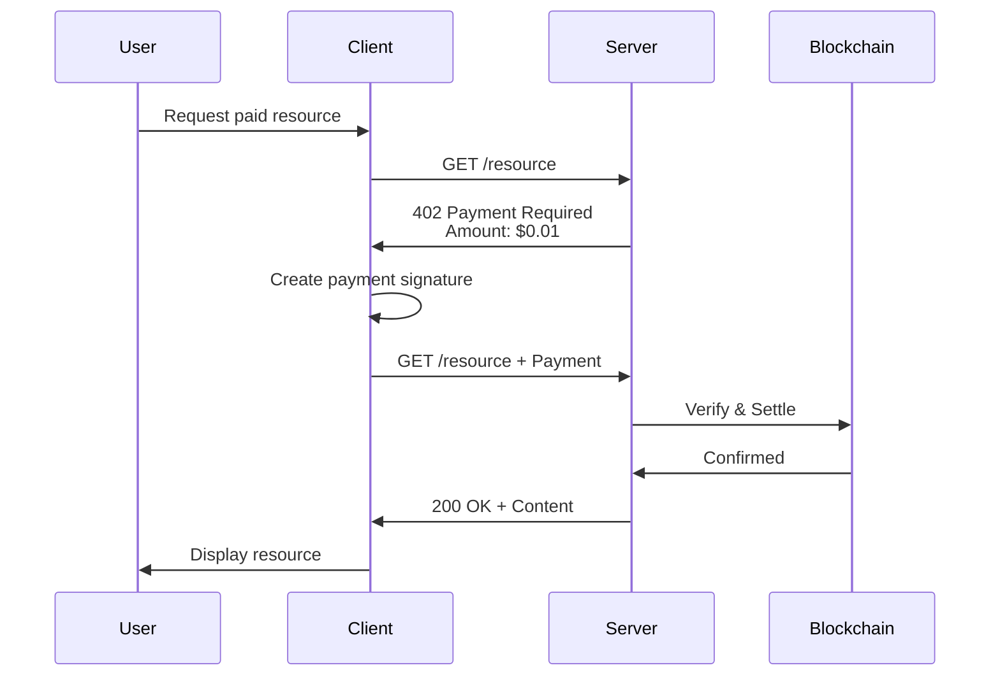

# What is x402?

## The Problem

Today's internet operates on a binary model: content is either free or requires an account with a subscription. There's no native way to pay for individual HTTP requests, forcing content creators and API providers into these limiting models:

### Current Limitations

**Free Content**
- Monetization through ads (poor user experience)
- Limited by rate limits and API keys
- No payment for actual usage
- Vulnerable to abuse

**Subscription Model**
- High barrier to entry (monthly fees)
- Users pay for unused capacity
- Complex account management
- All-or-nothing access

**Traditional Micropayments**
- Require user accounts
- High transaction fees make small payments impractical
- Complex payment flows
- Poor developer experience

## The Solution: x402

**x402 is a protocol that enables HTTP endpoints to require micropayments for access**, using blockchain-based payments that are:

- **Immediate**: No account creation or authentication required
- **Granular**: Pay only for what you use, per request
- **Low-cost**: Blockchain settlement makes micropayments economical
- **Simple**: Standard HTTP headers carry payment information
- **Universal**: Works with any HTTP client/server

### How It Works (Simple Version)



**In plain language:**
1. You try to access a paid endpoint
2. Server says "This costs $0.01"
3. Your client creates a cryptographic payment authorization
4. Client retries the request with payment proof
5. Server verifies and settles the payment
6. You get your content

## Core Concepts

### 402 Payment Required

x402 leverages **HTTP status code 402** (Payment Required), which has been reserved since HTTP/1.1 but rarely used. When a server returns 402, it includes:

- Payment requirements (amount, method, recipient)
- Resource description
- Acceptable payment schemes and networks

### Payment Signature

Instead of sending money directly, the client creates a **cryptographic signature** authorizing the transfer. This signature:

- Proves the payer owns the funds
- Authorizes a specific amount to a specific recipient
- Has an expiration time
- Can be verified without blockchain interaction
- Is settled on-chain by the server/facilitator

### Facilitator

A **facilitator** is a service that:

- Verifies payment signatures are valid
- Settles payments on the blockchain
- Can be run locally or as a remote service
- Provides a standard interface for different payment schemes

## Why Blockchain?

Traditional payment systems (credit cards, PayPal) have limitations for micropayments:

| Traditional Payments | Blockchain Payments |
|---------------------|-------------------|
| $0.30 + 3% fee per transaction | <$0.01 transaction fee |
| Requires user account | Wallet is identity |
| Days to settle | Seconds to settle |
| Chargeback risk | Final settlement |
| Centralized gatekeepers | Permissionless |

Blockchain makes micropayments **economically viable** for the first time.

## Protocol Benefits

### For Content Creators

✅ Monetize at any scale (even $0.001 per request)
✅ No payment processor accounts needed
✅ Direct payment, no middlemen taking cuts
✅ Usage-based pricing models
✅ Instant revenue recognition

### For Developers

✅ Simple HTTP-based protocol
✅ Standard headers, no complex SDKs
✅ Works with existing HTTP clients/servers
✅ Multiple language implementations
✅ Easy to test and debug

### For Users

✅ Pay only for what you use
✅ No account creation required
✅ Privacy-preserving (blockchain address only)
✅ Transparent pricing
✅ Works across any x402-enabled service

## Real-World Applications

### API Monetization

```typescript
// Traditional: All-or-nothing API keys
GET /api/weather?key=xxx&location=SF

// x402: Pay per request
GET /api/weather?location=SF
// + Payment: $0.001
```

### AI Model Access

```typescript
// Instead of: $20/month for OpenAI API

// Use x402: Pay $0.002 per request to multiple AI providers
POST /ai/generate + Payment: $0.002
```

### Content Access

```typescript
// Instead of: $10/month subscription

// Use x402: Pay $0.10 per article
GET /articles/123 + Payment: $0.10
```

### Rate Limiting by Payment

```typescript
// Free tier: 100 requests/day
// Paid tier: $0.001 per additional request

// Automatic tier upgrade via x402
GET /api/data + Payment: $0.001
```

## The x402 Protocol Name

The name "x402" comes from:

- **"x"**: Extensible protocol prefix (like HTTP/x headers)
- **"402"**: HTTP status code for "Payment Required"

The protocol defines:
- How servers communicate payment requirements (402 responses)
- How clients attach payment proofs (HTTP headers)
- How payments are verified and settled (facilitator interface)
- Multiple payment schemes (EVM, Solana, etc.)

## Protocol Features

The x402 protocol includes:

- **Header-based** communication for clean HTTP integration
- **Multiple payment schemes** (exact, streaming, etc.)
- **Multi-network support** (EVM chains, Solana, etc.)
- **Facilitator abstraction** (local or remote)
- **Strong type safety** and excellent developer experience

---

## Next Steps

- **Understand the Architecture**: [Architecture Overview](./architecture-overview.md)
- **See Real Use Cases**: [Use Cases](./use-cases.md)
- **Learn the Flow**: [Payment Flow Overview](../02-protocol-flows/payment-flow-overview.md)

---

*The reference implementation demonstrates these concepts in `/e2e/clients/fetch` and `/e2e/servers/express`*
