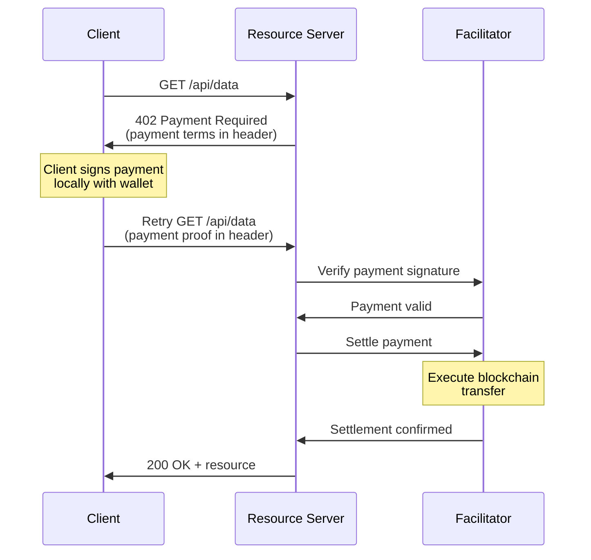
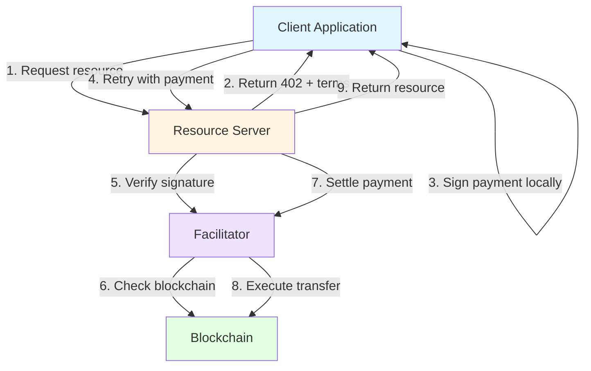

<!-- VERIFIED: 3c3e2168 -->
# What is x402?

x402 is a protocol and SDK for building HTTP APIs that accept cryptocurrency micropayments on a per-request basis. It extends the HTTP 402 Payment Required status code to enable seamless, cryptographically-verified payments for API access.

## The Problem

Traditional API monetization faces several challenges:

- **Subscription overhead**: Monthly billing and account management create friction for both providers and consumers
- **Payment processor fees**: Credit card fees (2-3%) make micropayments economically unviable
- **Limited granularity**: Difficult to charge per-request or offer flexible pricing models
- **Geographic restrictions**: Payment processors exclude users in many countries
- **Privacy concerns**: Traditional payments require extensive user data collection

## The Solution

x402 combines three key technologies:

1. **HTTP 402 Status Code**: A standard (but previously unused) HTTP status code for payment required
2. **Blockchain Payments**: Low-fee, permissionless cryptocurrency transactions
3. **Payment Protocol**: A simple handshake between client and server to negotiate and verify payments

The result is a drop-in middleware system that lets you charge for API access without subscriptions, accounts, or traditional payment processors.

## How It Works


```mermaid
sequenceDiagram
    participant C as Client
    participant S as Resource Server
    participant F as Facilitator

    C->>S: GET /api/data
    S->>C: 402 Payment Required<br/>(payment terms in header)

    Note over C: Client signs payment<br/>locally with wallet

    C->>S: Retry GET /api/data<br/>(payment proof in header)
    S->>F: Verify payment signature
    F->>S: Payment valid
    S->>F: Settle payment

    Note over F: Execute blockchain<br/>transfer

    F->>S: Settlement confirmed
    S->>C: 200 OK + resource
```

### Key Insight

**Clients never contact the Facilitator directly.** Payment creation happens entirely on the client side using local wallet signing. The Resource Server handles all Facilitator interactions for verification and settlement.

## Key Benefits

### For API Providers

- **Instant monetization**: Add payment requirements with a few lines of middleware code
- **Micropayment economics**: Charge fractions of a cent per request profitably
- **No merchant accounts**: No payment processor onboarding or monthly fees
- **Global access**: Accept payments from anyone with a compatible blockchain wallet
- **Flexible pricing**: Different prices per endpoint, dynamic pricing, time-based access

### For API Consumers

- **Pay-as-you-go**: No subscriptions, only pay for what you use
- **No accounts**: No registration, email verification, or personal data required
- **Instant access**: Start using paid APIs in seconds
- **Privacy**: Pseudonymous blockchain payments instead of credit cards
- **Programmatic**: Payments integrate seamlessly into code workflows

## Supported Networks

x402 uses CAIP-2 network identifiers for blockchain network specification:

### EVM Networks (Ethereum-compatible)

- `eip155:1` - Ethereum Mainnet
- `eip155:84532` - Base Sepolia (testnet)
- `eip155:8453` - Base Mainnet
- Any EVM-compatible chain

### Solana

- `solana:5eykt4UsFv8P8NJdTREpY1vzqKqZKvdp` - Solana Mainnet
- `solana:EtWTRABZaYq6iMfeYKouRu166VU2xqa1` - Solana Devnet

## Architecture

x402 consists of three main components:


```mermaid
flowchart TD
    C[Client Application]
    S[Resource Server]
    F[Facilitator]
    B[Blockchain]

    C -->|1. Request resource| S
    S -->|2. Return 402 + terms| C
    C -->|3. Sign payment locally| C
    C -->|4. Retry with payment| S
    S -->|5. Verify signature| F
    F -->|6. Check blockchain| B
    S -->|7. Settle payment| F
    F -->|8. Execute transfer| B
    S -->|9. Return resource| C

    style C fill:#e1f5ff
    style S fill:#fff4e1
    style F fill:#f0e1ff
    style B fill:#e1ffe1
```

### Components

**Client**: Your application code that makes HTTP requests. Uses x402 client SDK to automatically handle payment negotiations and sign transactions with a blockchain wallet.

**Resource Server**: Your API server. Uses x402 middleware to protect endpoints and specify payment requirements. Handles all communication with the Facilitator.

**Facilitator**: A service that verifies payment signatures and settles transactions on the blockchain. Operated by x402 or self-hosted. Clients never interact with it directly.

**Blockchain**: The underlying payment rail (Ethereum, Base, Solana, etc.) where funds are transferred.

## Quick Example

### Server Side

```typescript
import express from "express";
import { paymentMiddleware } from "@x402/express";
import { x402ResourceServer, HTTPFacilitatorClient } from "@x402/core/server";
import { registerExactEvmScheme } from "@x402/evm/exact/server";

const app = express();

const facilitatorClient = new HTTPFacilitatorClient({
  url: "https://facilitator.x402.org"
});
const server = new x402ResourceServer(facilitatorClient);
registerExactEvmScheme(server);

app.use(paymentMiddleware(
  {
    "GET /api/premium-data": {
      accepts: {
        scheme: "exact",
        network: "eip155:84532",
        payTo: "0xYourAddress",
        price: "$0.01",
      },
      description: "Premium data access",
    },
  },
  server,
));

app.get("/api/premium-data", (req, res) => {
  res.json({ data: "Premium content" });
});

app.listen(3000);
```

### Client Side

```typescript
import { x402Client } from "@x402/core/client";
import { registerExactEvmScheme } from "@x402/evm/exact/client";
import { wrapFetchWithPayment } from "@x402/fetch";
import { privateKeyToAccount } from "viem/accounts";

const account = privateKeyToAccount("0xYourPrivateKey");
const client = new x402Client();
registerExactEvmScheme(client, { signer: account });

const fetchWithPayment = wrapFetchWithPayment(fetch, client);

// This automatically handles the payment flow
const response = await fetchWithPayment("http://localhost:3000/api/premium-data");
const data = await response.json();
```

## Payment Schemes

x402 uses "schemes" to define how payments are created, verified, and settled. The primary scheme is:

- **exact**: Fixed-price payments using ERC-3009 (EVM) or SPL Token (Solana) transfers

Each scheme can be implemented on different blockchain networks, and the protocol is extensible to support additional payment types.

## Next Steps

- [Installation](../00-getting-started/installation.md) - Install the x402 SDK
- [Quick Start - Client](../00-getting-started/quick-start-client.md) - Build a payment-enabled client
- [Quick Start - Server](../00-getting-started/quick-start-server.md) - Protect your API with payments
- [Architecture Overview](./architecture-overview.md) - Deep dive into the protocol architecture
