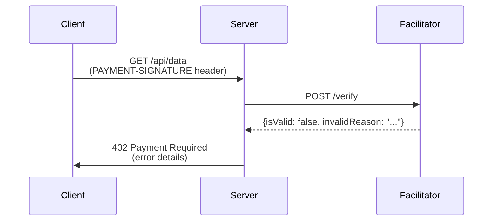
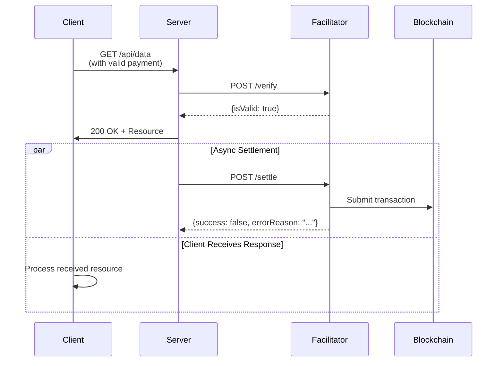

<!-- VERIFIED: 3c3e2168 -->
# Error Scenarios

This document covers error handling in the x402 protocol, including common failure modes and recovery strategies for verification, settlement, and client-side payment creation errors.

## Overview

The x402 protocol handles errors at three key points:

1. **Verification errors** - Payment signature validation fails
2. **Settlement errors** - Blockchain transaction submission fails
3. **Client errors** - Payment creation fails before sending to server

Importantly, verification failures block resource access (returning 402), while settlement failures do not revoke resource access. Applications must decide how to handle settlement failures based on their business needs.

## Verification Failures

Verification occurs synchronously when a client submits a payment signature. If verification fails, the server returns a 402 response, blocking resource access.

### Common Verification Failures



### Invalid Signature

The payment signature is cryptographically invalid or corrupted.

**Cause:**
- Client corrupted the signature during transmission
- Wallet produced an invalid signature
- Signature was tampered with

**Server Response:**
```http
HTTP/1.1 402 Payment Required
Content-Type: application/json

{
  "error": "Invalid payment signature",
  "code": "VERIFICATION_FAILED"
}
```

**Facilitator Response:**
```json
{
  "isValid": false,
  "invalidReason": "Invalid signature"
}
```

**Recovery:**
The client should retry payment creation with a fresh signature:

```typescript
try {
  const response = await fetch("https://server.example.com/api/data", {
    headers: { "PAYMENT-SIGNATURE": paymentSignature }
  });

  if (response.status === 402) {
    // Re-sign payment and retry
    const paymentRequired = decodePaymentRequired(response);
    const newSignature = await client.createPaymentPayload(paymentRequired);
    return fetch("https://server.example.com/api/data", {
      headers: { "PAYMENT-SIGNATURE": encodePaymentSignature(newSignature) }
    });
  }
} catch (error) {
  console.error("Payment verification failed:", error);
}
```

### Insufficient Payment Amount

The payment amount is less than the required amount.

**Cause:**
- Client selected a lower payment tier than required
- Token amount miscalculated due to decimal handling
- Server changed the required amount

**Server Response:**
```http
HTTP/1.1 402 Payment Required
Content-Type: application/json

{
  "error": "Insufficient payment amount",
  "code": "VERIFICATION_FAILED",
  "required": "10000",
  "provided": "5000"
}
```

**Facilitator Response:**
```json
{
  "isValid": false,
  "invalidReason": "Insufficient payment amount"
}
```

**Recovery:**
The client should check the new payment requirements and create a payment with the correct amount:

```typescript
const response = await fetch("https://server.example.com/api/data");

if (response.status === 402) {
  const paymentRequired = decodePaymentRequired(response);
  const requirements = paymentRequired.accepts[0];

  // Verify sufficient balance before signing
  const balance = await wallet.getBalance(requirements.asset);
  if (balance < BigInt(requirements.amount)) {
    throw new Error("Insufficient balance for required payment");
  }

  const signature = await client.createPaymentPayload(paymentRequired);
  return fetch("https://server.example.com/api/data", {
    headers: { "PAYMENT-SIGNATURE": encodePaymentSignature(signature) }
  });
}
```

### Expired Authorization

The payment signature's validity window has passed.

**Cause:**
- Payment was created but not sent for too long
- Server's clock is significantly ahead of client's clock
- Authorization has a short validity window

**Server Response:**
```http
HTTP/1.1 402 Payment Required
Content-Type: application/json

{
  "error": "Payment authorization expired",
  "code": "VERIFICATION_FAILED"
}
```

**Facilitator Response:**
```json
{
  "isValid": false,
  "invalidReason": "Authorization expired"
}
```

**Recovery:**
Create a fresh payment signature:

```typescript
// Always create signature immediately before sending
const paymentRequired = decodePaymentRequired(
  await fetch("https://server.example.com/api/data")
);

const freshSignature = await client.createPaymentPayload(paymentRequired);
const response = await fetch("https://server.example.com/api/data", {
  headers: { "PAYMENT-SIGNATURE": encodePaymentSignature(freshSignature) }
});
```

### Mismatched Payment Terms

The payment terms in the signature don't match the server's current terms.

**Cause:**
- Server changed payment terms between requests
- Server is enforcing strict term matching
- Client sent a stale payment signature

**Server Response:**
```http
HTTP/1.1 402 Payment Required
Content-Type: application/json

{
  "error": "Payment terms do not match",
  "code": "VERIFICATION_FAILED"
}
```

**Facilitator Response:**
```json
{
  "isValid": false,
  "invalidReason": "Payment terms mismatch"
}
```

**Recovery:**
Retrieve fresh terms and create new payment:

```typescript
const freshTerms = await fetch("https://server.example.com/api/data");
const paymentRequired = decodePaymentRequired(freshTerms);
const signature = await client.createPaymentPayload(paymentRequired);

return fetch("https://server.example.com/api/data", {
  headers: { "PAYMENT-SIGNATURE": encodePaymentSignature(signature) }
});
```

### Duplicate or Replay Signature

The payment signature has already been used, indicating a replay attack attempt.

**Cause:**
- Client or network duplicated the request
- Attacker is attempting to replay a valid signature
- Nonce tracking is preventing reuse

**Server Response:**
```http
HTTP/1.1 402 Payment Required
Content-Type: application/json

{
  "error": "Payment already used",
  "code": "VERIFICATION_FAILED"
}
```

**Facilitator Response:**
```json
{
  "isValid": false,
  "invalidReason": "Replay protection: signature already used"
}
```

**Recovery:**
The client should create a brand new payment. This error indicates proper security. Do not retry with the same signature:

```typescript
// Do NOT retry with the same signature
// Do NOT cache and reuse signatures

// Create a completely new payment
const paymentRequired = decodePaymentRequired(
  await fetch("https://server.example.com/api/data")
);

const newSignature = await client.createPaymentPayload(paymentRequired);
return fetch("https://server.example.com/api/data", {
  headers: { "PAYMENT-SIGNATURE": encodePaymentSignature(newSignature) }
});
```

## Settlement Failures

Settlement occurs asynchronously after resource delivery. Unlike verification failures, settlement failures do not block resource access. The resource has already been delivered.

### Settlement Error Response



### Insufficient Balance

The payer's account does not have enough tokens to settle the payment.

**Cause:**
- User spent balance between signing and settlement
- Estimate included fees, actual fees were higher
- Network conditions caused price impact

**Facilitator Response:**
```json
{
  "success": false,
  "errorReason": "insufficient_balance",
  "transaction": "",
  "network": "eip155:84532"
}
```

**Server Handling:**
```typescript
const result = await facilitator.settle(paymentPayload, requirements);

if (!result.success) {
  // Resource was already delivered
  // Decide how to handle the failure
  if (result.errorReason === "insufficient_balance") {
    // Option 1: Log for later recovery
    await logFailedSettlement({
      payer: result.payer,
      reason: result.errorReason,
      timestamp: Date.now()
    });

    // Option 2: Notify user through separate channel
    await notifyUserOfSettlementFailure(result.payer);

    // Option 3: Mark account as requiring manual review
    await markAccountForReview(result.payer);
  }
}
```

**Recovery Strategies:**
- Manual retry by server after configurable delay
- Notify user and allow them to retry
- Implement tiered fallback (e.g., request smaller amount)
- Accept the loss as cost of operations (for low-value transactions)

### Network Congestion / High Gas Fees

Transaction submission failed due to network conditions.

**Cause:**
- Network is congested, gas prices spiked
- Estimated fees became insufficient
- Transaction pool is full

**Facilitator Response:**
```json
{
  "success": false,
  "errorReason": "network_congestion",
  "transaction": "",
  "network": "eip155:84532"
}
```

**Server Handling:**
```typescript
const result = await facilitator.settle(paymentPayload, requirements);

if (!result.success && result.errorReason === "network_congestion") {
  // Implement exponential backoff retry
  const delayMs = Math.min(1000 * Math.pow(2, retryCount), 60000);
  setTimeout(async () => {
    const retryResult = await facilitator.settle(paymentPayload, requirements);
    // Handle retry result
  }, delayMs);
}
```

### Transaction Reverted

The blockchain transaction executed but reverted (e.g., due to transfer failure).

**Cause:**
- Token transfer failed at chain level
- Smart contract validation failed
- Token contract temporarily blocked transfers

**Facilitator Response:**
```json
{
  "success": false,
  "errorReason": "transaction_reverted",
  "transaction": "0x...", // Hash available even if reverted
  "network": "eip155:84532"
}
```

**Server Handling:**
```typescript
const result = await facilitator.settle(paymentPayload, requirements);

if (!result.success && result.errorReason === "transaction_reverted") {
  // Transaction is on-chain but failed
  // Log the hash for debugging
  logger.error("Settlement transaction reverted", {
    txHash: result.transaction,
    payer: result.payer,
    network: result.network
  });

  // Do not retry - the transaction is permanent
  // Notify application administrators
  alertAdministrators("Settlement reverted", result);
}
```

### Facilitator Unavailable

The facilitator service is unreachable.

**Cause:**
- Facilitator is down or unreachable
- Network connectivity issue
- DNS resolution failure

**Server Handling:**
```typescript
try {
  const result = await facilitator.settle(paymentPayload, requirements);
} catch (error) {
  if (error.code === "ECONNREFUSED" || error.code === "ETIMEDOUT") {
    // Facilitator is unreachable
    // Implement retry with fallback

    // Option 1: Queue for retry
    await settlementQueue.add({
      paymentPayload,
      requirements,
      retryCount: 0
    });

    // Option 2: Use backup facilitator
    const backupResult = await backupFacilitator.settle(
      paymentPayload,
      requirements
    );
  }
}
```

## Client-Side Errors

Client-side errors occur during payment creation, before the payment is sent to the server.

### No Scheme Registered for Network

The client does not have a payment scheme registered for the requested network.

**Cause:**
- Client was not configured with required scheme
- Scheme registration failed during setup
- Server requested an unsupported network

**Error:**
```typescript
const client = new x402Client();
registerExactEvmScheme(client, { signer: account }); // Only registered for one scheme

const paymentRequired = decodePaymentRequired(response);
const requirements = paymentRequired.accepts[0]; // Different network!

try {
  const payload = await client.createPaymentPayload(paymentRequired);
} catch (error) {
  // Error: "No scheme registered for network eip155:solana:mainnet"
}
```

**Recovery:**
Register additional schemes before making requests:

```typescript
import { registerExactEvmScheme } from "@x402/evm/exact/client";
import { registerExactSvmScheme } from "@x402/svm/exact/client";

const client = new x402Client();

// Register both EVM and SVM schemes
registerExactEvmScheme(client, { signer: evmAccount });
registerExactSvmScheme(client, { signer: svmKeypair });

// Now both networks are supported
const payload = await client.createPaymentPayload(paymentRequired);
```

### Insufficient Balance

The client's wallet does not have enough balance to cover the payment.

**Cause:**
- Wallet balance is below required amount
- Tokens locked or unavailable
- Wrong token selected

**Prevention:**
Check balance before signing:

```typescript
const paymentRequired = decodePaymentRequired(response);
const requirements = paymentRequired.accepts[0];

// Check balance before committing to payment
const balance = await publicClient.readContract({
  address: requirements.asset,
  abi: erc20ABI,
  functionName: "balanceOf",
  args: [userAddress]
});

if (balance < BigInt(requirements.amount)) {
  throw new Error(
    `Insufficient balance: need ${requirements.amount}, have ${balance}`
  );
}

// Now safe to create payment
const payload = await client.createPaymentPayload(paymentRequired);
```

### Signature Creation Failed

The wallet refused to sign or signing failed.

**Cause:**
- User rejected the signing request
- Hardware wallet disconnected
- Wallet internal error
- Insufficient permissions

**Handling:**
```typescript
try {
  const payload = await client.createPaymentPayload(paymentRequired);
} catch (error) {
  if (error.code === "ACTION_REJECTED") {
    console.error("User rejected payment signature");
    // Prompt user to try again
  } else if (error.code === "DISCONNECTED") {
    console.error("Hardware wallet disconnected");
    // Reconnect wallet
  } else {
    console.error("Signature creation failed:", error.message);
    // Generic error handling
  }
}
```

### Invalid Payment Requirements

The payment requirements from the server are malformed or invalid.

**Cause:**
- Server sent invalid PAYMENT-REQUIRED header
- Decode error in client
- Server misconfigured

**Handling:**
```typescript
try {
  const paymentRequired = decodePaymentRequired(response);

  // Validate structure
  if (!paymentRequired.accepts || paymentRequired.accepts.length === 0) {
    throw new Error("No payment options provided");
  }

  for (const option of paymentRequired.accepts) {
    if (!option.network || !option.asset || !option.amount) {
      throw new Error("Invalid payment option structure");
    }
  }

  const payload = await client.createPaymentPayload(paymentRequired);
} catch (error) {
  console.error("Invalid payment requirements:", error);
  // Show user-friendly error
}
```

## Error Handling Patterns

### Retry Logic

Not all errors warrant retries. Use these guidelines:

```typescript
enum RetryableError {
  // Network errors
  TIMEOUT = "timeout",
  TEMPORARILY_UNAVAILABLE = "temporarily_unavailable",

  // Transient signature errors
  EXPIRED = "expired",

  // Transient settlement errors
  NETWORK_CONGESTION = "network_congestion",
  TEMPORARILY_INSUFFICIENT_BALANCE = "insufficient_balance"
}

async function executeWithRetry(fn, maxRetries = 3) {
  for (let attempt = 0; attempt < maxRetries; attempt++) {
    try {
      return await fn();
    } catch (error) {
      const isRetryable = Object.values(RetryableError).includes(error.code);
      const isLastAttempt = attempt === maxRetries - 1;

      if (!isRetryable || isLastAttempt) {
        throw error;
      }

      // Exponential backoff
      const delayMs = Math.min(100 * Math.pow(2, attempt), 10000);
      await new Promise(resolve => setTimeout(resolve, delayMs));
    }
  }
}
```

### Comprehensive Error Handling

```typescript
import { wrapFetchWithPayment } from "@x402/fetch";

async function fetchProtectedResource(url) {
  const fetchWithPayment = wrapFetchWithPayment(fetch, client);

  try {
    const response = await executeWithRetry(
      () => fetchWithPayment(url),
      3 // max retries
    );

    if (!response.ok) {
      throw new Error(`HTTP ${response.status}: ${response.statusText}`);
    }

    return response;
  } catch (error) {
    // Categorize and handle error
    if (error.message.includes("No scheme registered")) {
      // Configuration error - needs app update
      showErrorMessage("Payment method not supported");
    } else if (error.message.includes("Insufficient balance")) {
      // User action needed
      showErrorMessage("Please add funds to your wallet");
    } else if (error.code === "ACTION_REJECTED") {
      // User cancelled
      showErrorMessage("Payment cancelled by user");
    } else {
      // Technical error
      logger.error("Payment failed", { url, error });
      showErrorMessage("Unable to process payment. Please try again.");
    }

    throw error;
  }
}
```

## Best Practices

### Verification Errors

1. **Always retry on verification failure** - The error is likely temporary or user-correctable
2. **Check invalidReason field** - Use specific error messages to guide user recovery
3. **Request fresh terms** - Don't reuse old payment terms across verification failures
4. **Implement backoff** - Use exponential backoff to avoid overwhelming the server

### Settlement Errors

1. **Do not revoke resource access** - Resource delivery is not dependent on settlement success
2. **Log all failures** - Settlement failures are critical for reconciliation
3. **Implement retry strategy** - Settlement can often succeed after delay
4. **Monitor settlement latency** - Track settlement times to detect system issues
5. **Plan for manual recovery** - Have process for investigating failed settlements

### Client Errors

1. **Validate early** - Check balance and scheme support before user initiates payment
2. **Fail fast** - Don't let validation errors block the UI indefinitely
3. **Provide clear messaging** - Tell users exactly what went wrong and how to fix it
4. **Handle rejection gracefully** - User cancellation is not an error

## Related Documentation

- [Payment Flow Overview](./payment-flow-overview.md) - Core protocol flow
- [Happy Path Flow](./happy-path.md) - Successful payment sequence
- [Network Variations](./network-variations.md) - EVM and Solana differences
