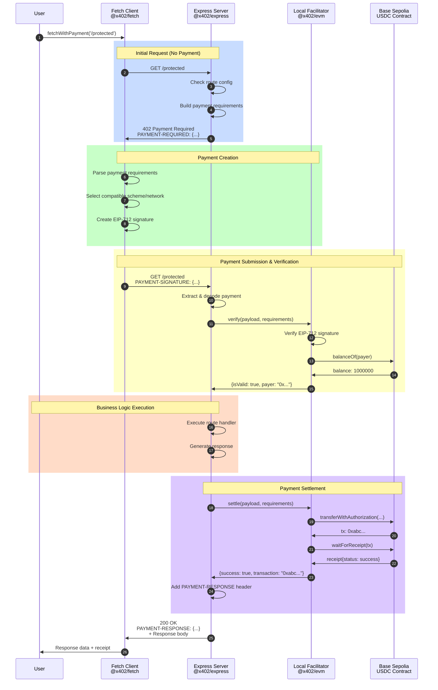

# Happy Path: Successful Payment Flow

This document walks through a complete successful payment interaction, showing what happens at each step with actual code references from the implementation.

## Overview

A "happy path" is when everything works correctly:
- Client has sufficient funds
- Payment signature is valid
- Network is responsive
- Transaction settles successfully



## Step-by-Step Breakdown

### Step 1: Initial Request (No Payment)

**User Action**:
```typescript
const response = await fetchWithPayment('http://localhost:4021/protected');
```

**Client Code** (`typescript/packages/http/fetch/src/index.ts:101-106`):
```typescript
return async (input: RequestInfo, init?: RequestInit) => {
  const response = await fetch(input, init);

  if (response.status !== 402) {
    return response;  // Not a payment-required response
  }
  // ... handle payment
```

**What Happens**:
- Wrapped fetch makes a normal HTTP request
- No payment headers are included yet
- Request reaches the server

---

### Step 2: Server Route Matching

**Server Code** (`typescript/packages/http/express/src/index.ts:84-95`):
```typescript
return async (req: Request, res: Response, next: NextFunction) => {
  const adapter = new ExpressAdapter(req);
  const context: HTTPRequestContext = {
    adapter,
    path: req.path,
    method: req.method,
    paymentHeader: adapter.getHeader('payment-signature'),
  };

  const result = await server.processHTTPRequest(context, paywallConfig);
  // ...
```

**What Happens**:
- Express middleware intercepts the request
- Creates an HTTPAdapter wrapping Express req/res
- Extracts payment header (none present yet)
- Calls `processHTTPRequest`

---

### Step 3: Build Payment Requirements

**Server Code** (`typescript/packages/http/express/src/index.ts:24-35` for route config):
```typescript
app.use(paymentMiddleware({
  "GET /protected": {
    payTo: PAYEE_ADDRESS,
    scheme: "exact",
    price: "$0.001",
    network: NETWORK,  // "eip155:84532"
  }
}, localFacilitatorClient, [{ network: NETWORK, server: new ExactEvmService() }]));
```

**Processing** (`typescript/packages/mechanisms/evm/src/exact/index.ts:301-365`):
```typescript
parsePrice(price: Price, network: Network): AssetAmount {
  // "$0.001" -> converts to USDC smallest units
  const amount = this.convertToTokenAmount("0.001", network);
  // Returns: "1000" (0.001 USDC = 1000 units with 6 decimals)

  const assetInfo = this.getDefaultAsset(network);
  // For Base Sepolia: {
  //   address: "0x036CbD53842c5426634e7929541eC2318f3dCF7e",
  //   name: "USDC",
  //   version: "2"
  // }

  return {
    amount: "1000",
    asset: "0x036CbD53842c5426634e7929541eC2318f3dCF7e",
    extra: { name: "USDC", version: "2" }
  };
}
```

**Resulting PaymentRequirements Object**:
```typescript
{
  scheme: "exact",
  network: "eip155:84532",
  asset: "0x036CbD53842c5426634e7929541eC2318f3dCF7e",
  amount: "1000",
  payTo: "0x742d35Cc6634C0532925a3b844Bc9e7595f0bEb",
  maxTimeoutSeconds: 300,
  extra: {
    name: "USDC",
    version: "2"
  }
}
```

---

### Step 4: Return 402 Response

**Server Code** (`typescript/packages/core/src/http/x402HTTPResourceService.ts:168-177`):
```typescript
if (!paymentPayload) {
  return {
    type: 'payment-error',
    response: this.createHTTPResponse(
      paymentRequired,
      this.isWebBrowser(adapter),
      paywallConfig,
      routeConfig.customPaywallHtml
    )
  };
}
```

**HTTP Response**:
```http
HTTP/1.1 402 Payment Required
Content-Type: application/json
PAYMENT-REQUIRED: eyJ4NDAyVmVyc2lvbiI6MiwiZXJyb3IiOiJQYXltZW50IHJlcXVpcmVkIiwicmVzb3VyY2UiOnsidXJsIjoiaHR0cDovL2xvY2FsaG9zdDo0MDIxL3Byb3RlY3RlZCIsImRlc2NyaXB0aW9uIjoiIiwibWltZVR5cGUiOiIifSwiYWNjZXB0cyI6W3sic2NoZW1lIjoiZXhhY3QiLCJuZXR3b3JrIjoiZWlwMTU1Ojg0NTMyIiwiYXNzZXQiOiIweDgzMzU4OWZDRDZlRGI2RTA4ZjRjN0MzMkQ0ZjcxYjU0YmRBMDI5MTMiLCJhbW91bnQiOiIxMDAwIiwicGF5VG8iOiIweDc0MmQzNUNjNjYzNEMwNTMyOTI1YTNiODQ0QmM5ZTc1OTVmMGJFYiIsIm1heFRpbWVvdXRTZWNvbmRzIjozMDAsImV4dHJhIjp7Im5hbWUiOiJVU0RDIiwidmVyc2lvbiI6IjIifX1dfQ==

{
  "error": "Payment required"
}
```

**Decoded PAYMENT-REQUIRED Header**:
```json
{
  "x402Version": 2,
  "error": "Payment required",
  "resource": {
    "url": "http://localhost:4021/protected",
    "description": "",
    "mimeType": ""
  },
  "accepts": [{
    "scheme": "exact",
    "network": "eip155:84532",
    "asset": "0x036CbD53842c5426634e7929541eC2318f3dCF7e",
    "amount": "1000",
    "payTo": "0x742d35Cc6634C0532925a3b844Bc9e7595f0bEb",
    "maxTimeoutSeconds": 300,
    "extra": {
      "name": "USDC",
      "version": "2"
    }
  }]
}
```

---

### Step 5: Client Parses Requirements

**Client Code** (`typescript/packages/http/fetch/src/index.ts:108-130`):
```typescript
// Parse payment requirements from response
let paymentRequired: PaymentRequired;
try {
  const responseHeaders: Record<string, string> = {};
  response.headers.forEach((value, key) => {
    responseHeaders[key.toUpperCase()] = value;
  });

  paymentRequired = client.getPaymentRequiredResponse(responseHeaders, body);
} catch (error) {
  throw new Error(`Failed to parse payment requirements: ${error.message}`);
}
```

**Parsed Object** (same as decoded header above):
```typescript
paymentRequired = {
  x402Version: 2,
  resource: { url: "...", description: "", mimeType: "" },
  accepts: [{ scheme: "exact", network: "eip155:84532", ... }]
}
```

---

### Step 6: Select Payment Requirements

**Client Code** (`typescript/packages/http/fetch/src/index.ts:133-136` + `typescript/packages/core/src/client/x402Client.ts:25-51`):
```typescript
const selectedPaymentRequirements = client.selectPaymentRequirements(
  paymentRequired.x402Version,
  paymentRequired.accepts
);
```

**Selection Logic**:
```typescript
// From x402Client.ts
selectPaymentRequirements(x402Version: number, paymentRequirements: PaymentRequirements[]): PaymentRequirements {
  const clientSchemesByNetwork = this.registeredClientSchemes.get(x402Version);

  // Filter to only requirements the client supports
  const supportedPaymentRequirements = paymentRequirements.filter(requirement => {
    let clientSchemes = findSchemesByNetwork(clientSchemesByNetwork, requirement.network);
    if (!clientSchemes) return false;
    return clientSchemes.has(requirement.scheme);
  });

  // Use selector function (defaults to first option)
  return this.paymentRequirementsSelector(x402Version, supportedPaymentRequirements);
}
```

**Selected**: The first (and only) option in `accepts` array

---

### Step 7: Create Payment Payload

**Client Code** (`typescript/packages/http/fetch/src/index.ts:139-146`):
```typescript
let paymentPayload;
try {
  paymentPayload = await client.createPaymentPayload(
    paymentRequired.x402Version,
    selectedPaymentRequirements
  );
} catch (error) {
  throw new Error(`Failed to create payment payload: ${error.message}`);
}
```

**EVM Client Implementation** (`typescript/packages/mechanisms/evm/src/exact/index.ts:15-43`):
```typescript
async createPaymentPayload(_: number, requirements: PaymentRequirements): Promise<PaymentPayload> {
  const nonce = createNonce();  // Random bytes32
  const now = Math.floor(Date.now() / 1000);

  const authorization: ExactEvmPayloadV2["authorization"] = {
    from: this.signer.address,  // "0xABC..."
    to: getAddress(requirements.payTo),  // "0x742d..."
    value: requirements.amount,  // "1000"
    validAfter: (now - 600).toString(),  // 10 min buffer
    validBefore: (now + requirements.maxTimeoutSeconds).toString(),
    nonce,  // "0x1234..."
  };

  // Sign using EIP-712
  const signature = await this.signAuthorization(authorization, requirements);

  const payload: ExactEvmPayloadV2 = {
    authorization,
    signature,  // "0xabcd...signature"
  };

  return {
    x402Version: 2,
    scheme: requirements.scheme,
    network: requirements.network,
    payload,
    accepted: requirements,
  } as PaymentPayload;
}
```

**EIP-712 Signing** (`typescript/packages/mechanisms/evm/src/exact/index.ts:48-82`):
```typescript
private async signAuthorization(
  authorization: ExactEvmPayloadV2["authorization"],
  requirements: PaymentRequirements
): Promise<`0x${string}`> {
  const chainId = parseInt(requirements.network.split(":")[1]);  // 84532

  const domain = {
    name: "USDC",
    version: "2",
    chainId: 84532,
    verifyingContract: "0x036CbD53842c5426634e7929541eC2318f3dCF7e",
  };

  const message = {
    from: "0xABC...",
    to: "0x742d...",
    value: BigInt("1000"),
    validAfter: BigInt("1730000000"),
    validBefore: BigInt("1730000300"),
    nonce: "0x1234...",
  };

  // User's wallet signs this typed data
  return await this.signer.signTypedData({
    domain,
    types: authorizationTypes,  // EIP-3009 types
    primaryType: "TransferWithAuthorization",
    message,
  });
}
```

**Resulting PaymentPayload Object**:
```typescript
{
  x402Version: 2,
  scheme: "exact",
  network: "eip155:84532",
  payload: {
    authorization: {
      from: "0xABC123...",
      to: "0x742d35Cc6634C0532925a3b844Bc9e7595f0bEb",
      value: "1000",
      validAfter: "1730000000",
      validBefore: "1730000300",
      nonce: "0x1234567890abcdef..."
    },
    signature: "0xabcdef123456...signature"
  },
  accepted: { /* original requirements */ }
}
```

---

### Step 8: Retry Request with Payment

**Client Code** (`typescript/packages/http/fetch/src/index.ts:149-176`):
```typescript
// Encode payment header
const paymentHeaders = client.encodePaymentSignatureHeader(paymentPayload);

// Create new request with payment header
const newInit = {
  ...init,
  headers: {
    ...(init.headers || {}),
    ...paymentHeaders,  // { 'PAYMENT-SIGNATURE': 'base64encoded...' }
    "Access-Control-Expose-Headers": "PAYMENT-RESPONSE,X-PAYMENT-RESPONSE",
  },
  __is402Retry: true,  // Prevent infinite loops
};

// Retry the request with payment
const secondResponse = await fetch(input, newInit);
return secondResponse;
```

**HTTP Request**:
```http
GET /protected HTTP/1.1
Host: localhost:4021
PAYMENT-SIGNATURE: eyJ4NDAyVmVyc2lvbiI6Miwic2NoZW1lIjoiZXhhY3QiLCJuZXR3b3JrIjoiZWlwMTU1Ojg0NTMyIiwicGF5bG9hZCI6eyJhdXRob3JpemF0aW9uIjp7ImZyb20iOiIweDEyMy4uLiIsInRvIjoiMHg3NDJkLi4uIiwidmFsdWUiOiIxMDAwIiwidmFsaWRBZnRlciI6IjE3MzAwMDAwMDAiLCJ2YWxpZEJlZm9yZSI6IjE3MzAwMDAzMDAiLCJub25jZSI6IjB4MTIzNC4uLiJ9LCJzaWduYXR1cmUiOiIweGFiY2QuLi4ifSwiYWNjZXB0ZWQiOnsuLi59fQ==
Access-Control-Expose-Headers: PAYMENT-RESPONSE,X-PAYMENT-RESPONSE
```

---

### Step 9: Server Extracts Payment

**Server Code** (`typescript/packages/core/src/http/x402HTTPResourceService.ts:148-150`):
```typescript
// Check for payment header
const paymentPayload = this.extractPayment(adapter);
```

**Extraction Logic**:
```typescript
private extractPayment(adapter: HTTPAdapter): PaymentPayload | null {
  const paymentHeader = adapter.getHeader('payment-signature');

  if (!paymentHeader) return null;

  return decodePaymentSignatureHeader(paymentHeader);
}
```

**Decoded PaymentPayload**: Same object from Step 7

---

### Step 10: Verify Payment

**Server Code** (`typescript/packages/core/src/http/x402HTTPResourceService.ts:181-200`):
```typescript
// Verify payment
try {
  const matchingRequirements = this.findMatchingRequirements(
    paymentRequired.accepts,
    paymentPayload
  );

  if (!matchingRequirements) {
    // Return error
  }

  const verifyResponse = await this.verifyPayment(
    paymentPayload,
    matchingRequirements
  );

  if (!verifyResponse.isValid) {
    // Return error
  }

  // Payment is valid, proceed
  return {
    type: 'payment-verified',
    paymentPayload,
    requirements: matchingRequirements
  };
```

**Facilitator Verify** (`typescript/packages/mechanisms/evm/src/exact/index.ts:90-228`):
```typescript
async verify(payload: PaymentPayload, requirements: PaymentRequirements): Promise<VerifyResponse> {
  const exactEvmPayload = payload.payload as ExactEvmPayloadV2;

  // 1. Verify signature
  const recoveredAddress = await this.signer.verifyTypedData({
    address: exactEvmPayload.authorization.from,
    domain, types, message,
    signature: exactEvmPayload.signature
  });

  if (!recoveredAddress) {
    return { isValid: false, invalidReason: "invalid_signature" };
  }

  // 2. Verify recipient matches
  if (exactEvmPayload.authorization.to !== requirements.payTo) {
    return { isValid: false, invalidReason: "recipient_mismatch" };
  }

  // 3. Verify expiration
  const now = Math.floor(Date.now() / 1000);
  if (BigInt(exactEvmPayload.authorization.validBefore) < BigInt(now + 6)) {
    return { isValid: false, invalidReason: "expired" };
  }

  // 4. Check balance
  const balance = await this.signer.readContract({
    address: requirements.asset,
    abi: eip3009ABI,
    functionName: "balanceOf",
    args: [exactEvmPayload.authorization.from],
  });

  if (BigInt(balance) < BigInt(requirements.amount)) {
    return { isValid: false, invalidReason: "insufficient_funds" };
  }

  // 5. Verify amount
  if (BigInt(exactEvmPayload.authorization.value) < BigInt(requirements.amount)) {
    return { isValid: false, invalidReason: "insufficient_amount" };
  }

  return {
    isValid: true,
    payer: exactEvmPayload.authorization.from,
  };
}
```

**VerifyResponse**:
```typescript
{
  isValid: true,
  payer: "0xABC123..."
}
```

---

### Step 11: Execute Business Logic

**Server Code** (`typescript/packages/http/express/src/index.ts:119-137`):
```typescript
case 'payment-verified':
  const { paymentPayload, requirements } = result;

  // Wrap res.end to defer until after handler
  const originalEnd = res.end.bind(res);
  let endArgs: EndArgs | null = null;

  res.end = function (...args: EndArgs) {
    endArgs = args;
    return res;
  };

  // Proceed to the next middleware or route handler
  await next();
```

**Route Handler** (`e2e/servers/express/index.ts:55-60`):
```typescript
app.get("/protected", (req, res) => {
  res.json({
    message: "Protected endpoint accessed successfully",
    timestamp: new Date().toISOString(),
  });
});
```

**Response Set** (not sent yet):
```json
{
  "message": "Protected endpoint accessed successfully",
  "timestamp": "2024-10-24T12:00:00.000Z"
}
```

---

### Step 12: Settle Payment

**Server Code** (`typescript/packages/http/express/src/index.ts:139-159`):
```typescript
// If the response from the protected route is >= 400, do not settle
if (res.statusCode >= 400) {
  // Skip settlement, send response as-is
  return;
}

try {
  const settlementHeaders = await server.processSettlement(
    paymentPayload,
    requirements,
    res.statusCode
  );

  if (settlementHeaders) {
    Object.entries(settlementHeaders).forEach(([key, value]) => {
      res.setHeader(key, value);
    });
  }
```

**Facilitator Settle** (`typescript/packages/mechanisms/evm/src/exact/index.ts:230-294`):
```typescript
async settle(payload: PaymentPayload, requirements: PaymentRequirements): Promise<SettleResponse> {
  const exactEvmPayload = payload.payload as ExactEvmPayloadV2;

  // Re-verify before settling
  const valid = await this.verify(payload, requirements);
  if (!valid.isValid) {
    return {
      success: false,
      errorReason: valid.invalidReason,
      transaction: "",
      network: payload.network,
      payer: exactEvmPayload.authorization.from,
    };
  }

  try {
    // Parse signature (handle ERC-6492 if applicable)
    const { signature } = parseErc6492Signature(exactEvmPayload.signature);

    // Execute transferWithAuthorization on USDC contract
    const tx = await this.signer.writeContract({
      address: "0x036CbD53842c5426634e7929541eC2318f3dCF7e",
      abi: eip3009ABI,
      functionName: "transferWithAuthorization",
      args: [
        "0xABC123...",  // from
        "0x742d35...",  // to
        BigInt("1000"),  // value
        BigInt("1730000000"),  // validAfter
        BigInt("1730000300"),  // validBefore
        "0x1234...",  // nonce
        signature,
      ],
    });
    // Returns: "0xdef456...transaction_hash"

    // Wait for transaction confirmation
    const receipt = await this.signer.waitForTransactionReceipt({ hash: tx });

    if (receipt.status !== "success") {
      return { success: false, errorReason: "transaction_failed", transaction: tx };
    }

    return {
      success: true,
      transaction: tx,
      network: payload.network,
      payer: exactEvmPayload.authorization.from,
    };
  } catch (error) {
    return {
      success: false,
      errorReason: "transaction_failed",
      transaction: "",
      network: payload.network,
    };
  }
}
```

**SettleResponse**:
```typescript
{
  success: true,
  transaction: "0xdef456789abc...transaction_hash",
  network: "eip155:84532",
  payer: "0xABC123..."
}
```

**On-Chain Transaction**:
```
From: 0xABC123... (payer)
To: 0x036CbD... (USDC contract)
Function: transferWithAuthorization(
  from: 0xABC123...,
  to: 0x742d35... (server/payee),
  value: 1000,
  validAfter: 1730000000,
  validBefore: 1730000300,
  nonce: 0x1234...,
  signature: 0xabcd...
)
Status: Success
```

---

### Step 13: Send Final Response

**Server Code** (`typescript/packages/http/express/src/index.ts:156-177`):
```typescript
if (settlementHeaders) {
  Object.entries(settlementHeaders).forEach(([key, value]) => {
    res.setHeader(key, value);
  });
}

// Send the original response
res.end = originalEnd;
if (endArgs) {
  originalEnd(...(endArgs as Parameters<typeof res.end>));
}
```

**HTTP Response**:
```http
HTTP/1.1 200 OK
Content-Type: application/json
PAYMENT-RESPONSE: eyJzdWNjZXNzIjp0cnVlLCJ0cmFuc2FjdGlvbiI6IjB4ZGVmNDU2Nzg5YWJjLi4uIiwibmV0d29yayI6ImVpcDE1NTo4NDUzMiIsInBheWVyIjoiMHhBQkMxMjMuLi4ifQ==

{
  "message": "Protected endpoint accessed successfully",
  "timestamp": "2024-10-24T12:00:00.000Z"
}
```

**Decoded PAYMENT-RESPONSE Header**:
```json
{
  "success": true,
  "transaction": "0xdef456789abc...transaction_hash",
  "network": "eip155:84532",
  "payer": "0xABC123..."
}
```

---

### Step 14: Client Receives Response

**Client Code** (automatic in fetch wrapper):
```typescript
const secondResponse = await fetch(input, newInit);
return secondResponse;  // Returns to user
```

**User Code**:
```typescript
const response = await fetchWithPayment('http://localhost:4021/protected');
const data = await response.json();
// data = { message: "Protected endpoint...", timestamp: "..." }

const paymentResponse = response.headers.get("PAYMENT-RESPONSE");
// Can decode to see transaction hash
```

---

## Complete Object Flow

### Payment Requirements Flow

```
Route Config → SchemeNetworkService.parsePrice() →
AssetAmount → PaymentRequirements →
encodeHeader → PAYMENT-REQUIRED header →
Client parses → PaymentRequired object
```

### Payment Payload Flow

```
PaymentRequired → Client selects requirements →
SchemeNetworkClient.createPaymentPayload() →
EIP-712 signing → PaymentPayload →
encodeHeader → PAYMENT-SIGNATURE header →
Server decodes → Facilitator verifies → Settlement
```

## Summary

This happy path demonstrates:

1. ✅ **Clean HTTP flow** - Standard request/response with special headers
2. ✅ **Type safety** - TypeScript ensures correctness throughout
3. ✅ **Cryptographic security** - EIP-712 signatures prove authorization
4. ✅ **Blockchain settlement** - Actual on-chain transfer of funds
5. ✅ **Framework agnostic** - Core logic independent of Express/Fetch
6. ✅ **Scheme extensibility** - Easy to add new payment methods

---

## Next Steps

- **Error Handling**: [Error Scenarios](./error-scenarios.md)
- **Network Differences**: [Network Variations](./network-variations.md)
- **Deep Dive**: [Types and Interfaces](../05-implementation-guide/types-and-interfaces.md)
- **Code Details**: [Client Payment Flow](../06-detailed-flows/client-payment-flow.md)

---

*Reference: `/e2e/` and `typescript/packages/`*
