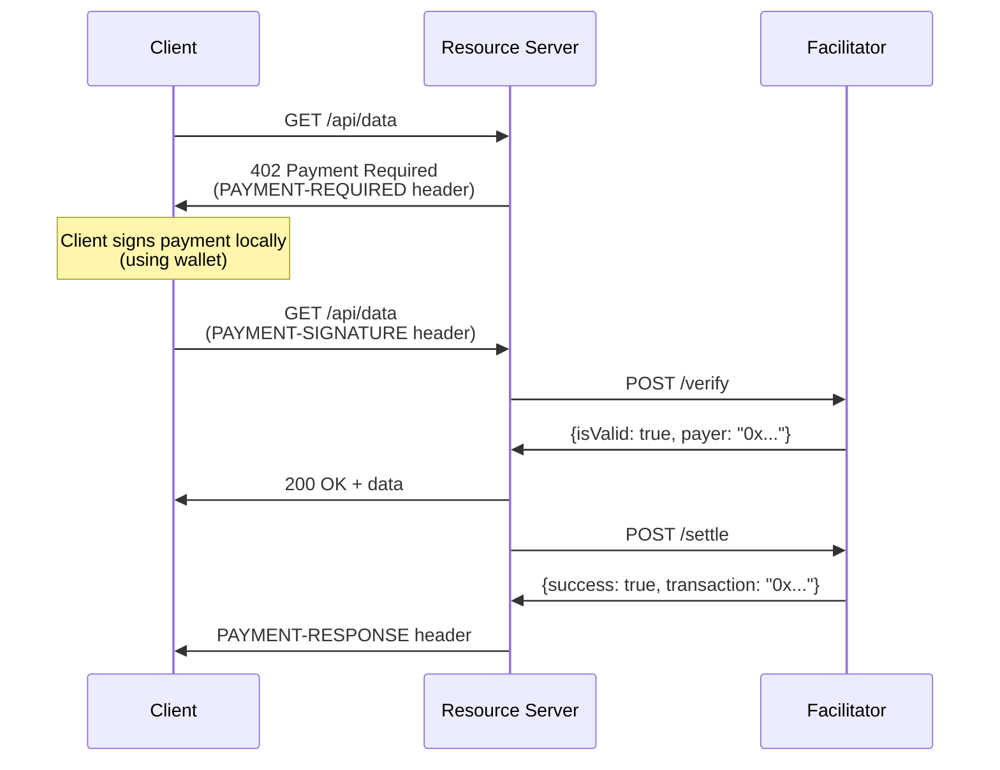

<!-- VERIFIED: 3c3e2168 -->
# Happy Path Flow

This document describes the complete happy path for an x402 payment flow, where a client successfully pays for a resource and receives the requested data.

## Overview

The happy path represents the ideal scenario where:
1. Client requests a paid resource
2. Server requests payment
3. Client signs and submits payment
4. Facilitator verifies the payment
5. Server delivers the resource
6. Facilitator settles the payment on-chain
7. Server confirms settlement to client

## Sequence Diagram


```mermaid
sequenceDiagram
    participant C as Client
    participant S as Resource Server
    participant F as Facilitator

    C->>S: GET /api/data
    S->>C: 402 Payment Required<br/>(PAYMENT-REQUIRED header)

    Note over C: Client signs payment locally<br/>(using wallet)

    C->>S: GET /api/data<br/>(PAYMENT-SIGNATURE header)
    S->>F: POST /verify
    F->>S: {isValid: true, payer: "0x..."}
    S->>C: 200 OK + data
    S->>F: POST /settle
    F->>S: {success: true, transaction: "0x..."}
    S->>C: PAYMENT-RESPONSE header
```

## Step-by-Step Breakdown

### Step 1: Initial Resource Request

The client makes a request to a protected endpoint without payment information.

**Request:**
```http
GET /api/data HTTP/1.1
Host: server.example.com
Accept: application/json
```

### Step 2: Payment Required Response

The server responds with a 402 status code and includes a `PAYMENT-REQUIRED` header containing payment instructions.

**Response:**
```http
HTTP/1.1 402 Payment Required
Content-Type: application/json
PAYMENT-REQUIRED: eyJ4NDAyVmVyc2lvbiI6MiwicmVzb3VyY2UiOnsidXJsIjoiaHR0cDovL3NlcnZlci5leGFtcGxlLmNvbS9hcGkvZGF0YSIsImRlc2NyaXB0aW9uIjoiUHJlbWl1bSBkYXRhIGVuZHBvaW50IiwibWltZVR5cGUiOiJhcHBsaWNhdGlvbi9qc29uIn0sImFjY2VwdHMiOlt7InNjaGVtZSI6ImV4YWN0IiwibmV0d29yayI6ImVpcDE1NTo4NDUzMiIsImFzc2V0IjoiMHgwMzZDYkQ1Mzg0MmM1NDI2NjM0ZTc5Mjk1NDFlQzIzMThmM2RDRjdlIiwiYW1vdW50IjoiMTAwMDAiLCJwYXlUbyI6IjB4NzQyZDM1Q2M2NjM0QzA1MzI5MjVhM2I4NDRCYzllNzU5NWYwYkViIiwibWF4VGltZW91dFNlY29uZHMiOjMwMH1dfQ==

{
  "error": "Payment required",
  "message": "This resource requires payment"
}
```

**PAYMENT-REQUIRED Header (decoded):**
```json
{
  "x402Version": 2,
  "resource": {
    "url": "http://server.example.com/api/data",
    "description": "Premium data endpoint",
    "mimeType": "application/json"
  },
  "accepts": [
    {
      "scheme": "exact",
      "network": "eip155:84532",
      "asset": "0x036CbD53842c5426634e7929541eC2318f3dCF7e",
      "amount": "10000",
      "payTo": "0x742d35Cc6634C0532925a3b844Bc9e7595f0bEb",
      "maxTimeoutSeconds": 300,
      "extra": {
        "name": "USDC",
        "version": "2"
      }
    }
  ]
}
```

**Header Fields:**
- `x402Version`: Protocol version (2 for current version)
- `resource`: Information about the requested resource
- `accepts`: Array of acceptable payment options
- `scheme`: Payment scheme ("exact" for fixed amount)
- `network`: CAIP-2 network identifier
- `asset`: Token contract address
- `amount`: Payment amount in smallest unit (e.g., 10000 = $0.01 USDC)
- `payTo`: Recipient address
- `maxTimeoutSeconds`: Payment validity window

### Step 3: Client Signs Payment

The client processes the payment request and signs the payment data locally using their wallet. This happens entirely on the client side without contacting the facilitator.

```typescript
// Client-side payment creation
const paymentPayload = await client.createPaymentPayload(paymentRequired);
```

### Step 4: Retry with Payment Signature

The client retries the request with the `PAYMENT-SIGNATURE` header.

**Request:**
```http
GET /api/data HTTP/1.1
Host: server.example.com
Accept: application/json
PAYMENT-SIGNATURE: eyJ4NDAyVmVyc2lvbiI6MiwicmVzb3VyY2UiOnsidXJsIjoiaHR0cDovL3NlcnZlci5leGFtcGxlLmNvbS9hcGkvZGF0YSJ9LCJhY2NlcHRlZCI6eyJzY2hlbWUiOiJleGFjdCIsIm5ldHdvcmsiOiJlaXAxNTU6ODQ1MzIiLCJhc3NldCI6IjB4MDM2Q2JENTM4NDJjNTQyNjYzNGU3OTI5NTQxZUMyMzE4ZjNkQ0Y3ZSIsImFtb3VudCI6IjEwMDAwIiwicGF5VG8iOiIweDc0MmQzNUNjNjYzNEMwNTMyOTI1YTNiODQ0QmM5ZTc1OTVmMGJFYiJ9LCJwYXlsb2FkIjp7InNpZ25hdHVyZSI6IjB4Li4uIiwiYXV0aG9yaXphdGlvbiI6ey4uLn19fQ==
```

**PAYMENT-SIGNATURE Header (decoded):**
```json
{
  "x402Version": 2,
  "resource": {
    "url": "http://server.example.com/api/data"
  },
  "accepted": {
    "scheme": "exact",
    "network": "eip155:84532",
    "asset": "0x036CbD53842c5426634e7929541eC2318f3dCF7e",
    "amount": "10000",
    "payTo": "0x742d35Cc6634C0532925a3b844Bc9e7595f0bEb",
    "maxTimeoutSeconds": 300,
    "extra": {
      "name": "USDC",
      "version": "2"
    }
  },
  "payload": {
    "signature": "0x...",
    "authorization": {
      "from": "0xPayerAddress",
      "to": "0x742d35Cc6634C0532925a3b844Bc9e7595f0bEb",
      "value": "10000",
      "validAfter": 0,
      "validBefore": 1704067500,
      "nonce": "0x..."
    }
  }
}
```

### Step 5: Server Verifies Payment

The server extracts the payment signature and sends it to the facilitator for verification.

**Request to Facilitator:**
```http
POST /verify HTTP/1.1
Host: facilitator.x402.org
Content-Type: application/json

{
  "paymentPayload": { ... },
  "paymentRequirements": { ... }
}
```

**Facilitator Response:**
```json
{
  "isValid": true,
  "payer": "0xPayerAddress"
}
```

### Step 6: Server Delivers Resource

After receiving verification confirmation, the server immediately delivers the requested resource.

**Response:**
```http
HTTP/1.1 200 OK
Content-Type: application/json

{
  "data": "Premium content here"
}
```

### Step 7: Asynchronous Settlement

After delivering the resource, the server requests the facilitator to settle the payment on-chain. This happens asynchronously and does not block the client response.

**Request to Facilitator:**
```http
POST /settle HTTP/1.1
Host: facilitator.x402.org
Content-Type: application/json

{
  "paymentPayload": { ... },
  "paymentRequirements": { ... }
}
```

**Facilitator Response:**
```json
{
  "success": true,
  "transaction": "0x9876543210abcdef...",
  "network": "eip155:84532",
  "payer": "0xPayerAddress"
}
```

### Step 8: Settlement Confirmation

The server includes the settlement confirmation in the `PAYMENT-RESPONSE` header. This may be sent with the resource response or in a subsequent request.

**PAYMENT-RESPONSE Header (decoded):**
```json
{
  "success": true,
  "transaction": "0x9876543210abcdef...",
  "network": "eip155:84532"
}
```

## Timing Characteristics

| Phase | Typical Duration | Blocking? |
|-------|------------------|-----------|
| Initial request | < 50ms | Yes |
| 402 response | < 50ms | Yes |
| Client signing | < 500ms | Yes (client-side) |
| Retry with payment | < 50ms | Yes |
| Verification | < 200ms | Yes |
| Resource delivery | Varies | Yes |
| Settlement | 2-30 seconds | No (async) |

The client receives the resource within ~1 second of initiating payment. Blockchain settlement happens in the background.

## Key Points

### Fast Payment Verification

The server delivers the resource immediately after signature verification, without waiting for on-chain settlement. This ensures low latency for the client.

### Asynchronous Settlement

Settlement happens in the background after resource delivery. The client is not blocked waiting for blockchain confirmation.

### Trust Model

The server trusts the facilitator's signature verification. The facilitator acts as a trusted service that manages the on-chain settlement process.

### Replay Protection

The nonce and validity window in the payment signature ensure each payment is unique and time-bound. The facilitator tracks used nonces to prevent double-spending.

## Client Implementation

```typescript
import { x402Client } from "@x402/core/client";
import { registerExactEvmScheme } from "@x402/evm/exact/client";
import { wrapFetchWithPayment } from "@x402/fetch";
import { privateKeyToAccount } from "viem/accounts";

const account = privateKeyToAccount("0xYourPrivateKey");
const client = new x402Client();
registerExactEvmScheme(client, { signer: account });

const fetchWithPayment = wrapFetchWithPayment(fetch, client);

// The wrapped fetch handles the entire happy path automatically
const response = await fetchWithPayment("http://server.example.com/api/data");
const data = await response.json();
```

## Server Implementation

```typescript
import express from "express";
import { paymentMiddleware } from "@x402/express";
import { x402ResourceServer, HTTPFacilitatorClient } from "@x402/core/server";
import { registerExactEvmScheme } from "@x402/evm/exact/server";

const app = express();

const facilitatorClient = new HTTPFacilitatorClient({
  url: "https://facilitator.x402.org"
});
const server = new x402ResourceServer(facilitatorClient);
registerExactEvmScheme(server);

app.use(paymentMiddleware(
  {
    "GET /api/data": {
      accepts: {
        scheme: "exact",
        network: "eip155:84532",
        payTo: "0x742d35Cc6634C0532925a3b844Bc9e7595f0bEb",
        price: "$0.01",
      },
      description: "Premium data endpoint",
    },
  },
  server,
));

app.get("/api/data", (req, res) => {
  res.json({ data: "Premium content here" });
});

app.listen(3000);
```

## Next Steps

- [Error Scenarios](./error-scenarios.md) - Handling verification and settlement failures
- [Network Variations](./network-variations.md) - EVM vs Solana flow differences
