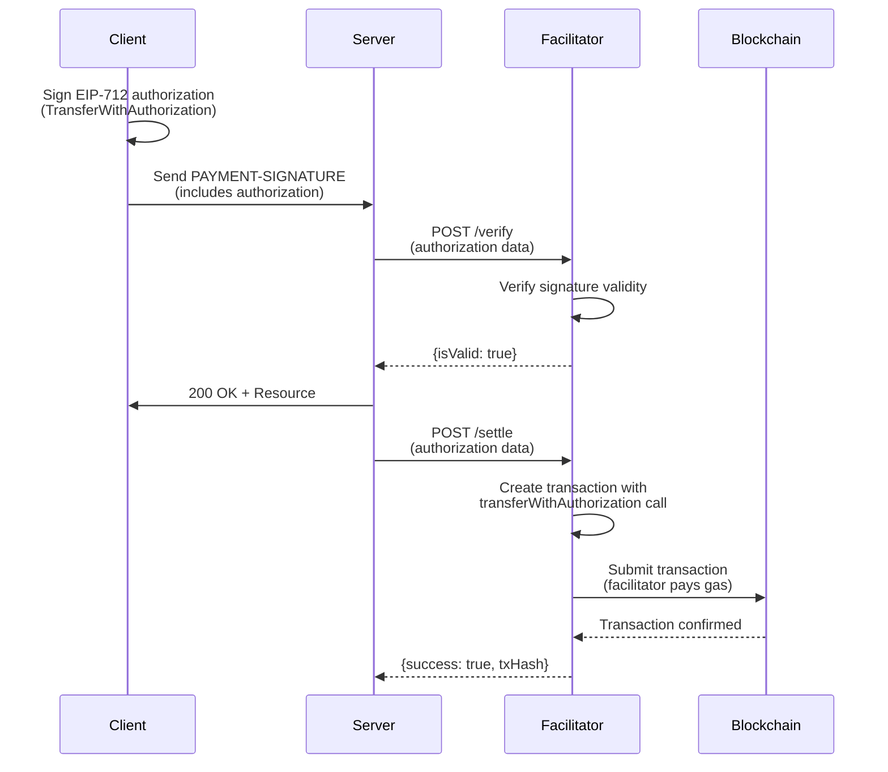
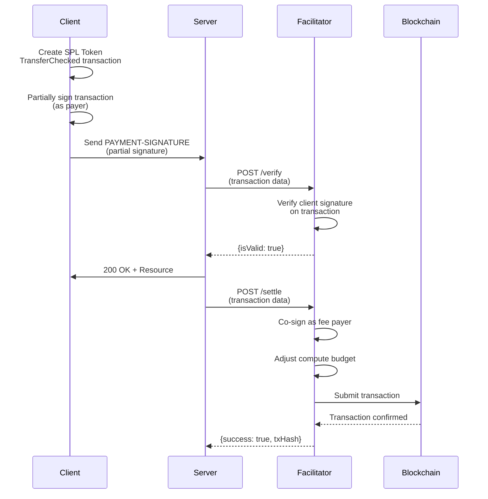

<!-- VERIFIED: 3c3e2168 -->
# Network Variations

The x402 protocol supports both EVM-compatible blockchains (Ethereum, Base, Polygon, etc.) and Solana through distinct implementations that handle network-specific signing and transaction mechanics. This document explains how payments differ between EVM and SVM networks, and how to work with multi-chain endpoints.

## Overview

While the core x402 payment flow remains consistent across all blockchains, the underlying transaction mechanics differ significantly:

- **EVM Networks** use EIP-3009 `TransferWithAuthorization` for gas-efficient transfers where the facilitator pays gas
- **SVM Networks** use SPL Token `TransferChecked` with a co-signing model where the facilitator acts as fee payer

Both approaches achieve the same outcome: client-signed payment proof that the facilitator executes on-chain.

## EVM Networks

EVM networks use the Exact payment scheme with EIP-3009, a cryptographic standard that allows token transfers to be authorized off-chain and executed by any address.

### Network Identifiers

EVM networks use CAIP-2 format: `eip155:<chainId>`

| Network | Identifier | Chain ID | Use Case |
|---------|-----------|----------|----------|
| Ethereum Mainnet | `eip155:1` | 1 | Production payments |
| Base Mainnet | `eip155:8453` | 8453 | Production payments |
| Base Sepolia | `eip155:84532` | 84532 | Development/testing |
| Polygon Mainnet | `eip155:137` | 137 | Production payments |
| Polygon Amoy | `eip155:80002` | 80002 | Development/testing |
| Avalanche C-Chain | `eip155:43114` | 43114 | Production payments |
| Wildcard (All EVM) | `eip155:*` | - | Multi-chain support |

### Transaction Flow



### Key Characteristics

**Client-Side Signing:**
- Client signs an EIP-712 message using their wallet
- No transaction creation needed - just a cryptographic authorization
- Private key never leaves the client

**Facilitator as Fee Payer:**
- Facilitator executes the `transferWithAuthorization` call on-chain
- Facilitator pays the gas fee
- Client's authorization is time-bound and nonce-bound to prevent replay

**Authorization Fields:**
```json
{
  "from": "0xClientAddress",
  "to": "0xRecipientAddress",
  "value": "1000000",
  "validAfter": 0,
  "validBefore": 1704067500,
  "nonce": "0x...",
  "signature": "0x..."
}
```

### Supported Assets

Any ERC-20 token implementing EIP-3009:
- **USDC** (primary) - deployed on all major EVM chains
- EURC
- Custom tokens that implement `transferWithAuthorization()`

### Example: Client Implementation

```typescript
import { x402Client } from "@x402/core/client";
import { registerExactEvmScheme } from "@x402/evm/exact/client";
import { wrapFetchWithPayment } from "@x402/fetch";
import { privateKeyToAccount } from "viem/accounts";

// Set up signer
const account = privateKeyToAccount(process.env.PRIVATE_KEY as `0x${string}`);

// Create client and register EVM scheme
const client = new x402Client();
registerExactEvmScheme(client, { signer: account });

// Wrap fetch with automatic payment handling
const paidFetch = wrapFetchWithPayment(fetch, client);

// Any request to EVM networks is handled automatically
const response = await paidFetch("https://api.example.com/protected");
```

### Example: Server Implementation

```typescript
import express from "express";
import { paymentMiddleware } from "@x402/express";
import { x402ResourceServer, HTTPFacilitatorClient } from "@x402/core/server";
import { registerExactEvmScheme } from "@x402/evm/exact/server";

const app = express();

const facilitator = new HTTPFacilitatorClient({
  url: "https://facilitator.x402.org"
});

const server = new x402ResourceServer(facilitator);
registerExactEvmScheme(server);

app.use(paymentMiddleware(
  {
    "GET /api/premium": {
      accepts: [
        {
          scheme: "exact",
          network: "eip155:8453",
          payTo: "0xRecipientAddress",
          price: "$0.01"
        },
        {
          scheme: "exact",
          network: "eip155:84532",
          payTo: "0xRecipientAddress",
          price: "$0.01"
        }
      ],
      description: "Premium endpoint - accepts Base Mainnet or Sepolia"
    }
  },
  server
));

app.get("/api/premium", (req, res) => {
  res.json({ data: "Protected content" });
});
```

## SVM Networks

SVM networks (Solana and derivatives) use the Exact payment scheme with SPL Token transfers, leveraging Solana's native token program.

### Network Identifiers

SVM networks use CAIP-2 format: `solana:<genesisHash>`

| Network | Identifier | Genesis Hash | Use Case |
|---------|-----------|--------------|----------|
| Mainnet Beta | `solana:5eykt4UsFv8P8NJdTREpY1vzqKqZKvdp` | 5eykt4UsFv8P8NJdTREpY1vzqKqZKvdp | Production |
| Devnet | `solana:EtWTRABZaYq6iMfeYKouRu166VU2xqa1` | EtWTRABZaYq6iMfeYKouRu166VU2xqa1 | Development |
| Testnet | `solana:4uhcVJyU9pJkvQyS88uRDiswHXSCkY3z` | 4uhcVJyU9pJkvQyS88uRDiswHXSCkY3z | Testing |
| Wildcard (All SVM) | `solana:*` | - | Multi-chain support |

### Transaction Flow



### Key Characteristics

**Partial Client Signing:**
- Client creates a complete transaction but only signs it as the token authority
- Client does NOT sign as fee payer (Solana requires fee payer signature)
- Facilitator completes the signing as fee payer before submission

**Facilitator as Fee Payer:**
- Facilitator signs the transaction as the fee payer
- Pays all Solana network fees (lamports)
- Client pays the actual token transfer amount

**Transaction Structure:**
```json
{
  "feePayer": "FacilitatorAddress",
  "instructions": [
    {
      "program": "TokenkegQfeZyiNwAJsyFbPVwwQQfzZeL5kRowKV3",
      "data": "TransferChecked",
      "accounts": {
        "source": "ClientATA",
        "mint": "USDCMint",
        "destination": "RecipientATA",
        "authority": "ClientAddress",
        "tokenProgram": "TokenkegQfeZyiNwAJsyFbPVwwQQfzZeL5kRowKV3"
      }
    }
  ],
  "signers": ["ClientAddress", "FacilitatorAddress"]
}
```

### Supported Assets

SPL tokens (both Token and Token-2022):
- **USDC** (primary) - native SPL token on Solana
- Any SPL token with Associated Token Accounts (ATAs)
- Token-2022 program tokens

### Example: Client Implementation

```typescript
import { x402Client } from "@x402/core/client";
import { registerExactSvmScheme } from "@x402/svm/exact/client";
import { wrapFetchWithPayment } from "@x402/fetch";
import { createKeyPairSignerFromBytes } from "@solana/kit";
import { base58 } from "@scure/base";

// Set up signer from private key
const keypair = await createKeyPairSignerFromBytes(
  base58.decode(process.env.SVM_PRIVATE_KEY!)
);

// Create client and register SVM scheme
const client = new x402Client();
registerExactSvmScheme(client, { signer: keypair });

// Wrap fetch with automatic payment handling
const paidFetch = wrapFetchWithPayment(fetch, client);

// Any request to Solana networks is handled automatically
const response = await paidFetch("https://api.example.com/protected");
```

### Example: Server Implementation

```typescript
import express from "express";
import { paymentMiddleware } from "@x402/express";
import { x402ResourceServer, HTTPFacilitatorClient } from "@x402/core/server";
import { registerExactSvmScheme } from "@x402/svm/exact/server";

const app = express();

const facilitator = new HTTPFacilitatorClient({
  url: "https://facilitator.x402.org"
});

const server = new x402ResourceServer(facilitator);
registerExactSvmScheme(server);

app.use(paymentMiddleware(
  {
    "GET /api/premium": {
      accepts: [
        {
          scheme: "exact",
          network: "solana:5eykt4UsFv8P8NJdTREpY1vzqKqZKvdp",
          payTo: "RecipientPublicKey",
          price: "$0.01"
        }
      ],
      description: "Premium endpoint - Solana Mainnet"
    }
  },
  server
));

app.get("/api/premium", (req, res) => {
  res.json({ data: "Protected content" });
});
```

## Key Differences

### Signing Model

| Aspect | EVM | SVM |
|--------|-----|-----|
| **Signing Method** | EIP-712 message signature | Transaction partial signature |
| **What Client Signs** | Off-chain authorization | On-chain transaction |
| **Private Key Exposure** | Message only (safe) | Transaction body (safe) |
| **Client Signs as** | Token authority | Token authority + transaction signer |
| **Facilitator Signs as** | (does not sign) | Fee payer |

### Fee Structure

| Aspect | EVM | SVM |
|--------|-----|-----|
| **Network Fee** | Gas (paid by facilitator) | Lamports (paid by facilitator) |
| **Fee Amount** | Variable (based on gas price) | Fixed (5000 lamports typical) |
| **Fee Estimation** | Complex algorithm | Simple, predictable |
| **Client Payment** | USDC amount only | USDC amount only |

### Transaction Execution

| Aspect | EVM | SVM |
|--------|-----|-----|
| **Execution Timing** | Anytime within validity window | Immediate after facilitator signs |
| **Replay Protection** | Nonce + ValidBefore timestamp | Transaction blockhash |
| **Authorization Storage** | Not stored on-chain | Not stored on-chain |
| **Signature Validity** | 1 hour typical | Single slot (~400ms) |

### Verification Requirements

| Aspect | EVM | SVM |
|--------|-----|-----|
| **Verify Signature** | EIP-712 signature on authorization | Transaction signature |
| **Verify Fields** | From, To, Value, ValidBefore, Nonce | All transaction fields |
| **RPC Requirements** | Web3 provider | Solana RPC |
| **Cryptographic Check** | ECDSA over Keccak256 | Ed25519 |

## Multi-Chain Endpoints

Servers can accept payments on multiple blockchains simultaneously, allowing clients to choose their preferred network.

### Multi-Chain Configuration

```typescript
import express from "express";
import { paymentMiddleware } from "@x402/express";
import { x402ResourceServer, HTTPFacilitatorClient } from "@x402/core/server";
import { registerExactEvmScheme } from "@x402/evm/exact/server";
import { registerExactSvmScheme } from "@x402/svm/exact/server";

const app = express();

const facilitator = new HTTPFacilitatorClient({
  url: "https://facilitator.x402.org"
});

const server = new x402ResourceServer(facilitator);
registerExactEvmScheme(server);
registerExactSvmScheme(server);

// Single endpoint accepting multiple networks
app.use(paymentMiddleware(
  {
    "GET /api/data": {
      accepts: [
        // EVM options
        {
          scheme: "exact",
          network: "eip155:8453",
          payTo: "0xEvmRecipient",
          price: "$0.01"
        },
        {
          scheme: "exact",
          network: "eip155:84532",
          payTo: "0xEvmRecipient",
          price: "$0.01"
        },
        // SVM options
        {
          scheme: "exact",
          network: "solana:5eykt4UsFv8P8NJdTREpY1vzqKqZKvdp",
          payTo: "SvmRecipientAddress",
          price: "$0.01"
        },
        {
          scheme: "exact",
          network: "solana:EtWTRABZaYq6iMfeYKouRu166VU2xqa1",
          payTo: "SvmRecipientAddress",
          price: "$0.01"
        }
      ],
      description: "API endpoint - choose your network"
    }
  },
  server
));

app.get("/api/data", (req, res) => {
  res.json({ data: "Content available on all networks" });
});

app.listen(3000);
```

### Multi-Chain Client

```typescript
import { x402Client } from "@x402/core/client";
import { registerExactEvmScheme } from "@x402/evm/exact/client";
import { registerExactSvmScheme } from "@x402/svm/exact/client";
import { wrapFetchWithPayment } from "@x402/fetch";
import { privateKeyToAccount } from "viem/accounts";
import { createKeyPairSignerFromBytes } from "@solana/kit";
import { base58 } from "@scure/base";

// Set up both signers
const evmAccount = privateKeyToAccount(process.env.EVM_PRIVATE_KEY as `0x${string}`);
const svmKeypair = await createKeyPairSignerFromBytes(
  base58.decode(process.env.SVM_PRIVATE_KEY!)
);

// Create client supporting both networks
const client = new x402Client();
registerExactEvmScheme(client, { signer: evmAccount });
registerExactSvmScheme(client, { signer: svmKeypair });

// Wrapped fetch handles any network automatically
const paidFetch = wrapFetchWithPayment(fetch, client);

// Client chooses network automatically based on server response
const response = await paidFetch("https://api.example.com/api/data");
```

### Client Network Selection

When a server offers multiple payment options, the client automatically selects the first matching network it supports:

1. Server sends `PAYMENT-REQUIRED` with array of `accepts` options
2. Client iterates through options in order
3. Client uses the first option for which it has a registered scheme
4. If no matching network is supported, client cannot make payment

**Best Practice:** Order payment options by:
1. Most common networks first (broader client compatibility)
2. Mainnet before testnet
3. Network cost efficiency (cheaper networks first)

```typescript
// Well-ordered accepts array
{
  accepts: [
    { network: "eip155:8453", ... },      // Base (popular, low cost)
    { network: "eip155:1", ... },         // Ethereum (established)
    { network: "solana:5eykt4...", ... }, // Solana Mainnet
    { network: "eip155:84532", ... },     // Base Sepolia (testnet)
  ]
}
```

## Network-Specific Considerations

### Gas and Fee Handling

**EVM Networks:**
- Facilitator estimates gas based on historical data
- Gas price fluctuates with network congestion
- Very cheap on Layer-2s (Base: ~$0.0001 per transaction)
- More expensive on Mainnet (Ethereum: $1-5 depending on congestion)

**SVM Networks:**
- Fixed base fee per transaction (~5000 lamports ≈ $0.001)
- Priority fees optional but recommended for speed
- Very predictable cost structure
- No congestion pricing

### Signature Validity

**EVM Networks:**
- Authorizations valid for up to 1 hour (configurable)
- Can be executed immediately or delayed
- Good for slow networks or pending verification

**SVM Networks:**
- Transactions must use current blockhash
- Validity limited to single slot (~400ms)
- Faster execution but less flexibility
- Must re-sign if not submitted quickly

### RPC and Network Access

**EVM Networks:**
- Facilitator needs Web3 provider (Infura, Alchemy, Ankr, etc.)
- Providers available for all major chains
- High availability, easy to scale

**SVM Networks:**
- Facilitator needs Solana RPC endpoint
- Fewer public RPC providers
- Rate limiting common on public endpoints
- Private endpoints recommended for production

## Common Patterns

### Accept Only Your Preferred Network

```typescript
// Server: Accept only Base Mainnet
{
  "GET /api/data": {
    accepts: [
      {
        scheme: "exact",
        network: "eip155:8453",
        payTo: "0xRecipient",
        price: "$0.01"
      }
    ]
  }
}
```

### Accept Any EVM Network

```typescript
// Server: Accept all EVM networks via wildcard
{
  "GET /api/data": {
    accepts: [
      {
        scheme: "exact",
        network: "eip155:*",
        payTo: "0xRecipient",
        price: "$0.01"
      }
    ]
  }
}
```

### Require Specific Networks

```typescript
import { x402Client } from "@x402/core/client";
import { registerExactEvmScheme } from "@x402/evm/exact/client";
import { registerExactSvmScheme } from "@x402/svm/exact/client";

// Client: Support only Base
const client = new x402Client();
registerExactEvmScheme(client, { signer, network: "eip155:8453" });

// Client: Support all EVM networks
const evmClient = new x402Client();
registerExactEvmScheme(evmClient, { signer, network: "eip155:*" });

// Client: Support all Solana networks
const svmClient = new x402Client();
registerExactSvmScheme(svmClient, { signer, network: "solana:*" });
```

## Troubleshooting

### EVM Payment Fails with "Invalid Signature"

Common causes:
- Wrong chain ID in authorization
- Signature created with different private key
- Authorization timestamp has expired
- Signer address mismatch

**Debug:**
```typescript
const auth = paymentPayload.authorization;
console.log("From:", auth.from);
console.log("ValidBefore:", new Date(auth.validBefore * 1000));
console.log("ChainId:", network); // Verify matches server expectation
```

### SVM Payment Fails with "Invalid Transaction"

Common causes:
- Blockhash too old (client took too long to sign)
- Transaction not fully signed
- Token account doesn't exist
- Fee payer has insufficient lamports

**Debug:**
```typescript
const tx = paymentPayload.transaction;
console.log("Blockhash:", tx.recentBlockhash);
console.log("Signers:", tx.signatures.length);
console.log("Timestamp:", Date.now() - txCreatedTime); // Should be < 10 seconds
```

## Next Steps

- [Payment Flow Overview](./payment-flow-overview.md) - Core protocol flow
- [Happy Path Flow](./happy-path.md) - Detailed successful payment sequence
- [Error Scenarios](./error-scenarios.md) - Handling payment failures
- [@x402/evm Documentation](../03-sdk-reference/mechanisms/evm.md) - EVM SDK details
- [@x402/svm Documentation](../03-sdk-reference/mechanisms/svm.md) - SVM SDK details
