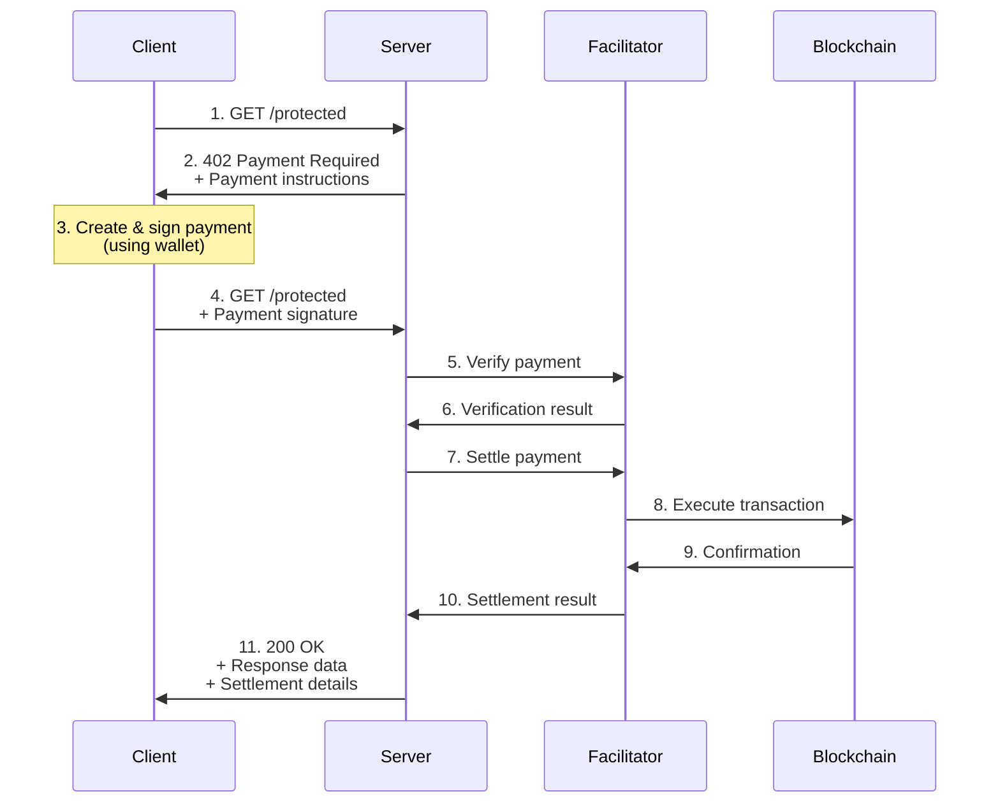

# Payment Flow Overview

High-level overview of how the x402 payment protocol works from request to settlement.

## Simple Flow Diagram

## Key Phases

### Phase 1: Discovery
Client learns what payment is required

### Phase 2: Authorization
Client creates cryptographic proof of payment

### Phase 3: Verification
Server/Facilitator confirms payment is valid

### Phase 4: Execution
Business logic runs (only if payment valid)

### Phase 5: Settlement
Payment is executed on blockchain

See [Happy Path](./happy-path.md) for detailed step-by-step walkthrough.

## Next Steps

- **Detailed Flow**: [Happy Path](./happy-path.md)
- **Error Handling**: [Error Scenarios](./error-scenarios.md)
- **Network Differences**: [Network Variations](./network-variations.md)
