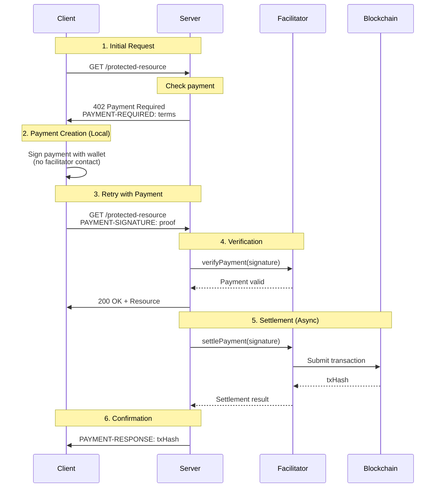

<!-- VERIFIED: 0aa62c64 -->
# Payment Flow Overview

The x402 protocol implements a lightweight payment layer for HTTP resources through a standard request-response cycle with payment verification. This document describes the core payment flow that all x402 implementations follow.

## Flow Diagram


```mermaid
sequenceDiagram
    participant Client
    participant Server
    participant Facilitator
    participant Blockchain

    Note over Client,Server: 1. Initial Request
    Client->>Server: GET /protected-resource

    Note over Server: Check payment
    Server->>Client: 402 Payment Required<br/>PAYMENT-REQUIRED: terms

    Note over Client: 2. Payment Creation (Local)
    Client->>Client: Sign payment with wallet<br/>(no facilitator contact)

    Note over Client,Server: 3. Retry with Payment
    Client->>Server: GET /protected-resource<br/>PAYMENT-SIGNATURE: proof

    Note over Server,Facilitator: 4. Verification
    Server->>Facilitator: verifyPayment(signature)
    Facilitator-->>Server: Payment valid

    Server->>Client: 200 OK + Resource

    Note over Server,Blockchain: 5. Settlement (Async)
    Server->>Facilitator: settlePayment(signature)
    Facilitator->>Blockchain: Submit transaction
    Blockchain-->>Facilitator: txHash
    Facilitator-->>Server: Settlement result

    Note over Server,Client: 6. Confirmation
    Server->>Client: PAYMENT-RESPONSE: txHash
```

## Protocol Phases

### 1. Request Phase

The flow begins when a client requests a protected resource without payment credentials:

```http
GET /protected-resource HTTP/1.1
Host: api.example.com
```

The server identifies that payment is required and initiates the payment challenge.

### 2. Payment Challenge (402 Response)

The server responds with a `402 Payment Required` status and includes payment terms in the `PAYMENT-REQUIRED` header:

```http
HTTP/1.1 402 Payment Required
PAYMENT-REQUIRED: <base64-encoded payment requirements>
Content-Type: application/json

{
  "error": "Payment required",
  "message": "This resource requires payment"
}
```

The `PAYMENT-REQUIRED` header (when decoded) contains:

```json
{
  "x402Version": 2,
  "accepts": [
    {
      "scheme": "exact",
      "network": "eip155:84532",
      "asset": "0x036CbD53842c5426634e7929541eC2318f3dCF7e",
      "amount": "10000",
      "payTo": "0x742d35Cc6634C0532925a3b844Bc9e7595f0bEb",
      "maxTimeoutSeconds": 300
    }
  ]
}
```

### 3. Payment Creation

The client receives the payment terms and creates a payment signature **locally**:

1. Parse the `PAYMENT-REQUIRED` header to extract terms
2. Select a payment option from `accepts` array
3. Sign payment data with user's wallet
4. **No interaction with facilitator required at this stage**

The client constructs a payment signature that includes:
- Payment terms from the server
- Wallet signature proving ownership
- Chain-specific data (e.g., EVM EIP-3009 authorization)

### 4. Payment Verification

The client retries the request with the payment signature:

```http
GET /protected-resource HTTP/1.1
Host: api.example.com
PAYMENT-SIGNATURE: <base64-encoded payment proof>
```

The server:
1. Extracts payment data from `PAYMENT-SIGNATURE` header
2. Calls facilitator's `/verify` endpoint to validate
3. Checks that payment terms match and signature is valid
4. Proceeds with request processing if verification succeeds

### 5. Resource Delivery

Upon successful verification, the server returns the protected resource:

```http
HTTP/1.1 200 OK
Content-Type: application/json

{
  "data": "Protected resource content"
}
```

At this point, the client has access to the resource. Settlement happens asynchronously.

### 6. Settlement

After delivering the resource, the server initiates settlement with the facilitator:

```typescript
// Server-side settlement (async)
const result = await facilitator.settle(paymentPayload, paymentRequirements);
```

The facilitator:
1. Submits the payment transaction to the blockchain
2. Waits for confirmation
3. Returns transaction hash and status

Settlement is non-blocking and happens in the background to avoid delaying the response.

### 7. Settlement Confirmation

The server communicates settlement status to the client through the `PAYMENT-RESPONSE` header:

```http
HTTP/1.1 200 OK
PAYMENT-RESPONSE: <base64-encoded settlement confirmation>
Content-Type: application/json
```

The `PAYMENT-RESPONSE` header (when decoded) contains:

```json
{
  "success": true,
  "transaction": "0x9876543210abcdef...",
  "network": "eip155:84532"
}
```

## Key Characteristics

### Stateless Protocol

The x402 protocol is stateless at the HTTP level:
- Each request contains all necessary payment information
- No session management required
- Servers can scale horizontally without shared state

### Client-Side Signing

Payment signatures are created entirely on the client:
- Wallet never leaves user control
- No custodial facilitator access required
- Client directly interacts with user's wallet

### Async Settlement

Settlement is decoupled from resource delivery:
- Servers return resources immediately after verification
- Blockchain submission happens in background
- Settlement confirmation arrives later

### Facilitator Role

The facilitator provides two services:
1. **Verification**: Validates payment signatures (synchronous)
2. **Settlement**: Submits transactions to blockchain (asynchronous)

The facilitator does not:
- Hold user funds
- Require payment creation requests from clients
- Block resource delivery

## HTTP Headers Summary

| Header | Direction | Purpose |
|--------|-----------|---------|
| `PAYMENT-REQUIRED` | Server to Client | Payment terms in 402 response |
| `PAYMENT-SIGNATURE` | Client to Server | Payment proof with request |
| `PAYMENT-RESPONSE` | Server to Client | Settlement confirmation |

## Error Handling

### Verification Failures

If payment verification fails:

```http
HTTP/1.1 402 Payment Required
Content-Type: application/json

{
  "error": "Invalid payment signature",
  "code": "VERIFICATION_FAILED"
}
```

Common verification failures:
- Invalid signature
- Insufficient payment amount
- Expired authorization
- Mismatched payment terms

### Settlement Failures

Settlement failures are communicated through `PAYMENT-RESPONSE`:

```json
{
  "success": false,
  "error": "insufficient_balance"
}
```

Note that resource delivery is not revoked on settlement failure. Applications must implement their own settlement failure handling logic.

## Next Steps

- [Happy Path Flow](./happy-path.md) - Detailed successful payment sequence
- [Error Scenarios](./error-scenarios.md) - Handling payment failures
- [Network Variations](./network-variations.md) - EVM and Solana differences
