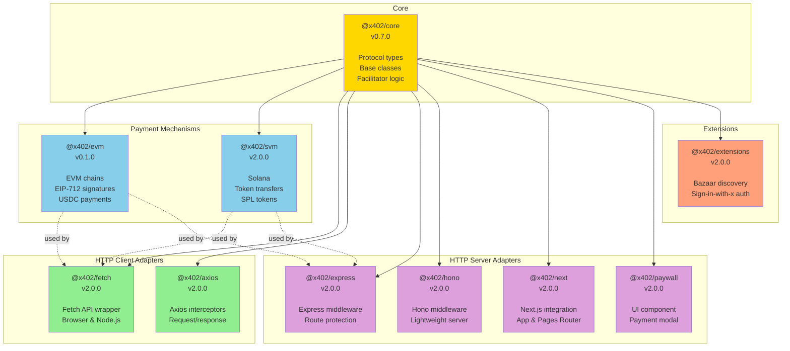

# x402 SDK Reference

Complete reference for all x402 TypeScript SDK packages. The x402 SDK is organized as a monorepo with specialized packages for different use cases and frameworks.

## Table of Contents

- [Package Overview](#package-overview)
- [Package Dependency Graph](#package-dependency-graph)
- [Installation](#installation)
- [Core Packages](#core-packages)
- [Payment Mechanism Packages](#payment-mechanism-packages)
- [HTTP Adapter Packages](#http-adapter-packages)
- [Extension Packages](#extension-packages)
- [Version Compatibility](#version-compatibility)
- [Quick Start Examples](#quick-start-examples)

---

## Package Overview

The x402 SDK consists of **9 packages** organized into four categories:

### Core Package (1)
- **@x402/core** - Protocol implementation, types, and base classes

### Payment Mechanisms (2)
- **@x402/evm** - Ethereum Virtual Machine payment schemes
- **@x402/svm** - Solana Virtual Machine payment schemes

### HTTP Adapters (6)
- **@x402/fetch** - Native Fetch API client wrapper
- **@x402/axios** - Axios HTTP client integration
- **@x402/express** - Express.js server middleware
- **@x402/hono** - Hono framework middleware
- **@x402/next** - Next.js integration (App Router & Pages Router)
- **@x402/paywall** - UI paywall component

### Extensions (1)
- **@x402/extensions** - Protocol extensions (bazaar discovery, sign-in-with-x authentication)

---

## Package Dependency Graph



**Dependency Rules**:
- All packages depend on **@x402/core**
- Payment mechanism packages (@x402/evm, @x402/svm) extend core interfaces
- HTTP adapters use core + payment mechanisms at runtime
- Extensions build on top of core functionality

---

## Installation

### Using npm

```bash
# Core (required for all integrations)
npm install @x402/core

# Payment mechanisms (choose based on target blockchain)
npm install @x402/evm        # For Ethereum, Base, etc.
npm install @x402/svm        # For Solana

# HTTP clients (choose one)
npm install @x402/fetch      # For Fetch API
npm install @x402/axios      # For Axios

# HTTP servers (choose based on framework)
npm install @x402/express    # For Express.js
npm install @x402/hono       # For Hono
npm install @x402/next       # For Next.js

# UI components (optional)
npm install @x402/paywall    # Payment modal UI

# Extensions (optional)
npm install @x402/extensions          # All extensions (bazaar, sign-in-with-x)
```

### Using pnpm (monorepo)

```bash
pnpm install @x402/core @x402/evm @x402/fetch
```

### Using yarn

```bash
yarn add @x402/core @x402/evm @x402/express
```

---

## Core Packages

### @x402/core

**Version**: 0.7.0
**License**: Apache-2.0
**Repository**: [github.com/coinbase/x402](https://github.com/coinbase/x402)

The foundation package containing protocol types, interfaces, and base implementations.

#### Key Exports

```typescript
// Main exports
import { ... } from '@x402/core'

// Submodule exports
import { x402Client } from '@x402/core/client'
import { x402ResourceService } from '@x402/core/server'
import { x402Facilitator } from '@x402/core/facilitator'
import { x402HTTPClient } from '@x402/core/http'
import { PaymentPayload, PaymentRequired } from '@x402/core/types'
import { encodePaymentSignatureHeader } from '@x402/core/utils'
```

#### What's Included

- **Types** (`@x402/core/types`)
  - `PaymentRequired` - 402 response structure
  - `PaymentPayload` - Client payment signature
  - `PaymentRequirements` - Server requirements
  - `VerifyResponse` / `SettleResponse` - Facilitator responses
  - Interface definitions for all protocol components

- **Client Logic** (`@x402/core/client`)
  - `x402Client` - Base client for payment creation
  - Scheme registration and selection
  - Payment requirement parsing

- **Server Logic** (`@x402/core/server`)
  - `x402ResourceService` - Base server for payment verification
  - Route configuration handling
  - Payment verification and settlement orchestration

- **Facilitator** (`@x402/core/facilitator`)
  - `x402Facilitator` - Multi-scheme facilitator implementation
  - Scheme registration interface
  - Payment verification and settlement coordination

- **HTTP Layer** (`@x402/core/http`)
  - `x402HTTPClient` - HTTP-specific client logic
  - `x402HTTPResourceService` - HTTP-specific server logic
  - `HTTPAdapter` interface for framework integration
  - Header encoding/decoding utilities

- **Utilities** (`@x402/core/utils`)
  - Header encoding/decoding functions
  - Network parsing utilities
  - Nonce generation
  - Price parsing helpers

#### Dependencies

- **zod** - Runtime type validation

#### When to Use

- Required dependency for all x402 integrations
- Import types when building custom implementations
- Use submodules directly for low-level control

---

## Payment Mechanism Packages

### @x402/evm

**Version**: 0.1.0
**Target Networks**: Ethereum, Base, Polygon, Arbitrum, Optimism, and all EVM-compatible chains
**Payment Schemes**: `exact` (EIP-712 signature-based transfers)

#### What's Included

- **ExactEvmClient** - Creates EIP-712 payment signatures
- **ExactEvmFacilitator** - Verifies and settles EVM payments
- **ExactEvmService** - Parses prices and enhances requirements
- **Network Configuration** - Predefined configs for major EVM chains
- **EIP-3009 Support** - USDC `transferWithAuthorization` integration

#### Dependencies

- `@x402/core` - Core protocol types
- `viem` - Ethereum interaction library
- `zod` - Type validation

#### Supported Networks

```typescript
// Mainnet
"eip155:8453"     // Base
"eip155:1"        // Ethereum
"eip155:137"      // Polygon
"eip155:42161"    // Arbitrum

// Testnet
"eip155:84532"    // Base Sepolia
"eip155:11155111" // Sepolia
```

#### Example Usage

```typescript
import { ExactEvmClient, ExactEvmFacilitator } from '@x402/evm';
import { privateKeyToAccount } from 'viem/accounts';

// Client-side: Create payment
const account = privateKeyToAccount('0x...');
const client = new ExactEvmClient(account);
const paymentPayload = await client.createPaymentPayload(2, requirements);

// Server-side: Verify and settle
const facilitator = new ExactEvmFacilitator(viemClient);
const verifyResult = await facilitator.verify(paymentPayload, requirements);
const settleResult = await facilitator.settle(paymentPayload, requirements);
```

---

### @x402/svm

**Version**: 2.0.0
**Target Networks**: Solana mainnet, Solana devnet
**Payment Schemes**: `exact` (Solana native transfers and SPL tokens)

#### What's Included

- **ExactSvmClient** - Creates Solana payment transactions
- **ExactSvmFacilitator** - Verifies and settles Solana payments
- **ExactSvmService** - Price parsing for Solana tokens
- **SPL Token Support** - USDC and other SPL tokens
- **Network Configuration** - Solana mainnet and devnet

#### Dependencies

- `@x402/core` - Core protocol types
- `zod` - Type validation

#### Supported Networks

```typescript
"solana:mainnet"  // Solana Mainnet
"solana:devnet"   // Solana Devnet
```

#### Example Usage

```typescript
import { ExactSvmClient, ExactSvmFacilitator } from '@x402/svm';

// Client-side: Create payment
const client = new ExactSvmClient(solanaWallet);
const paymentPayload = await client.createPaymentPayload(2, requirements);

// Server-side: Verify and settle
const facilitator = new ExactSvmFacilitator(solanaConnection);
const verifyResult = await facilitator.verify(paymentPayload, requirements);
const settleResult = await facilitator.settle(paymentPayload, requirements);
```

---

## HTTP Adapter Packages

### @x402/fetch

**Version**: 2.0.0
**Use Case**: Client-side HTTP requests with automatic payment handling
**Environment**: Browser and Node.js

#### What's Included

- **wrapFetchWithPayment()** - Wraps native fetch with payment logic
- Automatic 402 detection and retry
- Payment header injection
- Response parsing with settlement details

#### Dependencies

- `@x402/core` - Core types and client logic
- `viem` - For EVM payment signing (peer dependency)
- `zod` - Type validation

#### Example Usage

```typescript
import { wrapFetchWithPayment } from '@x402/fetch';
import { ExactEvmClient } from '@x402/evm';
import { privateKeyToAccount } from 'viem/accounts';

const account = privateKeyToAccount(process.env.PRIVATE_KEY);
const fetchWithPayment = wrapFetchWithPayment(fetch, {
  schemes: [
    {
      network: "eip155:8453",
      client: new ExactEvmClient(account),
    },
  ],
});

// Use like normal fetch - payment handled automatically
const response = await fetchWithPayment('https://api.example.com/premium');
const data = await response.json();
const paymentReceipt = response.headers.get('PAYMENT-RESPONSE');
```

---

### @x402/axios

**Version**: 2.0.0
**Use Case**: Axios-based applications needing payment support
**Environment**: Browser and Node.js

#### What's Included

- **createAxiosWithPayment()** - Creates Axios instance with payment interceptors
- Request interceptor for payment injection
- Response interceptor for 402 handling
- Compatible with existing Axios configuration

#### Dependencies

- `@x402/core` - Core types
- `axios` - HTTP client
- `zod` - Type validation

#### Example Usage

```typescript
import { createAxiosWithPayment } from '@x402/axios';
import { ExactEvmClient } from '@x402/evm';

const axiosWithPayment = createAxiosWithPayment({
  schemes: [
    {
      network: "eip155:8453",
      client: new ExactEvmClient(account),
    },
  ],
  // Standard axios config
  baseURL: 'https://api.example.com',
  timeout: 5000,
});

// Use like normal axios
const response = await axiosWithPayment.get('/premium');
```

---

### @x402/express

**Version**: 2.0.0
**Use Case**: Express.js API servers requiring payment for endpoints
**Environment**: Node.js

#### What's Included

- **paymentMiddleware()** - Express middleware for payment protection
- Route-specific payment configuration
- Automatic 402 response generation
- Payment verification and settlement
- Paywall HTML for browser requests

#### Dependencies

- `@x402/core` - Core server logic
- `express` - Web framework
- `viem` - For EVM facilitator
- `@solana/kit` - For Solana facilitator
- `@coinbase/cdp-sdk` - For CDP integration
- `zod` - Type validation

#### Example Usage

```typescript
import express from 'express';
import { paymentMiddleware } from '@x402/express';
import { ExactEvmService, ExactEvmFacilitator } from '@x402/evm';

const app = express();

app.use(paymentMiddleware(
  {
    "GET /premium": {
      payTo: "0x742d35Cc6634C0532925a3b844Bc9e7595f0bEb",
      scheme: "exact",
      price: "$0.001",
      network: "eip155:8453",
    },
  },
  facilitatorClient,
  [{ network: "eip155:8453", server: new ExactEvmService() }]
));

app.get('/premium', (req, res) => {
  res.json({ message: 'Premium content' });
});
```

---

### @x402/hono

**Version**: 2.0.0
**Use Case**: Hono framework APIs (lightweight alternative to Express)
**Environment**: Node.js, Cloudflare Workers, Deno, Bun

#### What's Included

- **paymentMiddleware()** - Hono middleware for payment protection
- Compatible with Hono's routing patterns
- Edge runtime support
- Lightweight and fast

#### Dependencies

- `@x402/core` - Core server logic
- `hono` - Web framework
- `zod` - Type validation

#### Example Usage

```typescript
import { Hono } from 'hono';
import { paymentMiddleware } from '@x402/hono';

const app = new Hono();

app.use('/premium/*', paymentMiddleware({
  payTo: "0x742d35Cc6634C0532925a3b844Bc9e7595f0bEb",
  scheme: "exact",
  price: "$0.001",
  network: "eip155:8453",
}, facilitatorClient, schemes));

app.get('/premium/data', (c) => {
  return c.json({ message: 'Premium data' });
});
```

---

### @x402/next

**Version**: 2.0.0
**Use Case**: Next.js applications (App Router and Pages Router)
**Environment**: Node.js (server-side)

#### What's Included

- **App Router**: Middleware and route handlers
- **Pages Router**: API route wrappers
- Server Components support
- Edge Runtime support

#### Dependencies

- `@x402/core` - Core logic
- `next` - Next.js framework (peer dependency >=15.0.0)
- `zod` - Type validation

#### Example Usage

**App Router (Middleware)**:
```typescript
// middleware.ts
import { paymentMiddleware } from '@x402/next';

export default paymentMiddleware({
  "/api/premium": {
    payTo: "0x742d35Cc6634C0532925a3b844Bc9e7595f0bEb",
    scheme: "exact",
    price: "$0.001",
    network: "eip155:8453",
  },
});
```

**Pages Router (API Route)**:
```typescript
// pages/api/premium.ts
import { withPayment } from '@x402/next';

async function handler(req, res) {
  res.json({ message: 'Premium content' });
}

export default withPayment(handler, {
  payTo: "0x742d35Cc6634C0532925a3b844Bc9e7595f0bEb",
  scheme: "exact",
  price: "$0.001",
  network: "eip155:8453",
});
```

---

### @x402/paywall

**Version**: 2.0.0
**Use Case**: Pre-built UI component for payment modals
**Environment**: Browser

#### What's Included

- **PaywallModal** - React component for payment UI
- Wallet connection integration
- Payment status display
- Customizable styling
- Support for multiple wallets (MetaMask, WalletConnect, Coinbase Wallet)

#### Dependencies

- `@x402/core` - Core types
- `zod` - Type validation

#### Example Usage

```typescript
import { PaywallModal } from '@x402/paywall';

function App() {
  return (
    <PaywallModal
      paymentRequired={paymentRequiredData}
      onPaymentComplete={(receipt) => {
        console.log('Payment successful:', receipt);
      }}
      onCancel={() => {
        console.log('Payment cancelled');
      }}
    />
  );
}
```

---

## Extension Packages

### @x402/extensions

**Version**: 2.0.0
**Use Case**: Protocol extensions for discovery, authentication, and custom features
**Status**: Production-ready (bazaar), Early development (sign-in-with-x)

#### What's Included

The extensions package provides modular protocol extensions through submodule exports:

- **@x402/extensions/bazaar** - Service discovery and API marketplace
- **@x402/extensions/sign-in-with-x** - Blockchain-based authentication

#### Installation

```bash
npm install @x402/extensions
```

#### Bazaar Extension

Service discovery and cataloging for x402-enabled resources.

```typescript
import { declareDiscoveryExtension, extractDiscoveryInfo } from '@x402/extensions/bazaar';

// Server: Declare discoverable endpoint
const discoveryExtension = declareDiscoveryExtension(
  "GET",
  { query: "example" },
  {
    properties: { query: { type: "string" } },
    required: ["query"]
  }
);

// Facilitator: Extract discovery info
const info = extractDiscoveryInfo(paymentPayload, paymentRequirements);
```

#### Sign-in-with-X Extension

Blockchain-based authentication integrated with x402 payments.

```typescript
import { signInWithEthereum, verifySession } from '@x402/extensions/sign-in-with-x';

// Client-side sign-in
const session = await signInWithEthereum({
  domain: 'example.com',
  address: account.address,
  statement: 'Sign in to access premium features',
});

// Server-side verification
const verified = await verifySession(session.token);
if (verified) {
  // User is authenticated
}
```

---

## Version Compatibility

### Protocol Versions

All packages are built for **x402 Protocol Version 2**.

| Package | Version | Protocol | Status |
|---------|---------|----------|--------|
| @x402/core | 0.7.0 | v2 | Stable |
| @x402/evm | 0.1.0 | v2 | Beta |
| @x402/svm | 2.0.0 | v2 | Stable |
| @x402/fetch | 2.0.0 | v2 | Stable |
| @x402/axios | 2.0.0 | v2 | Beta |
| @x402/express | 2.0.0 | v2 | Stable |
| @x402/hono | 2.0.0 | v2 | Beta |
| @x402/next | 2.0.0 | v2 | Beta |
| @x402/paywall | 2.0.0 | v2 | Beta |
| @x402/extensions | 2.0.0 | v2 | Stable (bazaar), Planned (sign-in-with-x) |

### Framework Requirements

| Package | Minimum Version | Notes |
|---------|----------------|-------|
| @x402/next | Next.js >=15.0.0 | Peer dependency |
| @x402/express | Express >=4.18.0 | Direct dependency |
| @x402/hono | Hono >=4.7.0 | Direct dependency |
| @x402/fetch | Node.js >=18.0.0 | For Node.js usage |

### Blockchain Library Versions

| Package | Library | Version |
|---------|---------|---------|
| @x402/evm | viem | ^2.21.0 |
| @x402/express | @solana/kit | ^2.1.0 |
| @x402/express | @coinbase/cdp-sdk | ^1.22.0 |

---

## Quick Start Examples

### Client + EVM

```bash
npm install @x402/fetch @x402/evm viem
```

```typescript
import { wrapFetchWithPayment } from '@x402/fetch';
import { ExactEvmClient } from '@x402/evm';
import { privateKeyToAccount } from 'viem/accounts';

const account = privateKeyToAccount(process.env.PRIVATE_KEY);
const fetchWithPayment = wrapFetchWithPayment(fetch, {
  schemes: [{
    network: "eip155:8453",
    client: new ExactEvmClient(account),
  }],
});

const response = await fetchWithPayment('https://api.example.com/premium');
console.log(await response.json());
```

### Server + EVM

```bash
npm install @x402/express @x402/evm viem express
```

```typescript
import express from 'express';
import { paymentMiddleware } from '@x402/express';
import { ExactEvmService, ExactEvmFacilitator } from '@x402/evm';
import { x402Facilitator } from '@x402/core/facilitator';
import { createPublicClient, http } from 'viem';
import { base } from 'viem/chains';

const app = express();

// Setup facilitator
const viemClient = createPublicClient({
  chain: base,
  transport: http(),
});

const facilitator = new x402Facilitator();
facilitator.registerScheme("eip155:8453", new ExactEvmFacilitator(viemClient));

// Add payment middleware
app.use(paymentMiddleware(
  {
    "GET /premium": {
      payTo: "0x742d35Cc6634C0532925a3b844Bc9e7595f0bEb",
      scheme: "exact",
      price: "$0.001",
      network: "eip155:8453",
    },
  },
  { verify: (...args) => facilitator.verify(...args),
    settle: (...args) => facilitator.settle(...args),
    getSupported: () => facilitator.getSupported() },
  [{ network: "eip155:8453", server: new ExactEvmService() }]
));

app.get('/premium', (req, res) => {
  res.json({ message: 'Premium content' });
});

app.listen(3000);
```

### Full Stack (Next.js)

```bash
npm install @x402/next @x402/evm viem next
```

**API Route** (`app/api/premium/route.ts`):
```typescript
import { NextRequest } from 'next/server';
import { paymentHandler } from '@x402/next';

export const POST = paymentHandler(
  async (req: NextRequest) => {
    return Response.json({ message: 'Premium content' });
  },
  {
    payTo: "0x742d35Cc6634C0532925a3b844Bc9e7595f0bEb",
    scheme: "exact",
    price: "$0.001",
    network: "eip155:8453",
  }
);
```

---

## Architecture Patterns

### Layered Architecture

```
┌─────────────────────────────────────┐
│  Your Application Code              │
├─────────────────────────────────────┤
│  HTTP Adapters                      │
│  (@x402/fetch, @x402/express, etc.) │
├─────────────────────────────────────┤
│  Payment Mechanisms                 │
│  (@x402/evm, @x402/svm)            │
├─────────────────────────────────────┤
│  Core Protocol                      │
│  (@x402/core)                       │
└─────────────────────────────────────┘
```

### Client-Server Flow

```
Client App
   └─> @x402/fetch (HTTP client)
         └─> @x402/evm (payment creation)
               └─> @x402/core (protocol logic)
                     ↓ HTTPS + Payment Headers
                     ↓
Server App
   └─> @x402/express (HTTP server)
         └─> @x402/evm (payment verification)
               └─> @x402/core (protocol logic)
```

---

## Additional Resources

- **Protocol Documentation**: [/docs/README.md](../README.md)
- **Reference Implementation**: `/e2e/clients/fetch` and `/e2e/servers/express`
- **GitHub Repository**: [github.com/coinbase/x402](https://github.com/coinbase/x402)
- **Package Source Code**: `/typescript/packages/`

---

## Contributing

Each package has its own development setup. See individual package README files for development instructions.

**Package locations**:
- Core: `/typescript/packages/core`
- Mechanisms: `/typescript/packages/mechanisms/{evm,svm}`
- HTTP: `/typescript/packages/http/{fetch,axios,express,hono,next,paywall}`
- Extensions: `/typescript/packages/extensions/{bazaar,sign-in-with-x}`

---

*Last updated: 2024-10-24*
