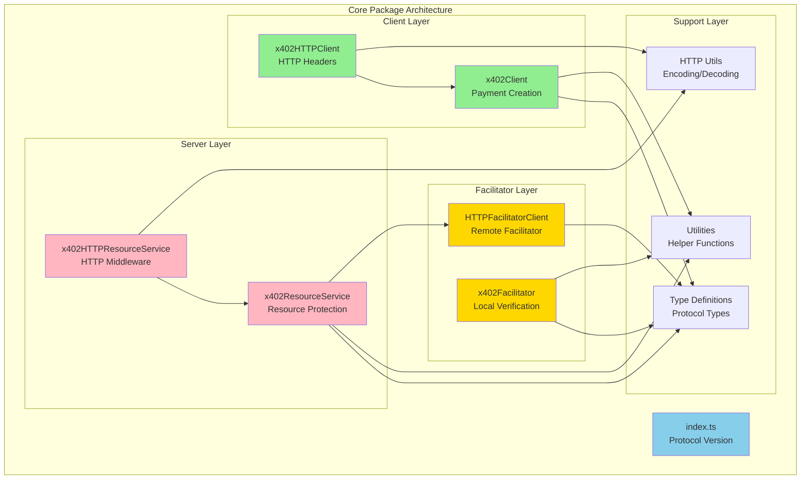

# @x402/core

The `@x402/core` package provides the foundational implementation of the x402 payment protocol. This package contains transport-agnostic classes and interfaces that enable payment-protected resources across different platforms and frameworks.

## Overview

`@x402/core` is the foundation of the x402 SDK ecosystem. It implements the core protocol logic for clients, servers, and facilitators without any dependencies on specific HTTP frameworks or blockchain implementations. This design enables:

- **Transport Independence**: Core logic works with any HTTP framework
- **Blockchain Agnosticism**: Supports multiple payment mechanisms (EVM, Solana, etc.)
- **Extensibility**: Clear interfaces for custom payment schemes
- **Type Safety**: Comprehensive TypeScript types for the entire protocol

## Installation

```bash
npm install @x402/core
# or
pnpm add @x402/core
# or
yarn add @x402/core
```

## Package Structure

The package is organized into submodules, each accessible via subpath exports:

```typescript
// Main exports - protocol version
import { x402Version } from '@x402/core';

// Client functionality
import { x402Client, x402HTTPClient } from '@x402/core/client';

// Server functionality
import { x402ResourceService, x402HTTPResourceService } from '@x402/core/server';

// Facilitator implementation
import { x402Facilitator } from '@x402/core/facilitator';

// HTTP utilities
import {
  encodePaymentSignatureHeader,
  decodePaymentRequiredHeader
} from '@x402/core/http';

// Type definitions
import type {
  PaymentPayload,
  PaymentRequirements
} from '@x402/core/types';

// Utility functions
import { findByNetworkAndScheme, deepEqual } from '@x402/core/utils';
```

## Architecture



## Module Documentation

### Core Exports

- [Main Package](./main.md) - Protocol version and constants
- [Types](./types.md) - Type definitions for the protocol
- [Utilities](./utils.md) - Helper functions

### Client Modules

- [x402Client](./client.md) - Core client for creating payments
- [HTTP Client Extensions](./http-client.md) - HTTP-specific client functionality

### Server Modules

- [x402ResourceService](./server.md) - Core server for protecting resources
- [HTTP Server Extensions](./http-server.md) - HTTP-specific server functionality

### Facilitator Modules

- [x402Facilitator](./facilitator.md) - Local facilitator implementation
- [HTTP Facilitator Client](./facilitator-client.md) - HTTP client for remote facilitators

### Support Modules

- [HTTP Utilities](./http.md) - Header encoding/decoding functions

## Quick Examples

### Client-Side Payment

```typescript
import { x402HTTPClient } from '@x402/core/client';
import { ExactEvmClient } from '@x402/evm';
import { privateKeyToAccount } from 'viem/accounts';

// Setup client
const account = privateKeyToAccount('0x...');
const client = new x402HTTPClient();

client.registerScheme('eip155:*', new ExactEvmClient(account));

// Handle 402 response
const response = await fetch(url);
if (response.status === 402) {
  const paymentRequired = client.getPaymentRequiredResponse(
    Object.fromEntries(response.headers.entries())
  );

  // Select payment requirements
  const selected = client.selectPaymentRequirements(
    paymentRequired.x402Version,
    paymentRequired.accepts
  );

  // Create payment
  const payment = await client.createPaymentPayload(
    paymentRequired.x402Version,
    selected
  );

  // Retry with payment
  const headers = client.encodePaymentSignatureHeader(payment);
  const paidResponse = await fetch(url, { headers });
}
```

### Server-Side Protection

```typescript
import { x402HTTPResourceService } from '@x402/core/server';
import { HTTPFacilitatorClient } from '@x402/core/server';
import { ExactEvmService } from '@x402/evm';

// Setup server
const server = new x402HTTPResourceService({
  'GET /protected': {
    scheme: 'exact',
    payTo: '0x742d35Cc6634C0532925a3b844Bc9e7595f0bEb',
    price: '$0.10',
    network: 'eip155:8453',
    description: 'Protected API endpoint',
    mimeType: 'application/json'
  }
});

// Register payment mechanism
server.registerScheme('eip155:8453', new ExactEvmService());

// Initialize (fetch supported kinds from facilitator)
await server.initialize();

// Process request
const result = await server.processHTTPRequest({
  adapter: httpAdapter,
  path: '/protected',
  method: 'GET'
});

if (result.type === 'payment-verified') {
  // Payment is valid, proceed with request
  const response = await handler();

  // Settle payment
  const settlementHeaders = await server.processSettlement(
    result.paymentPayload,
    result.requirements,
    response.status
  );
}
```

### Local Facilitator

```typescript
import { x402Facilitator } from '@x402/core/facilitator';
import { ExactEvmFacilitator } from '@x402/evm';
import { privateKeyToAccount } from 'viem/accounts';

// Setup facilitator
const facilitator = new x402Facilitator();
const signerAccount = privateKeyToAccount('0x...');

facilitator.registerScheme(
  'eip155:8453',
  new ExactEvmFacilitator(signerAccount)
);

// Verify payment
const verifyResult = await facilitator.verify(
  paymentPayload,
  paymentRequirements
);

if (verifyResult.isValid) {
  // Settle payment
  const settleResult = await facilitator.settle(
    paymentPayload,
    paymentRequirements
  );
}
```

## Design Principles

### 1. Transport Agnostic

Core classes don't depend on specific HTTP frameworks. The `HTTPAdapter` interface allows any framework to integrate:

```typescript
interface HTTPAdapter {
  getHeader(name: string): string | undefined;
  getMethod(): string;
  getPath(): string;
  getUrl(): string;
  // ...
}
```

### 2. Mechanism Pluggable

Payment schemes implement standard interfaces:

```typescript
interface SchemeNetworkClient {
  readonly scheme: string;
  createPaymentPayload(
    x402Version: number,
    requirements: PaymentRequirements
  ): Promise<PaymentPayload>;
}

interface SchemeNetworkFacilitator {
  readonly scheme: string;
  verify(
    payload: PaymentPayload,
    requirements: PaymentRequirements
  ): Promise<VerifyResponse>;
  settle(
    payload: PaymentPayload,
    requirements: PaymentRequirements
  ): Promise<SettleResponse>;
}

interface SchemeNetworkService {
  readonly scheme: string;
  parsePrice(price: Price, network: Network): AssetAmount;
  enhancePaymentRequirements(
    paymentRequirements: PaymentRequirements,
    supportedKind: any,
    facilitatorExtensions: string[]
  ): Promise<PaymentRequirements>;
}
```

### 3. Facilitator Abstraction

Servers work with any facilitator implementation (HTTP-based or local):

```typescript
interface FacilitatorClient {
  verify(
    paymentPayload: PaymentPayload,
    paymentRequirements: PaymentRequirements
  ): Promise<VerifyResponse>;

  settle(
    paymentPayload: PaymentPayload,
    paymentRequirements: PaymentRequirements
  ): Promise<SettleResponse>;

  getSupported(): Promise<SupportedResponse>;
}
```

### 4. Network Pattern Matching

Network identifiers support wildcards for family-level registration:

```typescript
// Register for all EIP-155 networks (any EVM chain)
client.registerScheme('eip155:*', new ExactEvmClient(account));

// Or register for specific networks
client.registerScheme('eip155:8453', new BaseSpecificClient());
client.registerScheme('solana:mainnet', new SolanaClient());
```

## Dependencies

The core package has minimal dependencies:

```json
{
  "dependencies": {
    "zod": "^3.24.2"
  }
}
```

Zod is used for runtime type validation where needed.

## Related Packages

- [@x402/evm](../mechanisms/evm.md) - Ethereum payment mechanisms
- [@x402/svm](../mechanisms/svm.md) - Solana payment mechanisms
- [@x402/fetch](../http-adapters/fetch.md) - Fetch API client integration
- [@x402/express](../http-adapters/express.md) - Express server integration

## Next Steps

- [Client Implementation](./client.md) - Deep dive into client functionality
- [Server Implementation](./server.md) - Deep dive into server functionality
- [Type Definitions](./types.md) - Complete type reference
- [HTTP Integration](./http.md) - HTTP protocol handling
