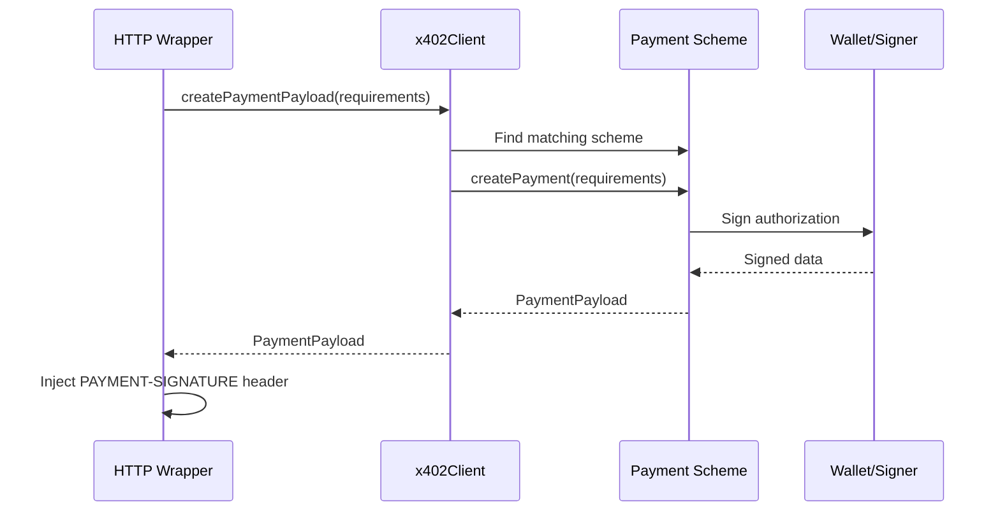

<!-- VERIFIED: 0aa62c64 -->
# Client Module

The client module provides the core payment coordination functionality for x402 protocol consumers. It manages payment scheme registration and coordinates payment payload creation when accessing protected resources.

## Overview

The `x402Client` class is the central component for making payments in the x402 protocol. It:

- Registers payment schemes (e.g., EVM exact, SVM exact) that define how payments are created and signed
- Coordinates payment payload creation when accessing protected resources
- Integrates with HTTP client wrappers to automatically inject payment headers
- Signs payments locally using the provided wallet/signer (never contacts a facilitator)

The client is designed to be transport-agnostic and works with any HTTP client through wrapper functions.

## x402Client Class

### Constructor

```typescript
import { x402Client } from "@x402/core/client";

const client = new x402Client();
```

The constructor takes no arguments. All configuration is done through scheme registration.

### Methods

#### registerScheme

Registers a payment scheme with the client. This method is typically called by scheme-specific registration functions rather than directly.

```typescript
client.registerScheme(scheme: PaymentScheme): void
```

**Parameters:**
- `scheme`: A payment scheme implementation that conforms to the `PaymentScheme` interface

**Note:** In practice, you'll use scheme-specific registration functions like `registerExactEvmScheme()` rather than calling this method directly.

#### createPaymentPayload

Creates a payment payload for a given payment requirements. This method is called automatically by HTTP client wrappers.

```typescript
async createPaymentPayload(
  paymentRequirements: PaymentRequirements,
  resourceInfo: ResourceInfo
): Promise<PaymentPayload>
```

**Parameters:**
- `paymentRequirements`: Payment requirements from the server's 402 response
- `resourceInfo`: Information about the resource being accessed

**Returns:** A `PaymentPayload` object containing the signed payment data.

**Throws:** Error if no registered scheme can handle the requested mechanism and network.

## Scheme Registration

Payment schemes define how payments are created and signed for specific blockchain networks and mechanisms. Schemes are registered using dedicated registration functions provided by mechanism packages.

### EVM Exact Scheme

```typescript
import { registerExactEvmScheme } from "@x402/evm/exact/client";
import { privateKeyToAccount } from "viem/accounts";

const account = privateKeyToAccount(process.env.PRIVATE_KEY as `0x${string}`);
registerExactEvmScheme(client, { signer: account });
```

**Configuration:**
- `signer`: A viem account object created from a private key

**Supported Networks:**
- Any EVM-compatible network using CAIP-2 format (e.g., `eip155:84532` for Base Sepolia)

### SVM Exact Scheme

```typescript
import { registerExactSvmScheme } from "@x402/svm/exact/client";
import { Keypair } from "@solana/web3.js";

const keypair = Keypair.fromSecretKey(
  Buffer.from(process.env.PRIVATE_KEY as string, "hex")
);
registerExactSvmScheme(client, { signer: keypair });
```

**Configuration:**
- `signer`: A Solana `Keypair` object

**Supported Networks:**
- Solana networks using CAIP-2 format (e.g., `solana:EtWTRABZaYq6iMfeYKouRu166VU2xqa1` for Solana Devnet)

### Multiple Schemes

You can register multiple schemes to support payments across different networks and mechanisms:

```typescript
// Register both EVM and SVM schemes
registerExactEvmScheme(client, { signer: evmAccount });
registerExactSvmScheme(client, { signer: solanaKeypair });

// Client will automatically select the appropriate scheme based on server requirements
```

## Payment Flow



### Key Points

1. **Scheme Selection**: The client matches the requested scheme and network against registered schemes
2. **Local Signing**: The payment is signed locally using the wallet/signer provided during registration
3. **No Facilitator Contact**: The client NEVER contacts a facilitator during payment creation
4. **Transport Agnostic**: The payload can be sent via any HTTP client

## Usage Examples

### Basic Client Setup with Fetch

```typescript
import { x402Client } from "@x402/core/client";
import { registerExactEvmScheme } from "@x402/evm/exact/client";
import { wrapFetchWithPayment } from "@x402/fetch";
import { privateKeyToAccount } from "viem/accounts";

// Create and configure client
const account = privateKeyToAccount(process.env.PRIVATE_KEY as `0x${string}`);
const client = new x402Client();
registerExactEvmScheme(client, { signer: account });

// Wrap HTTP client
const fetchWithPayment = wrapFetchWithPayment(fetch, client);

// Make paid request
const response = await fetchWithPayment("http://server/protected");
const data = await response.json();
```

### Multi-Network Support

```typescript
import { x402Client } from "@x402/core/client";
import { registerExactEvmScheme } from "@x402/evm/exact/client";
import { registerExactSvmScheme } from "@x402/svm/exact/client";
import { wrapFetchWithPayment } from "@x402/fetch";
import { privateKeyToAccount } from "viem/accounts";
import { Keypair } from "@solana/web3.js";

// Setup client with multiple schemes
const evmAccount = privateKeyToAccount(process.env.EVM_PRIVATE_KEY as `0x${string}`);
const svmKeypair = Keypair.fromSecretKey(
  Buffer.from(process.env.SVM_PRIVATE_KEY as string, "hex")
);

const client = new x402Client();
registerExactEvmScheme(client, { signer: evmAccount });
registerExactSvmScheme(client, { signer: svmKeypair });

const fetchWithPayment = wrapFetchWithPayment(fetch, client);

// Client automatically uses appropriate scheme based on server requirements
const evmResponse = await fetchWithPayment("http://evm-server/resource");
const svmResponse = await fetchWithPayment("http://svm-server/resource");
```

### With Axios

```typescript
import { x402Client } from "@x402/core/client";
import { registerExactEvmScheme } from "@x402/evm/exact/client";
import { wrapAxiosWithPayment } from "@x402/axios";
import { privateKeyToAccount } from "viem/accounts";
import axios from "axios";

const account = privateKeyToAccount(process.env.PRIVATE_KEY as `0x${string}`);
const client = new x402Client();
registerExactEvmScheme(client, { signer: account });

const axiosWithPayment = wrapAxiosWithPayment(axios, client);

const response = await axiosWithPayment.get("http://server/protected");
console.log(response.data);
```

### Error Handling

```typescript
import { x402Client } from "@x402/core/client";
import { wrapFetchWithPayment } from "@x402/fetch";

const client = new x402Client();
const fetchWithPayment = wrapFetchWithPayment(fetch, client);

try {
  const response = await fetchWithPayment("http://server/protected");
  const data = await response.json();
} catch (error) {
  if (error.message.includes("No scheme registered")) {
    console.error("Payment scheme not configured for server requirements");
  } else {
    console.error("Payment failed:", error);
  }
}
```

## Integration with HTTP Clients

The client integrates with various HTTP clients through wrapper functions:

- **Native Fetch**: `@x402/fetch` - `wrapFetchWithPayment(fetch, client)`
- **Axios**: `@x402/axios` - `wrapAxiosWithPayment(axios, client)`

See the HTTP client wrapper documentation for integration details.

## Network Format

Networks are specified using CAIP-2 format: `<namespace>:<reference>`

**Examples:**
- EVM networks: `eip155:1` (Ethereum), `eip155:84532` (Base Sepolia), `eip155:8453` (Base Mainnet)
- Solana: `solana:5eykt4UsFv8P8NJdTREpY1vzqKqZKvdp` (Mainnet), `solana:EtWTRABZaYq6iMfeYKouRu166VU2xqa1` (Devnet)

The client uses this format to match incoming payment requirements with registered payment schemes.

## Next Steps

- [Server Module](./server.md) - Build payment-protected APIs
- [Facilitator Module](./facilitator.md) - Run your own facilitator
- [@x402/fetch](../http-adapters/fetch.md) - Fetch client wrapper
- [@x402/evm](../mechanisms/evm.md) - EVM payment mechanism
