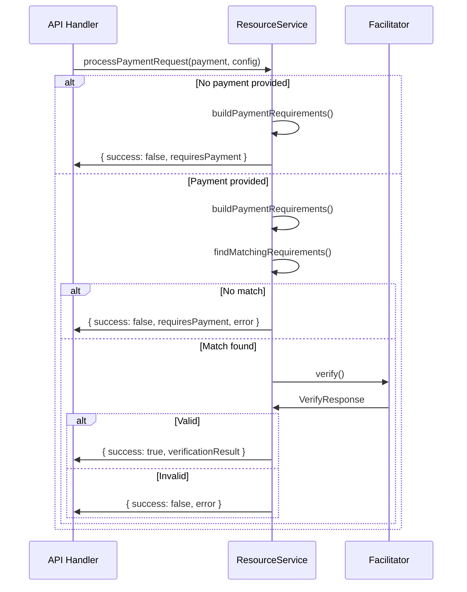

# x402ResourceService

The `x402ResourceService` class is the core server-side implementation for protecting resources with x402 payments. It handles payment verification, settlement, and requirement building in a transport-agnostic manner.

## Overview

`x402ResourceService` provides servers with:
- Resource configuration and payment requirement generation
- Payment verification through facilitators
- Payment settlement and transaction recording
- Support for multiple payment schemes and networks
- Facilitator discovery and management

## Import

```typescript
import { x402ResourceService } from '@x402/core/server';
```

## Class Definition

```typescript
export class x402ResourceService {
  constructor(facilitatorClients?: FacilitatorClient | FacilitatorClient[]);

  registerScheme(network: Network, server: SchemeNetworkService): x402ResourceService;

  async initialize(): Promise<void>;

  async buildPaymentRequirements(resourceConfig: ResourceConfig): Promise<PaymentRequirements[]>;

  createPaymentRequiredResponse(
    requirements: PaymentRequirements[],
    resourceInfo: ResourceInfo,
    error?: string,
    extensions?: Record<string, any>
  ): PaymentRequired;

  async verifyPayment(
    paymentPayload: PaymentPayload,
    requirements: PaymentRequirements
  ): Promise<VerifyResponse>;

  async settlePayment(
    paymentPayload: PaymentPayload,
    requirements: PaymentRequirements
  ): Promise<SettleResponse>;

  findMatchingRequirements(
    availableRequirements: PaymentRequirements[],
    paymentPayload: PaymentPayload
  ): PaymentRequirements | undefined;

  async processPaymentRequest(
    paymentPayload: PaymentPayload | null,
    resourceConfig: ResourceConfig,
    resourceInfo: ResourceInfo,
    extensions?: Record<string, any>
  ): Promise<{
    success: boolean;
    requiresPayment?: PaymentRequired;
    verificationResult?: VerifyResponse;
    error?: string;
  }>;
}
```

## Constructor

### Parameters

- **facilitatorClients** (optional): One or more facilitator client implementations
  - Type: `FacilitatorClient | FacilitatorClient[]`
  - Default: Creates a default `HTTPFacilitatorClient` pointing to `https://x402.org/facilitator`

### Examples

```typescript
import { x402ResourceService, HTTPFacilitatorClient } from '@x402/core/server';

// Use default facilitator
const service = new x402ResourceService();

// Use custom facilitator URL
const service = new x402ResourceService(
  new HTTPFacilitatorClient({ url: 'https://facilitator.example.com' })
);

// Use multiple facilitators (first match wins)
const service = new x402ResourceService([
  new HTTPFacilitatorClient({ url: 'https://primary.example.com' }),
  new HTTPFacilitatorClient({ url: 'https://fallback.example.com' })
]);

// Use local facilitator
import { x402Facilitator } from '@x402/core/facilitator';
const localFacilitator = new x402Facilitator();
// ... register schemes on localFacilitator

class LocalFacilitatorClient implements FacilitatorClient {
  async verify(payload, requirements) {
    return localFacilitator.verify(payload, requirements);
  }
  async settle(payload, requirements) {
    return localFacilitator.settle(payload, requirements);
  }
  async getSupported() {
    // Return supported kinds
  }
}

const service = new x402ResourceService(new LocalFacilitatorClient());
```

## Methods

### registerScheme()

Registers a payment scheme implementation for a specific network.

```typescript
registerScheme(
  network: Network,
  server: SchemeNetworkService
): x402ResourceService
```

#### Parameters

- **network**: Network identifier (e.g., `eip155:8453`, `solana:mainnet`)
- **server**: Implementation of `SchemeNetworkService` interface

#### Returns

Returns `this` for method chaining.

#### Examples

```typescript
import { ExactEvmService } from '@x402/evm';
import { SolanaService } from '@x402/svm';

const service = new x402ResourceService();

// Register EVM implementation for Base
service.registerScheme('eip155:8453', new ExactEvmService());

// Chain registrations
service
  .registerScheme('eip155:8453', new ExactEvmService())
  .registerScheme('eip155:84532', new ExactEvmService())
  .registerScheme('solana:mainnet', new SolanaService());
```

### initialize()

Fetches supported payment kinds from all registered facilitators. Must be called before processing payments.

```typescript
async initialize(): Promise<void>
```

#### Behavior

1. Queries each facilitator's `/supported` endpoint
2. Builds internal mappings of supported schemes by version and network
3. Earlier facilitators in the array get precedence

#### Examples

```typescript
const service = new x402ResourceService();
service.registerScheme('eip155:8453', new ExactEvmService());

// Initialize before accepting payments
await service.initialize();

// Now ready to process payments
```

#### Error Handling

If a facilitator fails to respond, initialization continues with a warning:

```typescript
try {
  await service.initialize();
} catch (error) {
  // Individual facilitator errors are caught and logged
  // Initialization succeeds if at least one facilitator responds
}
```

### buildPaymentRequirements()

Builds payment requirements for a protected resource.

```typescript
async buildPaymentRequirements(
  resourceConfig: ResourceConfig
): Promise<PaymentRequirements[]>
```

#### Parameters

```typescript
interface ResourceConfig {
  scheme: string;              // e.g., 'exact'
  payTo: string;               // Payment recipient address
  price: Price;                // e.g., '$0.10' or { amount: '100000', asset: 'USDC' }
  network: Network;            // e.g., 'eip155:8453'
  maxTimeoutSeconds?: number;  // Default: 300 (5 minutes)
}
```

#### Returns

Array of `PaymentRequirements` objects (typically one per resource config).

#### Process

1. Finds registered scheme implementation for the network
2. Parses price using scheme's price parser
3. Queries facilitator for supported kind
4. Enhances requirements with scheme-specific data
5. Returns formatted requirements

#### Examples

```typescript
const requirements = await service.buildPaymentRequirements({
  scheme: 'exact',
  payTo: '0x742d35Cc6634C0532925a3b844Bc9e7595f0bEb',
  price: '$0.10',
  network: 'eip155:8453',
  maxTimeoutSeconds: 600
});

console.log(requirements);
// [{
//   scheme: 'exact',
//   network: 'eip155:8453',
//   amount: '100000',
//   asset: '0x833589fCD6eDb6E08f4c7C32D4f71b54bdA02913',
//   payTo: '0x742d35Cc6634C0532925a3b844Bc9e7595f0bEb',
//   maxTimeoutSeconds: 600,
//   extra: {
//     signerAddress: '0x...',
//     verifyingContract: '0x...'
//   }
// }]
```

### createPaymentRequiredResponse()

Creates a 402 Payment Required response object.

```typescript
createPaymentRequiredResponse(
  requirements: PaymentRequirements[],
  resourceInfo: ResourceInfo,
  error?: string,
  extensions?: Record<string, any>
): PaymentRequired
```

#### Parameters

```typescript
interface ResourceInfo {
  url: string;         // Resource URL
  description: string; // Human-readable description
  mimeType: string;    // Content type
}
```

#### Returns

```typescript
interface PaymentRequired {
  x402Version: 2;
  error?: string;
  resource: ResourceInfo;
  accepts: PaymentRequirements[];
  extensions?: Record<string, any>;
}
```

#### Examples

```typescript
const requirements = await service.buildPaymentRequirements(resourceConfig);

const paymentRequired = service.createPaymentRequiredResponse(
  requirements,
  {
    url: 'https://api.example.com/data',
    description: 'Premium API endpoint',
    mimeType: 'application/json'
  },
  'Payment required to access this resource'
);
```

### verifyPayment()

Verifies a payment payload against requirements using the facilitator.

```typescript
async verifyPayment(
  paymentPayload: PaymentPayload,
  requirements: PaymentRequirements
): Promise<VerifyResponse>
```

#### Returns

```typescript
interface VerifyResponse {
  isValid: boolean;
  invalidReason?: string;
  payer?: string;
}
```

#### Examples

```typescript
const verifyResult = await service.verifyPayment(
  paymentPayload,
  matchingRequirements
);

if (verifyResult.isValid) {
  console.log('Payment valid from:', verifyResult.payer);
  // Proceed with request
} else {
  console.error('Invalid payment:', verifyResult.invalidReason);
  // Reject request
}
```

#### Facilitator Selection

The service automatically selects the appropriate facilitator based on:
- Payment version (x402Version)
- Payment network
- Payment scheme

If no specific match is found, it tries all facilitators in order.

### settlePayment()

Settles a verified payment on-chain through the facilitator.

```typescript
async settlePayment(
  paymentPayload: PaymentPayload,
  requirements: PaymentRequirements
): Promise<SettleResponse>
```

#### Returns

```typescript
interface SettleResponse {
  success: boolean;
  errorReason?: string;
  payer?: string;
  transaction: string;
  network: Network;
}
```

#### Examples

```typescript
const settleResult = await service.settlePayment(
  paymentPayload,
  requirements
);

if (settleResult.success) {
  console.log('Payment settled:', {
    transaction: settleResult.transaction,
    network: settleResult.network,
    payer: settleResult.payer
  });

  // Store transaction reference
  await db.transactions.create({
    hash: settleResult.transaction,
    network: settleResult.network,
    payer: settleResult.payer,
    amount: requirements.amount
  });
} else {
  console.error('Settlement failed:', settleResult.errorReason);
}
```

### findMatchingRequirements()

Finds which payment requirements match a given payment payload.

```typescript
findMatchingRequirements(
  availableRequirements: PaymentRequirements[],
  paymentPayload: PaymentPayload
): PaymentRequirements | undefined
```

#### Returns

The matching `PaymentRequirements` or `undefined` if no match.

#### Matching Logic

For v2 protocol:
- Deep equality check between requirements and `paymentPayload.accepted`

#### Examples

```typescript
const matchingRequirements = service.findMatchingRequirements(
  allRequirements,
  paymentPayload
);

if (!matchingRequirements) {
  // Payment doesn't match any offered requirements
  throw new Error('Invalid payment - no matching requirements');
}
```

### processPaymentRequest()

High-level method that handles the complete payment flow.

```typescript
async processPaymentRequest(
  paymentPayload: PaymentPayload | null,
  resourceConfig: ResourceConfig,
  resourceInfo: ResourceInfo,
  extensions?: Record<string, any>
): Promise<{
  success: boolean;
  requiresPayment?: PaymentRequired;
  verificationResult?: VerifyResponse;
  error?: string;
}>
```

#### Process Flow



#### Examples

```typescript
const result = await service.processPaymentRequest(
  paymentPayload,
  {
    scheme: 'exact',
    payTo: '0x742d35Cc6634C0532925a3b844Bc9e7595f0bEb',
    price: '$0.10',
    network: 'eip155:8453'
  },
  {
    url: req.url,
    description: 'Protected endpoint',
    mimeType: 'application/json'
  }
);

if (result.success) {
  // Payment verified - process request
  const data = await fetchProtectedData();

  // Settle after successful response
  const settlement = await service.settlePayment(
    paymentPayload,
    result.verificationResult
  );

  return {
    status: 200,
    data,
    headers: {
      'PAYMENT-RESPONSE': encodePaymentResponseHeader(settlement)
    }
  };
} else if (result.requiresPayment) {
  // No payment or invalid payment - return 402
  return {
    status: 402,
    headers: {
      'PAYMENT-REQUIRED': encodePaymentRequiredHeader(result.requiresPayment)
    }
  };
}
```

## Complete Example

```typescript
import { x402ResourceService, HTTPFacilitatorClient } from '@x402/core/server';
import { ExactEvmService } from '@x402/evm';
import {
  decodePaymentSignatureHeader,
  encodePaymentRequiredHeader,
  encodePaymentResponseHeader
} from '@x402/core/http';

// Setup
const service = new x402ResourceService(
  new HTTPFacilitatorClient({
    url: process.env.FACILITATOR_URL || 'https://x402.org/facilitator'
  })
);

service.registerScheme('eip155:8453', new ExactEvmService());

await service.initialize();

// Handler
async function handleProtectedRequest(req: Request): Promise<Response> {
  // Extract payment
  const paymentHeader = req.headers.get('PAYMENT-SIGNATURE');
  const paymentPayload = paymentHeader
    ? decodePaymentSignatureHeader(paymentHeader)
    : null;

  // Process payment
  const result = await service.processPaymentRequest(
    paymentPayload,
    {
      scheme: 'exact',
      payTo: '0x742d35Cc6634C0532925a3b844Bc9e7595f0bEb',
      price: '$0.10',
      network: 'eip155:8453'
    },
    {
      url: req.url,
      description: 'Premium API data',
      mimeType: 'application/json'
    }
  );

  if (!result.success) {
    if (result.requiresPayment) {
      return new Response(null, {
        status: 402,
        headers: {
          'PAYMENT-REQUIRED': encodePaymentRequiredHeader(result.requiresPayment)
        }
      });
    }
    return new Response(result.error, { status: 400 });
  }

  // Payment verified - process request
  const data = { message: 'Success', timestamp: Date.now() };

  // Settle payment
  const settlement = await service.settlePayment(
    paymentPayload!,
    result.verificationResult as any
  );

  return new Response(JSON.stringify(data), {
    status: 200,
    headers: {
      'Content-Type': 'application/json',
      'PAYMENT-RESPONSE': encodePaymentResponseHeader(settlement)
    }
  });
}
```

## Best Practices

### 1. Initialize Early

Call `initialize()` during application startup:

```typescript
// app.ts
const service = new x402ResourceService();
service.registerScheme('eip155:8453', new ExactEvmService());

// Initialize before accepting requests
await service.initialize();

app.listen(3000);
```

### 2. Cache Service Instance

Create one service instance and reuse it:

```typescript
// services/payment.ts
export const paymentService = new x402ResourceService();
paymentService.registerScheme('eip155:8453', new ExactEvmService());

// Initialize in startup
export async function initializePaymentService() {
  await paymentService.initialize();
}

// Use in handlers
import { paymentService } from './services/payment';
```

### 3. Handle Errors Gracefully

```typescript
try {
  const result = await service.processPaymentRequest(/* ... */);
} catch (error) {
  logger.error('Payment processing failed:', error);
  return new Response('Payment service unavailable', { status: 503 });
}
```

### 4. Use HTTP Extension for Frameworks

For framework integration, use `x402HTTPResourceService`:

```typescript
import { x402HTTPResourceService } from '@x402/core/server';

const service = new x402HTTPResourceService({
  'GET /api/data': {
    scheme: 'exact',
    payTo: '0x...',
    price: '$0.10',
    network: 'eip155:8453',
    description: 'API data endpoint',
    mimeType: 'application/json'
  }
});
```

See [HTTP Server Extensions](./http-server.md) for details.

## Related Documentation

- [x402HTTPResourceService](./http-server.md) - HTTP-specific server methods
- [x402Facilitator](./facilitator.md) - Local facilitator implementation
- [HTTP Facilitator Client](./facilitator-client.md) - Remote facilitator client
- [Payment Types](./types.md#payment-types) - Type definitions
- [EVM Server](../mechanisms/evm.md#server) - Ethereum implementation
