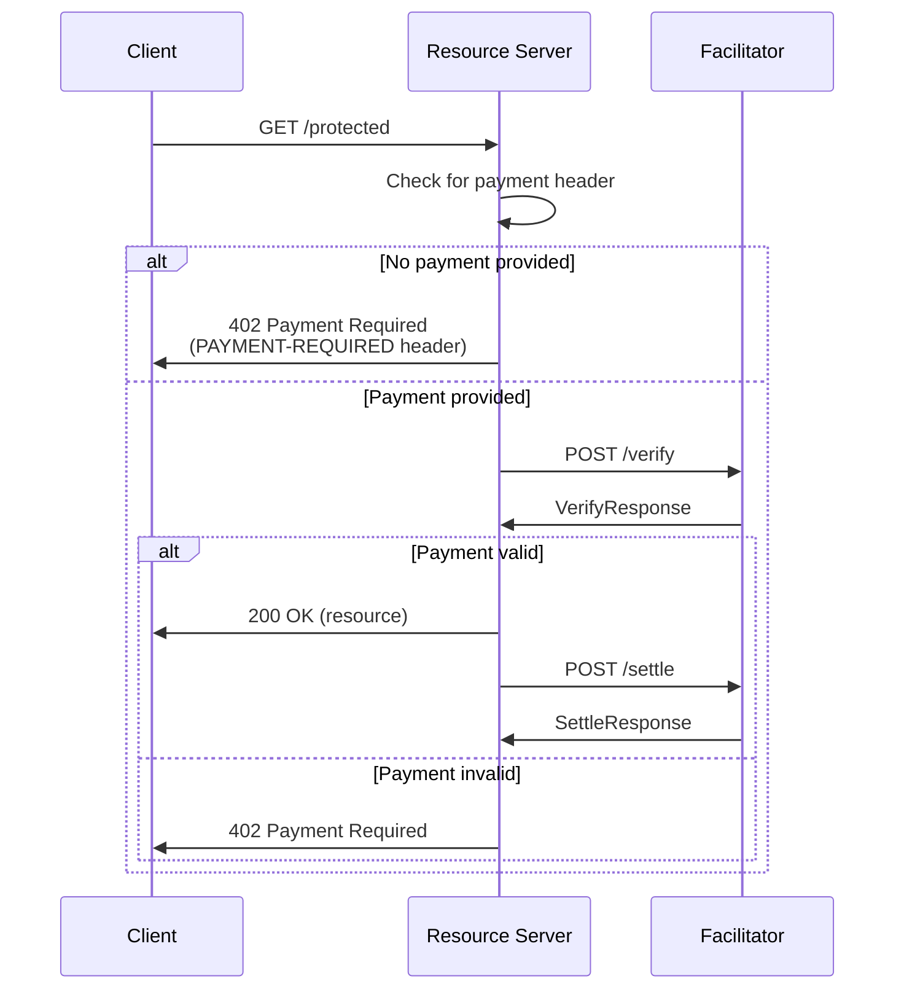

<!-- VERIFIED: 3c3e2168 -->
# Server Module

The server module provides the core components for building x402-protected resource servers. It includes the `x402ResourceServer` class for payment verification and settlement, and the `HTTPFacilitatorClient` for communicating with facilitator services.

## Overview

The server module is transport-agnostic and handles:

- Building payment requirements for protected resources
- Verifying payments through a facilitator
- Settling verified payments
- Managing payment scheme implementations

Resource servers delegate cryptographic verification and on-chain settlement to a facilitator service, which specializes in those operations. The server focuses on business logic: what resources cost, who can access them, and how to process payments.

## x402ResourceServer Class

The core class for implementing payment-protected resources.

### Constructor

```typescript
import { x402ResourceServer, HTTPFacilitatorClient } from "@x402/core/server";

const facilitatorClient = new HTTPFacilitatorClient({
  url: "https://facilitator.x402.org"
});

const server = new x402ResourceServer(facilitatorClient);
```

**Parameters:**

- `facilitatorClient`: A `FacilitatorClient` instance for communicating with the facilitator service

### Registering Payment Schemes

Payment schemes define how different blockchain networks handle payments. Register them using scheme-specific registration functions:

```typescript
import { registerExactEvmScheme } from "@x402/evm/exact/server";
import { registerExactSvmScheme } from "@x402/svm/exact/server";

// Register EVM chains (Ethereum, Base, etc.)
registerExactEvmScheme(server);

// Register Solana
registerExactSvmScheme(server);
```

### Key Methods

#### verifyPayment

Verifies a payment against requirements using the facilitator:

```typescript
const verifyResult = await server.verifyPayment(paymentPayload, requirements);

if (verifyResult.isValid) {
  console.log("Payment verified from:", verifyResult.payer);
} else {
  console.error("Verification failed:", verifyResult.invalidReason);
}
```

**Returns:**

```typescript
interface VerifyResponse {
  isValid: boolean;
  invalidReason?: string;
  payer?: string;
}
```

#### settlePayment

Settles a verified payment by requesting on-chain settlement from the facilitator:

```typescript
const settleResult = await server.settlePayment(paymentPayload, requirements);

if (settleResult.success) {
  console.log("Transaction:", settleResult.transaction);
  console.log("Network:", settleResult.network);
} else {
  console.error("Settlement failed:", settleResult.errorReason);
}
```

**Returns:**

```typescript
interface SettleResponse {
  success: boolean;
  errorReason?: string;
  payer?: string;
  transaction: string;
  network: string;
}
```

## HTTPFacilitatorClient Class

HTTP-based client for communicating with x402 facilitator services.

### Constructor

```typescript
import { HTTPFacilitatorClient } from "@x402/core/server";

const facilitatorClient = new HTTPFacilitatorClient({
  url: "https://facilitator.x402.org",
});
```

**Configuration Options:**

```typescript
interface FacilitatorConfig {
  url: string;  // Facilitator service URL
}
```

### Methods

**`verify(paymentPayload, paymentRequirements)`**

Verify a payment with the facilitator:

```typescript
const result = await facilitatorClient.verify(paymentPayload, requirements);
```

**`settle(paymentPayload, paymentRequirements)`**

Settle a payment with the facilitator:

```typescript
const result = await facilitatorClient.settle(paymentPayload, requirements);
```

**`getSupported()`**

Fetch supported payment kinds:

```typescript
const supported = await facilitatorClient.getSupported();
console.log("Supported kinds:", supported.kinds);
```

## Route Configuration

Routes are defined as objects mapping HTTP method and path to payment requirements:

```typescript
const routes = {
  "GET /api/data": {
    accepts: {
      scheme: "exact",
      network: "eip155:84532",
      payTo: "0x742d35Cc6634C0532925a3b844Bc9e7595f0bEb",
      price: "$0.01",
    },
    description: "Premium data access",
  },
};
```

### Single Payment Option

```typescript
"GET /api/resource": {
  accepts: {
    scheme: "exact",
    network: "eip155:84532",
    payTo: "0x742d35Cc6634C0532925a3b844Bc9e7595f0bEb",
    price: "$0.001",
    maxTimeoutSeconds: 60,
  },
  description: "Resource description",
}
```

### Multiple Payment Options

Accept payments on different networks:

```typescript
"POST /api/compute": {
  accepts: [
    {
      scheme: "exact",
      network: "eip155:84532",
      payTo: "0x742d35Cc6634C0532925a3b844Bc9e7595f0bEb",
      price: "$0.05",
    },
    {
      scheme: "exact",
      network: "solana:EtWTRABZaYq6iMfeYKouRu166VU2xqa1",
      payTo: "DYw8jCTfwHNRJhhmFcbXvVDTqWMEVFBX6ZKUmG5CNSKK",
      price: "$0.05",
    },
  ],
  description: "Multi-chain endpoint",
}
```

### Price Formats

```typescript
// Fiat string (converted to token amount)
price: "$0.001"
price: "$1.50"

// With more precision
price: "$0.0001"
```

## Payment Verification Flow


```mermaid
sequenceDiagram
    participant Client
    participant Server as Resource Server
    participant Facilitator

    Client->>Server: GET /protected
    Server->>Server: Check for payment header
    alt No payment provided
        Server->>Client: 402 Payment Required<br/>(PAYMENT-REQUIRED header)
    else Payment provided
        Server->>Facilitator: POST /verify
        Facilitator->>Server: VerifyResponse
        alt Payment valid
            Server->>Client: 200 OK (resource)
            Server->>Facilitator: POST /settle
            Facilitator->>Server: SettleResponse
        else Payment invalid
            Server->>Client: 402 Payment Required
        end
    end
```

## Scheme Registration

Payment schemes implement blockchain-specific logic. Use registration helpers for common schemes:

### EVM Chains (Ethereum, Base, etc.)

```typescript
import { registerExactEvmScheme } from "@x402/evm/exact/server";

registerExactEvmScheme(server);
```

### Solana

```typescript
import { registerExactSvmScheme } from "@x402/svm/exact/server";

registerExactSvmScheme(server);
```

## Usage Examples

### Basic Express Server

```typescript
import express from "express";
import { paymentMiddleware } from "@x402/express";
import { x402ResourceServer, HTTPFacilitatorClient } from "@x402/core/server";
import { registerExactEvmScheme } from "@x402/evm/exact/server";

const app = express();

const facilitatorClient = new HTTPFacilitatorClient({
  url: "https://facilitator.x402.org"
});

const server = new x402ResourceServer(facilitatorClient);
registerExactEvmScheme(server);

app.use(paymentMiddleware({
  "GET /protected": {
    accepts: {
      scheme: "exact",
      network: "eip155:84532",
      payTo: "0x742d35Cc6634C0532925a3b844Bc9e7595f0bEb",
      price: "$0.001",
    },
    description: "Protected endpoint",
  },
}, server));

app.get("/protected", (req, res) => {
  res.json({ message: "Success!" });
});

app.listen(3000);
```

### Multi-Chain Support

```typescript
import { registerExactEvmScheme } from "@x402/evm/exact/server";
import { registerExactSvmScheme } from "@x402/svm/exact/server";

const server = new x402ResourceServer(facilitatorClient);

// Register both EVM and Solana
registerExactEvmScheme(server);
registerExactSvmScheme(server);

app.use(paymentMiddleware({
  "GET /multi-chain": {
    accepts: [
      {
        scheme: "exact",
        network: "eip155:84532",
        payTo: "0x742d35Cc6634C0532925a3b844Bc9e7595f0bEb",
        price: "$0.10",
      },
      {
        scheme: "exact",
        network: "solana:EtWTRABZaYq6iMfeYKouRu166VU2xqa1",
        payTo: "DYw8jCTfwHNRJhhmFcbXvVDTqWMEVFBX6ZKUmG5CNSKK",
        price: "$0.10",
      },
    ],
    description: "Accept payment on Base or Solana",
  },
}, server));
```

## Network Identifiers

Networks use the CAIP-2 format: `namespace:reference`

**EVM Chains:**
- `eip155:1` - Ethereum Mainnet
- `eip155:8453` - Base Mainnet
- `eip155:84532` - Base Sepolia

**Solana:**
- `solana:5eykt4UsFv8P8NJdTREpY1vzqKqZKvdp` - Mainnet
- `solana:EtWTRABZaYq6iMfeYKouRu166VU2xqa1` - Devnet

## Next Steps

- [Client Module](./client.md) - Build payment clients
- [Facilitator Module](./facilitator.md) - Run your own facilitator
- [@x402/express](../http-adapters/express.md) - Express middleware
- [@x402/evm](../mechanisms/evm.md) - EVM payment mechanism
