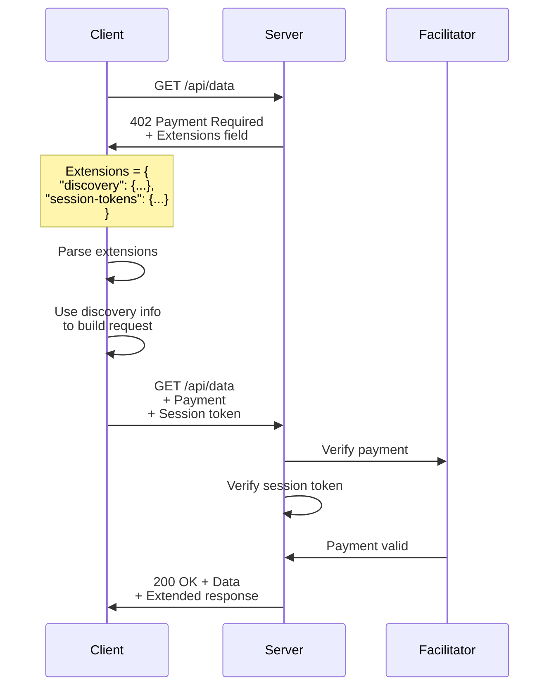

# Extensions

Extensions enhance the x402 protocol with additional functionality beyond basic payment processing.

## Available Extensions

All extensions are available through the unified **@x402/extensions** package:

| Extension | Status | Description |
|-----------|--------|-------------|
| [@x402/extensions/bazaar](./bazaar.md) | ✅ **Production** | Service discovery and API marketplace |
| [@x402/extensions/sign-in-with-x](./sign-in-with-x.md) | 🚧 **Planned** | Blockchain-based authentication |

**Installation**:
```bash
npm install @x402/extensions
```

## Extension Architecture

Extensions use the x402 protocol's `extensions` field to communicate additional capabilities and metadata:

```typescript
{
  x402Version: 2,
  resource: { /* ... */ },
  accepts: [ /* ... */ ],
  extensions: {
    "discovery": { /* Bazaar discovery info */ },
    "session-tokens": { /* Sign-in-with-X auth */ }
  }
}
```

## Bazaar Extension (Discovery)

Enables automatic service discovery and cataloging of x402-enabled APIs.

**Use Cases:**
- API marketplaces
- Automatic client SDK generation
- Service indexing
- Documentation generation

**Key Features:**
- JSON Schema validation
- HTTP method support (GET, POST, etc.)
- Input/output specifications
- Example requests and responses

[Learn more →](./bazaar.md)

## Sign-in-with-X Extension (Authentication)

Provides blockchain-based authentication integrated with payment flows.

**Use Cases:**
- User authentication via wallet signatures
- Session management
- Access control
- Identity verification

**Key Features:** (Planned)
- EIP-4361 (Sign-In with Ethereum) support
- Session token generation
- Combined auth + payment flows
- Multi-chain support

[Learn more →](./sign-in-with-x.md)

## Extension Flow



## Using Extensions

### Server-Side

Declare extensions in route configuration:

```typescript
import { declareDiscoveryExtension } from '@x402/extensions/bazaar';

const routes = {
  'GET /api/analytics': {
    scheme: 'exact',
    payTo: '0x...',
    price: '$0.10',
    network: 'eip155:8453',
    description: 'Analytics API',

    // Add discovery extension
    discoverable: true,
    inputSchema: {
      properties: {
        startDate: { type: 'string', format: 'date' },
        endDate: { type: 'string', format: 'date' }
      },
      required: ['startDate', 'endDate']
    },
    outputSchema: {
      properties: {
        users: { type: 'number' },
        revenue: { type: 'number' }
      }
    }
  }
};
```

### Client-Side

Parse and use extension data:

```typescript
const response = await fetch(url);

if (response.status === 402) {
  const paymentRequired = decodePaymentRequiredHeader(
    response.headers.get('PAYMENT-REQUIRED')!
  );

  // Check for extensions
  if (paymentRequired.extensions?.discovery) {
    const discovery = paymentRequired.extensions.discovery;
    console.log('Input schema:', discovery.schema.properties.input);
    console.log('Example request:', discovery.info.input);
  }

  // Create payment...
}
```

## Creating Custom Extensions

Extensions are simple key-value objects in the `extensions` field:

```typescript
// Server-side: Add extension to PaymentRequired
const paymentRequired: PaymentRequired = {
  x402Version: 2,
  resource: { /* ... */ },
  accepts: [ /* ... */ ],
  extensions: {
    'my-extension': {
      info: {
        // Your extension data
        customField: 'value',
        metadata: { /* ... */ }
      },
      schema: {
        // JSON Schema for validation
        type: 'object',
        properties: { /* ... */ }
      }
    }
  }
};

// Client-side: Read extension
if (paymentRequired.extensions?.['my-extension']) {
  const myExt = paymentRequired.extensions['my-extension'];
  // Use extension data
}
```

### Extension Design Guidelines

1. **Namespace**: Use descriptive names (e.g., `discovery`, `session-tokens`)
2. **Schema**: Always include JSON Schema for validation
3. **Versioning**: Include version in extension data
4. **Optional**: Extensions must be optional (clients can ignore)
5. **Documentation**: Document extension format and usage

## Extension Registry

Reserved extension names:

| Name | Purpose | Package |
|------|---------|---------|
| `discovery` | Service discovery | @x402/extensions/bazaar |
| `session-tokens` | Authentication | @x402/extensions/sign-in-with-x |

For custom extensions, use reverse-domain notation:
- `com.example.my-extension`
- `io.company.feature`

## Facilitator Extensions

Facilitators also declare supported extensions:

```typescript
{
  kinds: [ /* ... */ ],
  extensions: ['discovery', 'session-tokens']
}
```

Servers check facilitator extensions before including them:

```typescript
const facilitatorExtensions = await facilitator.getSupported();

const paymentRequired = server.createPaymentRequiredResponse(
  requirements,
  resourceInfo,
  undefined,
  // Only include extensions facilitator supports
  includeExtensions(facilitatorExtensions.extensions)
);
```

## Related Documentation

- [Bazaar Extension](./bazaar.md) - Discovery implementation
- [Sign-in-with-X](./sign-in-with-x.md) - Authentication (planned)
- [Core Types](../core/types.md) - Extension type definitions
- [Protocol Specification](../../01-overview/what-is-x402.md) - Extension protocol details
