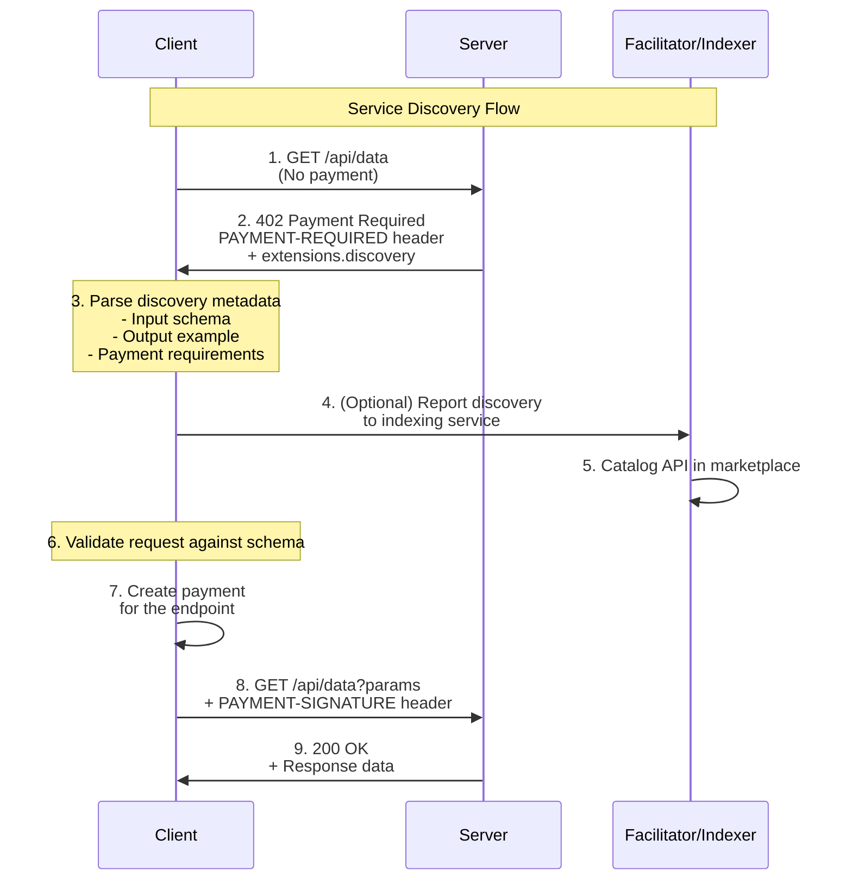
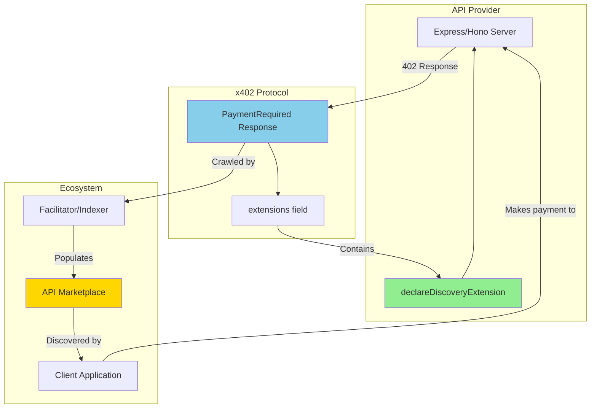
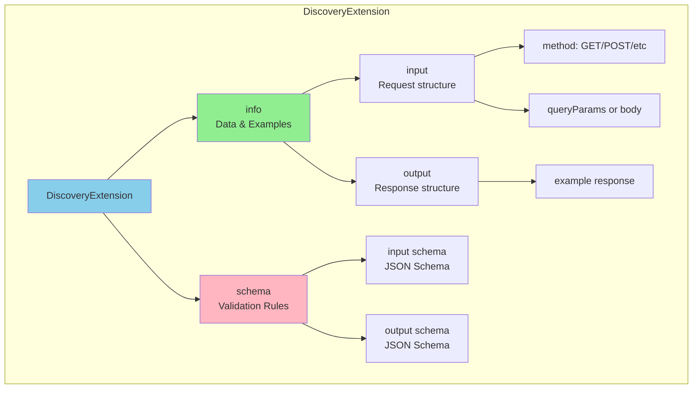

# Bazaar Extension

**Package**: `@x402/extensions/bazaar`
**Status**: Production-ready (v2.0.0)
**Protocol Family**: Protocol-agnostic

The Bazaar extension provides service discovery capabilities for x402-enabled APIs, enabling facilitators to automatically catalog and index payment-protected resources.

---

## Overview

The Bazaar extension (officially named "discovery") enables servers to publish structured API metadata through the x402 protocol. This allows facilitators, API marketplaces, and client tools to automatically discover, understand, and integrate with payment-enabled services.

### What Problem Does It Solve?

In a decentralized payment ecosystem, clients need to discover:
- What APIs accept x402 payments
- What input parameters each endpoint requires
- What output format to expect
- How to construct valid requests

Without discovery, this information must be communicated out-of-band through documentation, increasing friction and limiting automated integration.

### Why Use Service Discovery?

**For API Providers:**
- Increase discoverability in API marketplaces
- Enable automatic client SDK generation
- Provide machine-readable documentation
- Reduce integration support burden

**For Facilitators:**
- Build searchable API catalogs
- Verify endpoint schemas programmatically
- Generate revenue from API discovery services
- Provide value-added services to API consumers

**For Clients:**
- Auto-generate type-safe API clients
- Validate requests before payment
- Discover new services programmatically
- Reduce integration time from days to minutes

### Key Features

- **HTTP Method Support**: GET, POST, PUT, PATCH, DELETE, HEAD
- **Schema Validation**: JSON Schema for input/output validation
- **Type Safety**: Full TypeScript type definitions
- **Protocol-Agnostic**: Works with any payment scheme or network
- **Self-Documenting**: Extensions include both data and schema
- **Graceful Degradation**: Clients work without discovery support

---

## Installation

The Bazaar extension is part of the `@x402/extensions` package:

```bash
npm install @x402/extensions
```

The extension is distributed separately to keep the core protocol lightweight. Only install if you need discovery features.

---

## Core Concepts

### Service Discovery Fundamentals

Service discovery in x402 works through the **extensions field** in the `PaymentRequired` response. When a server returns a 402 status, it can include discovery metadata that describes the endpoint's API contract.

### Discovery Extension Structure

Every discovery extension has two parts:

1. **`info`** - The actual data (examples, metadata)
2. **`schema`** - JSON Schema for validation

This dual structure enables both human understanding (through examples) and machine validation (through schemas).

### Registration and Announcement

Servers "announce" their API structure by including the discovery extension in their 402 responses. There's no central registry - discovery is decentralized.

### Discovery and Lookup

Facilitators and indexing services can crawl x402 endpoints to build searchable API catalogs. Clients can then query these catalogs to find relevant APIs.

### Key Terminology

- **Discovery Extension**: The `@x402/extensions/bazaar` metadata attached to payment requirements
- **Query Methods**: HTTP methods that use query parameters (GET, HEAD, DELETE)
- **Body Methods**: HTTP methods that use request bodies (POST, PUT, PATCH)
- **Info**: The example data and metadata portion of the extension
- **Schema**: The JSON Schema validation rules

---

## API Reference

### `declareDiscoveryExtension()`

Creates a discovery extension object for an HTTP endpoint.

```typescript
function declareDiscoveryExtension(
  method: QueryParamMethods | BodyMethods,
  input: any,
  inputSchema: Record<string, any>,
  options?: {
    bodyType?: 'json' | 'form-data' | 'text';
    output?: {
      example?: any;
      schema?: Record<string, any>;
    };
  }
): DiscoveryExtension
```

#### Parameters

**`method`** - `QueryParamMethods | BodyMethods`

The HTTP method for the endpoint:
- Query methods: `'GET'`, `'HEAD'`, `'DELETE'`
- Body methods: `'POST'`, `'PUT'`, `'PATCH'`

**`input`** - `any`

Example input data:
- For query methods: Example query parameters as an object
- For body methods: Example request body

This provides concrete examples for API consumers.

**`inputSchema`** - `Record<string, any>`

JSON Schema describing the input structure. Must be a valid JSON Schema properties object:

```typescript
{
  properties: {
    paramName: { type: 'string', description: 'Parameter description' },
    // ... more properties
  },
  required: ['paramName'], // Optional: required parameters
  additionalProperties: false // Optional: strict validation
}
```

**`options`** - `object` (optional)

Additional configuration:

- **`bodyType`** - `'json' | 'form-data' | 'text'`
  - Content type for body methods
  - Default: `'json'`
  - Only applies to POST, PUT, PATCH

- **`output`** - `object`
  - **`example`** - Example response data
  - **`schema`** - JSON Schema for response structure

#### Returns

A `DiscoveryExtension` object with the following structure:

```typescript
{
  info: {
    input: {
      type: 'http',
      method: string,
      queryParams?: Record<string, any>, // For query methods
      bodyType?: string,                  // For body methods
      body?: any                          // For body methods
    },
    output?: {
      type: 'json',
      example: any
    }
  },
  schema: {
    $schema: 'https://json-schema.org/draft/2020-12/schema',
    type: 'object',
    properties: {
      input: { /* JSON Schema */ },
      output?: { /* JSON Schema */ }
    },
    required: ['input']
  }
}
```

#### Throws

Throws an error if an unsupported HTTP method is provided.

---

### Types

#### `DiscoveryExtension`

Union type of `QueryDiscoveryExtension | BodyDiscoveryExtension`.

```typescript
export type DiscoveryExtension =
  | QueryDiscoveryExtension
  | BodyDiscoveryExtension;
```

#### `QueryDiscoveryExtension`

Extension structure for query parameter methods (GET, HEAD, DELETE).

```typescript
export interface QueryDiscoveryExtension {
  info: {
    input: {
      type: 'http';
      method: QueryParamMethods;
      queryParams?: Record<string, any>;
      headers?: Record<string, string>;
    };
    output?: {
      type?: string;
      format?: string;
      example?: any;
    };
  };
  schema: {
    $schema: 'https://json-schema.org/draft/2020-12/schema';
    type: 'object';
    properties: {
      input: { /* ... */ };
      output?: { /* ... */ };
    };
    required: ['input'];
  };
}
```

#### `BodyDiscoveryExtension`

Extension structure for body methods (POST, PUT, PATCH).

```typescript
export interface BodyDiscoveryExtension {
  info: {
    input: {
      type: 'http';
      method: BodyMethods;
      bodyType: 'json' | 'form-data' | 'text';
      body: any;
      queryParams?: Record<string, any>;
      headers?: Record<string, string>;
    };
    output?: {
      type?: string;
      format?: string;
      example?: any;
    };
  };
  schema: {
    $schema: 'https://json-schema.org/draft/2020-12/schema';
    type: 'object';
    properties: {
      input: { /* ... */ };
      output?: { /* ... */ };
    };
    required: ['input'];
  };
}
```

#### `QueryParamMethods` / `BodyMethods`

Type aliases from `@x402/core/http`:

```typescript
type QueryParamMethods = 'GET' | 'HEAD' | 'DELETE';
type BodyMethods = 'POST' | 'PUT' | 'PATCH';
```

---

## Usage Examples

### Basic Usage - GET Endpoint

Simple discovery declaration for a GET endpoint:

```typescript
import { declareDiscoveryExtension } from '@x402/extensions/bazaar';

const discovery = declareDiscoveryExtension(
  'GET',
  // Example query parameters
  { userId: '123', format: 'json' },
  // JSON Schema for query parameters
  {
    properties: {
      userId: {
        type: 'string',
        description: 'User ID to fetch'
      },
      format: {
        type: 'string',
        enum: ['json', 'xml'],
        description: 'Response format'
      }
    },
    required: ['userId']
  },
  // Optional: Output specification
  {
    output: {
      example: {
        id: '123',
        name: 'John Doe',
        email: 'john@example.com'
      },
      schema: {
        properties: {
          id: { type: 'string' },
          name: { type: 'string' },
          email: { type: 'string', format: 'email' }
        }
      }
    }
  }
);

// Result structure:
// discovery.info.input.method === 'GET'
// discovery.info.input.queryParams === { userId: '123', format: 'json' }
// discovery.info.output.example === { id: '123', name: 'John Doe', ... }
// discovery.schema.properties.input.properties.queryParams === { properties: {...}, required: [...] }
```

### Basic Usage - POST Endpoint

Discovery declaration for a POST endpoint with JSON body:

```typescript
import { declareDiscoveryExtension } from '@x402/extensions/bazaar';

const discovery = declareDiscoveryExtension(
  'POST',
  // Example request body
  {
    query: 'machine learning trends',
    maxResults: 10,
    sortBy: 'relevance'
  },
  // JSON Schema for request body
  {
    properties: {
      query: {
        type: 'string',
        description: 'Search query string',
        minLength: 1,
        maxLength: 200
      },
      maxResults: {
        type: 'number',
        description: 'Maximum number of results',
        minimum: 1,
        maximum: 100,
        default: 10
      },
      sortBy: {
        type: 'string',
        enum: ['relevance', 'date', 'popularity'],
        default: 'relevance'
      }
    },
    required: ['query']
  },
  // Options
  {
    bodyType: 'json', // Default, can be omitted
    output: {
      example: {
        results: [
          { title: 'ML Trend 1', url: 'https://...', relevance: 0.95 },
          { title: 'ML Trend 2', url: 'https://...', relevance: 0.89 }
        ],
        total: 2,
        query: 'machine learning trends'
      },
      schema: {
        properties: {
          results: {
            type: 'array',
            items: {
              type: 'object',
              properties: {
                title: { type: 'string' },
                url: { type: 'string', format: 'uri' },
                relevance: { type: 'number', minimum: 0, maximum: 1 }
              },
              required: ['title', 'url', 'relevance']
            }
          },
          total: { type: 'number', minimum: 0 },
          query: { type: 'string' }
        }
      }
    }
  }
);
```

### Advanced Usage - Complex Schema

Discovery with nested objects and arrays:

```typescript
const discovery = declareDiscoveryExtension(
  'POST',
  // Example: Analytics query
  {
    dateRange: {
      start: '2024-01-01',
      end: '2024-12-31'
    },
    metrics: ['revenue', 'users', 'conversions'],
    groupBy: 'month',
    filters: [
      { field: 'country', operator: 'eq', value: 'US' }
    ]
  },
  // Schema with nested structures
  {
    properties: {
      dateRange: {
        type: 'object',
        properties: {
          start: { type: 'string', format: 'date' },
          end: { type: 'string', format: 'date' }
        },
        required: ['start', 'end']
      },
      metrics: {
        type: 'array',
        items: {
          type: 'string',
          enum: ['revenue', 'users', 'conversions', 'churn']
        },
        minItems: 1,
        maxItems: 10
      },
      groupBy: {
        type: 'string',
        enum: ['day', 'week', 'month', 'year']
      },
      filters: {
        type: 'array',
        items: {
          type: 'object',
          properties: {
            field: { type: 'string' },
            operator: { type: 'string', enum: ['eq', 'ne', 'gt', 'lt', 'in'] },
            value: {} // Any type
          },
          required: ['field', 'operator', 'value']
        }
      }
    },
    required: ['dateRange', 'metrics']
  },
  {
    output: {
      example: {
        data: [
          { period: '2024-01', revenue: 50000, users: 1500 },
          { period: '2024-02', revenue: 55000, users: 1650 }
        ]
      }
    }
  }
);
```

### Advanced Usage - Form Data

Discovery for file upload endpoints:

```typescript
const discovery = declareDiscoveryExtension(
  'POST',
  // Example form data (represented as object)
  {
    file: '<binary data>',
    description: 'Profile picture',
    public: true
  },
  // Schema
  {
    properties: {
      file: {
        type: 'string',
        format: 'binary',
        description: 'Image file (JPEG, PNG)'
      },
      description: {
        type: 'string',
        maxLength: 500
      },
      public: {
        type: 'boolean',
        default: false
      }
    },
    required: ['file']
  },
  {
    bodyType: 'form-data', // Specify form data
    output: {
      example: {
        url: 'https://cdn.example.com/images/abc123.jpg',
        id: 'abc123',
        size: 245780
      }
    }
  }
);
```

---

## Integration Patterns

### Express Integration

Complete example of integrating discovery with an Express server:

```typescript
import express from 'express';
import { paymentMiddleware } from '@x402/express';
import { declareDiscoveryExtension } from '@x402/extensions/bazaar';
import { ExactEvmService } from '@x402/evm';
import { encodePaymentRequiredHeader } from '@x402/core/http';

const app = express();

// Create discovery extension
const analyticsDiscovery = declareDiscoveryExtension(
  'GET',
  { startDate: '2024-01-01', endDate: '2024-12-31' },
  {
    properties: {
      startDate: { type: 'string', format: 'date' },
      endDate: { type: 'string', format: 'date' }
    },
    required: ['startDate', 'endDate']
  },
  {
    output: {
      example: {
        totalRevenue: 125000,
        totalUsers: 5420,
        period: { start: '2024-01-01', end: '2024-12-31' }
      },
      schema: {
        properties: {
          totalRevenue: { type: 'number' },
          totalUsers: { type: 'number' },
          period: {
            type: 'object',
            properties: {
              start: { type: 'string', format: 'date' },
              end: { type: 'string', format: 'date' }
            }
          }
        }
      }
    }
  }
);

// Configure payment middleware with discovery
app.use(paymentMiddleware(
  {
    'GET /api/analytics': {
      scheme: 'exact',
      payTo: '0x742d35Cc6634C0532925a3b844Bc454e4438f44e',
      price: '$0.10',
      network: 'eip155:8453', // Base mainnet
      description: 'Analytics API - Historical data access',
      // Note: Direct extension integration coming in future version
      // For now, manually include via custom middleware (see below)
    }
  },
  undefined, // Facilitator client
  [{ network: 'eip155:8453', server: new ExactEvmService() }]
));

// Temporary: Manual extension middleware until direct integration available
app.use((req, res, next) => {
  // Intercept 402 responses to add discovery extension
  const originalStatus = res.status.bind(res);
  res.status = function(code: number) {
    if (code === 402 && req.path === '/api/analytics') {
      // Get existing PAYMENT-REQUIRED header
      const paymentRequired = res.getHeader('PAYMENT-REQUIRED');
      if (paymentRequired) {
        const decoded = JSON.parse(
          Buffer.from(paymentRequired as string, 'base64').toString()
        );

        // Add discovery extension
        decoded.extensions = {
          ...decoded.extensions,
          'org.x402.bazaar': analyticsDiscovery
        };

        // Re-encode and set header
        res.setHeader('PAYMENT-REQUIRED', encodePaymentRequiredHeader(decoded));
      }
    }
    return originalStatus(code);
  };
  next();
});

// Define the protected endpoint
app.get('/api/analytics', (req, res) => {
  const { startDate, endDate } = req.query;

  // Validate query parameters
  if (!startDate || !endDate) {
    return res.status(400).json({ error: 'Missing required parameters' });
  }

  // Return analytics data
  res.json({
    totalRevenue: 125000,
    totalUsers: 5420,
    period: { start: startDate, end: endDate }
  });
});

app.listen(3000, () => {
  console.log('Server running on http://localhost:3000');
  console.log('Try: GET /api/analytics?startDate=2024-01-01&endDate=2024-12-31');
});
```

### Hono Integration

**Note**: Hono integration is planned but not yet implemented. The `@x402/hono` package is currently a placeholder.

Once available, usage will follow a similar pattern to Express:

```typescript
// Future API (not yet available)
import { Hono } from 'hono';
import { paymentMiddleware } from '@x402/hono';
import { declareDiscoveryExtension } from '@x402/extensions/bazaar';

const app = new Hono();

const discovery = declareDiscoveryExtension(/* ... */);

app.use('/api/*', paymentMiddleware({
  'GET /api/data': {
    scheme: 'exact',
    payTo: '0x...',
    price: '$0.01',
    network: 'eip155:8453',
    extensions: {
      'org.x402.bazaar': discovery
    }
  }
}));

app.get('/api/data', (c) => {
  return c.json({ data: 'value' });
});
```

Check the [@x402/hono package documentation](../http-adapters/hono.md) for current status.

---

## Architecture

### Discovery Flow Sequence



### Component Interaction



### Extension Structure



---

## Best Practices

### 1. Provide Complete Schemas

Always include comprehensive JSON Schema validation rules:

```typescript
// Good: Complete schema with descriptions
{
  properties: {
    userId: {
      type: 'string',
      description: 'Unique user identifier',
      pattern: '^[a-zA-Z0-9_-]+$',
      minLength: 3,
      maxLength: 50
    },
    includeDeleted: {
      type: 'boolean',
      description: 'Include soft-deleted records',
      default: false
    }
  },
  required: ['userId'],
  additionalProperties: false
}

// Bad: Minimal schema
{
  properties: {
    userId: { type: 'string' }
  }
}
```

### 2. Include Realistic Examples

Provide examples that accurately represent your API:

```typescript
// Good: Realistic example
{
  output: {
    example: {
      id: 'usr_1234567890',
      name: 'Jane Doe',
      email: 'jane.doe@example.com',
      created: '2024-01-15T10:30:00Z',
      verified: true
    }
  }
}

// Bad: Placeholder example
{
  output: {
    example: {
      id: '123',
      name: 'test',
      email: 'test@test.com'
    }
  }
}
```

### 3. Use Descriptive Field Names

Choose clear, self-documenting field names:

```typescript
// Good: Clear names
{ startDate: '2024-01-01', endDate: '2024-12-31', includeWeekends: true }

// Bad: Unclear names
{ d1: '2024-01-01', d2: '2024-12-31', w: true }
```

### 4. Validate Discovery Data in Development

Ensure your discovery extensions are valid:

```typescript
import Ajv from 'ajv';

const ajv = new Ajv();

function validateDiscoveryExtension(discovery: DiscoveryExtension): boolean {
  // Validate that info matches schema
  const validate = ajv.compile(discovery.schema);
  const valid = validate(discovery.info);

  if (!valid) {
    console.error('Discovery validation errors:', validate.errors);
    return false;
  }

  return true;
}

// In development
if (process.env.NODE_ENV === 'development') {
  if (!validateDiscoveryExtension(myDiscovery)) {
    throw new Error('Invalid discovery extension');
  }
}
```

### 5. Version Your APIs

Include version information in your discovery:

```typescript
const discovery = declareDiscoveryExtension(
  'GET',
  { version: '2.0', /* ... */ },
  {
    properties: {
      version: {
        type: 'string',
        description: 'API version',
        enum: ['1.0', '2.0'],
        default: '2.0'
      },
      // ... other properties
    }
  }
);
```

### 6. Document Breaking Changes

When updating API schemas, document changes clearly:

```typescript
// v2.0 - Breaking change: 'userId' renamed to 'id'
const discoveryV2 = declareDiscoveryExtension(
  'GET',
  { id: '123' }, // Changed from userId
  {
    properties: {
      id: {
        type: 'string',
        description: 'User identifier (renamed from userId in v2.0)'
      }
    }
  }
);
```

### Performance Considerations

1. **Cache Discovery Objects**: Discovery extensions are static, cache them:
   ```typescript
   // Cache at module level
   const ANALYTICS_DISCOVERY = declareDiscoveryExtension(/* ... */);

   // Reuse in requests
   app.use((req, res, next) => {
     // Use cached ANALYTICS_DISCOVERY
   });
   ```

2. **Minimize Extension Size**: Large schemas increase header size:
   ```typescript
   // Prefer concise schemas
   { type: 'string', minLength: 1, maxLength: 100 }
   // Over verbose descriptions
   { type: 'string', description: 'A very long description that repeats information...' }
   ```

3. **Lazy Load Schemas**: For complex APIs, generate schemas on-demand

### Security Considerations

1. **Don't Expose Internal Details**: Avoid leaking implementation details:
   ```typescript
   // Bad: Exposes database structure
   {
     properties: {
       user_id: { type: 'string' },
       db_internal_flag: { type: 'boolean' }
     }
   }

   // Good: Public API contract
   {
     properties: {
       userId: { type: 'string', description: 'User identifier' }
     }
   }
   ```

2. **Validate All Inputs**: Discovery provides schema - use it:
   ```typescript
   app.get('/api/data', (req, res) => {
     // Validate against discovery schema
     if (!validateInput(req.query, discoverySchema)) {
       return res.status(400).json({ error: 'Invalid parameters' });
     }
     // Process request
   });
   ```

3. **Rate Limit Discovery Endpoints**: Prevent abuse of free 402 responses

---

## Troubleshooting

### Issue: Discovery Extension Not Appearing in Response

**Symptom**: Clients don't receive discovery metadata in 402 responses.

**Solutions**:

1. **Verify Extension Field**: Ensure you're adding to `extensions` not `extra`:
   ```typescript
   // Correct
   paymentRequired.extensions = { 'org.x402.bazaar': discovery };

   // Wrong
   paymentRequired.extra = { 'org.x402.bazaar': discovery }; // Wrong field!
   ```

2. **Check Middleware Order**: Discovery middleware must run before response is sent:
   ```typescript
   // Correct order
   app.use(discoveryMiddleware);  // Add extensions
   app.use(paymentMiddleware);    // Process payments
   app.get('/api', handler);       // Handle request
   ```

3. **Inspect Raw Headers**: Debug the actual HTTP response:
   ```bash
   curl -v http://localhost:3000/api/data | grep PAYMENT-REQUIRED
   ```

### Issue: Schema Validation Fails

**Symptom**: `validateDiscoveryExtension()` returns false.

**Solutions**:

1. **Match Info to Schema**: Ensure your example matches the schema:
   ```typescript
   // Schema says userId is required
   inputSchema: {
     properties: { userId: { type: 'string' } },
     required: ['userId']
   }

   // But example is missing it
   input: { name: 'John' } // Missing userId!
   ```

2. **Check JSON Schema Syntax**: Ensure schema is valid:
   ```typescript
   // Invalid
   { type: 'string', require: ['userId'] } // 'require' doesn't exist

   // Valid
   { type: 'object', required: ['userId'] }
   ```

3. **Use AJV for Debugging**:
   ```typescript
   import Ajv from 'ajv';
   const ajv = new Ajv({ allErrors: true });
   const validate = ajv.compile(discovery.schema);
   validate(discovery.info);
   console.log(validate.errors); // See all validation errors
   ```

### Issue: Extension Too Large

**Symptom**: Headers exceed server limits, 431 errors.

**Solutions**:

1. **Simplify Examples**: Use minimal but representative examples:
   ```typescript
   // Instead of 10 example items
   output: { example: { items: [/* 10 items */] } }

   // Use 1-2 items
   output: { example: { items: [/* 1-2 items */] } }
   ```

2. **Remove Redundant Descriptions**: Keep schemas concise

3. **Consider External Schema**: For very large APIs, reference external schema:
   ```typescript
   {
     info: {
       schemaUrl: 'https://api.example.com/schema.json'
     },
     schema: { /* minimal inline schema */ }
   }
   ```

### Issue: Clients Ignore Discovery

**Symptom**: Clients make payments but don't use discovery metadata.

**Explanation**: This is expected behavior. Discovery is optional - clients that don't understand it will ignore it and proceed with normal payment flow. This is by design for graceful degradation.

**Not an Issue**: If you need clients to use discovery, document this requirement in your API docs.

### Debugging Tips

1. **Enable Verbose Logging**:
   ```typescript
   if (process.env.DEBUG === 'true') {
     console.log('Discovery extension:', JSON.stringify(discovery, null, 2));
   }
   ```

2. **Validate in Tests**:
   ```typescript
   import { describe, it, expect } from 'vitest';

   describe('Discovery Extension', () => {
     it('should have valid schema', () => {
       const discovery = declareDiscoveryExtension(/* ... */);
       expect(validateDiscoveryExtension(discovery)).toBe(true);
     });
   });
   ```

3. **Use TypeScript Strict Mode**: Catch type errors early:
   ```json
   // tsconfig.json
   {
     "compilerOptions": {
       "strict": true,
       "noImplicitAny": true
     }
   }
   ```

---

## Use Cases

### 1. Building an API Marketplace

Create a searchable directory of x402 APIs:

```typescript
import { declareDiscoveryExtension, DiscoveryExtension } from '@x402/extensions/bazaar';

class APIMarketplace {
  private apis = new Map<string, {
    url: string;
    discovery: DiscoveryExtension;
    price: string;
    description: string;
  }>();

  /**
   * Crawl an x402 endpoint and index its discovery metadata
   */
  async indexAPI(url: string) {
    const response = await fetch(url);

    if (response.status === 402) {
      const paymentRequiredHeader = response.headers.get('PAYMENT-REQUIRED');
      if (!paymentRequiredHeader) return;

      const paymentRequired = JSON.parse(
        Buffer.from(paymentRequiredHeader, 'base64').toString()
      );

      const discovery = paymentRequired.extensions?.['org.x402.bazaar'];
      if (!discovery) return;

      // Index the API
      this.apis.set(url, {
        url,
        discovery,
        price: paymentRequired.accepts[0]?.amount || 'N/A',
        description: paymentRequired.resource?.description || 'No description'
      });

      console.log(`Indexed: ${url}`);
    }
  }

  /**
   * Search indexed APIs by method and parameters
   */
  search(criteria: {
    method?: string;
    hasParameter?: string;
    maxPrice?: number;
  }) {
    return Array.from(this.apis.values()).filter(api => {
      const { discovery, price } = api;

      // Filter by method
      if (criteria.method && discovery.info.input.method !== criteria.method) {
        return false;
      }

      // Filter by parameter existence
      if (criteria.hasParameter) {
        const params = discovery.info.input.queryParams || discovery.info.input.body;
        if (!params || !(criteria.hasParameter in params)) {
          return false;
        }
      }

      // Filter by price
      if (criteria.maxPrice) {
        const priceValue = parseFloat(price.replace('$', ''));
        if (priceValue > criteria.maxPrice) {
          return false;
        }
      }

      return true;
    });
  }

  /**
   * Get API details
   */
  getAPI(url: string) {
    return this.apis.get(url);
  }

  /**
   * List all APIs
   */
  listAll() {
    return Array.from(this.apis.values());
  }
}

// Usage
const marketplace = new APIMarketplace();

// Index APIs
await marketplace.indexAPI('https://api1.example.com/data');
await marketplace.indexAPI('https://api2.example.com/search');
await marketplace.indexAPI('https://api3.example.com/analytics');

// Search for GET endpoints under $0.10
const results = marketplace.search({
  method: 'GET',
  maxPrice: 0.10
});

console.log(`Found ${results.length} APIs:`, results);
```

### 2. Auto-Generate Client SDK

Generate type-safe API clients from discovery metadata:

```typescript
import { DiscoveryExtension } from '@x402/extensions/bazaar';

/**
 * Generate TypeScript types from JSON Schema
 */
function jsonSchemaToTypeScript(schema: any): string {
  if (!schema.properties) return 'any';

  const fields = Object.entries(schema.properties).map(([key, prop]: [string, any]) => {
    const required = schema.required?.includes(key);
    const optional = required ? '' : '?';
    const type = prop.type === 'string' ? 'string' :
                 prop.type === 'number' ? 'number' :
                 prop.type === 'boolean' ? 'boolean' :
                 prop.type === 'array' ? 'any[]' :
                 prop.type === 'object' ? 'object' : 'any';

    return `  ${key}${optional}: ${type};`;
  });

  return `{\n${fields.join('\n')}\n}`;
}

/**
 * Generate API client from discovery extension
 */
function generateAPIClient(
  apiName: string,
  baseUrl: string,
  discovery: DiscoveryExtension
): string {
  const method = discovery.info.input.method;
  const isQueryMethod = ['GET', 'HEAD', 'DELETE'].includes(method);

  const inputSchema = discovery.schema.properties.input.properties;
  const paramsSchema = isQueryMethod ?
    inputSchema.queryParams :
    inputSchema.body;

  const paramsType = jsonSchemaToTypeScript(paramsSchema);
  const outputType = discovery.schema.properties.output ?
    'any' : // Should parse output schema
    'any';

  return `
import { wrapFetchWithPayment } from '@x402/fetch';

export interface ${apiName}Params ${paramsType}

export interface ${apiName}Response ${outputType}

export async function ${apiName}(
  params: ${apiName}Params,
  paymentClient: any
): Promise<${apiName}Response> {
  const fetchWithPayment = wrapFetchWithPayment(fetch, {
    schemes: [paymentClient]
  });

  ${isQueryMethod ? `
  // Build query string
  const queryString = new URLSearchParams(params as any).toString();
  const url = \`${baseUrl}?\${queryString}\`;
  const response = await fetchWithPayment(url, { method: '${method}' });
  ` : `
  // POST with JSON body
  const response = await fetchWithPayment('${baseUrl}', {
    method: '${method}',
    headers: { 'Content-Type': 'application/json' },
    body: JSON.stringify(params)
  });
  `}

  if (!response.ok) {
    throw new Error(\`API error: \${response.status}\`);
  }

  return await response.json();
}
`;
}

// Usage
const apiClient = generateAPIClient(
  'getAnalytics',
  'https://api.example.com/analytics',
  analyticsDiscovery
);

console.log(apiClient);

// Generated client can be used as:
// import { getAnalytics } from './generated/api-client';
// const data = await getAnalytics({ startDate: '2024-01-01', endDate: '2024-12-31' }, paymentClient);
```

### 3. API Documentation Generator

Generate human-readable API docs from discovery:

```typescript
import { DiscoveryExtension } from '@x402/extensions/bazaar';

function generateMarkdownDocs(
  endpoint: string,
  discovery: DiscoveryExtension
): string {
  const method = discovery.info.input.method;
  const isQueryMethod = ['GET', 'HEAD', 'DELETE'].includes(method);

  const inputSchema = discovery.schema.properties.input.properties;
  const paramsSchema = isQueryMethod ?
    inputSchema.queryParams :
    inputSchema.body;

  const params = Object.entries(paramsSchema?.properties || {}).map(
    ([key, prop]: [string, any]) => {
      const required = paramsSchema.required?.includes(key) ? '**Required**' : 'Optional';
      const type = prop.type || 'any';
      const desc = prop.description || 'No description';

      return `- \`${key}\` (${type}) - ${required} - ${desc}`;
    }
  );

  const exampleInput = discovery.info.input.queryParams || discovery.info.input.body;
  const exampleOutput = discovery.info.output?.example;

  return `
# ${method} ${endpoint}

${discovery.info.output ? `**Description**: Access to ${endpoint} data` : ''}

## Parameters

${params.join('\n')}

## Example Request

\`\`\`${isQueryMethod ? 'bash' : 'json'}
${isQueryMethod ?
  `curl "${endpoint}?${new URLSearchParams(exampleInput).toString()}"` :
  JSON.stringify(exampleInput, null, 2)
}
\`\`\`

## Example Response

\`\`\`json
${JSON.stringify(exampleOutput, null, 2)}
\`\`\`

## Schema

<details>
<summary>Click to expand JSON Schema</summary>

\`\`\`json
${JSON.stringify(discovery.schema, null, 2)}
\`\`\`

</details>
`;
}

// Usage
const docs = generateMarkdownDocs('/api/analytics', analyticsDiscovery);
console.log(docs);

// Save to file or serve via docs site
```

---

## Related Documentation

- **[Extensions Overview](./README.md)** - Learn about the x402 extension system
- **[Sign-in-with-X Extension](./sign-in-with-x.md)** - Authentication extension
- **[Express Integration](../http-adapters/express.md)** - Server middleware for Express
- **[Hono Integration](../http-adapters/hono.md)** - Server middleware for Hono
- **[ADR-004: Extension System](../../08-architecture/adr-004-extensions.md)** - Architecture decisions
- **[JSON Schema](https://json-schema.org/)** - Schema specification reference
- **[Core Types](../core/types.md)** - x402 core type definitions

---

## Contributing

The Bazaar extension is open source and contributions are welcome!

### Reporting Issues

Found a bug or have a feature request? Please open an issue on the [x402 GitHub repository](https://github.com/coinbase/x402/issues).

### Extension Development

Interested in creating your own x402 extension? See the [Extension Development Guide](../../05-advanced/creating-extensions.md).

### Testing

Run the test suite:

```bash
cd typescript/packages/extensions/bazaar
pnpm test
```

---

## License

Apache-2.0 - See [LICENSE](https://github.com/coinbase/x402/blob/main/LICENSE) for details.
