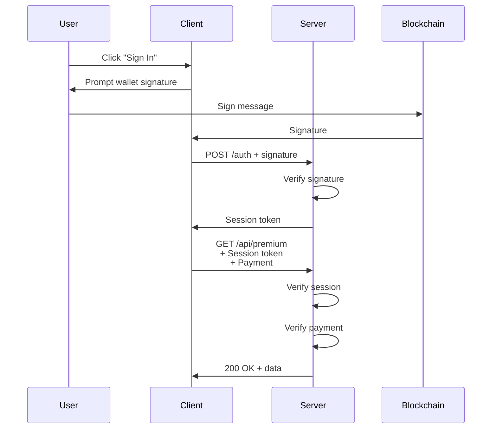

# Sign-in-with-X Extension (Coming Soon)

**Package**: `@x402/extensions/sign-in-with-x`
**Status**: Planned

Blockchain-based authentication extension integrating with x402 payment flows.

## Status

🚧 **Planned** - This extension is not yet implemented.

## Planned Features

- EIP-4361 (Sign-In with Ethereum) support
- Session token generation and validation
- Combined authentication + payment flows
- Multi-chain wallet authentication
- Session management utilities

## Expected Architecture



## Expected API

### Client-Side

```typescript
import { signInWithEthereum } from '@x402/extensions/sign-in-with-x';
import { createWalletClient } from 'viem';

const walletClient = createWalletClient({ /* ... */ });

// Sign in
const session = await signInWithEthereum(walletClient, {
  domain: 'example.com',
  uri: 'https://example.com',
  statement: 'Sign in to Example App'
});

// Use session with payments
const fetchWithAuth = wrapFetchWithPayment(fetch, {
  schemes: [{ network: 'eip155:*', client: evmClient }],
  session: session.token
});

const response = await fetchWithAuth('https://api.example.com/premium');
```

### Server-Side

```typescript
import { verifySignInMessage, createSession } from '@x402/extensions/sign-in-with-x';

app.post('/auth', async (req, res) => {
  const { message, signature } = req.body;

  // Verify EIP-4361 message
  const verified = await verifySignInMessage(message, signature);

  if (verified.valid) {
    // Create session
    const session = await createSession(verified.address, {
      expiresIn: '24h'
    });

    res.json({ token: session.token });
  } else {
    res.status(401).json({ error: 'Invalid signature' });
  }
});

// Middleware: verify session + payment
app.use('/api/premium', sessionMiddleware, paymentMiddleware);
```

## Integration with Payments

The extension combines authentication with payment requirements:

```typescript
// 402 response includes session requirements
{
  x402Version: 2,
  resource: { /* ... */ },
  accepts: [ /* ... */ ],
  extensions: {
    'session-tokens': {
      required: true,
      endpoint: '/auth',
      method: 'POST',
      format: 'EIP-4361'
    }
  }
}
```

## EIP-4361 Message Format

```
example.com wants you to sign in with your Ethereum account:
0x1234567890123456789012345678901234567890

Sign in to Example App

URI: https://example.com
Version: 1
Chain ID: 1
Nonce: 32891756
Issued At: 2024-01-01T00:00:00.000Z
```

## Session Token Structure

```typescript
{
  token: 'jwt_token_here',
  address: '0x...',
  chainId: 1,
  expiresAt: 1704067200,
  permissions: ['read', 'write']
}
```

## Use Cases

### 1. Gated Content

Require both authentication and payment:

```typescript
app.use('/api/premium', [
  sessionMiddleware,  // Verify user is authenticated
  paymentMiddleware   // Verify payment
]);
```

### 2. User-Specific Pricing

Offer discounts to authenticated users:

```typescript
const price = req.session?.address
  ? '$0.05'  // Discounted for logged-in users
  : '$0.10'; // Regular price

app.use(paymentMiddleware({
  'GET /api/data': {
    scheme: 'exact',
    payTo: '0x...',
    price,
    network: 'eip155:8453'
  }
}));
```

### 3. Usage Tracking

Track per-user API usage:

```typescript
app.use('/api/premium', sessionMiddleware, async (req, res, next) => {
  const address = req.session.address;
  await trackUsage(address, req.path);
  next();
}, paymentMiddleware);
```

## Security Considerations

### Message Replay Protection

- Nonce must be unique per sign-in attempt
- Issued At timestamp prevents old signatures
- Expiration time limits session duration

### Session Management

- Store sessions securely (Redis, database)
- Use HTTPS for token transmission
- Implement token rotation
- Allow session revocation

### Multi-Chain Support

- Verify chain ID in signature
- Allow multiple wallets per user
- Support chain-specific permissions

## Current Workaround

Until `@x402/extensions/sign-in-with-x` is available, implement custom authentication:

```typescript
import { verifyMessage } from 'viem';
import { generateNonce } from 'siwe';

// Generate sign-in message
app.get('/auth/message', (req, res) => {
  const nonce = generateNonce();
  const message = `Sign in to ${domain}\nNonce: ${nonce}`;

  res.json({ message, nonce });
});

// Verify signature
app.post('/auth/verify', async (req, res) => {
  const { message, signature, address } = req.body;

  const valid = await verifyMessage({
    address,
    message,
    signature
  });

  if (valid) {
    const token = jwt.sign({ address }, SECRET, { expiresIn: '24h' });
    res.json({ token });
  } else {
    res.status(401).json({ error: 'Invalid signature' });
  }
});
```

## Contributing

Interested in implementing this extension? See [Contributing Guide](../../08-architecture/contributing.md).

Key tasks:
- [ ] EIP-4361 message generation and verification
- [ ] Session token creation (JWT or custom format)
- [ ] Session storage and management
- [ ] Multi-chain support
- [ ] Express/HTTP adapter integration
- [ ] Client-side utilities
- [ ] Security best practices documentation
- [ ] Integration tests

## Related Documentation

- [Extensions Overview](./README.md) - Extension architecture
- [Bazaar Extension](./bazaar.md) - Discovery extension
- [EIP-4361 Specification](https://eips.ethereum.org/EIPS/eip-4361) - Sign-In with Ethereum
- [JWT](https://jwt.io/) - Session token format
