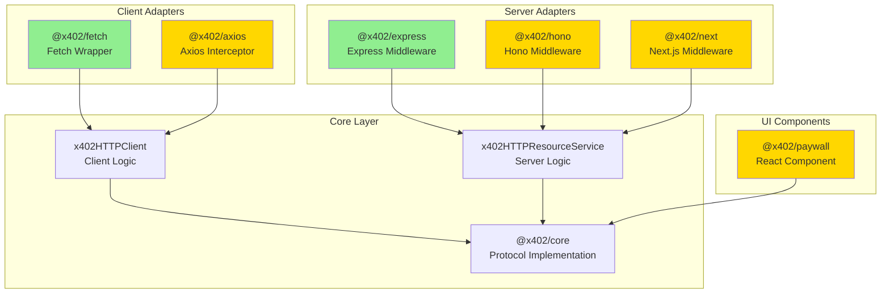

# HTTP Adapters

HTTP adapters provide framework-specific integrations for the x402 payment protocol. These packages wrap the core protocol implementation with convenient APIs for popular HTTP clients and server frameworks.

## Available Adapters

### Client Adapters

Client adapters automatically handle 402 Payment Required responses and retry requests with payment signatures.

| Package | Status | Description |
|---------|--------|-------------|
| [@x402/fetch](./fetch.md) | ✅ **Stable** | Native Fetch API wrapper |
| [@x402/axios](./axios.md) | 🚧 **Planned** | Axios interceptor integration |

### Server Adapters

Server adapters provide middleware for protecting endpoints with payment requirements.

| Package | Status | Description |
|---------|--------|-------------|
| [@x402/express](./express.md) | ✅ **Stable** | Express.js middleware |
| [@x402/hono](./hono.md) | 🚧 **Planned** | Hono framework middleware |
| [@x402/next](./next.md) | 🚧 **Planned** | Next.js route protection |

### UI Components

| Package | Status | Description |
|---------|--------|-------------|
| [@x402/paywall](./paywall.md) | 🚧 **Planned** | React paywall component |

## Architecture



## Quick Start

### Client-Side (Fetch)

```typescript
import { wrapFetchWithPayment } from '@x402/fetch';
import { ExactEvmClient } from '@x402/evm';
import { privateKeyToAccount } from 'viem/accounts';

const account = privateKeyToAccount('0x...');

const fetchWithPayment = wrapFetchWithPayment(fetch, {
  schemes: [
    {
      network: 'eip155:*',
      client: new ExactEvmClient(account)
    }
  ]
});

// Automatically handles 402 responses
const response = await fetchWithPayment('https://api.example.com/data');
const data = await response.json();
```

### Server-Side (Express)

```typescript
import express from 'express';
import { paymentMiddleware } from '@x402/express';
import { ExactEvmService } from '@x402/evm';

const app = express();

app.use(paymentMiddleware(
  {
    'GET /api/data': {
      scheme: 'exact',
      payTo: '0x742d35Cc6634C0532925a3b844Bc9e7595f0bEb',
      price: '$0.10',
      network: 'eip155:8453',
      description: 'Premium API data'
    }
  },
  undefined, // Use default facilitator
  [{ network: 'eip155:8453', server: new ExactEvmService() }]
));

app.get('/api/data', (req, res) => {
  res.json({ message: 'Protected data' });
});
```

## Choosing an Adapter

### For Clients

**Use @x402/fetch if:**
- You're using modern JavaScript/TypeScript
- You want a simple, lightweight solution
- You're building for browser or Node.js 18+

**Use @x402/axios if:** (Coming Soon)
- You're already using Axios in your project
- You need advanced request configuration
- You want interceptor-based architecture

### For Servers

**Use @x402/express if:**
- You're building a Node.js REST API
- You want mature, battle-tested middleware
- You need extensive ecosystem support

**Use @x402/hono if:** (Coming Soon)
- You're building edge-native applications
- You need minimal bundle size
- You're deploying to Cloudflare Workers, Deno, or Bun

**Use @x402/next if:** (Coming Soon)
- You're building a Next.js application
- You want seamless App Router integration
- You need SSR/SSG support

## Adapter Design Principles

### 1. Framework-Native Experience

Adapters use patterns familiar to each framework:

```typescript
// Express: Middleware pattern
app.use(paymentMiddleware(routes));

// Hono: Middleware pattern (Coming Soon)
app.use(paymentMiddleware(routes));

// Next.js: Route handlers (Coming Soon)
export default withPayment(handler, config);
```

### 2. Minimal Configuration

Adapters require only essential configuration:

```typescript
// Client: Just schemes
wrapFetchWithPayment(fetch, { schemes: [...] });

// Server: Just routes
paymentMiddleware({ 'GET /path': { ...config } });
```

### 3. Full Protocol Support

All adapters support:
- Multiple payment schemes (EVM, Solana, custom)
- Multiple networks per scheme
- Custom facilitators
- Payment requirement selection

### 4. Type Safety

All adapters provide full TypeScript types:

```typescript
import type {
  SchemeRegistration,
  PaymentRequired,
  PaymentPayload
} from '@x402/fetch';
```

## Common Patterns

### Client-Side Error Handling

```typescript
const fetchWithPayment = wrapFetchWithPayment(fetch, {
  schemes: [
    { network: 'eip155:*', client: evmClient }
  ]
});

try {
  const response = await fetchWithPayment(url);
  if (!response.ok) {
    if (response.status === 402) {
      // Payment failed or not supported
      console.error('Payment required but failed');
    }
    throw new Error(`HTTP ${response.status}`);
  }
  const data = await response.json();
} catch (error) {
  console.error('Request failed:', error);
}
```

### Server-Side Route Protection

```typescript
// Protect specific routes
app.use(paymentMiddleware({
  'GET /premium/*': { /* paid */ },
  'POST /api/expensive': { /* paid */ }
}));

// Free routes still work
app.get('/free', (req, res) => {
  res.json({ message: 'No payment required' });
});
```

### Multi-Network Support

```typescript
// Client: Support both EVM and Solana
wrapFetchWithPayment(fetch, {
  schemes: [
    { network: 'eip155:*', client: evmClient },
    { network: 'solana:*', client: solanaClient }
  ]
});

// Server: Accept payments on multiple networks
paymentMiddleware(
  {
    'GET /api/data': {
      scheme: 'exact',
      payTo: '0x...',
      price: '$0.10',
      network: 'eip155:8453'
    }
  },
  undefined,
  [
    { network: 'eip155:8453', server: new ExactEvmService() },
    { network: 'solana:mainnet', server: new SolanaService() }
  ]
);
```

## Performance Considerations

### Client-Side

- Minimal overhead: Single extra request only on 402 responses
- No polling: Synchronous payment creation
- Efficient caching: Payment signatures are single-use

### Server-Side

- Lazy initialization: Server starts immediately, initializes facilitators async
- Connection pooling: Reuses HTTP connections to facilitators
- No blocking: Payment verification is async

## Testing

### Mock Facilitators

```typescript
import { x402Facilitator } from '@x402/core/facilitator';

class MockFacilitator implements SchemeNetworkFacilitator {
  async verify() {
    return { isValid: true, payer: '0x...' };
  }
  async settle() {
    return {
      success: true,
      transaction: '0x...',
      network: 'eip155:8453'
    };
  }
}

// Use in tests
const facilitator = new x402Facilitator();
facilitator.registerScheme('eip155:8453', new MockFacilitator());
```

### Integration Tests

```typescript
import { wrapFetchWithPayment } from '@x402/fetch';

describe('Payment Flow', () => {
  it('should handle 402 and retry with payment', async () => {
    const fetch = wrapFetchWithPayment(globalThis.fetch, {
      schemes: [{ network: 'eip155:8453', client: mockClient }]
    });

    const response = await fetch('http://localhost:3000/protected');
    expect(response.status).toBe(200);

    const settlement = decodePaymentResponseHeader(
      response.headers.get('PAYMENT-RESPONSE')!
    );
    expect(settlement.success).toBe(true);
  });
});
```

## Migration Guides

### From Body-Based to Header-Based

The v2 protocol uses headers instead of request bodies:

```typescript
// V1 (Legacy) - Body-based
fetch(url, {
  method: 'POST',
  body: JSON.stringify({ payment: { ... } })
});

// V2 - Header-based
fetch(url, {
  method: 'GET',  // Can use GET now!
  headers: {
    'PAYMENT-SIGNATURE': '...'
  }
});
```

Adapters handle this automatically.

### From Custom Implementation

If you built custom payment handling:

```typescript
// Before: Custom implementation
async function makeRequest(url) {
  let response = await fetch(url);
  if (response.status === 402) {
    const payment = await createPayment(response);
    response = await fetch(url, {
      headers: { 'PAYMENT': payment }
    });
  }
  return response;
}

// After: Use adapter
const fetchWithPayment = wrapFetchWithPayment(fetch, { schemes });
const response = await fetchWithPayment(url);
```

## Related Documentation

- [@x402/core](../core/README.md) - Core protocol implementation
- [@x402/evm](../mechanisms/evm.md) - Ethereum payment mechanisms
- [@x402/svm](../mechanisms/svm.md) - Solana payment mechanisms

## Contributing

To add a new adapter:

1. Implement the `HTTPAdapter` interface (server) or wrap `x402HTTPClient` (client)
2. Follow the framework's idioms and patterns
3. Provide comprehensive TypeScript types
4. Include examples and tests
5. Update this README

See [Contributing Guide](../../08-architecture/contributing.md) for details.
