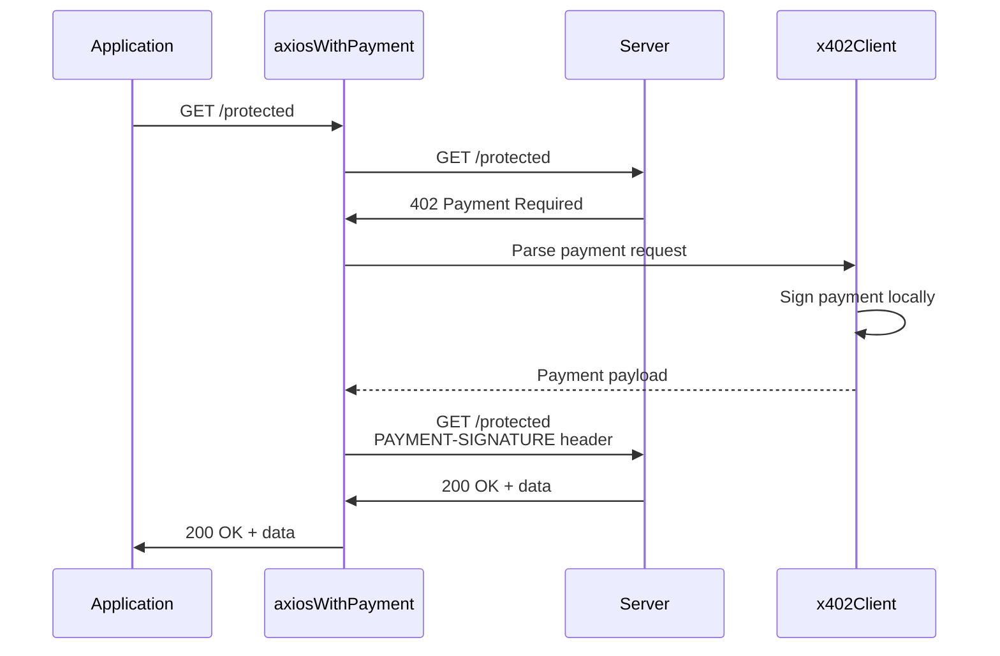

<!-- VERIFIED: 0aa62c64 -->
# @x402/axios

Axios adapter that wraps an Axios instance with automatic x402 payment handling.

## Installation

```bash
pnpm add @x402/axios @x402/evm viem axios
```

## Quick Start

```typescript
import { x402Client } from "@x402/core/client";
import { registerExactEvmScheme } from "@x402/evm/exact/client";
import { wrapAxiosWithPayment } from "@x402/axios";
import { privateKeyToAccount } from "viem/accounts";
import axios from "axios";

const account = privateKeyToAccount(process.env.PRIVATE_KEY as `0x${string}`);
const client = new x402Client();
registerExactEvmScheme(client, { signer: account });

const axiosWithPayment = wrapAxiosWithPayment(axios, client);

// Use like normal axios - payment happens automatically
const response = await axiosWithPayment.get("http://server/protected");
console.log(response.data);
```

## Payment Flow



The wrapper:
1. Intercepts all HTTP responses
2. Detects 402 Payment Required status codes
3. Extracts payment requirements from headers
4. Uses the x402 client to create and sign payment locally
5. Retries the original request with `PAYMENT-SIGNATURE` header
6. Returns the successful response to the caller

## wrapAxiosWithPayment

Wraps an Axios instance with automatic x402 payment handling.

```typescript
function wrapAxiosWithPayment(
  axiosInstance: AxiosInstance,
  client: x402Client
): AxiosInstance
```

**Parameters:**

- `axiosInstance` - The Axios instance to wrap (can be default axios or custom instance)
- `client` - Configured x402 client with registered payment schemes

**Returns:**

An Axios instance that automatically handles 402 Payment Required responses.

## Usage Examples

### GET Request

```typescript
const response = await axiosWithPayment.get("http://server/api/data");
console.log(response.data);
```

### POST Request

```typescript
const response = await axiosWithPayment.post(
  "http://server/api/submit",
  { key: "value" }
);
console.log(response.data);
```

### With Axios Config

```typescript
const response = await axiosWithPayment.get("http://server/api/data", {
  headers: {
    "Custom-Header": "value"
  },
  timeout: 5000
});
```

### Using Custom Axios Instance

```typescript
const customAxios = axios.create({
  baseURL: "http://server",
  timeout: 10000,
  headers: {
    "User-Agent": "my-app"
  }
});

const wrappedAxios = wrapAxiosWithPayment(customAxios, client);

// All custom config is preserved
const response = await wrappedAxios.get("/api/data");
```

### With Interceptors

The wrapped axios instance preserves all Axios features including interceptors:

```typescript
const axiosWithPayment = wrapAxiosWithPayment(axios, client);

// Add custom interceptors
axiosWithPayment.interceptors.request.use(config => {
  console.log("Making request:", config.url);
  return config;
});

axiosWithPayment.interceptors.response.use(response => {
  console.log("Received response:", response.status);
  return response;
});

const response = await axiosWithPayment.get("http://server/protected");
```

## Error Handling

```typescript
try {
  const response = await axiosWithPayment.get("http://server/protected");
  console.log(response.data);
} catch (error) {
  if (axios.isAxiosError(error)) {
    if (error.response?.status === 402) {
      console.error("Payment failed:", error.message);
    } else {
      console.error("Request failed:", error.message);
    }
  }
}
```

## TypeScript Support

The wrapper maintains full TypeScript support:

```typescript
interface ApiResponse {
  data: string;
  timestamp: number;
}

const response = await axiosWithPayment.get<ApiResponse>(
  "http://server/api/data"
);

// response.data is typed as ApiResponse
console.log(response.data.timestamp);
```

## Key Points

- Works with all Axios features (interceptors, config, etc.)
- Client signs payments locally without contacting a facilitator
- All Axios methods (get, post, put, delete, etc.) are preserved
- Original request config is preserved in the retry

## Next Steps

- [Client Module](../core/client.md) - x402 client configuration
- [@x402/fetch](./fetch.md) - Fetch API adapter
- [@x402/evm](../mechanisms/evm.md) - EVM payment scheme
