# @x402/express

Express.js middleware for protecting routes with x402 payment requirements.

## Overview

`@x402/express` provides middleware that automatically protects Express routes with payment requirements. The middleware:

1. Intercepts requests to protected routes
2. Checks for payment headers
3. Verifies payments through facilitators
4. Settles payments on-chain after successful responses
5. Returns 402 responses for unpaid/invalid requests

## Installation

```bash
npm install @x402/express @x402/core express
# Also install payment mechanism(s)
npm install @x402/evm  # For Ethereum payments
```

## Dependencies

- `@x402/core` - Core protocol implementation
- `express` - Express.js framework (peer dependency)
- `zod` - Runtime validation

## Basic Usage

```typescript
import express from 'express';
import { paymentMiddleware } from '@x402/express';
import { ExactEvmService } from '@x402/evm';

const app = express();

// Apply payment middleware
app.use(paymentMiddleware(
  {
    'GET /api/premium': {
      scheme: 'exact',
      payTo: '0x742d35Cc6634C0532925a3b844Bc9e7595f0bEb',
      price: '$0.10',
      network: 'eip155:8453',
      description: 'Premium API endpoint',
      mimeType: 'application/json'
    }
  },
  undefined,  // Use default facilitator
  [{ network: 'eip155:8453', server: new ExactEvmService() }]
));

// Define protected route
app.get('/api/premium', (req, res) => {
  res.json({ message: 'Premium data', timestamp: Date.now() });
});

// Free routes still work
app.get('/api/free', (req, res) => {
  res.json({ message: 'Free data' });
});

app.listen(3000);
```

## API Reference

### paymentMiddleware()

Creates Express middleware for payment-protected routes.

```typescript
function paymentMiddleware(
  routes: RoutesConfig,
  facilitatorClients?: FacilitatorClient | FacilitatorClient[],
  schemes?: SchemeRegistration[],
  paywallConfig?: PaywallConfig,
  initializeOnStart?: boolean
): express.RequestHandler
```

#### Parameters

**routes**: Route configurations defining which endpoints require payment

```typescript
type RoutesConfig = Record<string, RouteConfig> | RouteConfig;

interface RouteConfig {
  scheme: string;              // e.g., 'exact'
  payTo: string;               // Payment recipient address
  price: Price;                // e.g., '$0.10' or { amount: '100000', asset: 'USDC' }
  network: Network;            // e.g., 'eip155:8453'
  maxTimeoutSeconds?: number;  // Default: 300

  // Optional HTTP metadata
  resource?: string;
  description?: string;
  mimeType?: string;
  customPaywallHtml?: string;
  discoverable?: boolean;
  inputSchema?: any;
  outputSchema?: any;
}
```

**facilitatorClients** (optional): Facilitator client(s) for payment processing
- Type: `FacilitatorClient | FacilitatorClient[]`
- Default: Uses `https://x402.org/facilitator`

**schemes** (optional): Payment scheme implementations for the server

```typescript
interface SchemeRegistration {
  network: Network;
  server: SchemeNetworkService;
}
```

**paywallConfig** (optional): Configuration for browser paywall UI

```typescript
interface PaywallConfig {
  cdpClientKey?: string;
  appName?: string;
  appLogo?: string;
  sessionTokenEndpoint?: string;
  currentUrl?: string;
  testnet?: boolean;
}
```

**initializeOnStart** (optional): Whether to initialize facilitators on startup
- Type: `boolean`
- Default: `true`

#### Returns

Express middleware function compatible with `app.use()`, `app.get()`, etc.

## Route Configuration

### Single Route

```typescript
app.use(paymentMiddleware(
  {
    'GET /premium/data': {
      scheme: 'exact',
      payTo: '0x...',
      price: '$0.10',
      network: 'eip155:8453'
    }
  },
  undefined,
  schemes
));
```

### Multiple Routes

```typescript
app.use(paymentMiddleware(
  {
    'GET /api/data': {
      scheme: 'exact',
      payTo: '0x...',
      price: '$0.10',
      network: 'eip155:8453',
      description: 'API data access'
    },
    'POST /api/compute': {
      scheme: 'exact',
      payTo: '0x...',
      price: '$1.00',
      network: 'eip155:8453',
      description: 'Heavy computation'
    },
    '/premium/*': {
      scheme: 'exact',
      payTo: '0x...',
      price: '$0.50',
      network: 'eip155:8453',
      description: 'Premium content'
    }
  },
  undefined,
  schemes
));
```

### Route Patterns

```typescript
// Method + path
'GET /api/users'
'POST /api/compute'

// Any method
'/api/data'

// Wildcards
'/premium/*'
'/api/*/data'

// Parameters
'/api/[id]'
'/users/[userId]/posts'
```

## Complete Example

```typescript
import express from 'express';
import { paymentMiddleware } from '@x402/express';
import { HTTPFacilitatorClient } from '@x402/core/server';
import { ExactEvmService } from '@x402/evm';

const app = express();

// Configure facilitator
const facilitator = new HTTPFacilitatorClient({
  url: process.env.FACILITATOR_URL || 'https://x402.org/facilitator'
});

// Configure payment schemes
const schemes = [
  {
    network: 'eip155:8453',  // Base
    server: new ExactEvmService()
  }
];

// Apply middleware
app.use(paymentMiddleware(
  {
    'GET /api/premium/analytics': {
      scheme: 'exact',
      payTo: '0x742d35Cc6634C0532925a3b844Bc9e7595f0bEb',
      price: '$0.25',
      network: 'eip155:8453',
      description: 'Premium analytics data',
      mimeType: 'application/json'
    },
    'POST /api/premium/compute': {
      scheme: 'exact',
      payTo: '0x742d35Cc6634C0532925a3b844Bc9e7595f0bEb',
      price: '$2.00',
      network: 'eip155:8453',
      description: 'Heavy computation endpoint',
      mimeType: 'application/json'
    },
    '/premium/*': {
      scheme: 'exact',
      payTo: '0x742d35Cc6634C0532925a3b844Bc9e7595f0bEb',
      price: '$0.50',
      network: 'eip155:8453',
      description: 'Premium content',
      mimeType: 'application/json'
    }
  },
  facilitator,
  schemes,
  {
    appName: 'My Premium API',
    appLogo: 'https://example.com/logo.png',
    testnet: process.env.NODE_ENV === 'development'
  }
));

// Protected routes
app.get('/api/premium/analytics', (req, res) => {
  res.json({
    users: 1500,
    revenue: 25000,
    growth: 0.15
  });
});

app.post('/api/premium/compute', express.json(), (req, res) => {
  // Expensive computation
  const result = performComputation(req.body);
  res.json({ result });
});

// Free routes
app.get('/api/free/data', (req, res) => {
  res.json({ message: 'Free access' });
});

app.listen(3000, () => {
  console.log('Server running on http://localhost:3000');
});
```

## Payment Flow

```mermaid
sequenceDiagram
    participant Client
    participant Middleware as Payment Middleware
    participant Handler as Route Handler
    participant Facilitator

    Client->>Middleware: GET /premium

    alt No payment header
        Middleware->>Client: 402 Payment Required
    else Has payment header
        Middleware->>Facilitator: Verify payment
        Facilitator->>Middleware: ✓ Valid

        Middleware->>Handler: next()
        Handler->>Middleware: Response

        alt Response >= 400
            Middleware->>Client: Error response<br/>(no settlement)
        else Response < 400
            Middleware->>Facilitator: Settle payment
            Facilitator->>Middleware: Transaction hash
            Middleware->>Client: 200 OK + data<br/>PAYMENT-RESPONSE header
        end
    end
```



## Advanced Usage

### Custom Facilitator

```typescript
const facilitator = new HTTPFacilitatorClient({
  url: 'https://my-facilitator.example.com',
  createAuthHeaders: async () => {
    const token = await getAuthToken();
    return {
      verify: { 'Authorization': `Bearer ${token}` },
      settle: { 'Authorization': `Bearer ${token}` },
      supported: { 'Authorization': `Bearer ${token}` }
    };
  }
});

app.use(paymentMiddleware(routes, facilitator, schemes));
```

### Multiple Facilitators

```typescript
app.use(paymentMiddleware(
  routes,
  [
    new HTTPFacilitatorClient({ url: 'https://primary.example.com' }),
    new HTTPFacilitatorClient({ url: 'https://fallback.example.com' })
  ],
  schemes
));
```

### Manual Initialization

```typescript
const middleware = paymentMiddleware(
  routes,
  facilitator,
  schemes,
  undefined,
  false  // Don't initialize on start
);

// Initialize manually
await middleware._service.initialize();

app.use(middleware);
```

### Custom Paywall HTML

```typescript
app.use(paymentMiddleware(
  {
    'GET /premium': {
      scheme: 'exact',
      payTo: '0x...',
      price: '$0.10',
      network: 'eip155:8453',
      customPaywallHtml: `
        <!DOCTYPE html>
        <html>
          <head><title>Payment Required</title></head>
          <body>
            <h1>Custom Paywall</h1>
            <p>Please pay to access this content.</p>
          </body>
        </html>
      `
    }
  },
  undefined,
  schemes
));
```

### TypeScript Types

```typescript
import type {
  PaymentRequired,
  PaymentPayload,
  SchemeRegistration,
  Network
} from '@x402/express';

const routes: Record<string, RouteConfig> = {
  'GET /premium': {
    scheme: 'exact',
    payTo: '0x...',
    price: '$0.10',
    network: 'eip155:8453' as Network
  }
};
```

## Error Handling

### Middleware Errors

```typescript
app.use(paymentMiddleware(routes, facilitator, schemes));

// Error handler
app.use((err, req, res, next) => {
  console.error('Error:', err);
  res.status(500).json({ error: 'Internal server error' });
});
```

### Settlement Errors

If settlement fails, the middleware:
1. Logs the error to console
2. Returns 402 if response not sent
3. Allows response if already sent

```typescript
// Monitor settlement failures
app.use((req, res, next) => {
  const originalJson = res.json.bind(res);
  res.json = function (body) {
    console.log('Response:', res.statusCode, body);
    return originalJson(body);
  };
  next();
});
```

## Browser vs API Clients

The middleware detects request type and responds accordingly:

**Browser Requests** (Accept: text/html):
```html
<!DOCTYPE html>
<html>
  <head><title>Payment Required</title></head>
  <body>
    <h1>Payment Required</h1>
    <p>Amount: $0.10 USDC</p>
    <!-- Payment widget -->
  </body>
</html>
```

**API Requests** (Accept: application/json):
```
Status: 402 Payment Required
Headers:
  PAYMENT-REQUIRED: base64encoded...
```

## Testing

### Integration Tests

```typescript
import request from 'supertest';
import express from 'express';
import { paymentMiddleware } from '@x402/express';

describe('Payment Middleware', () => {
  const app = express();

  app.use(paymentMiddleware(
    { 'GET /protected': { /* config */ } },
    mockFacilitator,
    schemes
  ));

  app.get('/protected', (req, res) => {
    res.json({ data: 'success' });
  });

  it('should return 402 without payment', async () => {
    const response = await request(app).get('/protected');
    expect(response.status).toBe(402);
    expect(response.headers['payment-required']).toBeDefined();
  });

  it('should allow access with valid payment', async () => {
    const response = await request(app)
      .get('/protected')
      .set('PAYMENT-SIGNATURE', validPaymentHeader);

    expect(response.status).toBe(200);
    expect(response.body.data).toBe('success');
    expect(response.headers['payment-response']).toBeDefined();
  });
});
```

### Mock Facilitator

```typescript
import { FacilitatorClient } from '@x402/core/server';

class MockFacilitator implements FacilitatorClient {
  async verify() {
    return { isValid: true, payer: '0x...' };
  }

  async settle() {
    return {
      success: true,
      transaction: '0xmock...',
      network: 'eip155:8453' as Network,
      payer: '0x...'
    };
  }

  async getSupported() {
    return {
      kinds: [{
        x402Version: 2,
        scheme: 'exact',
        network: 'eip155:8453' as Network
      }],
      extensions: []
    };
  }
}
```

## Performance

- **Lazy initialization**: Server starts immediately, facilitators initialize async
- **No blocking**: All payment operations are async
- **Minimal overhead**: Free routes have zero payment processing
- **Connection reuse**: HTTP clients pool connections to facilitators

## Security

- **Payment verification**: All payments verified before access
- **Settlement after success**: Payments only settled if route handler succeeds (< 400 status)
- **No refunds**: Failed requests (>= 400) do not settle payments
- **Signature validation**: EIP-712 signatures validated by facilitator

## Migration from V1

V1 middleware checked request body, V2 checks headers:

```typescript
// V1 (legacy, not supported)
// Used req.body for payment

// V2 (current)
app.use(paymentMiddleware(routes, facilitator, schemes));
// Uses req.headers['payment-signature']
```

## Common Patterns

### Tiered Pricing

```typescript
app.use(paymentMiddleware({
  'GET /api/basic': {
    scheme: 'exact',
    payTo: '0x...',
    price: '$0.05',
    network: 'eip155:8453'
  },
  'GET /api/premium': {
    scheme: 'exact',
    payTo: '0x...',
    price: '$0.25',
    network: 'eip155:8453'
  },
  'GET /api/enterprise': {
    scheme: 'exact',
    payTo: '0x...',
    price: '$2.00',
    network: 'eip155:8453'
  }
}, undefined, schemes));
```

### Per-Request Pricing

```typescript
app.use(paymentMiddleware({
  'POST /api/compute': {
    scheme: 'exact',
    payTo: '0x...',
    price: '$1.00',  // Base price
    network: 'eip155:8453'
  }
}, undefined, schemes));

app.post('/api/compute', (req, res) => {
  // Adjust response based on computation complexity
  // (Price already paid, this is for analytics)
  const complexity = calculateComplexity(req.body);
  const result = compute(req.body);
  res.json({ result, complexity });
});
```

## Related Documentation

- [x402HTTPResourceService](../core/http-server.md) - Underlying server implementation
- [EVM Server](../mechanisms/evm.md#server) - Ethereum payment server
- [Protocol Flow](../../02-protocol-flows/happy-path.md) - Complete protocol flow
- [Testing Guide](../../05-testing-and-debugging/testing.md) - Testing strategies
