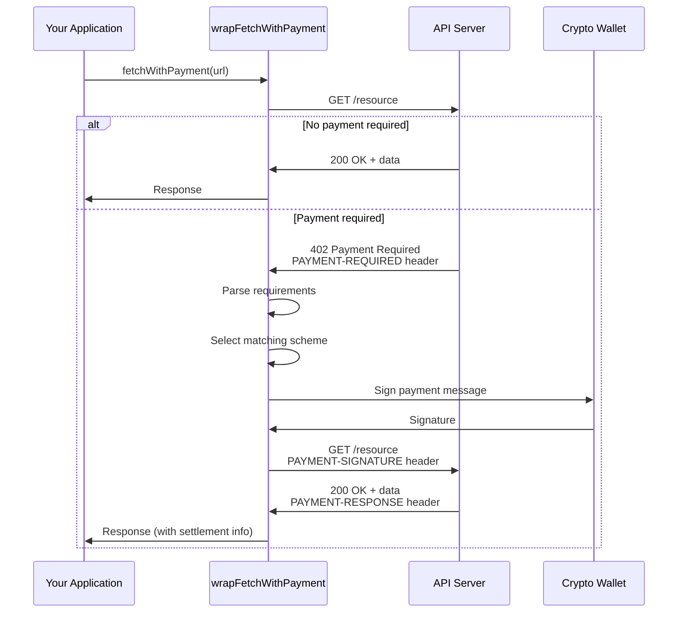

# @x402/fetch

Native Fetch API wrapper that automatically handles x402 payment requirements.

## Overview

`@x402/fetch` wraps the standard `fetch` function to transparently handle 402 Payment Required responses. When a protected resource requires payment, the wrapper:

1. Intercepts the 402 response
2. Parses payment requirements
3. Creates a payment signature
4. Retries the request with payment

This provides a seamless payment experience with zero changes to your existing fetch calls.

## Installation

```bash
npm install @x402/fetch @x402/core
# Also install payment mechanism(s)
npm install @x402/evm  # For Ethereum payments
# or
npm install @x402/svm  # For Solana payments
```

## Dependencies

- `@x402/core` - Core protocol implementation
- `viem` -  Ethereum library (peer dependency)
- `zod` - Runtime validation

## Basic Usage

```typescript
import { wrapFetchWithPayment } from '@x402/fetch';
import { ExactEvmClient } from '@x402/evm';
import { privateKeyToAccount } from 'viem/accounts';

// Setup wallet
const account = privateKeyToAccount(process.env.PRIVATE_KEY as `0x${string}`);

// Wrap fetch with payment handling
const fetchWithPayment = wrapFetchWithPayment(fetch, {
  schemes: [
    {
      network: 'eip155:*',  // All EVM chains
      client: new ExactEvmClient(account)
    }
  ]
});

// Use like normal fetch - payments handled automatically
const response = await fetchWithPayment('https://api.example.com/premium/data');
const data = await response.json();

// Check settlement information
import { decodePaymentResponseHeader } from '@x402/fetch';

const settlementHeader = response.headers.get('PAYMENT-RESPONSE');
if (settlementHeader) {
  const settlement = decodePaymentResponseHeader(settlementHeader);
  console.log('Transaction:', settlement.transaction);
  console.log('Network:', settlement.network);
}
```

## API Reference

### wrapFetchWithPayment()

Wraps a fetch function with payment handling capability.

```typescript
function wrapFetchWithPayment(
  fetch: typeof globalThis.fetch,
  config: FetchWrapperConfig
): typeof globalThis.fetch
```

#### Parameters

**fetch**: The fetch function to wrap (typically `globalThis.fetch` or `window.fetch`)

**config**: Configuration object with the following properties:

```typescript
interface FetchWrapperConfig {
  schemes: SchemeRegistration[];
  paymentRequirementsSelector?: SelectPaymentRequirements;
}

interface SchemeRegistration {
  network: Network;              // e.g., 'eip155:8453', 'eip155:*'
  client: SchemeNetworkClient;   // Payment scheme implementation
  x402Version?: number;          // Default: 2
}

type SelectPaymentRequirements = (
  x402Version: number,
  paymentRequirements: PaymentRequirements[]
) => PaymentRequirements;
```

#### Returns

A wrapped fetch function with the same signature as the original.

#### Throws

- `Error` if no schemes are provided
- `Error` if payment requirements cannot be parsed
- `Error` if payment payload creation fails
- `Error` if a payment retry is attempted twice (prevents infinite loops)

## Configuration Examples

### Single Network

```typescript
const fetchWithPayment = wrapFetchWithPayment(fetch, {
  schemes: [
    {
      network: 'eip155:8453',  // Base mainnet only
      client: new ExactEvmClient(account)
    }
  ]
});
```

### Multiple Networks (Wildcard)

```typescript
const fetchWithPayment = wrapFetchWithPayment(fetch, {
  schemes: [
    {
      network: 'eip155:*',  // All EVM chains
      client: new ExactEvmClient(account)
    }
  ]
});
```

### Multiple Payment Mechanisms

```typescript
import { ExactEvmClient } from '@x402/evm';
import { SolanaClient } from '@x402/svm';

const fetchWithPayment = wrapFetchWithPayment(fetch, {
  schemes: [
    {
      network: 'eip155:*',
      client: new ExactEvmClient(evmAccount)
    },
    {
      network: 'solana:mainnet',
      client: new SolanaClient(solanaWallet)
    }
  ]
});
```

### Custom Payment Selection

By default, the wrapper selects the first available payment option. Provide a custom selector for different behavior:

```typescript
const fetchWithPayment = wrapFetchWithPayment(fetch, {
  schemes: [...],
  paymentRequirementsSelector: (x402Version, accepts) => {
    // Prefer lowest cost option
    return accepts.reduce((min, curr) =>
      parseFloat(curr.amount) < parseFloat(min.amount) ? curr : min
    );
  }
});
```

## Payment Flow



## Advanced Usage

### Error Handling

```typescript
try {
  const response = await fetchWithPayment(url);

  if (!response.ok) {
    if (response.status === 402) {
      console.error('Payment required but failed');
      // Possible reasons:
      // - Insufficient balance
      // - Unsupported network
      // - Invalid signature
    }
    throw new Error(`HTTP ${response.status}: ${response.statusText}`);
  }

  const data = await response.json();
} catch (error) {
  if (error.message.includes('No network/scheme registered')) {
    console.error('Cannot pay - unsupported payment method');
  } else if (error.message.includes('Failed to create payment payload')) {
    console.error('Payment creation failed:', error);
  } else {
    console.error('Request failed:', error);
  }
}
```

### Extracting Settlement Information

```typescript
import { decodePaymentResponseHeader } from '@x402/fetch';

const response = await fetchWithPayment(url);

if (response.ok) {
  const settlementHeader = response.headers.get('PAYMENT-RESPONSE');

  if (settlementHeader) {
    const settlement = decodePaymentResponseHeader(settlementHeader);

    console.log('Payment settled:', {
      success: settlement.success,
      transaction: settlement.transaction,
      network: settlement.network,
      payer: settlement.payer
    });

    // Store transaction reference
    await db.payments.create({
      txHash: settlement.transaction,
      network: settlement.network,
      amount: '0.10',
      timestamp: new Date()
    });
  }
}
```

### TypeScript Types

```typescript
import type {
  SchemeRegistration,
  FetchWrapperConfig,
  SelectPaymentRequirements,
  PaymentRequired,
  PaymentPayload,
  Network
} from '@x402/fetch';

// Type-safe configuration
const config: FetchWrapperConfig = {
  schemes: [
    {
      network: 'eip155:8453',
      client: evmClient
    }
  ]
};

// Type-safe selector
const selector: SelectPaymentRequirements = (version, accepts) => {
  return accepts[0];
};
```

### Request Configuration

The wrapped fetch supports all standard fetch options:

```typescript
// POST with payment
const response = await fetchWithPayment(url, {
  method: 'POST',
  headers: {
    'Content-Type': 'application/json',
    'Authorization': 'Bearer token'
  },
  body: JSON.stringify({ query: 'data' })
});

// With abort controller
const controller = new AbortController();
const response = await fetchWithPayment(url, {
  signal: controller.signal
});

// With timeout
const response = await fetchWithPayment(url, {
  signal: AbortSignal.timeout(5000)
});
```

## Complete Example

```typescript
import { wrapFetchWithPayment, decodePaymentResponseHeader } from '@x402/fetch';
import { ExactEvmClient } from '@x402/evm';
import { privateKeyToAccount } from 'viem/accounts';

// Configuration
const account = privateKeyToAccount(process.env.PRIVATE_KEY as `0x${string}`);

const fetchWithPayment = wrapFetchWithPayment(fetch, {
  schemes: [
    {
      network: 'eip155:*',
      client: new ExactEvmClient(account)
    }
  ],
  paymentRequirementsSelector: (version, accepts) => {
    // Filter out expensive options
    const affordable = accepts.filter(req =>
      parseFloat(req.amount) <= 1000000 // Max $1.00 USDC
    );
    return affordable[0] || accepts[0];
  }
});

// Usage function
async function fetchPremiumData(endpoint: string) {
  try {
    const response = await fetchWithPayment(
      `https://api.example.com${endpoint}`,
      {
        headers: {
          'Accept': 'application/json'
        }
      }
    );

    if (!response.ok) {
      throw new Error(`HTTP ${response.status}: ${response.statusText}`);
    }

    const data = await response.json();

    // Extract settlement info
    const settlementHeader = response.headers.get('PAYMENT-RESPONSE');
    if (settlementHeader) {
      const settlement = decodePaymentResponseHeader(settlementHeader);
      console.log('Paid via transaction:', settlement.transaction);
    }

    return data;
  } catch (error) {
    console.error('Failed to fetch premium data:', error);
    throw error;
  }
}

// Use
const data = await fetchPremiumData('/premium/analytics');
console.log('Data:', data);
```

## Browser Support

`@x402/fetch` works in any environment with native `fetch` support:

- Modern browsers (Chrome 42+, Firefox 39+, Safari 10.1+, Edge 14+)
- Node.js 18+
- Deno
- Bun
- Cloudflare Workers
- Service Workers

For older environments, use a fetch polyfill:

```typescript
import fetch from 'node-fetch';  // Node.js < 18
import { wrapFetchWithPayment } from '@x402/fetch';

const fetchWithPayment = wrapFetchWithPayment(fetch as any, config);
```

## Testing

### Mock Responses

```typescript
import { wrapFetchWithPayment } from '@x402/fetch';

// Mock fetch
const mockFetch = vi.fn();

mockFetch
  .mockResolvedValueOnce({
    status: 402,
    headers: new Headers({
      'PAYMENT-REQUIRED': 'base64encoded...'
    })
  })
  .mockResolvedValueOnce({
    status: 200,
    headers: new Headers({
      'PAYMENT-RESPONSE': 'base64encoded...'
    }),
    json: () => Promise.resolve({ data: 'success' })
  });

const fetchWithPayment = wrapFetchWithPayment(mockFetch, {
  schemes: [{ network: 'eip155:8453', client: mockClient }]
});

const response = await fetchWithPayment(url);
expect(response.status).toBe(200);
```

### Integration Tests

```typescript
import { wrapFetchWithPayment } from '@x402/fetch';
import { ExactEvmClient } from '@x402/evm';
import { privateKeyToAccount } from 'viem/accounts';

describe('Payment Flow', () => {
  const testAccount = privateKeyToAccount('0x...');

  it('should handle 402 and complete payment', async () => {
    const fetchWithPayment = wrapFetchWithPayment(fetch, {
      schemes: [
        {
          network: 'eip155:84532',  // Base Sepolia testnet
          client: new ExactEvmClient(testAccount)
        }
      ]
    });

    const response = await fetchWithPayment(
      'http://localhost:3000/protected'
    );

    expect(response.status).toBe(200);
    expect(response.headers.has('PAYMENT-RESPONSE')).toBe(true);
  });
});
```

## Performance

- **Zero overhead** for free resources (no payment = no extra processing)
- **One extra request** for paid resources (402 → payment → 200)
- **Minimal memory** footprint (< 10KB minified)
- **No polling** or websockets (synchronous flow)

## Security

- **Private keys never leave your application** - Signing happens locally
- **Single-use signatures** - Each payment is unique and cannot be replayed
- **Timeout protection** - Signatures expire (default 5 minutes)
- **Network validation** - Only registered networks can be paid to

## Limitations

- Cannot handle responses already consumed (e.g., response.text() called before payment)
- Requires `RequestInit` object to be passed on first call (for retry)
- Does not handle authentication beyond payment (use standard headers)
- Maximum one retry per request (prevents infinite loops)

## Migration from V1

V1 used body-based payments, V2 uses header-based:

```typescript
// V1 (not supported by this wrapper)
// Had to POST payment in request body

// V2 (current)
const fetchWithPayment = wrapFetchWithPayment(fetch, {
  schemes: [{ network: 'eip155:*', client: evmClient }]
});

// Works with GET, POST, any method
const response = await fetchWithPayment(url);
```

## Related Documentation

- [x402HTTPClient](../core/http-client.md) - Underlying client implementation
- [EVM Client](../mechanisms/evm.md#client) - Ethereum payment client
- [SVM Client](../mechanisms/svm.md#client) - Solana payment client
- [Protocol Flow](../../02-protocol-flows/happy-path.md) - Complete protocol flow
