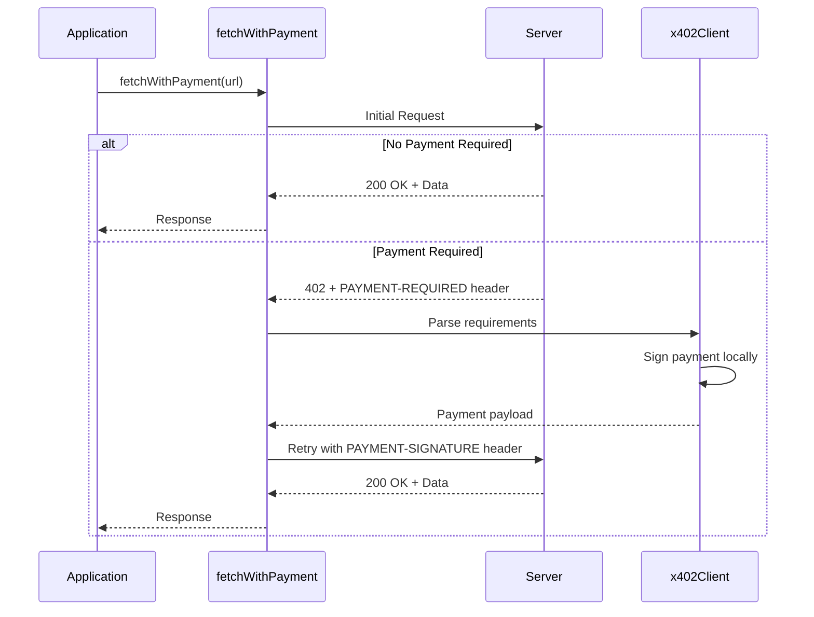

<!-- VERIFIED: 3c3e2168 -->
# @x402/fetch

HTTP client adapter that wraps the native `fetch` API with automatic payment handling for the x402 protocol.

## Installation

```bash
pnpm add @x402/fetch @x402/evm viem
```

For Solana support:

```bash
pnpm add @x402/svm @solana/kit @scure/base
```

## Quick Start

```typescript
import { x402Client } from "@x402/core/client";
import { registerExactEvmScheme } from "@x402/evm/exact/client";
import { wrapFetchWithPayment } from "@x402/fetch";
import { privateKeyToAccount } from "viem/accounts";

const account = privateKeyToAccount(process.env.PRIVATE_KEY as `0x${string}`);
const client = new x402Client();
registerExactEvmScheme(client, { signer: account });

const fetchWithPayment = wrapFetchWithPayment(fetch, client);

// Use like normal fetch - payment happens automatically
const response = await fetchWithPayment("http://server/protected");
const data = await response.json();
```

## Payment Flow


```mermaid
sequenceDiagram
    participant App as Application
    participant Fetch as fetchWithPayment
    participant Server
    participant Client as x402Client

    App->>Fetch: fetchWithPayment(url)
    Fetch->>Server: Initial Request

    alt No Payment Required
        Server-->>Fetch: 200 OK + Data
        Fetch-->>App: Response
    else Payment Required
        Server-->>Fetch: 402 + PAYMENT-REQUIRED header
        Fetch->>Client: Parse requirements
        Client->>Client: Sign payment locally
        Client-->>Fetch: Payment payload
        Fetch->>Server: Retry with PAYMENT-SIGNATURE header
        Server-->>Fetch: 200 OK + Data
        Fetch-->>App: Response
    end
```

The wrapper:

1. Makes the initial HTTP request
2. If the server returns 402 Payment Required:
   - Parses payment requirements from `PAYMENT-REQUIRED` header
   - Selects appropriate payment scheme based on network
   - Creates payment signature locally (no facilitator contact)
   - Adds `PAYMENT-SIGNATURE` header to request
   - Retries the request automatically
3. Returns the final response to your application

## wrapFetchWithPayment

Wraps the native fetch API with automatic payment handling.

```typescript
function wrapFetchWithPayment(
  fetch: typeof globalThis.fetch,
  client: x402Client
): typeof globalThis.fetch
```

**Parameters:**

- `fetch` - The fetch function to wrap (typically `globalThis.fetch`)
- `client` - Configured x402Client instance with registered payment schemes

**Returns:**

A wrapped fetch function with the same signature as native fetch, but with automatic 402 handling.

## Usage Examples

### Basic GET Request

```typescript
const response = await fetchWithPayment("http://server/api/data");
const data = await response.json();
console.log(data);
```

### POST Request with Body

```typescript
const response = await fetchWithPayment("http://server/api/compute", {
  method: "POST",
  headers: {
    "Content-Type": "application/json",
  },
  body: JSON.stringify({
    query: "What is the weather?",
  }),
});

const result = await response.json();
```

### Custom Headers

```typescript
const response = await fetchWithPayment("http://server/protected", {
  method: "GET",
  headers: {
    "Authorization": "Bearer token",
    "X-Custom-Header": "value",
  },
});
```

### Multi-Chain Support

```typescript
import { x402Client } from "@x402/core/client";
import { registerExactEvmScheme } from "@x402/evm/exact/client";
import { registerExactSvmScheme } from "@x402/svm/exact/client";
import { wrapFetchWithPayment } from "@x402/fetch";
import { privateKeyToAccount } from "viem/accounts";
import { Keypair } from "@solana/web3.js";

const evmAccount = privateKeyToAccount(process.env.EVM_PRIVATE_KEY as `0x${string}`);
const svmKeypair = Keypair.fromSecretKey(
  Buffer.from(process.env.SVM_PRIVATE_KEY as string, "hex")
);

const client = new x402Client();
registerExactEvmScheme(client, { signer: evmAccount });
registerExactSvmScheme(client, { signer: svmKeypair });

const fetchWithPayment = wrapFetchWithPayment(fetch, client);

// Client automatically selects appropriate scheme based on server requirements
const response = await fetchWithPayment("http://server/resource");
```

## Error Handling

```typescript
try {
  const response = await fetchWithPayment("http://server/protected");
  const data = await response.json();
} catch (error) {
  if (error.message.includes("No scheme registered")) {
    console.error("Payment scheme not configured for server requirements");
  } else if (error.message.includes("Failed to create payment")) {
    console.error("Could not create payment signature");
  } else {
    console.error("Request failed:", error);
  }
}
```

## Key Points

- **Zero configuration changes** - Use like normal fetch after initial setup
- **Automatic payment handling** - Intercepts 402 responses and manages payment flow
- **Local signing** - Client signs payments locally without contacting a facilitator
- **Multi-chain support** - Works with EVM, Solana, and other blockchain networks
- **Full TypeScript support** - Complete type definitions included

## Next Steps

- [Client Module](../core/client.md) - Core client documentation
- [@x402/axios](./axios.md) - Axios adapter
- [@x402/evm](../mechanisms/evm.md) - EVM payment mechanism
