# Payment Mechanisms

Payment mechanisms implement the blockchain-specific logic for creating, verifying, and settling payments in the x402 protocol.

## Available Mechanisms

| Package | Status | Description |
|---------|--------|-------------|
| [@x402/evm](./evm.md) | ✅ **Stable** | Ethereum Virtual Machine (EVM) payments |
| [@x402/svm](./svm.md) | 🚧 **Planned** | Solana Virtual Machine (SVM) payments |

## Architecture


## Mechanism Responsibilities

Each payment mechanism implements three interfaces:

### 1. SchemeNetworkClient (Client-Side)

Creates payment signatures for client applications.

```typescript
interface SchemeNetworkClient {
  readonly scheme: string;
  createPaymentPayload(
    x402Version: number,
    requirements: PaymentRequirements
  ): Promise<PaymentPayload>;
}
```

**Responsibilities:**
- Generate payment signatures using user's wallet
- Format payment data according to scheme specifications
- Handle blockchain-specific signing requirements

### 2. SchemeNetworkFacilitator (Facilitator-Side)

Verifies signatures and settles payments on-chain.

```typescript
interface SchemeNetworkFacilitator {
  readonly scheme: string;
  verify(
    payload: PaymentPayload,
    requirements: PaymentRequirements
  ): Promise<VerifyResponse>;
  settle(
    payload: PaymentPayload,
    requirements: PaymentRequirements
  ): Promise<SettleResponse>;
}
```

**Responsibilities:**
- Verify payment signature validity
- Check payment amount and recipient
- Execute on-chain settlement
- Wait for transaction confirmation

### 3. SchemeNetworkService (Server-Side)

Handles price parsing and requirement building.

```typescript
interface SchemeNetworkService {
  readonly scheme: string;
  parsePrice(price: Price, network: Network): AssetAmount;
  enhancePaymentRequirements(
    paymentRequirements: PaymentRequirements,
    supportedKind: any,
    facilitatorExtensions: string[]
  ): Promise<PaymentRequirements>;
}
```

**Responsibilities:**
- Parse user-friendly prices (e.g., "$0.10")
- Convert to blockchain-specific amounts
- Add blockchain-specific metadata to requirements

## Payment Flow by Component

```mermaid
sequenceDiagram
    participant App as Application
    participant Client as SchemeNetworkClient
    participant Wallet as User Wallet
    participant Server as SchemeNetworkService
    participant Facilitator as SchemeNetworkFacilitator
    participant Blockchain

    App->>Server: Request protected resource
    Server->>Server: parsePrice("$0.10")
    Server->>Server: enhancePaymentRequirements()
    Server->>App: 402 Payment Required

    App->>Client: createPaymentPayload(requirements)
    Client->>Wallet: Sign payment message
    Wallet->>Client: Signature
    Client->>App: PaymentPayload

    App->>Server: Request + PaymentPayload
    Server->>Facilitator: verify(payload, requirements)
    Facilitator->>Facilitator: Verify signature
    Facilitator->>Facilitator: Check amount/recipient
    Facilitator->>Server: ✓ Valid

    Server->>App: 200 OK + data
    Server->>Facilitator: settle(payload, requirements)
    Facilitator->>Blockchain: Execute transaction
    Blockchain->>Facilitator: Transaction hash
    Facilitator->>Server: Settlement response
    Server->>App: PAYMENT-RESPONSE header
```



## Supported Networks

### EVM Networks

The `@x402/evm` package supports all EVM-compatible chains:

- **Mainnet Chains**:
  - Ethereum (eip155:1)
  - Base (eip155:8453)
  - Optimism (eip155:10)
  - Arbitrum (eip155:42161)
  - Polygon (eip155:137)

- **Testnet Chains**:
  - Sepolia (eip155:11155111)
  - Base Sepolia (eip155:84532)
  - Optimism Sepolia (eip155:11155420)

### SVM Networks (Coming Soon)

The `@x402/svm` package will support:

- Solana Mainnet (solana:mainnet)
- Solana Devnet (solana:devnet)
- Solana Testnet (solana:testnet)

## Creating Custom Mechanisms

To implement a custom payment mechanism:

1. **Implement all three interfaces**:
   ```typescript
   export class CustomClient implements SchemeNetworkClient {
     readonly scheme = 'custom';
     async createPaymentPayload(version, requirements) { /* ... */ }
   }

   export class CustomFacilitator implements SchemeNetworkFacilitator {
     readonly scheme = 'custom';
     async verify(payload, requirements) { /* ... */ }
     async settle(payload, requirements) { /* ... */ }
   }

   export class CustomService implements SchemeNetworkService {
     readonly scheme = 'custom';
     parsePrice(price, network) { /* ... */ }
     async enhancePaymentRequirements(req, kind, exts) { /* ... */ }
   }
   ```

2. **Register with x402 client/server**:
   ```typescript
   // Client
   client.registerScheme('custom:network', new CustomClient());

   // Server
   server.registerScheme('custom:network', new CustomService());

   // Facilitator
   facilitator.registerScheme('custom:network', new CustomFacilitator());
   ```

## Comparison: EVM vs SVM

| Feature | EVM | SVM |
|---------|-----|-----|
| Signature Standard | EIP-712 | Ed25519 |
| Transfer Mechanism | EIP-3009 | SPL Token Transfer |
| Gas Token | ETH | SOL |
| Transaction Speed | ~12-15s | ~400ms |
| Finality | Probabilistic | Probabilistic |
| Smart Contract Support | Yes | Yes (Programs) |

## Related Documentation

- [EVM Implementation](./evm.md) - Complete EVM documentation
- [SVM Implementation](./svm.md) - Solana documentation (coming soon)
- [Core Types](../core/types.md) - Interface definitions
- [Custom Mechanisms Guide](../../08-architecture/custom-mechanisms.md) - Building custom payment schemes
