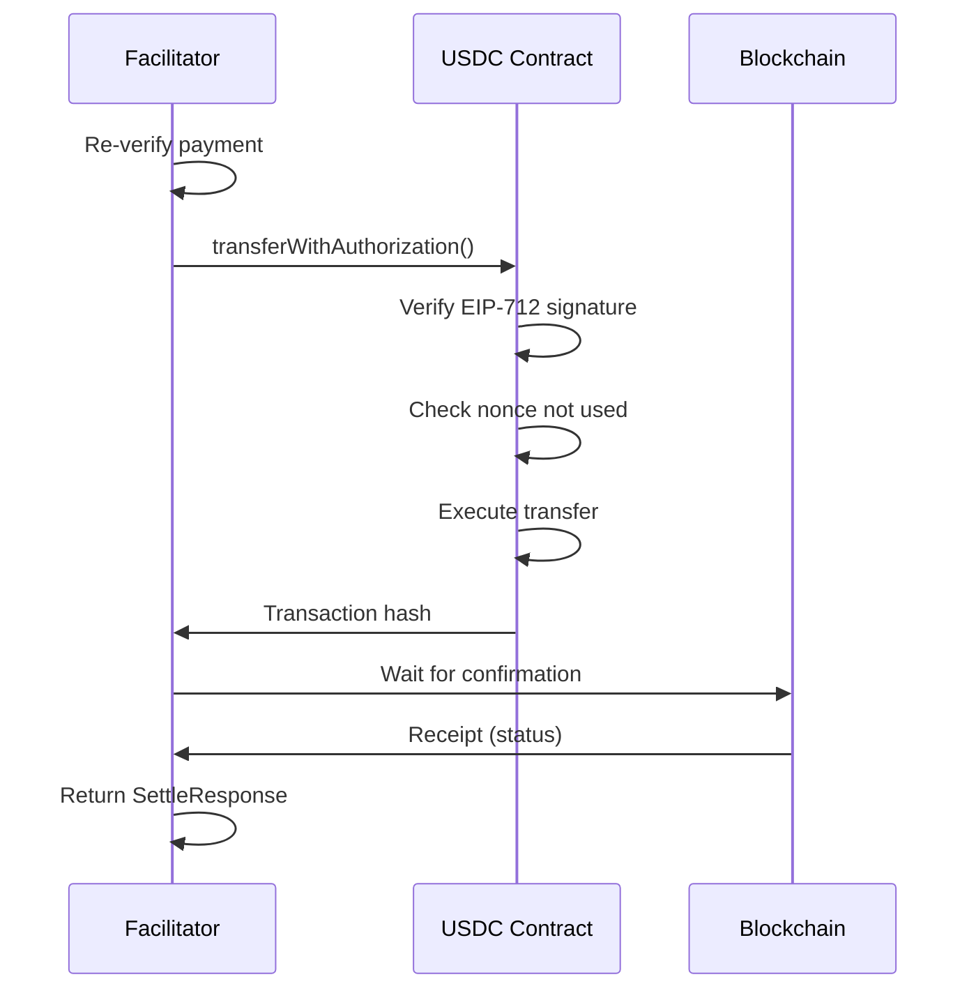

# @x402/evm

Ethereum Virtual Machine (EVM) payment mechanisms for the x402 protocol using EIP-712 signatures and EIP-3009 token transfers.

## Overview

The `@x402/evm` package provides complete EVM payment support using:
- **EIP-712** for structured data signing
- **EIP-3009** for gasless token transfers
- **USDC** as the default payment token (with 6 decimals)
- Support for all EVM-compatible chains (Ethereum, Base, Optimism, etc.)

> **Note**: x402 uses EIP-3009 `transferWithAuthorization()`, **not** the standard ERC-20 `approve()`/`transferFrom()` flow (EIP-2612 permit). This enables single-transaction, gasless payments for users. The facilitator calls `transferWithAuthorization()` directly on the token contract using the user's EIP-712 signature, executing the transfer in one atomic operation without requiring prior token approvals.

## Installation

```bash
npm install @x402/evm @x402/core viem
```

## Dependencies

- `@x402/core` - Core protocol implementation
- `viem` - Ethereum library for signing and transactions
- `zod` - Runtime validation

## Components

The package exports three main classes:

| Class | Purpose | Used By |
|-------|---------|---------|
| `ExactEvmClient` | Creates payment signatures | Client applications |
| `ExactEvmFacilitator` | Verifies and settles payments | Facilitator services |
| `ExactEvmService` | Parses prices and builds requirements | Resource servers |

## ExactEvmClient (Client-Side)

Creates EIP-712 payment signatures for client applications.

### Usage

```typescript
import { ExactEvmClient } from '@x402/evm';
import { privateKeyToAccount } from 'viem/accounts';
import { x402HTTPClient } from '@x402/core/client';

const account = privateKeyToAccount('0x...');
const evmClient = new ExactEvmClient(account);

const client = new x402HTTPClient();
client.registerScheme('eip155:*', evmClient);

// Create payment
const payment = await client.createPaymentPayload(2, requirements);
```

### Payment Structure

The client creates an EIP-3009 `TransferWithAuthorization` signature:

```typescript
{
  x402Version: 2,
  scheme: 'exact',
  network: 'eip155:8453',
  payload: {
    authorization: {
      from: '0x...',        // Payer address
      to: '0x...',          // Recipient address
      value: '100000',      // Amount in token units
      validAfter: '...',    // Unix timestamp (now - 10 min)
      validBefore: '...',   // Unix timestamp (now + maxTimeout)
      nonce: '0x...'        // Random 32-byte hex
    },
    signature: '0x...'      // EIP-712 signature
  },
  accepted: { /* requirements */ }
}
```

### EIP-712 Domain

```typescript
{
  name: 'USD Coin',                             // Token name
  version: '2',                                 // Token version
  chainId: 8453,                               // Base mainnet
  verifyingContract: '0x833589fCD6eDb6E08f4c7C32D4f71b54bdA02913'  // USDC on Base
}
```

### Supported Signers

The client accepts any viem-compatible signer:

```typescript
import { privateKeyToAccount } from 'viem/accounts';
import { createWalletClient, custom } from 'viem';

// Private key
const account = privateKeyToAccount('0x...');
const client = new ExactEvmClient(account);

// Browser wallet
const walletClient = createWalletClient({
  account,
  chain: base,
  transport: custom(window.ethereum)
});
const client = new ExactEvmClient(walletClient);
```

## ExactEvmFacilitator (Facilitator-Side)

Verifies signatures and settles payments on-chain.

### Usage

```typescript
import { ExactEvmFacilitator } from '@x402/evm';
import { createWalletClient, http } from 'viem';
import { base } from 'viem/chains';
import { privateKeyToAccount } from 'viem/accounts';

const account = privateKeyToAccount(process.env.FACILITATOR_KEY as `0x${string}`);

const walletClient = createWalletClient({
  account,
  chain: base,
  transport: http(process.env.RPC_URL)
});

const facilitator = new ExactEvmFacilitator(walletClient);

// Verify payment
const verifyResult = await facilitator.verify(paymentPayload, requirements);

if (verifyResult.isValid) {
  // Settle on-chain
  const settleResult = await facilitator.settle(paymentPayload, requirements);
  console.log('Transaction:', settleResult.transaction);
}
```

### Verification Checks

The facilitator verifies:

1. **Signature validity** - EIP-712 signature matches authorization
2. **Network match** - Payment network matches requirements
3. **Recipient match** - Payment goes to correct address
4. **Amount sufficiency** - Payment amount >= required amount
5. **Time validity** - Current time is between validAfter and validBefore
6. **Balance check** - Payer has sufficient token balance (if RPC available)

### Settlement Process



### Error Handling

Verification failures return specific reasons:

```typescript
{
  isValid: false,
  invalidReason: 'insufficient_funds',  // or other reason
  payer: '0x...'
}
```

Common invalid reasons:
- `unsupported_scheme` - Not 'exact' scheme
- `missing_eip712_domain` - Missing name/version in requirements
- `network_mismatch` - Payment network doesn't match
- `invalid_exact_evm_payload_signature` - Invalid EIP-712 signature
- `invalid_exact_evm_payload_recipient_mismatch` - Wrong recipient
- `invalid_exact_evm_payload_authorization_valid_before` - Signature expired
- `invalid_exact_evm_payload_authorization_valid_after` - Signature not yet valid
- `insufficient_funds` - Payer balance too low
- `invalid_exact_evm_payload_authorization_value` - Payment amount too low

## ExactEvmService (Server-Side)

Parses prices and builds payment requirements.

### Usage

```typescript
import { ExactEvmService } from '@x402/evm';
import { x402HTTPResourceService } from '@x402/core/server';

const service = new x402HTTPResourceService(routes);
service.registerScheme('eip155:8453', new ExactEvmService());

await service.initialize();
```

### Price Parsing

The service accepts multiple price formats:

```typescript
// Dollar amount (assumes USDC)
parsePrice('$0.10', 'eip155:8453')
// => { amount: '100000', asset: '0x833589...', extra: { name: 'USD Coin', version: '2' } }

// Number (assumes USDC)
parsePrice(0.10, 'eip155:8453')
// => { amount: '100000', asset: '0x833589...', extra: { name: 'USD Coin', version: '2' } }

// With currency
parsePrice('0.10 USDC', 'eip155:8453')
// => { amount: '100000', asset: '0x833589...', extra: { name: 'USD Coin', version: '2' } }

// Explicit format
parsePrice({
  amount: '100000',
  asset: '0x833589fCD6eDb6E08f4c7C32D4f71b54bdA02913'
}, 'eip155:8453')
// => { amount: '100000', asset: '0x833589...', extra: {} }
```

### Supported Networks

| Network | Chain ID | USDC Address |
|---------|----------|--------------|
| Ethereum Mainnet | eip155:1 | `0xA0b86991c6218b36c1d19D4a2e9Eb0cE3606eB48` |
| Sepolia | eip155:11155111 | `0x1c7D4B196Cb0C7B01d743Fbc6116a902379C7238` |
| Base | eip155:8453 | `0x833589fCD6eDb6E08f4c7C32D4f71b54bdA02913` |
| Base Sepolia | eip155:84532 | `0x036CbD53842c5426634e7929541eC2318f3dCF7e` |

## Complete Example

### Client Application

```typescript
import { wrapFetchWithPayment } from '@x402/fetch';
import { ExactEvmClient } from '@x402/evm';
import { privateKeyToAccount } from 'viem/accounts';

const account = privateKeyToAccount(process.env.PRIVATE_KEY as `0x${string}`);

const fetchWithPayment = wrapFetchWithPayment(fetch, {
  schemes: [
    {
      network: 'eip155:*',  // All EVM chains
      client: new ExactEvmClient(account)
    }
  ]
});

const response = await fetchWithPayment('https://api.example.com/premium');
const data = await response.json();
```

### Server Application

```typescript
import express from 'express';
import { paymentMiddleware } from '@x402/express';
import { ExactEvmService } from '@x402/evm';
import { HTTPFacilitatorClient } from '@x402/core/server';

const app = express();

app.use(paymentMiddleware(
  {
    'GET /api/premium': {
      scheme: 'exact',
      payTo: '0x742d35Cc6634C0532925a3b844Bc9e7595f0bEb',
      price: '$0.10',
      network: 'eip155:8453',
      description: 'Premium API data'
    }
  },
  new HTTPFacilitatorClient(),
  [{ network: 'eip155:8453', server: new ExactEvmService() }]
));

app.get('/api/premium', (req, res) => {
  res.json({ message: 'Premium data' });
});

app.listen(3000);
```

### Facilitator Service

```typescript
import { x402Facilitator } from '@x402/core/facilitator';
import { ExactEvmFacilitator } from '@x402/evm';
import { createWalletClient, http } from 'viem';
import { base } from 'viem/chains';
import { privateKeyToAccount } from 'viem/accounts';

const account = privateKeyToAccount(process.env.FACILITATOR_KEY as `0x${string}`);

const walletClient = createWalletClient({
  account,
  chain: base,
  transport: http(process.env.RPC_URL)
});

const facilitator = new x402Facilitator();
facilitator.registerScheme('eip155:8453', new ExactEvmFacilitator(walletClient));

// Use in facilitator endpoints
app.post('/verify', async (req, res) => {
  const result = await facilitator.verify(req.body.paymentPayload, req.body.paymentRequirements);
  res.json(result);
});

app.post('/settle', async (req, res) => {
  const result = await facilitator.settle(req.body.paymentPayload, req.body.paymentRequirements);
  res.json(result);
});
```

## Security Considerations

### Client-Side

- **Private key security**: Never expose private keys in client code
- **Signature expiry**: Signatures expire after `maxTimeoutSeconds` (default 300s)
- **Nonce uniqueness**: Each payment uses a unique nonce
- **Amount verification**: Always verify payment amounts match expectations

### Facilitator-Side

- **Re-verification**: Always re-verify before settlement
- **Balance checks**: Verify payer has sufficient balance
- **Nonce tracking**: Ensure nonces haven't been used (handled by EIP-3009)
- **Gas management**: Facilitator pays gas fees for settlement
- **Transaction confirmation**: Wait for transaction confirmation before returning success

## Gas Costs

Typical gas costs for `transferWithAuthorization`:
- Base: ~50,000 gas (~$0.00001 at 1 gwei)
- Ethereum: ~50,000 gas (~$0.50 at 20 gwei)

The facilitator pays gas fees, not the user.

## Testing

### Unit Tests

```typescript
import { ExactEvmClient } from '@x402/evm';
import { privateKeyToAccount } from 'viem/accounts';

describe('ExactEvmClient', () => {
  const account = privateKeyToAccount('0x...');
  const client = new ExactEvmClient(account);

  it('should create valid payment payload', async () => {
    const payload = await client.createPaymentPayload(2, mockRequirements);

    expect(payload.x402Version).toBe(2);
    expect(payload.scheme).toBe('exact');
    expect(payload.payload.signature).toMatch(/^0x[0-9a-f]{130}$/);
  });
});
```

### Integration Tests

See `/e2e/clients/fetch` and `/e2e/servers/express` for complete integration test examples.

## Troubleshooting

### "Missing EIP-712 domain parameters"

Ensure requirements include `name` and `version`:

```typescript
{
  extra: {
    name: 'USD Coin',
    version: '2'
  }
}
```

### "Insufficient funds"

Payer needs USDC balance:

```bash
# Check balance
cast call $USDC_ADDRESS "balanceOf(address)(uint256)" $PAYER_ADDRESS --rpc-url $RPC_URL
```

### "Transaction failed"

Common causes:
- Nonce already used (replay)
- Signature expired (`validBefore` passed)
- Insufficient balance
- Gas limit too low

## Related Documentation

- [Core Types](../core/types.md) - Interface definitions
- [Fetch Integration](../http-adapters/fetch.md) - Client usage
- [Express Integration](../http-adapters/express.md) - Server usage
- [EIP-712 Specification](https://eips.ethereum.org/EIPS/eip-712) - Signature standard
- [EIP-3009 Specification](https://eips.ethereum.org/EIPS/eip-3009) - Transfer standard
