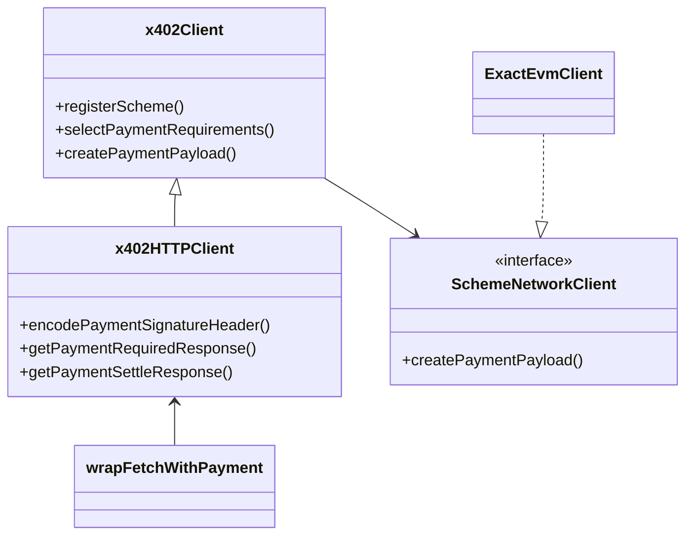
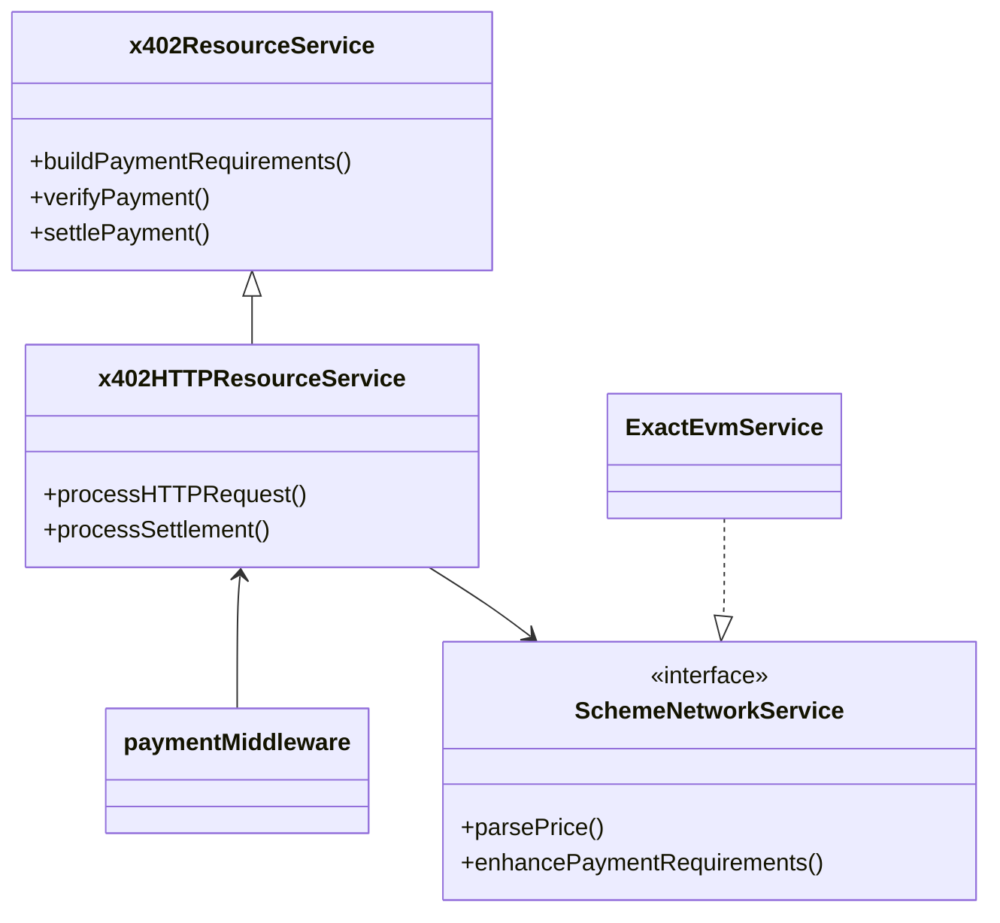
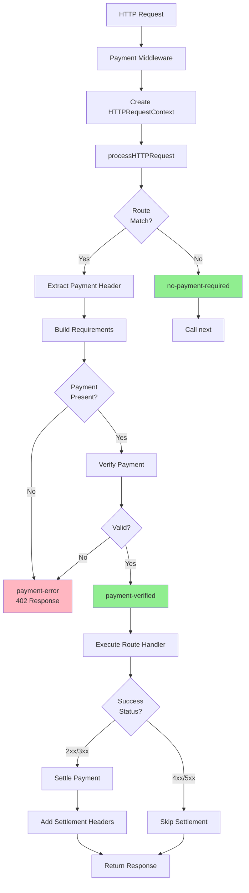

# Reference Implementation Architecture

Overview of the TypeScript reference implementation structure and organization.

## Package Structure

```
x402/
├── typescript/packages/
│   ├── core/                  # Framework-agnostic core logic
│   │   ├── src/types/        # Type definitions
│   │   ├── src/client/       # Client base classes
│   │   ├── src/server/       # Server base classes
│   │   ├── src/facilitator/  # Facilitator implementation
│   │   ├── src/http/         # HTTP-specific logic
│   │   └── src/utils/        # Shared utilities
│   ├── http/                  # HTTP framework integrations
│   │   ├── fetch/            # Fetch API wrapper (client)
│   │   ├── express/          # Express middleware (server)
│   │   ├── hono/             # Hono middleware (server)
│   │   └── next/             # Next.js integration (server)
│   └── mechanisms/            # Payment scheme implementations
│       ├── evm/              # EVM networks (Base, Ethereum, etc.)
│       └── svm/              # Solana networks
└── e2e/                       # Reference implementations & tests
    ├── clients/fetch/        # Reference client
    ├── servers/express/      # Reference server
    └── src/                  # Test harness
```

## Core Abstractions

### Client Layer



### Server Layer



## Reference Implementation

### Client (`e2e/clients/fetch/`)

**Purpose**: Demonstrates how to wrap HTTP clients with x402 payment handling

**Key Files**:
- `index.ts` - Entry point using `@x402/fetch`
- `test.config.json` - Test configuration
- `run.sh` - Execution script

See: [Client Architecture](./client-architecture.md)

### Server (`e2e/servers/express/`)

**Purpose**: Demonstrates how to protect endpoints with payment requirements

**Key Files**:
- `index.ts` - Express app with payment middleware
- `facilitator.ts` - Local facilitator configuration
- `test.config.json` - Test configuration
- `run.sh` - Execution script

See: [Server Architecture](./server-architecture.md)

### Test Harness (`e2e/src/`)

**Purpose**: Automated testing framework for client/server combinations

**Key Files**:
- `test.ts` - Main test runner
- `discovery.ts` - Automatic implementation discovery
- `proxy-base.ts` - Process management
- `clients/generic-client.ts` - Client proxy
- `servers/generic-server.ts` - Server proxy

See: [Test Harness](./test-harness.md)

## Design Patterns

### 1. Framework Agnostic Core

Core logic is independent of HTTP frameworks:

```typescript
// Core defines interfaces
interface HTTPAdapter {
  getHeader(name: string): string | undefined;
  // ...
}

// Express provides implementation
class ExpressAdapter implements HTTPAdapter {
  constructor(private req: Request) {}
  getHeader(name: string) { return this.req.header(name); }
}

// Hono provides implementation
class HonoAdapter implements HTTPAdapter {
  constructor(private c: Context) {}
  getHeader(name: string) { return this.c.req.header(name); }
}
```

### 2. Scheme Registration

Payment schemes are registered at runtime:

```typescript
// Client-side
const client = new x402HTTPClient();
client.registerScheme("eip155:8453", new ExactEvmClient(signer));
client.registerScheme("solana:mainnet", new ExactSolanaClient(signer));

// Server-side
const server = new x402HTTPResourceService(routes);
server.registerScheme("eip155:8453", new ExactEvmService());
server.registerScheme("solana:mainnet", new ExactSolanaService());
```

### 3. Local vs Remote Facilitators

Facilitators can run locally or remotely:

```typescript
// Local facilitator (reference implementation)
const facilitator = new x402Facilitator();
facilitator.registerScheme("eip155:8453", new ExactEvmFacilitator(signer));
const client = new LocalFacilitatorClient(facilitator);

// Remote facilitator (theoretical)
const client = new HTTPFacilitatorClient("https://facilitator.x402.org");

// Both implement FacilitatorClient interface
paymentMiddleware(routes, client);
```

## Data Flow

### Request Processing Flow



## Next Steps

- **Client Details**: [Client Architecture](./client-architecture.md)
- **Server Details**: [Server Architecture](./server-architecture.md)
- **Testing**: [Test Harness](./test-harness.md)

---

*Reference: `/e2e/` and `typescript/packages/`*
