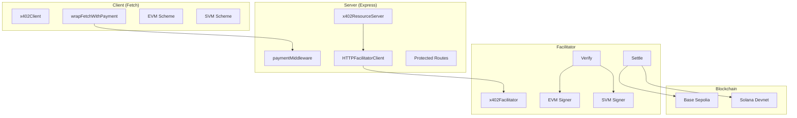
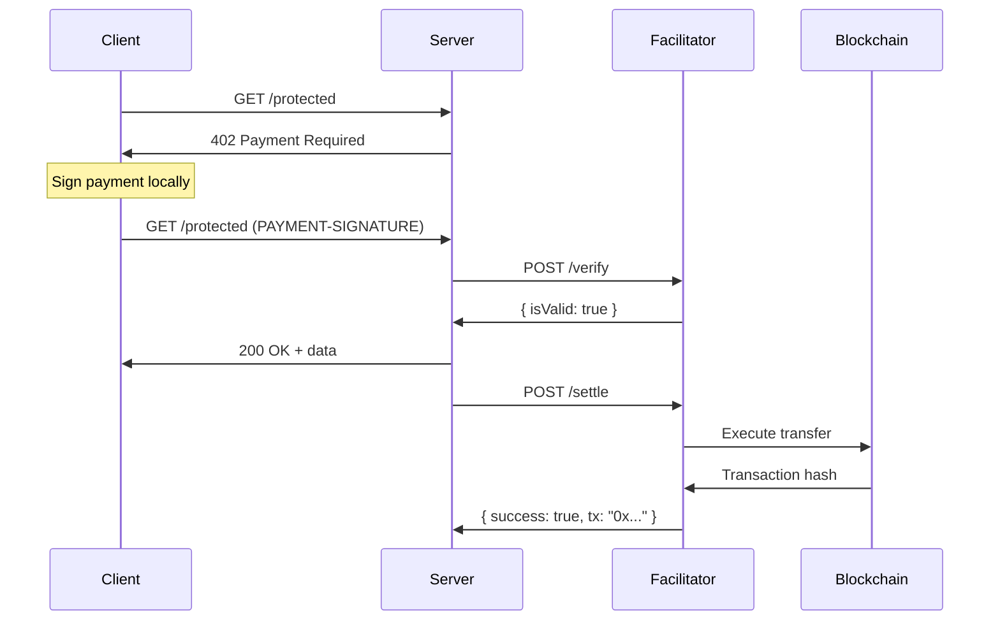

<!-- VERIFIED: 3c3e2168 -->
# Reference Architecture

This document describes the overall architecture of the x402 reference implementation used for end-to-end testing.

## Overview

The reference implementation demonstrates a complete x402 payment flow with three components:

1. **Client** - Makes HTTP requests with automatic payment handling
2. **Server** - Protects endpoints with payment requirements
3. **Facilitator** - Verifies signatures and settles payments on-chain

## Component Diagram


```mermaid
flowchart TB
    subgraph Client["Client (Fetch)"]
        C1[x402Client]
        C2[wrapFetchWithPayment]
        C3[EVM Scheme]
        C4[SVM Scheme]
    end

    subgraph Server["Server (Express)"]
        S1[paymentMiddleware]
        S2[x402ResourceServer]
        S3[HTTPFacilitatorClient]
        S4[Protected Routes]
    end

    subgraph Facilitator["Facilitator"]
        F1[x402Facilitator]
        F2[Verify]
        F3[Settle]
        F4[EVM Signer]
        F5[SVM Signer]
    end

    subgraph Blockchain["Blockchain"]
        B1[Base Sepolia]
        B2[Solana Devnet]
    end

    C2 --> S1
    S2 --> S3
    S3 --> F1
    F2 --> F4
    F2 --> F5
    F3 --> B1
    F3 --> B2
```

## Payment Flow


```mermaid
sequenceDiagram
    participant Client
    participant Server
    participant Facilitator
    participant Blockchain

    Client->>Server: GET /protected
    Server->>Client: 402 Payment Required

    Note over Client: Sign payment locally

    Client->>Server: GET /protected (PAYMENT-SIGNATURE)
    Server->>Facilitator: POST /verify
    Facilitator->>Server: { isValid: true }
    Server->>Client: 200 OK + data
    Server->>Facilitator: POST /settle
    Facilitator->>Blockchain: Execute transfer
    Blockchain->>Facilitator: Transaction hash
    Facilitator->>Server: { success: true, tx: "0x..." }
```

## Client Implementation

The reference client uses the fetch wrapper pattern:

```typescript
// e2e/clients/fetch/index.ts
import { x402Client } from "@x402/core/client";
import { registerExactEvmScheme } from "@x402/evm/exact/client";
import { registerExactSvmScheme } from "@x402/svm/exact/client";
import { wrapFetchWithPayment } from "@x402/fetch";

const client = new x402Client();
registerExactEvmScheme(client, { signer: evmAccount });
registerExactSvmScheme(client, { signer: svmSigner });

const fetchWithPayment = wrapFetchWithPayment(fetch, client);
const response = await fetchWithPayment(url);
```

### Key Features

- Multi-chain support (EVM + SVM)
- Automatic 402 handling
- Local payment signing
- Structured result output

## Server Implementation

The reference server uses Express with payment middleware:

```typescript
// e2e/servers/express/index.ts
import { paymentMiddleware } from "@x402/express";
import { x402ResourceServer, HTTPFacilitatorClient } from "@x402/core/server";

const facilitatorClient = new HTTPFacilitatorClient({ url: facilitatorUrl });
const server = new x402ResourceServer(facilitatorClient);

registerExactEvmScheme(server);
registerExactSvmScheme(server);

app.use(paymentMiddleware({
  "GET /protected": {
    accepts: { scheme: "exact", network: "eip155:84532", payTo, price: "$0.001" },
  },
  "GET /protected-svm": {
    accepts: { scheme: "exact", network: "solana:EtWTRABZaYq6iMfeYKouRu166VU2xqa1", payTo, price: "$0.001" },
  },
}, server));
```

### Key Features

- Multi-chain payment acceptance
- Route-based configuration
- Bazaar discovery extension
- Health check endpoint

## Facilitator Implementation

The facilitator verifies and settles payments:

```typescript
import { x402Facilitator } from "@x402/core/facilitator";
import { registerExactEvmScheme } from "@x402/evm/exact/facilitator";
import { registerExactSvmScheme } from "@x402/svm/exact/facilitator";

const facilitator = new x402Facilitator();
registerExactEvmScheme(facilitator, { signer: evmSigner, networks: "eip155:84532" });
registerExactSvmScheme(facilitator, { signer: svmSigner, networks: "solana:..." });

// Endpoints
app.get("/supported", (req, res) => res.json(facilitator.getSupported()));
app.post("/verify", async (req, res) => {
  const result = await facilitator.verify(req.body.paymentPayload, req.body.paymentRequirements);
  res.json(result);
});
app.post("/settle", async (req, res) => {
  const result = await facilitator.settle(req.body.paymentPayload, req.body.paymentRequirements);
  res.json(result);
});
```

### Key Features

- Multi-chain settlement
- Lifecycle hooks
- Gas management
- Transaction confirmation

## Test Harness

The E2E tests orchestrate the components:

1. Start facilitator server
2. Start resource server
3. Run client against protected endpoint
4. Verify payment completed
5. Check blockchain for settlement

## Environment Variables

```bash
# Client
RESOURCE_SERVER_URL=http://localhost:4021
ENDPOINT_PATH=/protected
EVM_PRIVATE_KEY=0x...
SVM_PRIVATE_KEY=...

# Server
PORT=4021
EVM_PAYEE_ADDRESS=0x...
SVM_PAYEE_ADDRESS=...
FACILITATOR_URL=http://localhost:4022

# Facilitator
PORT=4022
EVM_PRIVATE_KEY=0x...
SVM_PRIVATE_KEY=...
```

## Next Steps

- [Client Architecture](./client-architecture.md) - Detailed client implementation
- [Server Architecture](./server-architecture.md) - Detailed server implementation
- [Facilitator Architecture](./facilitator-architecture.md) - Detailed facilitator implementation
