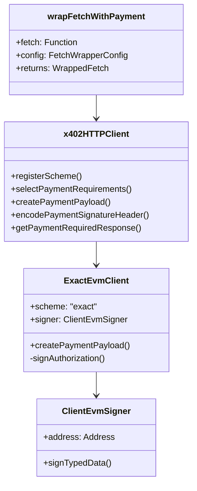
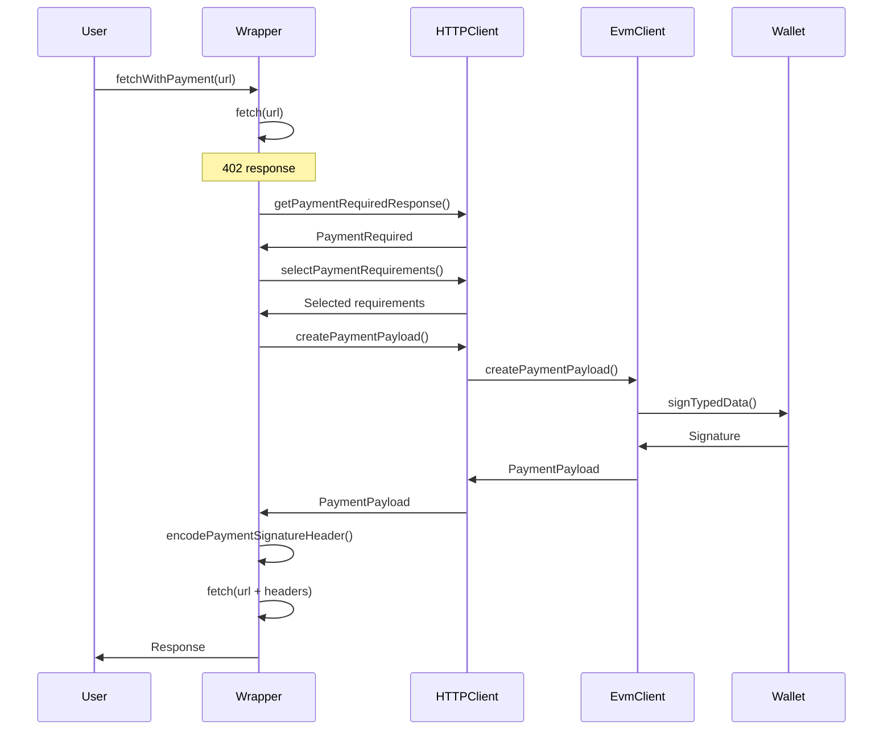

# Client Architecture

Detailed architecture of the reference TypeScript Fetch client implementation.

## Overview

**Location**: `e2e/clients/fetch/`
**Package**: `@x402/fetch`
**Source**: `typescript/packages/http/fetch/src/index.ts`

## Component Diagram



## Implementation Details

### Entry Point

**File**: `e2e/clients/fetch/index.ts`

```typescript
import { wrapFetchWithPayment } from "@x402/fetch";
import { ExactEvmClient } from "@x402/evm";
import { privateKeyToAccount } from "viem/accounts";

const account = privateKeyToAccount(process.env.EVM_PRIVATE_KEY);

const fetchWithPayment = wrapFetchWithPayment(fetch, {
  schemes: [
    {
      network: "eip155:*",
      client: new ExactEvmClient(account),
    },
  ],
});

const response = await fetchWithPayment(url, { method: "GET" });
```

### Wrapper Function

**File**: `typescript/packages/http/fetch/src/index.ts:79-177`

Key responsibilities:
1. Intercept 402 responses
2. Parse payment requirements
3. Create payment payload
4. Retry with payment

### Payment Creation Flow



## Configuration

### test.config.json

```json
{
  "name": "fetch",
  "type": "client",
  "language": "typescript",
  "protocolFamilies": ["evm"],
  "x402Versions": [1, 2],
  "environment": {
    "required": [
      "EVM_PRIVATE_KEY",
      "RESOURCE_SERVER_URL",
      "ENDPOINT_PATH"
    ]
  }
}
```

### run.sh

```bash
#!/bin/bash
pnpm tsx index.ts
```

## Key Operations

### 1. Detect 402 Response

```typescript
const response = await fetch(input, init);

if (response.status !== 402) {
  return response;  // Normal response, return as-is
}
// Handle payment requirement
```

### 2. Parse Payment Requirements

```typescript
const responseHeaders: Record<string, string> = {};
response.headers.forEach((value, key) => {
  responseHeaders[key.toUpperCase()] = value;
});

const paymentRequired = client.getPaymentRequiredResponse(
  responseHeaders,
  body
);
```

### 3. Select Compatible Requirements

```typescript
const selected = client.selectPaymentRequirements(
  paymentRequired.x402Version,
  paymentRequired.accepts
);
```

### 4. Create Payment

```typescript
const paymentPayload = await client.createPaymentPayload(
  paymentRequired.x402Version,
  selectedRequirements
);
```

### 5. Retry with Payment

```typescript
const paymentHeaders = client.encodePaymentSignatureHeader(paymentPayload);

const secondResponse = await fetch(input, {
  ...init,
  headers: { ...init.headers, ...paymentHeaders },
  __is402Retry: true
});
```

## EVM Client Implementation

**File**: `typescript/packages/mechanisms/evm/src/exact/index.ts:10-83`

```typescript
class ExactEvmClient implements SchemeNetworkClient {
  readonly scheme = "exact";

  constructor(private readonly signer: ClientEvmSigner) {}

  async createPaymentPayload(
    _: number,
    requirements: PaymentRequirements
  ): Promise<PaymentPayload> {
    // 1. Create authorization
    const authorization = {
      from: this.signer.address,
      to: requirements.payTo,
      value: requirements.amount,
      validAfter: (now - 600).toString(),
      validBefore: (now + requirements.maxTimeoutSeconds).toString(),
      nonce: createNonce(),
    };

    // 2. Sign using EIP-712
    const signature = await this.signAuthorization(authorization, requirements);

    // 3. Return payload
    return {
      x402Version: 2,
      scheme: requirements.scheme,
      network: requirements.network,
      payload: { authorization, signature },
      accepted: requirements,
    };
  }
}
```

## Error Handling

```typescript
try {
  paymentRequired = client.getPaymentRequiredResponse(responseHeaders, body);
} catch (error) {
  throw new Error(`Failed to parse payment requirements: ${error.message}`);
}

try {
  paymentPayload = await client.createPaymentPayload(...);
} catch (error) {
  throw new Error(`Failed to create payment payload: ${error.message}`);
}

// Prevent infinite retry loops
if ((init as { __is402Retry?: boolean }).__is402Retry) {
  throw new Error("Payment already attempted");
}
```

## Usage Examples

### Basic Usage

```typescript
const response = await fetchWithPayment('https://api.example.com/paid');
const data = await response.json();
```

### With Custom Selector

```typescript
const fetchWithPayment = wrapFetchWithPayment(fetch, {
  schemes: [{ network: "eip155:8453", client: new ExactEvmClient(account) }],
  paymentRequirementsSelector: (version, options) => {
    // Prefer Base mainnet
    const base = options.find(opt => opt.network === "eip155:8453");
    return base || options[0];
  }
});
```

### Multiple Networks

```typescript
const fetchWithPayment = wrapFetchWithPayment(fetch, {
  schemes: [
    { network: "eip155:8453", client: new ExactEvmClient(account) },
    { network: "eip155:84532", client: new ExactEvmClient(account) },
    { network: "eip155:1", client: new ExactEvmClient(account) }
  ]
});
```

## Next Steps

- **Server Architecture**: [Server Architecture](./server-architecture.md)
- **Payment Flow**: [Happy Path](../02-protocol-flows/happy-path.md)
- **Implementation**: [Client Implementation](../05-implementation-guide/client-implementation.md)

---

*Reference: `e2e/clients/fetch/` and `typescript/packages/http/fetch/`*
