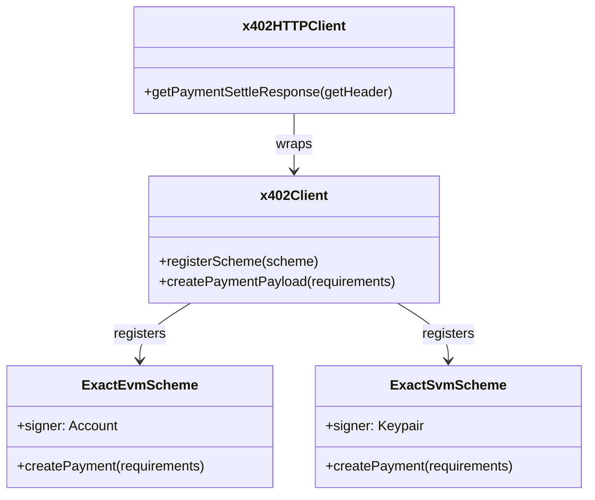
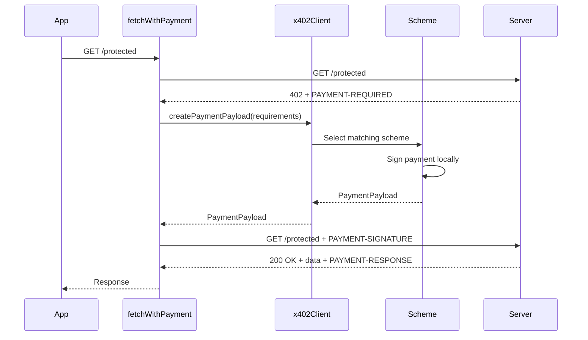

<!-- VERIFIED: 3c3e2168 -->
# Client Architecture

This document describes the reference client implementation that demonstrates how to build x402-enabled HTTP clients.

## Overview

The reference client wraps the native `fetch` API with automatic payment handling. When a server returns 402 Payment Required, the client:

1. Parses payment requirements
2. Signs a payment locally
3. Retries the request with the payment signature

## Source Code

Location: `e2e/clients/fetch/index.ts`

```typescript
import { config } from "dotenv";
import { wrapFetchWithPayment, decodePaymentResponseHeader } from "@x402/fetch";
import { privateKeyToAccount } from "viem/accounts";
import { registerExactEvmScheme } from "@x402/evm/exact/client";
import { registerExactSvmScheme } from "@x402/svm/exact/client";
import { base58 } from "@scure/base";
import { createKeyPairSignerFromBytes } from "@solana/kit";
import { x402Client, x402HTTPClient } from "@x402/core/client";

config();

const baseURL = process.env.RESOURCE_SERVER_URL as string;
const endpointPath = process.env.ENDPOINT_PATH as string;
const url = `${baseURL}${endpointPath}`;
const evmAccount = privateKeyToAccount(process.env.EVM_PRIVATE_KEY as `0x${string}`);
const svmSigner = await createKeyPairSignerFromBytes(
  base58.decode(process.env.SVM_PRIVATE_KEY as string)
);

// Create client and register schemes
const client = new x402Client();
registerExactEvmScheme(client, { signer: evmAccount });
registerExactSvmScheme(client, { signer: svmSigner });

const fetchWithPayment = wrapFetchWithPayment(fetch, client);

// Make request
const response = await fetchWithPayment(url, { method: "GET" });
const data = await response.json();
```

## Class Structure


```mermaid
classDiagram
    class x402Client {
        +registerScheme(scheme)
        +createPaymentPayload(requirements)
    }

    class x402HTTPClient {
        +getPaymentSettleResponse(getHeader)
    }

    class ExactEvmScheme {
        +signer: Account
        +createPayment(requirements)
    }

    class ExactSvmScheme {
        +signer: Keypair
        +createPayment(requirements)
    }

    x402Client --> ExactEvmScheme : registers
    x402Client --> ExactSvmScheme : registers
    x402HTTPClient --> x402Client : wraps
```

## Payment Flow


```mermaid
sequenceDiagram
    participant App
    participant fetchWithPayment
    participant x402Client
    participant Scheme
    participant Server

    App->>fetchWithPayment: GET /protected
    fetchWithPayment->>Server: GET /protected
    Server-->>fetchWithPayment: 402 + PAYMENT-REQUIRED

    fetchWithPayment->>x402Client: createPaymentPayload(requirements)
    x402Client->>Scheme: Select matching scheme
    Scheme->>Scheme: Sign payment locally
    Scheme-->>x402Client: PaymentPayload
    x402Client-->>fetchWithPayment: PaymentPayload

    fetchWithPayment->>Server: GET /protected + PAYMENT-SIGNATURE
    Server-->>fetchWithPayment: 200 OK + data + PAYMENT-RESPONSE
    fetchWithPayment-->>App: Response
```

## Key Components

### 1. Client Initialization

```typescript
const client = new x402Client();
```

Creates a new x402 client instance that manages payment schemes.

### 2. Scheme Registration

```typescript
registerExactEvmScheme(client, { signer: evmAccount });
registerExactSvmScheme(client, { signer: svmSigner });
```

Registers payment schemes for different blockchain networks:
- **EVM**: Ethereum, Base, and other EVM chains
- **SVM**: Solana

### 3. Fetch Wrapper

```typescript
const fetchWithPayment = wrapFetchWithPayment(fetch, client);
```

Wraps native fetch with automatic payment handling:
- Intercepts 402 responses
- Extracts payment requirements from `PAYMENT-REQUIRED` header
- Creates and signs payment
- Retries with `PAYMENT-SIGNATURE` header

### 4. Payment Response

```typescript
const paymentResponse = new x402HTTPClient(client).getPaymentSettleResponse(
  (name) => response.headers.get(name)
);
```

Extracts settlement confirmation from `PAYMENT-RESPONSE` header.

## Result Structure

The client outputs a structured JSON result:

```typescript
interface ClientResult {
  success: boolean;
  data: any;
  status_code: number;
  payment_response?: {
    success: boolean;
    transaction: string;
    network: string;
    payer: string;
  };
}
```

## Multi-Chain Support

The client supports multiple blockchain networks simultaneously:

```typescript
// EVM account from private key
const evmAccount = privateKeyToAccount(process.env.EVM_PRIVATE_KEY as `0x${string}`);

// Solana signer from private key
const svmSigner = await createKeyPairSignerFromBytes(
  base58.decode(process.env.SVM_PRIVATE_KEY as string)
);

// Register both schemes
registerExactEvmScheme(client, { signer: evmAccount });
registerExactSvmScheme(client, { signer: svmSigner });
```

The client automatically selects the appropriate scheme based on the server's payment requirements.

## Error Handling

```typescript
try {
  const response = await fetchWithPayment(url);
  // Handle success
} catch (error) {
  if (error.message.includes("No scheme registered")) {
    // Server requires unsupported payment method
  } else if (error.message.includes("Payment failed")) {
    // Payment creation failed
  }
}
```

## Environment Variables

| Variable | Description |
|----------|-------------|
| `RESOURCE_SERVER_URL` | Base URL of the server |
| `ENDPOINT_PATH` | Path to the protected endpoint |
| `EVM_PRIVATE_KEY` | Private key for EVM payments |
| `SVM_PRIVATE_KEY` | Private key for Solana payments |

## Next Steps

- [Server Architecture](./server-architecture.md) - Reference server implementation
- [Facilitator Architecture](./facilitator-architecture.md) - Reference facilitator implementation
