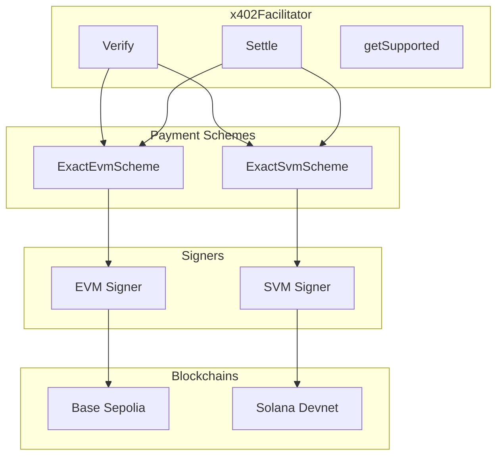
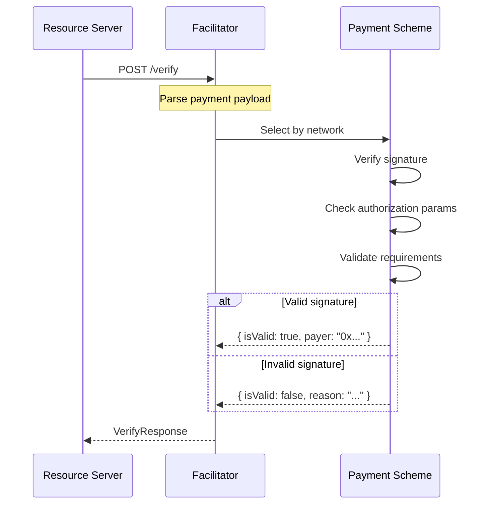
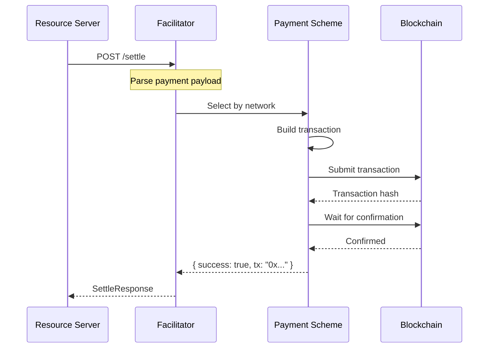

<!-- VERIFIED: 3c3e2168 -->
# Facilitator Architecture

This document describes the reference facilitator implementation that demonstrates how to build an x402 payment verification and settlement service.

## Overview

The facilitator is responsible for:

1. **Verification** - Validating payment signatures off-chain
2. **Settlement** - Executing payment transactions on-chain
3. **Discovery** - Advertising supported payment schemes and networks

Most applications use the hosted facilitator at `https://facilitator.x402.org`. Self-hosted facilitators are needed for custom settlement logic or private network support.

## Architecture



## Implementation

```typescript
import express from "express";
import { x402Facilitator } from "@x402/core/facilitator";
import { registerExactEvmScheme } from "@x402/evm/exact/facilitator";
import { registerExactSvmScheme } from "@x402/svm/exact/facilitator";
import { privateKeyToAccount } from "viem/accounts";
import { createKeyPairSignerFromBytes } from "@solana/kit";
import { base58 } from "@scure/base";

const app = express();
app.use(express.json());

// Create facilitator
const facilitator = new x402Facilitator();

// Register EVM scheme
const evmSigner = privateKeyToAccount(process.env.EVM_PRIVATE_KEY as `0x${string}`);
registerExactEvmScheme(facilitator, {
  signer: evmSigner,
  networks: "eip155:84532",
});

// Register SVM scheme
const svmSigner = await createKeyPairSignerFromBytes(
  base58.decode(process.env.SVM_PRIVATE_KEY!)
);
registerExactSvmScheme(facilitator, {
  signer: svmSigner,
  networks: "solana:EtWTRABZaYq6iMfeYKouRu166VU2xqa1",
});

// Endpoints
app.get("/supported", (req, res) => {
  res.json(facilitator.getSupported());
});

app.post("/verify", async (req, res) => {
  try {
    const { paymentPayload, paymentRequirements } = req.body;
    const result = await facilitator.verify(paymentPayload, paymentRequirements);
    res.json(result);
  } catch (error) {
    res.status(400).json({ isValid: false, invalidReason: error.message });
  }
});

app.post("/settle", async (req, res) => {
  try {
    const { paymentPayload, paymentRequirements } = req.body;
    const result = await facilitator.settle(paymentPayload, paymentRequirements);
    res.json(result);
  } catch (error) {
    res.status(500).json({ success: false, errorReason: error.message });
  }
});

app.listen(4022);
```

## Verify Flow



### Verification Steps

1. **Parse Payload** - Extract payment data from request
2. **Select Scheme** - Match network to registered scheme
3. **Verify Signature** - Cryptographic signature validation
4. **Check Authorization** - Validate EIP-3009 or SPL params
5. **Match Requirements** - Ensure payment meets server requirements

## Settle Flow



### Settlement Steps

1. **Parse Payload** - Extract payment data from request
2. **Select Scheme** - Match network to registered scheme
3. **Build Transaction** - Create settlement transaction
4. **Submit Transaction** - Broadcast to blockchain
5. **Wait for Confirmation** - Ensure transaction is mined
6. **Return Result** - Transaction hash and status

## API Endpoints

### GET /supported

Returns supported payment schemes and signer addresses.

**Response:**

```json
{
  "kinds": [
    {
      "x402Version": 2,
      "scheme": "exact",
      "network": "eip155:84532"
    },
    {
      "x402Version": 2,
      "scheme": "exact",
      "network": "solana:EtWTRABZaYq6iMfeYKouRu166VU2xqa1"
    }
  ],
  "extensions": [],
  "signers": {
    "eip155": ["0x..."],
    "solana": ["..."]
  }
}
```

### POST /verify

Verifies a payment signature without settling.

**Request:**

```json
{
  "paymentPayload": { /* ... */ },
  "paymentRequirements": { /* ... */ }
}
```

**Response (success):**

```json
{
  "isValid": true,
  "payer": "0x..."
}
```

**Response (failure):**

```json
{
  "isValid": false,
  "invalidReason": "invalid_signature"
}
```

### POST /settle

Settles a payment on-chain.

**Request:**

```json
{
  "paymentPayload": { /* ... */ },
  "paymentRequirements": { /* ... */ }
}
```

**Response (success):**

```json
{
  "success": true,
  "transaction": "0x...",
  "network": "eip155:84532",
  "payer": "0x..."
}
```

**Response (failure):**

```json
{
  "success": false,
  "errorReason": "insufficient_balance"
}
```

## Lifecycle Hooks

The facilitator supports lifecycle hooks for custom logic:

```typescript
const facilitator = new x402Facilitator()
  .onBeforeVerify(async (context) => {
    console.log("Verifying payment...");
    // Return { abort: true, reason: "..." } to reject
  })
  .onAfterVerify(async (context) => {
    console.log("Verified:", context.result.isValid);
  })
  .onBeforeSettle(async (context) => {
    console.log("Settling payment...");
    // Return { abort: true, reason: "..." } to cancel
  })
  .onAfterSettle(async (context) => {
    console.log("Settled:", context.result.transaction);
  })
  .onSettleFailure(async (context) => {
    console.error("Settlement failed:", context.error);
  });
```

## Requirements

### Private Keys

The facilitator needs private keys for:
- EVM settlement (ETH for gas + signing)
- Solana settlement (SOL for fees + signing)

### Gas/Fees

The facilitator pays transaction fees:
- **EVM**: ETH on the target network
- **Solana**: SOL for transaction fees

Monitor balances and set up alerts for low funds.

## Environment Variables

| Variable | Description |
|----------|-------------|
| `PORT` | Server port (default: 4022) |
| `EVM_PRIVATE_KEY` | Private key for EVM settlement |
| `SVM_PRIVATE_KEY` | Private key for Solana settlement |

## Security Considerations

1. **Private Key Storage** - Never commit keys, use environment variables
2. **Rate Limiting** - Prevent abuse with rate limits
3. **Input Validation** - Validate all incoming requests
4. **Gas Management** - Monitor and manage gas costs
5. **Logging** - Log all transactions for audit

## Hosted vs Self-Hosted

| Aspect | Hosted | Self-Hosted |
|--------|--------|-------------|
| Setup | None | Requires deployment |
| Maintenance | Managed | Self-managed |
| Gas | Paid by service | Self-funded |
| Networks | Limited | Any |
| Customization | None | Full control |

## Next Steps

- [Client Architecture](./client-architecture.md) - Reference client implementation
- [Server Architecture](./server-architecture.md) - Reference server implementation
- [Facilitator Quick Start](../00-getting-started/quick-start-facilitator.md) - Getting started guide
