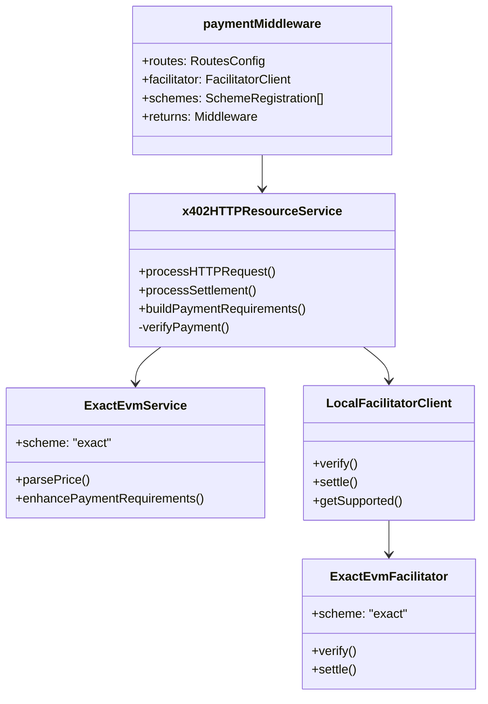

# Server Architecture

Detailed architecture of the reference TypeScript Express server implementation.

## Overview

**Location**: `e2e/servers/express/`
**Package**: `@x402/express`
**Source**: `typescript/packages/http/express/src/index.ts`

## Component Diagram



## Implementation Details

### Entry Point

**File**: `e2e/servers/express/index.ts`

```typescript
import express from "express";
import { paymentMiddleware } from "@x402/express";
import { ExactEvmService } from "@x402/evm";
import { localFacilitatorClient, NETWORK, PAYEE_ADDRESS } from "./facilitator";

const app = express();

app.use(
  paymentMiddleware(
    {
      "GET /protected": {
        payTo: PAYEE_ADDRESS,
        scheme: "exact",
        price: "$0.001",
        network: NETWORK,
      },
    },
    localFacilitatorClient,
    [{ network: NETWORK, server: new ExactEvmService() }]
  )
);

app.get("/protected", (req, res) => {
  res.json({
    message: "Protected endpoint accessed successfully",
    timestamp: new Date().toISOString(),
  });
});

app.listen(4021);
```

### Middleware Function

**File**: `typescript/packages/http/express/src/index.ts:63-181`

Key responsibilities:
1. Match routes requiring payment
2. Verify payment if provided
3. Execute route handler
4. Settle payment on success

### Request Processing Flow


## Configuration

### test.config.json

```json
{
  "name": "express",
  "type": "server",
  "language": "typescript",
  "protocol Families": ["evm"],
  "x402Version": 2,
  "endpoints": [
    {
      "path": "/protected",
      "method": "GET",
      "requiresPayment": true,
      "protocolFamily": "evm"
    },
    {
      "path": "/health",
      "method": "GET",
      "health": true
    },
    {
      "path": "/close",
      "method": "POST",
      "close": true
    }
  ],
  "environment": {
    "required": ["EVM_PRIVATE_KEY", "EVM_ADDRESS"],
    "optional": ["PORT"]
  }
}
```

### run.sh

```bash
#!/bin/bash
pnpm tsx index.ts
```

## Key Operations

### 1. Create HTTP Context

```typescript
const adapter = new ExpressAdapter(req);
const context: HTTPRequestContext = {
  adapter,
  path: req.path,
  method: req.method,
  paymentHeader: adapter.getHeader('payment-signature'),
};
```

### 2. Process Request

```typescript
const result = await server.processHTTPRequest(context, paywallConfig);

switch (result.type) {
  case 'no-payment-required':
    return next();

  case 'payment-error':
    // Return 402 response
    res.status(response.status);
    Object.entries(response.headers).forEach(([key, value]) => {
      res.setHeader(key, value);
    });
    res.json(response.body);
    return;

  case 'payment-verified':
    // Continue to handler, then settle
    break;
}
```

### 3. Wrap Response

```typescript
// Store original res.end
const originalEnd = res.end.bind(res);
let endArgs: EndArgs | null = null;

// Intercept res.end
res.end = function (...args: EndArgs) {
  endArgs = args;
  return res;
};

// Execute route handler
await next();

// Handler has completed, check status
if (res.statusCode >= 400) {
  // Error response, skip settlement
  res.end = originalEnd;
  if (endArgs) originalEnd(...endArgs);
  return;
}

// Success, settle payment
```

### 4. Settle Payment

```typescript
const settlementHeaders = await server.processSettlement(
  paymentPayload,
  requirements,
  res.statusCode
);

if (settlementHeaders) {
  Object.entries(settlementHeaders).forEach(([key, value]) => {
    res.setHeader(key, value);
  });
}

// Restore original end and send response
res.end = originalEnd;
if (endArgs) originalEnd(...endArgs);
```

## Local Facilitator

**File**: `e2e/servers/express/facilitator.ts`

```typescript
import { x402Facilitator } from "@x402/core/facilitator";
import { FacilitatorClient } from "@x402/core/server";
import { ExactEvmFacilitator } from "@x402/evm";
import { createWalletClient, http, publicActions } from "viem";
import { privateKeyToAccount } from "viem/accounts";
import { baseSepolia } from "viem/chains";

// Initialize wallet
const account = privateKeyToAccount(process.env.EVM_PRIVATE_KEY);
const viemClient = createWalletClient({
  account,
  chain: baseSepolia,
  transport: http()
}).extend(publicActions);

// Create facilitator
const facilitator = new x402Facilitator();
facilitator.registerScheme(
  "eip155:84532",
  new ExactEvmFacilitator(toFacilitatorEvmSigner(viemClient))
);

// Wrap as FacilitatorClient
export class LocalFacilitatorClient implements FacilitatorClient {
  readonly scheme = "exact";
  readonly x402Version = 2;

  constructor(private readonly facilitator: x402Facilitator) {}

  verify(payload, requirements) {
    return this.facilitator.verify(payload, requirements);
  }

  settle(payload, requirements) {
    return this.facilitator.settle(payload, requirements);
  }

  getSupported() {
    return Promise.resolve({
      kinds: [{
        x402Version: 2,
        scheme: "exact",
        network: "eip155:84532",
        extra: {},
      }],
      extensions: [],
    });
  }
}

export const localFacilitatorClient = new LocalFacilitatorClient(facilitator);
```

## Route Configuration

### Single Route

```typescript
const routes = {
  scheme: "exact",
  payTo: ADDRESS,
  price: "$0.001",
  network: "eip155:84532"
};
```

### Multiple Routes

```typescript
const routes = {
  "GET /free": undefined,  // Free endpoint
  "GET /cheap": {
    scheme: "exact",
    payTo: ADDRESS,
    price: "$0.01",
    network: "eip155:84532"
  },
  "POST /expensive": {
    scheme: "exact",
    payTo: ADDRESS,
    price: "$1.00",
    network: "eip155:84532",
    description: "Expensive operation",
    mimeType: "application/json"
  }
};
```

### Route Patterns

```typescript
// Exact match
"GET /protected"

// Wildcard
"GET /api/*"

// Parameter
"GET /users/:id"

// Catch-all (if not using object notation)
const routes = { scheme: "exact", ... };  // Applies to all routes
```

## EVM Service Implementation

**File**: `typescript/packages/mechanisms/evm/src/exact/index.ts:298-459`

```typescript
class ExactEvmService implements SchemeNetworkService {
  readonly scheme = "exact";

  parsePrice(price: Price, network: Network): AssetAmount {
    // "$0.001" -> { amount: "1000", asset: "0x...", extra: {...} }
    const amount = this.convertToTokenAmount(price, network);
    const assetInfo = this.getDefaultAsset(network);
    return {
      amount,
      asset: assetInfo.address,
      extra: {
        name: assetInfo.name,
        version: assetInfo.version
      }
    };
  }

  enhancePaymentRequirements(requirements, supportedKind, extensions) {
    // Currently no enhancements needed for exact scheme
    return Promise.resolve(requirements);
  }
}
```

## Error Handling

### Payment Verification Errors

```typescript
if (!verifyResponse.isValid) {
  return {
    type: 'payment-error',
    response: {
      status: 402,
      headers: { 'PAYMENT-REQUIRED': encoded },
      body: { error: verifyResponse.invalidReason }
    }
  };
}
```

### Settlement Errors

```typescript
try {
  const settlementHeaders = await server.processSettlement(...);
  // Success
} catch (error) {
  console.error(error);
  if (!res.headersSent) {
    res.status(402).json({
      error: 'Settlement failed',
      details: error.message
    });
  }
}
```

### Route Handler Errors

```typescript
// If handler returns error status, skip settlement
if (res.statusCode >= 400) {
  // No settlement, send response as-is
  res.end = originalEnd;
  if (endArgs) originalEnd(...endArgs);
  return;
}
```

## Utility Endpoints

### Health Check

```typescript
app.get("/health", (req, res) => {
  res.json({
    status: "ok",
    network: NETWORK,
    payee: PAYEE_ADDRESS,
    version: "2.0.0"
  });
});
```

### Graceful Shutdown

```typescript
app.post("/close", (req, res) => {
  res.json({ message: "Server shutting down gracefully" });
  setTimeout(() => process.exit(0), 100);
});
```

## Usage Examples

### Basic Protected Endpoint

```typescript
app.use(paymentMiddleware(
  { "GET /data": { payTo: ADDRESS, price: "$0.01", network: NETWORK, scheme: "exact" } },
  facilitator,
  [{ network: NETWORK, server: new ExactEvmService() }]
));

app.get("/data", (req, res) => {
  res.json({ data: "sensitive information" });
});
```

### Dynamic Pricing

```typescript
app.post("/compute", async (req, res) => {
  const cost = estimateComputeCost(req.body);

  // Custom price validation could be added here
  // Current implementation uses static prices from route config

  res.json({ result: await processCompute(req.body) });
});
```

### Conditional Payment

```typescript
app.use(rateLimitMiddleware);  // Apply rate limiting first

app.use(paymentMiddleware({
  "GET /api/*": {
    payTo: ADDRESS,
    price: "$0.001",
    network: NETWORK,
    scheme: "exact"
  }
}, facilitator, schemes));

// Free tier users will hit rate limit
// Paid requests bypass rate limit via payment middleware
```

## Next Steps

- **Client Architecture**: [Client Architecture](./client-architecture.md)
- **Facilitator**: [Facilitator Architecture](./facilitator-architecture.md)
- **Payment Flow**: [Happy Path](../02-protocol-flows/happy-path.md)

---

*Reference: `e2e/servers/express/` and `typescript/packages/http/express/`*
