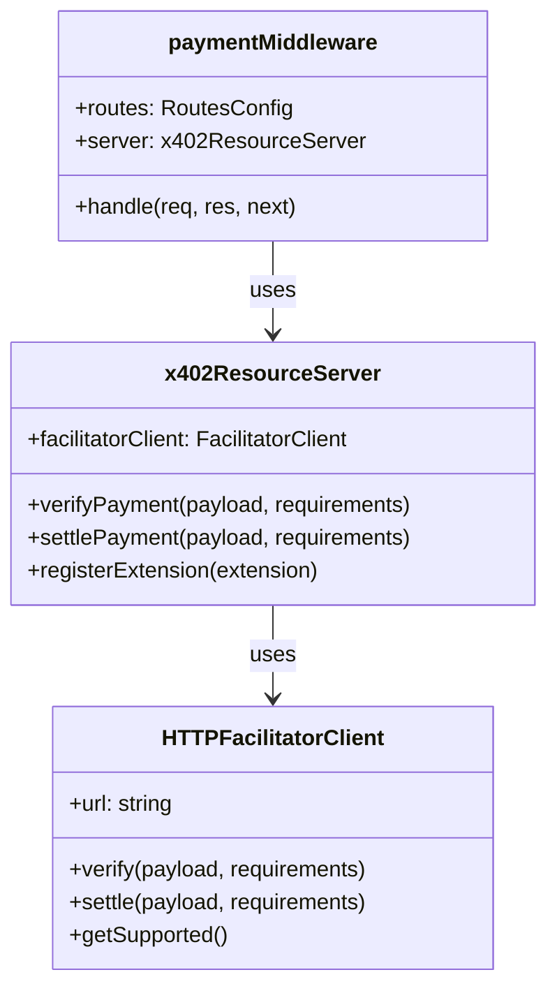
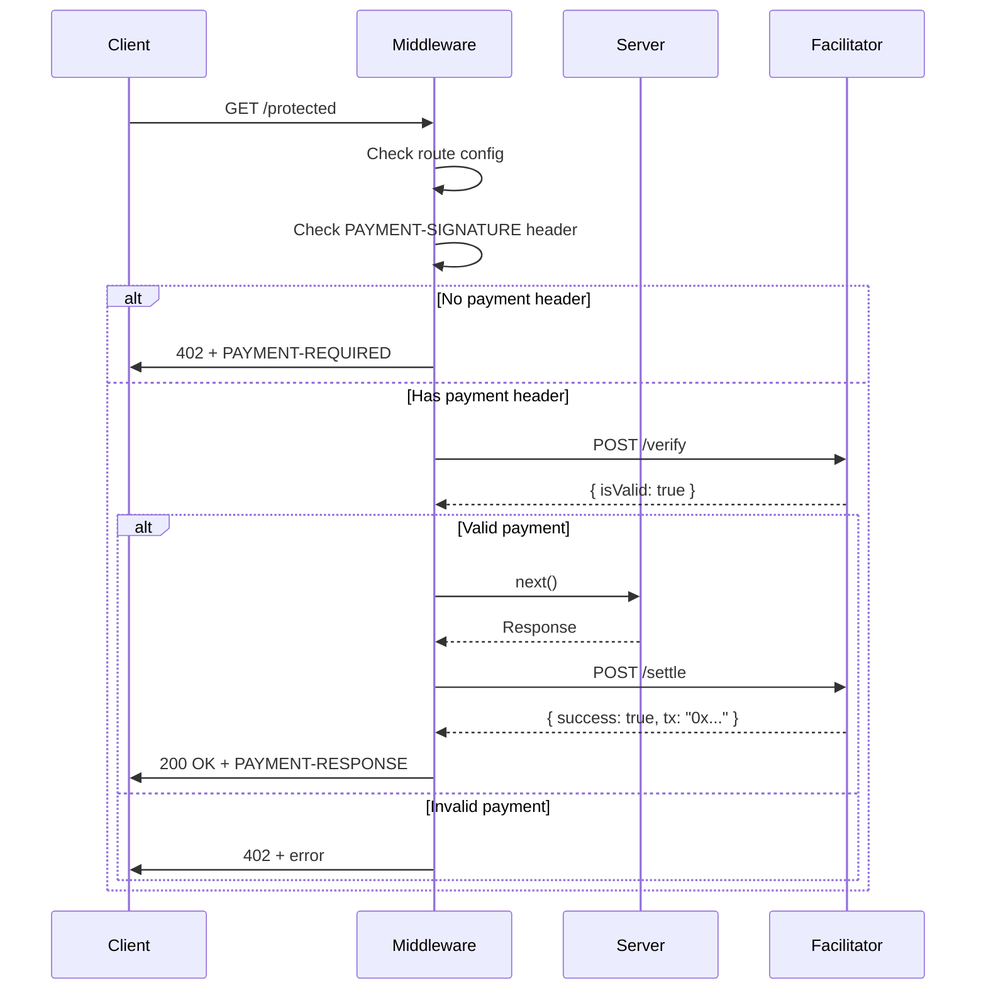

<!-- VERIFIED: 3c3e2168 -->
# Server Architecture

This document describes the reference server implementation that demonstrates how to protect Express endpoints with x402 payment requirements.

## Overview

The reference server uses Express with x402 payment middleware to:

1. Protect endpoints with payment requirements
2. Verify payments through a facilitator
3. Settle payments after serving protected content
4. Support multiple blockchain networks

## Source Code

Location: `e2e/servers/express/index.ts`

```typescript
import express from "express";
import { paymentMiddleware } from "@x402/express";
import { x402ResourceServer, HTTPFacilitatorClient } from "@x402/core/server";
import { registerExactEvmScheme } from "@x402/evm/exact/server";
import { registerExactSvmScheme } from "@x402/svm/exact/server";
import { bazaarResourceServerExtension, declareDiscoveryExtension } from "@x402/extensions/bazaar";

const PORT = process.env.PORT || "4021";
const EVM_NETWORK = "eip155:84532" as const;
const SVM_NETWORK = "solana:EtWTRABZaYq6iMfeYKouRu166VU2xqa1" as const;

// Initialize Express
const app = express();

// Create facilitator client
const facilitatorClient = new HTTPFacilitatorClient({ url: process.env.FACILITATOR_URL });

// Create resource server
const server = new x402ResourceServer(facilitatorClient);

// Register payment schemes
registerExactEvmScheme(server);
registerExactSvmScheme(server);

// Register extensions
server.registerExtension(bazaarResourceServerExtension);

// Apply payment middleware
app.use(paymentMiddleware({
  "GET /protected": {
    accepts: {
      payTo: process.env.EVM_PAYEE_ADDRESS,
      scheme: "exact",
      price: "$0.001",
      network: EVM_NETWORK,
    },
  },
  "GET /protected-svm": {
    accepts: {
      payTo: process.env.SVM_PAYEE_ADDRESS,
      scheme: "exact",
      price: "$0.001",
      network: SVM_NETWORK,
    },
  },
}, server));

// Protected endpoints
app.get("/protected", (req, res) => {
  res.json({ message: "Protected endpoint accessed successfully" });
});

app.get("/protected-svm", (req, res) => {
  res.json({ message: "Protected endpoint accessed successfully" });
});

// Health check (no payment required)
app.get("/health", (req, res) => {
  res.json({ status: "ok" });
});

app.listen(parseInt(PORT));
```

## Class Structure


```mermaid
classDiagram
    class x402ResourceServer {
        +facilitatorClient: FacilitatorClient
        +verifyPayment(payload, requirements)
        +settlePayment(payload, requirements)
        +registerExtension(extension)
    }

    class HTTPFacilitatorClient {
        +url: string
        +verify(payload, requirements)
        +settle(payload, requirements)
        +getSupported()
    }

    class paymentMiddleware {
        +routes: RoutesConfig
        +server: x402ResourceServer
        +handle(req, res, next)
    }

    x402ResourceServer --> HTTPFacilitatorClient : uses
    paymentMiddleware --> x402ResourceServer : uses
```

## Middleware Flow


```mermaid
sequenceDiagram
    participant Client
    participant Middleware
    participant Server
    participant Facilitator

    Client->>Middleware: GET /protected
    Middleware->>Middleware: Check route config
    Middleware->>Middleware: Check PAYMENT-SIGNATURE header

    alt No payment header
        Middleware->>Client: 402 + PAYMENT-REQUIRED
    else Has payment header
        Middleware->>Facilitator: POST /verify
        Facilitator-->>Middleware: { isValid: true }

        alt Valid payment
            Middleware->>Server: next()
            Server-->>Middleware: Response
            Middleware->>Facilitator: POST /settle
            Facilitator-->>Middleware: { success: true, tx: "0x..." }
            Middleware->>Client: 200 OK + PAYMENT-RESPONSE
        else Invalid payment
            Middleware->>Client: 402 + error
        end
    end
```

## Route Configuration

Routes are configured as a mapping from method+path to payment requirements:

```typescript
{
  "GET /protected": {
    accepts: {
      scheme: "exact",
      network: "eip155:84532",
      payTo: "0x...",
      price: "$0.001",
    },
    description: "Protected endpoint",
  },
}
```

### Route Pattern Format

- `"GET /path"` - Matches GET requests to /path
- `"POST /api/*"` - Wildcard matches any path under /api/
- `"GET /users/:id"` - Parameter patterns

### Payment Options

Single option:
```typescript
accepts: { scheme: "exact", network: "...", payTo: "...", price: "..." }
```

Multiple options (multi-chain):
```typescript
accepts: [
  { scheme: "exact", network: "eip155:84532", payTo: evmAddress, price: "$0.001" },
  { scheme: "exact", network: "solana:...", payTo: solanaAddress, price: "$0.001" },
]
```

## Key Components

### 1. Facilitator Client

```typescript
const facilitatorClient = new HTTPFacilitatorClient({
  url: process.env.FACILITATOR_URL
});
```

Connects to the facilitator service for payment verification and settlement.

### 2. Resource Server

```typescript
const server = new x402ResourceServer(facilitatorClient);
registerExactEvmScheme(server);
registerExactSvmScheme(server);
```

Creates the resource server and registers supported payment schemes.

### 3. Payment Middleware

```typescript
app.use(paymentMiddleware(routes, server));
```

Applies payment protection to configured routes.

### 4. Extensions

```typescript
server.registerExtension(bazaarResourceServerExtension);
```

Registers protocol extensions like Bazaar discovery.

## Extension: Bazaar Discovery

The reference server includes Bazaar discovery metadata:

```typescript
"GET /protected": {
  accepts: { /* ... */ },
  extensions: {
    ...declareDiscoveryExtension({
      output: {
        example: { message: "...", timestamp: "..." },
        schema: {
          properties: {
            message: { type: "string" },
            timestamp: { type: "string" },
          },
        },
      },
    }),
  },
}
```

This allows clients to discover:
- What the endpoint returns
- Schema of the response
- Example output

## HTTP Headers

### Request Headers

- `PAYMENT-SIGNATURE` - Base64-encoded payment payload

### Response Headers

- `PAYMENT-REQUIRED` - Base64-encoded payment requirements (402 response)
- `PAYMENT-RESPONSE` - Base64-encoded settlement confirmation (200 response)

## Endpoints

| Endpoint | Payment Required | Description |
|----------|------------------|-------------|
| `GET /protected` | Yes (EVM) | Protected EVM endpoint |
| `GET /protected-svm` | Yes (SVM) | Protected Solana endpoint |
| `GET /health` | No | Health check |
| `POST /close` | No | Shutdown server |

## Environment Variables

| Variable | Description |
|----------|-------------|
| `PORT` | Server port (default: 4021) |
| `EVM_PAYEE_ADDRESS` | EVM address to receive payments |
| `SVM_PAYEE_ADDRESS` | Solana address to receive payments |
| `FACILITATOR_URL` | URL of the facilitator service |

## Next Steps

- [Client Architecture](./client-architecture.md) - Reference client implementation
- [Facilitator Architecture](./facilitator-architecture.md) - Reference facilitator implementation
