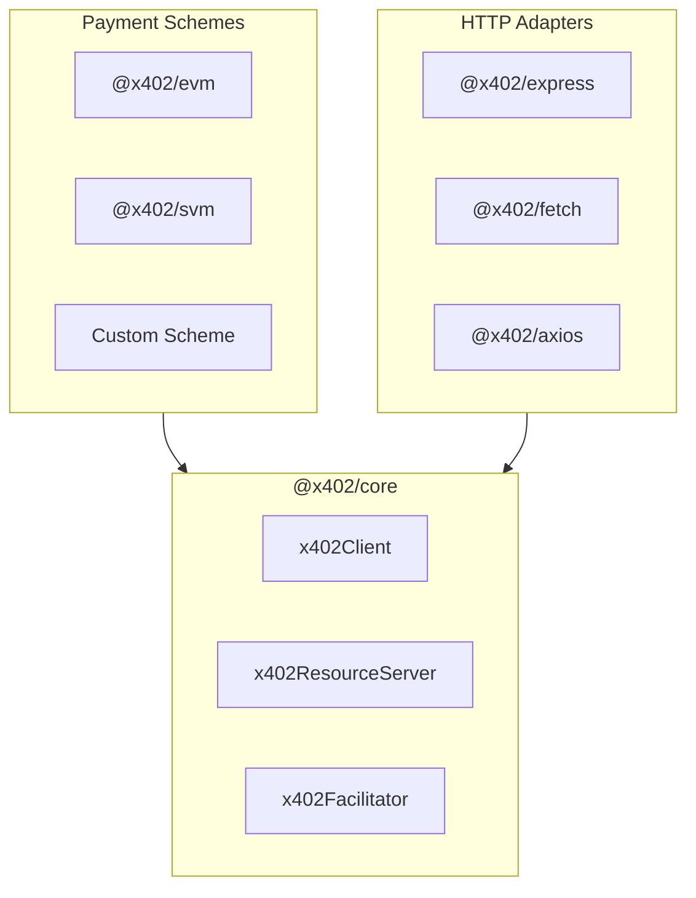

<!-- VERIFIED: 0aa62c64 -->
# Implementation Guide

This section provides deep-dive documentation for developers who want to extend or customize x402 implementations beyond the standard SDK usage.

## Who This Is For

- Developers implementing custom payment schemes
- Teams building custom facilitators
- Contributors to the x402 ecosystem
- Advanced users who need to understand internals

## Contents

- [Advanced Patterns](./advanced-patterns.md) - Lifecycle hooks, dynamic pricing, marketplace routing
- [Client Implementation](./client-implementation.md) - Building custom x402 clients
- [Server Implementation](./server-implementation.md) - Building custom resource servers
- [Facilitator Implementation](./facilitator-implementation.md) - Building custom facilitators
- [Payment Schemes](./payment-schemes.md) - Understanding and creating payment schemes
- [Types and Interfaces](./types-and-interfaces.md) - Complete type reference

## Source Code Reference

Implementation examples are available in the repository:

| Location | Purpose |
|----------|---------|
| `e2e/` | Tested, minimal implementations (canonical patterns) |
| `examples/typescript/servers/advanced/` | Advanced server patterns |
| `examples/typescript/clients/advanced/` | Advanced client patterns |
| `examples/typescript/facilitator/` | Facilitator reference |

> [!NOTE]
> Exclude all `/legacy/` paths - they contain V1 implementations incompatible with V2 documentation.

## Architecture Overview

The x402 SDK follows a scheme-based architecture where payment logic is encapsulated in scheme implementations:



## Key Concepts

### Scheme Registration

All three components (client, server, facilitator) use a registration pattern:

```typescript
// Client
registerExactEvmScheme(client, { signer });

// Server
registerExactEvmScheme(server);

// Facilitator
registerExactEvmScheme(facilitator, { signer, networks });
```

### Lifecycle Hooks

Each component supports hooks for customization:

| Component | Available Hooks |
|-----------|-----------------|
| Client | `onBeforePaymentCreation`, `onAfterPaymentCreation`, `onPaymentCreationFailure` |
| Server | `onBeforeVerify`, `onAfterVerify`, `onVerifyFailure`, `onBeforeSettle`, `onAfterSettle`, `onSettleFailure` |
| Facilitator | `onBeforeVerify`, `onAfterVerify`, `onVerifyFailure`, `onBeforeSettle`, `onAfterSettle`, `onSettleFailure` |

### Network Identifiers

x402 v2 uses CAIP-2 network identifiers:

| Chain | Format | Example |
|-------|--------|---------|
| EVM | `eip155:<chainId>` | `eip155:84532` (Base Sepolia) |
| Solana | `solana:<genesisHash>` | `solana:EtWTRABZaYq6iMfeYKouRu166VU2xqa1` |

## Getting Started

Choose your implementation path:

1. **Custom Client** - Start with [Client Implementation](./client-implementation.md)
2. **Custom Server** - Start with [Server Implementation](./server-implementation.md)
3. **Custom Facilitator** - Start with [Facilitator Implementation](./facilitator-implementation.md)
4. **Custom Payment Scheme** - Start with [Payment Schemes](./payment-schemes.md)
