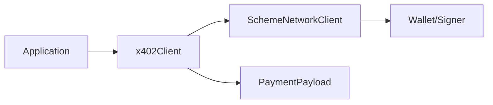

<!-- VERIFIED: 0aa62c64 -->
# Client Implementation

This guide explains how to build custom x402 clients or extend the existing client implementation.

## Overview

The `x402Client` class manages payment scheme registration, requirement selection, and payment payload creation. It operates locally and never communicates directly with facilitators.



## Key Interfaces

### SchemeNetworkClient

Every payment scheme must implement this interface for client-side operations:

```typescript
interface SchemeNetworkClient {
  readonly scheme: string;

  createPaymentPayload(
    x402Version: number,
    paymentRequirements: PaymentRequirements,
  ): Promise<Pick<PaymentPayload, "x402Version" | "payload">>;
}
```

The `createPaymentPayload` method signs a payment authorization locally using the wallet.

### x402Client Methods

```typescript
class x402Client {
  // Register a scheme for the current x402 version
  register(network: Network, client: SchemeNetworkClient): x402Client;

  // Register a scheme for x402 v1
  registerV1(network: string, client: SchemeNetworkClient): x402Client;

  // Register a policy to filter payment requirements
  registerPolicy(policy: PaymentPolicy): x402Client;

  // Create a payment payload from server requirements
  createPaymentPayload(paymentRequired: PaymentRequired): Promise<PaymentPayload>;
}
```

## Implementation Steps

### 1. Basic Client Setup

```typescript
import { x402Client } from "@x402/core/client";

const client = new x402Client();
```

### 2. Register Payment Schemes

Register schemes for each network you want to support:

```typescript
import { registerExactEvmScheme } from "@x402/evm/exact/client";
import { registerExactSvmScheme } from "@x402/svm/exact/client";
import { privateKeyToAccount } from "viem/accounts";
import { createKeyPairSignerFromBytes } from "@solana/kit";
import { base58 } from "@scure/base";

// EVM signer
const evmSigner = privateKeyToAccount(process.env.EVM_PRIVATE_KEY as `0x${string}`);
registerExactEvmScheme(client, { signer: evmSigner });

// Solana signer
const svmSigner = await createKeyPairSignerFromBytes(
  base58.decode(process.env.SVM_PRIVATE_KEY!)
);
registerExactSvmScheme(client, { signer: svmSigner });
```

### 3. Create Payment Payloads

When a server returns 402, parse the requirements and create a payment:

```typescript
const paymentRequired: PaymentRequired = JSON.parse(
  atob(response.headers.get("PAYMENT-REQUIRED")!)
);

const paymentPayload = await client.createPaymentPayload(paymentRequired);
```

### 4. Wrap HTTP Client

For automatic 402 handling, wrap your HTTP client:

```typescript
import { wrapFetchWithPayment } from "@x402/fetch";

const fetchWithPayment = wrapFetchWithPayment(fetch, client);
const response = await fetchWithPayment("https://api.example.com/protected");
```

## Payment Policies

Policies filter payment requirements before selection. Use them to implement preferences:

```typescript
// Prefer EVM networks
client.registerPolicy((version, requirements) =>
  requirements.filter(r => r.network.startsWith("eip155:"))
);

// Filter out expensive options
client.registerPolicy((version, requirements) =>
  requirements.filter(r => BigInt(r.amount) < BigInt("1000000"))
);

// Prefer specific assets
client.registerPolicy((version, requirements) =>
  requirements.filter(r => r.asset === "0x833589fCD6eDb6E08f4c7C32D4f71b54bdA02913")
);
```

Policies are applied in order, and the first remaining option is selected.

## Lifecycle Hooks

### onBeforePaymentCreation

Executes before signing. Can abort payment creation:

```typescript
client.onBeforePaymentCreation(async (context) => {
  console.log("Creating payment for:", context.selectedRequirements.amount);

  if (BigInt(context.selectedRequirements.amount) > maxAmount) {
    return { abort: true, reason: "Amount exceeds limit" };
  }
});
```

### onAfterPaymentCreation

Executes after successful payment creation:

```typescript
client.onAfterPaymentCreation(async (context) => {
  console.log("Payment created:", context.paymentPayload);
  await logPayment(context.paymentPayload);
});
```

### onPaymentCreationFailure

Executes when payment creation fails. Can recover:

```typescript
client.onPaymentCreationFailure(async (context) => {
  console.error("Payment failed:", context.error);

  // Attempt recovery with fallback
  if (fallbackPayload) {
    return { recovered: true, payload: fallbackPayload };
  }
});
```

## Custom Scheme Integration

To implement a custom scheme, create a class implementing `SchemeNetworkClient`:

```typescript
import { SchemeNetworkClient } from "@x402/core";

class CustomSchemeClient implements SchemeNetworkClient {
  readonly scheme = "custom";

  constructor(private signer: CustomSigner) {}

  async createPaymentPayload(
    x402Version: number,
    requirements: PaymentRequirements,
  ): Promise<Pick<PaymentPayload, "x402Version" | "payload">> {
    // Sign the payment authorization
    const signature = await this.signer.sign({
      amount: requirements.amount,
      asset: requirements.asset,
      payTo: requirements.payTo,
      nonce: generateNonce(),
    });

    return {
      x402Version,
      payload: {
        signature,
        from: this.signer.address,
        // ... other scheme-specific fields
      },
    };
  }
}

// Register with client
client.register("custom:network", new CustomSchemeClient(signer));
```

## Custom Payment Requirements Selector

Override the default selector to implement custom selection logic:

```typescript
const client = new x402Client((x402Version, requirements) => {
  // Select cheapest option
  return requirements.reduce((min, req) =>
    BigInt(req.amount) < BigInt(min.amount) ? req : min
  );
});
```

## Static Configuration

Create a client from a configuration object:

```typescript
const client = x402Client.fromConfig({
  schemes: [
    {
      network: "eip155:84532",
      client: new ExactEvmSchemeClient(evmSigner),
    },
    {
      network: "solana:EtWTRABZaYq6iMfeYKouRu166VU2xqa1",
      client: new ExactSvmSchemeClient(svmSigner),
    },
  ],
  policies: [
    (version, reqs) => reqs.filter(r => r.network.startsWith("eip155:")),
  ],
  paymentRequirementsSelector: (version, reqs) => reqs[0],
});
```

## Error Handling

```typescript
try {
  const payload = await client.createPaymentPayload(paymentRequired);
} catch (error) {
  if (error.message.includes("No client registered")) {
    // Server requires unsupported payment method
  } else if (error.message.includes("Payment creation aborted")) {
    // Hook aborted the payment
  } else if (error.message.includes("filtered out by policies")) {
    // All options filtered by policies
  }
}
```

## Next Steps

- [Server Implementation](./server-implementation.md) - Building resource servers
- [Payment Schemes](./payment-schemes.md) - Creating custom schemes
- [Types and Interfaces](./types-and-interfaces.md) - Complete type reference
