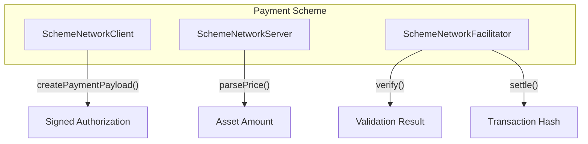

<!-- VERIFIED: 0aa62c64 -->
# Payment Schemes

Payment schemes define how payments are authorized, verified, and settled on specific blockchain networks. This guide explains the scheme architecture and how to create custom schemes.

## What is a Payment Scheme?

A payment scheme encapsulates:

1. **Client-side signing** - How payments are authorized locally
2. **Server-side pricing** - How prices are converted to on-chain amounts
3. **Facilitator verification** - How signatures are validated
4. **Facilitator settlement** - How payments are executed on-chain



## Built-in Schemes

> [!NOTE]
> **Roadmap: New Payment Schemes**
> Several new payment schemes are planned:
> - **Usage-Based (`upto`)** - Post-computed pricing for metered APIs (Q4 2025)
> - **Commerce** - Refunds and escrow for e-commerce (Q1 2026)
> - **Deferred** - Pay-later flows (community contribution)
>
> [View Roadmap](../../09-appendix/roadmap.md#now-in-progress)

### Exact EVM Scheme

Uses EIP-3009 `transferWithAuthorization` for gasless USDC transfers on EVM chains.

**Supported Networks:**

| Network | Chain ID | CAIP-2 Identifier |
|---------|----------|-------------------|
| Base Mainnet | 8453 | `eip155:8453` |
| Base Sepolia | 84532 | `eip155:84532` |
| Ethereum Mainnet | 1 | `eip155:1` |

**How It Works:**

1. Client signs EIP-3009 authorization message
2. Facilitator verifies signature off-chain
3. Facilitator calls `transferWithAuthorization` on USDC contract
4. USDC transfers from payer to payee in single transaction

### Exact SVM Scheme

Uses SPL Token transfers on Solana for USDC payments.

**Supported Networks:**

| Network | Genesis Hash | CAIP-2 Identifier |
|---------|--------------|-------------------|
| Solana Devnet | `EtWTRABZ...` | `solana:EtWTRABZaYq6iMfeYKouRu166VU2xqa1` |
| Solana Mainnet | `5eykt4Us...` | `solana:5eykt4UsFv8P8NJdTREpY1vzqKqZKvdpKuc147dw2N9d` |

**How It Works:**

1. Client signs SPL Token transfer instruction
2. Facilitator verifies signature and instruction validity
3. Facilitator submits transaction with fee payer signature
4. Token transfers from payer to payee

## Scheme Interfaces

### SchemeNetworkClient

Client-side interface for payment signing:

```typescript
interface SchemeNetworkClient {
  readonly scheme: string;

  createPaymentPayload(
    x402Version: number,
    paymentRequirements: PaymentRequirements,
  ): Promise<Pick<PaymentPayload, "x402Version" | "payload">>;
}
```

### SchemeNetworkServer

Server-side interface for price parsing:

```typescript
interface SchemeNetworkServer {
  readonly scheme: string;

  parsePrice(price: Price, network: Network): Promise<AssetAmount>;

  enhancePaymentRequirements(
    paymentRequirements: PaymentRequirements,
    supportedKind: SupportedKind,
    facilitatorExtensions: string[],
  ): Promise<PaymentRequirements>;
}
```

### SchemeNetworkFacilitator

Facilitator interface for verification and settlement:

```typescript
interface SchemeNetworkFacilitator {
  readonly scheme: string;
  readonly caipFamily: string;

  getExtra(network: Network): Record<string, unknown> | undefined;
  getSigners(network: string): string[];

  verify(payload: PaymentPayload, requirements: PaymentRequirements): Promise<VerifyResponse>;
  settle(payload: PaymentPayload, requirements: PaymentRequirements): Promise<SettleResponse>;
}
```

## Creating Custom Schemes

### Step 1: Define Scheme Name

Choose a unique scheme identifier:

```typescript
const SCHEME_NAME = "streaming"; // For streaming micropayments
```

### Step 2: Implement Client

```typescript
import { SchemeNetworkClient, PaymentRequirements, PaymentPayload } from "@x402/core";

export class StreamingSchemeClient implements SchemeNetworkClient {
  readonly scheme = "streaming";

  constructor(private signer: StreamingSigner) {}

  async createPaymentPayload(
    x402Version: number,
    requirements: PaymentRequirements,
  ): Promise<Pick<PaymentPayload, "x402Version" | "payload">> {
    // Generate unique stream ID
    const streamId = crypto.randomUUID();

    // Sign stream authorization
    const authorization = await this.signer.signStreamAuthorization({
      streamId,
      recipient: requirements.payTo,
      maxAmount: requirements.amount,
      asset: requirements.asset,
      validUntil: Date.now() + requirements.maxTimeoutSeconds * 1000,
    });

    return {
      x402Version,
      payload: {
        streamId,
        authorization,
        from: this.signer.address,
      },
    };
  }
}
```

### Step 3: Implement Server

```typescript
import { SchemeNetworkServer, Price, Network, AssetAmount, PaymentRequirements, SupportedKind } from "@x402/core";

export class StreamingSchemeServer implements SchemeNetworkServer {
  readonly scheme = "streaming";

  async parsePrice(price: Price, network: Network): Promise<AssetAmount> {
    // Convert price to streaming token amount
    if (typeof price === "string" && price.startsWith("$")) {
      const dollars = parseFloat(price.slice(1));
      const amount = Math.floor(dollars * 1_000_000).toString(); // 6 decimals

      return {
        amount,
        asset: getStreamingTokenAddress(network),
      };
    }

    // Handle AssetAmount directly
    return price as AssetAmount;
  }

  async enhancePaymentRequirements(
    requirements: PaymentRequirements,
    supportedKind: SupportedKind,
    facilitatorExtensions: string[],
  ): Promise<PaymentRequirements> {
    return {
      ...requirements,
      extra: {
        ...requirements.extra,
        streamingContract: getStreamingContract(requirements.network),
      },
    };
  }
}
```

### Step 4: Implement Facilitator

```typescript
import {
  SchemeNetworkFacilitator,
  PaymentPayload,
  PaymentRequirements,
  VerifyResponse,
  SettleResponse,
  Network,
} from "@x402/core";

export class StreamingSchemeFacilitator implements SchemeNetworkFacilitator {
  readonly scheme = "streaming";
  readonly caipFamily = "streaming:*";

  constructor(private signer: FacilitatorSigner) {}

  getExtra(network: Network): Record<string, unknown> | undefined {
    return {
      streamingContract: getStreamingContract(network),
    };
  }

  getSigners(network: string): string[] {
    return [this.signer.address];
  }

  async verify(
    payload: PaymentPayload,
    requirements: PaymentRequirements,
  ): Promise<VerifyResponse> {
    const { streamId, authorization, from } = payload.payload as StreamingPayload;

    // Verify authorization signature
    const isValid = await verifyStreamAuthorization(authorization, {
      streamId,
      recipient: requirements.payTo,
      maxAmount: requirements.amount,
      from,
    });

    if (!isValid) {
      return { isValid: false, invalidReason: "Invalid stream authorization" };
    }

    // Check stream hasn't been used
    if (await isStreamUsed(streamId)) {
      return { isValid: false, invalidReason: "Stream already used" };
    }

    return { isValid: true, payer: from };
  }

  async settle(
    payload: PaymentPayload,
    requirements: PaymentRequirements,
  ): Promise<SettleResponse> {
    const { streamId, authorization, from } = payload.payload as StreamingPayload;

    // Execute stream settlement on-chain
    const tx = await this.signer.executeStreamSettlement({
      streamId,
      authorization,
      from,
      to: requirements.payTo,
      amount: requirements.amount,
    });

    return {
      success: true,
      transaction: tx.hash,
      network: requirements.network,
      payer: from,
    };
  }
}
```

### Step 5: Create Registration Functions

```typescript
import { x402Client } from "@x402/core/client";
import { x402ResourceServer } from "@x402/core/server";
import { x402Facilitator } from "@x402/core/facilitator";

export function registerStreamingScheme(
  client: x402Client,
  options: { signer: StreamingSigner },
): void {
  const schemeClient = new StreamingSchemeClient(options.signer);
  client.register("streaming:mainnet", schemeClient);
}

export function registerStreamingScheme(server: x402ResourceServer): void {
  const schemeServer = new StreamingSchemeServer();
  server.register("streaming:mainnet", schemeServer);
}

export function registerStreamingScheme(
  facilitator: x402Facilitator,
  options: { signer: FacilitatorSigner; networks: Network | Network[] },
): void {
  const schemeFacilitator = new StreamingSchemeFacilitator(options.signer);
  facilitator.register(options.networks, schemeFacilitator);
}
```

### Step 6: Usage

```typescript
// Client
const client = new x402Client();
registerStreamingScheme(client, { signer: streamingSigner });

// Server
const server = new x402ResourceServer(facilitatorClient);
registerStreamingScheme(server);

// Facilitator
const facilitator = new x402Facilitator();
registerStreamingScheme(facilitator, {
  signer: facilitatorSigner,
  networks: "streaming:mainnet",
});
```

## Scheme Design Considerations

### Security

- **Replay protection** - Use nonces or unique identifiers
- **Expiration** - Include validity windows
- **Amount validation** - Verify amounts match requirements

### Performance

- **Signature size** - Minimize payload size for HTTP headers
- **Verification speed** - Optimize off-chain verification
- **Settlement batching** - Consider batching for high volume

### Compatibility

- **CAIP-2 compliance** - Use standard network identifiers
- **Asset identification** - Use contract addresses or standard asset IDs
- **Version support** - Handle both v1 and v2 protocol versions

## Testing Custom Schemes

```typescript
describe("StreamingScheme", () => {
  it("creates valid payment payload", async () => {
    const client = new StreamingSchemeClient(mockSigner);
    const requirements: PaymentRequirements = {
      scheme: "streaming",
      network: "streaming:mainnet",
      amount: "1000000",
      asset: "0x...",
      payTo: "0x...",
      maxTimeoutSeconds: 300,
      extra: {},
    };

    const payload = await client.createPaymentPayload(2, requirements);

    expect(payload.x402Version).toBe(2);
    expect(payload.payload.streamId).toBeDefined();
    expect(payload.payload.authorization).toBeDefined();
  });

  it("verifies valid authorization", async () => {
    const facilitator = new StreamingSchemeFacilitator(mockSigner);
    const payload = createTestPayload();
    const requirements = createTestRequirements();

    const result = await facilitator.verify(payload, requirements);

    expect(result.isValid).toBe(true);
    expect(result.payer).toBe(payload.payload.from);
  });
});
```

## Next Steps

- [Types and Interfaces](./types-and-interfaces.md) - Complete type reference
- [Client Implementation](./client-implementation.md) - Client architecture details
- [Facilitator Implementation](./facilitator-implementation.md) - Facilitator architecture details
