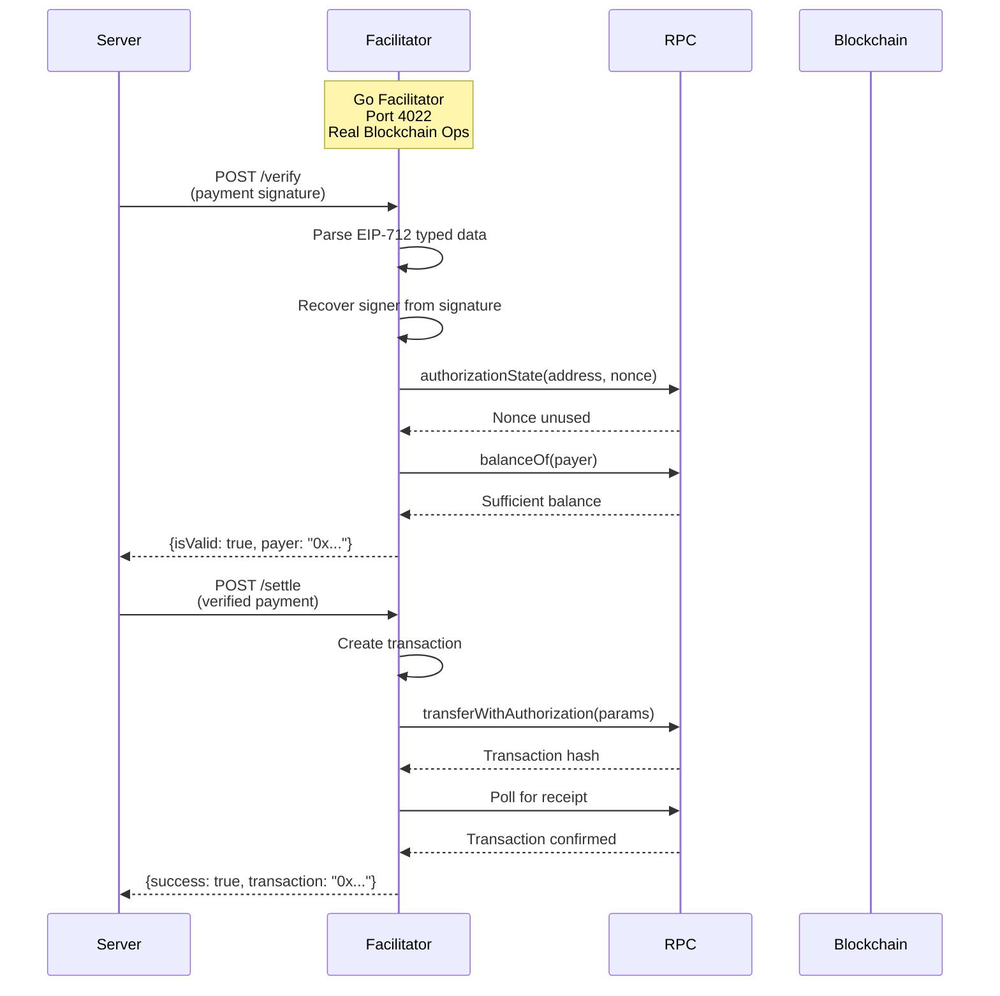
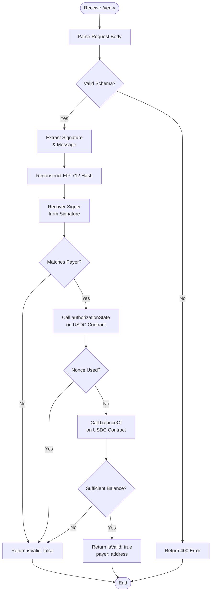
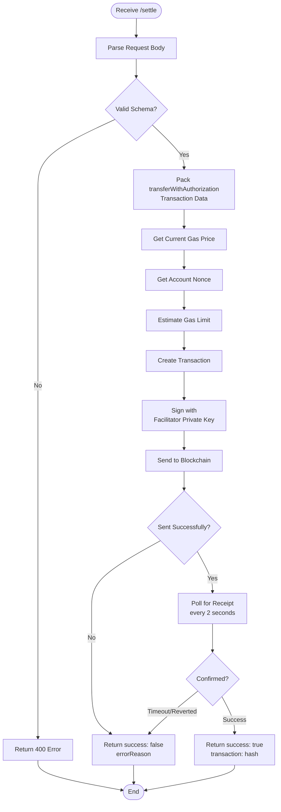

# Go Facilitator Reference Implementation

Reference implementation of a high-performance standalone x402 v2 facilitator HTTP service in Go.

## Location

**Path**: `/e2e/facilitators/go/`

**Key Files**:
- `main.go` - Main facilitator implementation
- `go.mod` - Go module dependencies
- `test.config.json` - Test configuration
- `run.sh` - Execution script for test harness
- `README.md` - Implementation-specific documentation

## Overview

The Go facilitator is a high-performance standalone HTTP service that performs real blockchain operations for x402 v2 payment verification and settlement. It demonstrates integration with the x402 Go SDK and serves as a reference for production-grade facilitator deployments.

**Features**:
- Real EIP-712 signature verification using go-ethereum
- Actual blockchain contract reads via RPC
- On-chain USDC settlement via `transferWithAuthorization`
- Transaction monitoring and confirmation
- V1 backward compatibility support
- Production-ready error handling

## Architecture

The Go facilitator performs actual blockchain operations, making it suitable for production deployment.



## Configuration

### Environment Variables

**Required**:
- `EVM_PRIVATE_KEY` - Private key for the facilitator's EVM account (must have ETH for gas)
- `EVM_NETWORK` - Network identifier (e.g., `eip155:84532` for Base Sepolia)

**Optional**:
- `PORT` - HTTP server port (default: `4022`)
- `EVM_RPC_URL` - RPC endpoint URL (default: `https://sepolia.base.org`)

### Test Configuration

**File**: `test.config.json`

```json
{
  "name": "go",
  "type": "facilitator",
  "language": "go",
  "protocolFamilies": ["evm"],
  "x402Versions": [2],
  "environment": {
    "required": ["PORT", "EVM_PRIVATE_KEY"],
    "optional": ["EVM_NETWORK"]
  }
}
```

### Supported Networks

- **Base Sepolia** (`eip155:84532`) - Primary testnet
- **EVM Networks** - Any EVM-compatible network with USDC support

**Note**: The Go facilitator uses real RPC connections and requires a reliable endpoint for production use.

## Endpoints

### POST /verify

Verify a payment signature with actual blockchain state checks.

**Request**:
```json
{
  "x402Version": 2,
  "paymentPayload": {
    "x402Version": 2,
    "scheme": "exact",
    "network": "eip155:84532",
    "payload": {
      "signature": "0x...",
      "message": {
        "amount": "100000",
        "asset": "0x833589fCD6eDb6E08f4c7C32D4f71b54bdA02913",
        "payTo": "0x742d35Cc6634C0532925a3b844Bc9e7595f0bEb"
      }
    },
    "accepted": { /* full requirements */ }
  },
  "paymentRequirements": {
    "scheme": "exact",
    "network": "eip155:84532",
    "asset": "0x833589fCD6eDb6E08f4c7C32D4f71b54bdA02913",
    "amount": "100000",
    "payTo": "0x742d35Cc6634C0532925a3b844Bc9e7595f0bEb",
    "maxTimeoutSeconds": 300,
    "extra": {
      "signerAddress": "0x...",
      "verifyingContract": "0x..."
    }
  }
}
```

**Success Response** (200):
```json
{
  "isValid": true,
  "payer": "0x1234..."
}
```

**Invalid Response** (200):
```json
{
  "isValid": false,
  "invalidReason": "Nonce already used",
  "payer": "0x1234..."
}
```

**Operations Performed**:
1. Parse and validate request schema
2. Reconstruct EIP-712 typed data hash
3. Recover signer address from signature
4. Call `authorizationState(address, nonce)` on USDC contract
5. Call `balanceOf(address)` to verify sufficient funds
6. Return validation result

### POST /settle

Execute actual on-chain token transfer.

**Request**: Same format as `/verify`

**Success Response** (200):
```json
{
  "success": true,
  "transaction": "0xabcd...",
  "network": "eip155:84532",
  "payer": "0x1234..."
}
```

**Failure Response** (200):
```json
{
  "success": false,
  "errorReason": "Transaction reverted: Nonce already used",
  "network": "eip155:84532"
}
```

**Operations Performed**:
1. Parse and validate request schema
2. Create transaction for `transferWithAuthorization`
3. Sign transaction with facilitator's private key
4. Send transaction to blockchain via RPC
5. Wait for transaction confirmation (polling)
6. Return transaction hash and confirmation

### GET /supported

Query supported payment schemes and networks.

**Response** (200):
```json
{
  "kinds": [
    {
      "x402Version": 2,
      "scheme": "exact",
      "network": "eip155:84532",
      "extra": {}
    }
  ],
  "extensions": []
}
```

**Note**: The Go facilitator currently doesn't support extensions like bazaar.

### GET /health

Health check endpoint.

**Response** (200):
```json
{
  "status": "ok",
  "network": "eip155:84532",
  "facilitator": "go",
  "address": "0x742d35Cc6634C0532925a3b844Bc9e7595f0bEb"
}
```

### POST /close

Graceful shutdown endpoint.

**Response** (200):
```json
{
  "message": "Shutting down"
}
```

**Behavior**:
- Terminates the process with exit code 0
- Allows test harness to cleanly stop facilitator

## Implementation Details

### SDK Integration

The facilitator uses the x402 Go SDK:

```go
import (
    x402 "github.com/coinbase/x402-go/v2"
    "github.com/coinbase/x402-go/v2/mechanisms/evm"
    evmv1 "github.com/coinbase/x402-go/v2/mechanisms/evm/v1"
)
```

### Real Blockchain Signer

Implements `FacilitatorEvmSigner` interface with actual blockchain operations:

```go
type realFacilitatorEvmSigner struct {
    privateKey *ecdsa.PrivateKey
    address    common.Address
    client     *ethclient.Client
    chainID    *big.Int
}

func (s *realFacilitatorEvmSigner) VerifyTypedData(
    address string,
    domain evm.TypedDataDomain,
    types map[string][]evm.TypedDataField,
    primaryType string,
    message map[string]interface{},
    signature []byte,
) (bool, error) {
    // Convert to apitypes for EIP-712 verification
    typedData := apitypes.TypedData{ /* ... */ }

    // Hash the data
    dataHash, _ := typedData.HashStruct(typedData.PrimaryType, typedData.Message)
    domainSeparator, _ := typedData.HashStruct("EIP712Domain", typedData.Domain.Map())

    // Reconstruct digest
    rawData := []byte{0x19, 0x01}
    rawData = append(rawData, domainSeparator...)
    rawData = append(rawData, dataHash...)
    digest := crypto.Keccak256(rawData)

    // Recover signer address
    pubKey, _ := crypto.SigToPub(digest, signature)
    recoveredAddr := crypto.PubkeyToAddress(*pubKey)

    return recoveredAddr == common.HexToAddress(address), nil
}
```

### Contract Interaction

Direct contract calls via ethclient:

```go
func (s *realFacilitatorEvmSigner) ReadContract(
    contractAddress string,
    abiJSON []byte,
    method string,
    args ...interface{},
) (interface{}, error) {
    contractABI, _ := abi.JSON(strings.NewReader(string(abiJSON)))

    // Pack method call
    data, _ := contractABI.Pack(method, args...)

    // Execute call
    result, _ := s.client.CallContract(ctx, ethereum.CallMsg{
        To:   &to,
        Data: data,
    }, nil)

    // Unpack result
    var output interface{}
    contractABI.UnpackIntoInterface(&output, method, result)

    return output, nil
}
```

### Transaction Execution

Real on-chain settlement:

```go
func (s *realFacilitatorEvmSigner) WriteContract(
    contractAddress string,
    abiJSON []byte,
    method string,
    args []interface{},
) (string, error) {
    contractABI, _ := abi.JSON(strings.NewReader(string(abiJSON)))

    // Pack transaction data
    data, _ := contractABI.Pack(method, args...)

    // Get gas price and nonce
    gasPrice, _ := s.client.SuggestGasPrice(ctx)
    nonce, _ := s.client.PendingNonceAt(ctx, s.address)

    // Estimate gas
    gasLimit, _ := s.client.EstimateGas(ctx, ethereum.CallMsg{
        From: s.address,
        To:   &to,
        Data: data,
    })

    // Create and sign transaction
    tx := types.NewTransaction(nonce, to, big.NewInt(0), gasLimit, gasPrice, data)
    signedTx, _ := types.SignTx(tx, types.NewEIP155Signer(s.chainID), s.privateKey)

    // Send transaction
    s.client.SendTransaction(ctx, signedTx)

    return signedTx.Hash().Hex(), nil
}
```

### Type Conversion

Automatic type conversion for Ethereum ABI:

```go
// Convert string addresses to common.Address
if addrStr, ok := arg.(string); ok {
    processedArgs[i] = common.HexToAddress(addrStr)
}

// Convert hex nonces to [32]byte
if nonceStr, ok := arg.(string); ok {
    nonceBytes, _ := hex.DecodeString(strings.TrimPrefix(nonceStr, "0x"))
    var nonce32 [32]byte
    copy(nonce32[:], nonceBytes)
    processedArgs[i] = nonce32
}
```

## Running Locally

### Prerequisites

- **Go 1.23+** - Install via mise or Go installer
- **Access to RPC endpoint** - Base Sepolia or other EVM network
- **Private key with ETH** - For gas fees

### Installation

```bash
cd /e2e/facilitators/go
go mod download
```

### Build

```bash
go build -o facilitator main.go
```

### Configuration

Set environment variables:

```bash
export EVM_PRIVATE_KEY=0x...
export EVM_NETWORK=eip155:84532
export EVM_RPC_URL=https://sepolia.base.org
export PORT=4022
```

### Run

```bash
# Direct execution
./facilitator

# Via run script (test harness)
./run.sh

# With inline environment
EVM_PRIVATE_KEY=0x... PORT=4022 ./facilitator
```

### Expected Output

```
2024/01/15 10:30:00 Starting Go Facilitator
2024/01/15 10:30:00 Network: eip155:84532
2024/01/15 10:30:00 Address: 0x742d35Cc6634C0532925a3b844Bc9e7595f0bEb
2024/01/15 10:30:00 RPC URL: https://sepolia.base.org
2024/01/15 10:30:01 Facilitator listening
```

## Testing

### Unit Testing

```bash
cd /e2e/facilitators/go
go test ./...
```

### Integration Testing

Via E2E test harness:

```bash
cd /e2e
pnpm test -d --facilitator=go
```

### Manual Testing

**Verify Endpoint**:
```bash
curl -X POST http://localhost:4022/verify \
  -H "Content-Type: application/json" \
  -d '{
    "x402Version": 2,
    "paymentPayload": {...},
    "paymentRequirements": {...}
  }'
```

**Health Check**:
```bash
curl http://localhost:4022/health
```

## Performance Characteristics

The Go facilitator is optimized for production workloads:

**Throughput**:
- Verification: ~100-200 requests/second (limited by RPC)
- Settlement: ~10-20 transactions/second (blockchain limited)

**Latency**:
- Verification: ~50-100ms (depends on RPC latency)
- Settlement: ~2-5 seconds (blockchain confirmation time)

**Resource Usage**:
- Memory: ~10-20MB base
- CPU: Low (efficient Go runtime)
- Goroutines: ~10-50 under load

**Advantages over TypeScript**:
- Lower memory footprint
- Better concurrent request handling
- Faster signature verification
- Native blockchain tooling (go-ethereum)

## Protocol Compliance

The Go facilitator fully implements the x402 v2 facilitator protocol.

**Specification**: `/e2e/facilitators/text-facilitator-protocol.txt`

### Verification Process



### Settlement Process



## Integration

### Using with Go Servers

```go
import (
    "bytes"
    "encoding/json"
    "net/http"
    x402 "github.com/coinbase/x402-go/v2"
)

type FacilitatorClient struct {
    baseURL string
}

func (f *FacilitatorClient) Verify(
    payload x402.PaymentPayload,
    requirements x402.PaymentRequirements,
) (*x402.VerifyResponse, error) {
    body, _ := json.Marshal(map[string]interface{}{
        "x402Version": 2,
        "paymentPayload": payload,
        "paymentRequirements": requirements,
    })

    resp, _ := http.Post(
        f.baseURL+"/verify",
        "application/json",
        bytes.NewBuffer(body),
    )

    var result x402.VerifyResponse
    json.NewDecoder(resp.Body).Decode(&result)

    return &result, nil
}
```

### Using with Any Language

The Go facilitator exposes standard HTTP/JSON endpoints, making it compatible with any programming language.

## Production Deployment

### Requirements

- **Reliable RPC endpoint** - Use Alchemy, Infura, or dedicated node
- **Sufficient ETH balance** - Monitor and maintain gas fee reserves
- **Process monitoring** - Use systemd, supervisor, or container orchestration
- **Health checks** - Monitor `/health` endpoint
- **Rate limiting** - Implement at reverse proxy level

### Recommended Setup

```yaml
# docker-compose.yml
version: '3.8'
services:
  facilitator:
    build: ./e2e/facilitators/go
    environment:
      - EVM_PRIVATE_KEY=${EVM_PRIVATE_KEY}
      - EVM_NETWORK=eip155:8453  # Base Mainnet
      - EVM_RPC_URL=${RPC_URL}
      - PORT=4022
    ports:
      - "4022:4022"
    restart: unless-stopped
    healthcheck:
      test: ["CMD", "curl", "-f", "http://localhost:4022/health"]
      interval: 30s
      timeout: 10s
      retries: 3
```

### Monitoring

Monitor these metrics:
- Request rate (verify/settle)
- Error rate
- Settlement success rate
- Average latency
- ETH balance
- RPC health

## Security Considerations

**Private Key Security**:
- Use hardware security modules (HSM) for production
- Rotate keys periodically
- Use separate keys for dev/staging/production
- Never log or expose private keys

**RPC Security**:
- Use authenticated RPC endpoints
- Implement request retry with backoff
- Monitor RPC provider health
- Have fallback RPC endpoints

**Transaction Security**:
- Validate all payment parameters
- Check contract addresses match expected values
- Monitor for unusual transaction patterns
- Implement gas price limits

**Network Security**:
- Run behind firewall
- Use HTTPS in production
- Implement IP allowlisting
- Add request rate limiting

## Troubleshooting

**"Failed to connect to RPC"**
- Check `EVM_RPC_URL` is correct and accessible
- Verify network connectivity
- Check RPC endpoint rate limits
- Try alternative RPC provider

**"Insufficient funds for gas"**
- Facilitator account needs ETH for gas fees
- Get ETH from faucet (testnet) or bridge (mainnet)
- Monitor balance and set up alerts

**"Nonce already used"**
- Payment has already been settled
- Check blockchain explorer for transaction
- Verify client isn't sending duplicate requests

**"Transaction reverted"**
- Check contract interaction parameters
- Verify USDC contract address is correct
- Ensure payer has approved spending
- Check authorization signature is valid

**"Timeout waiting for receipt"**
- Blockchain congestion may delay confirmation
- Increase timeout duration
- Check transaction status on block explorer
- Verify RPC endpoint is responsive

## Comparison with TypeScript Facilitator

| Feature | Go | TypeScript |
|---------|-----|-----------|
| **Performance** | Higher throughput | Moderate throughput |
| **Memory** | 10-20MB | 50-100MB |
| **Concurrency** | Excellent (goroutines) | Good (event loop) |
| **Extensions** | None currently | Bazaar |
| **V1 Support** | Yes | Yes |
| **Deployment** | Single binary | Node.js required |
| **Development** | Statically typed | Statically typed |

**When to use Go**:
- Production deployments
- High-throughput requirements
- Resource-constrained environments
- Preference for single binary deployment

**When to use TypeScript**:
- Development and testing
- Bazaar extension required
- JavaScript/TypeScript ecosystem preference
- Rapid prototyping

## Related Documentation

- [TypeScript Facilitator](./typescript-facilitator.md) - TypeScript implementation
- [Facilitator Protocol](../08-architecture/facilitator-protocol.md) - Protocol specification
- [Go SDK Reference](../03-sdk-reference/go-sdk.md) - Go SDK documentation
- [E2E Test Harness](./test-harness.md) - Testing infrastructure

## Source Code

**Location**: `/e2e/facilitators/go/main.go`

**Dependencies**:
- `github.com/coinbase/x402-go/v2` - x402 Go SDK
- `github.com/ethereum/go-ethereum` - Ethereum client
- `github.com/gin-gonic/gin` - HTTP framework

View the complete source code in the repository for implementation details.
