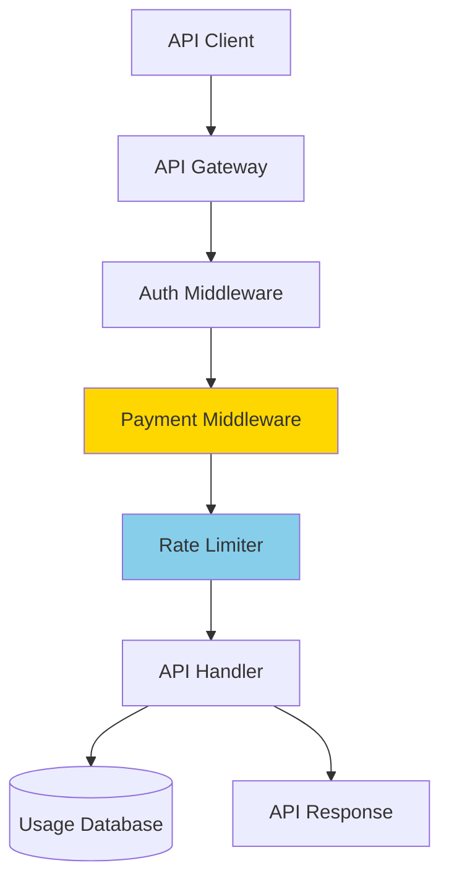

# Tutorial: API Monetization with Tiered Pricing

Build a RESTful API with multiple pricing tiers, usage tracking, and rate limiting based on payment levels using x402 protocol.

## What You'll Build

An Express API with:
- Three pricing tiers (Basic, Pro, Enterprise)
- Per-endpoint payment requirements
- Usage tracking and rate limiting
- Admin dashboard for monitoring
- API key management

**Architecture:**



## Prerequisites

- ✅ Completed [Server Quick Start](../00-getting-started/quick-start-server.md)
- ✅ Node.js >= 18.0.0, PostgreSQL
- ✅ Basic Express/TypeScript knowledge
- ✅ Wallet with private key

**Time to complete:** 45-60 minutes

---

## Table of Contents

1. [Project Setup](#step-1-project-setup)
2. [Database Setup](#step-2-database-setup)
3. [Configure Payment Tiers](#step-3-configure-payment-tiers)
4. [Implement Rate Limiting](#step-4-implement-rate-limiting)
5. [Create API Endpoints](#step-5-create-api-endpoints)
6. [Add Usage Tracking](#step-6-add-usage-tracking)
7. [Build Admin Dashboard](#step-7-build-admin-dashboard)
8. [Test the API](#step-8-test-the-api)

---

## Step 1: Project Setup

```bash
mkdir api-monetization
cd api-monetization
pnpm init

# Install dependencies
pnpm add @x402/express @x402/core @x402/evm express viem dotenv
pnpm add pg redis express-rate-limit
pnpm add -D tsx typescript @types/express @types/node @types/pg
```

Create `tsconfig.json`:

```json
{
  "compilerOptions": {
    "target": "ES2022",
    "module": "ESNext",
    "moduleResolution": "node",
    "esModuleInterop": true,
    "strict": true,
    "skipLibCheck": true,
    "outDir": "./dist"
  }
}
```

---

## Step 2: Database Setup

Create `db/schema.sql`:

```sql
-- Usage tracking table
CREATE TABLE api_usage (
  id SERIAL PRIMARY KEY,
  user_address VARCHAR(42) NOT NULL,
  endpoint VARCHAR(255) NOT NULL,
  method VARCHAR(10) NOT NULL,
  payment_amount DECIMAL(18, 6),
  tier VARCHAR(20),
  timestamp TIMESTAMP DEFAULT CURRENT_TIMESTAMP,
  response_time_ms INTEGER,
  status_code INTEGER
);

CREATE INDEX idx_user_address ON api_usage(user_address);
CREATE INDEX idx_timestamp ON api_usage(timestamp);
CREATE INDEX idx_tier ON api_usage(tier);

-- API keys table (optional)
CREATE TABLE api_keys (
  id SERIAL PRIMARY KEY,
  key VARCHAR(64) UNIQUE NOT NULL,
  user_address VARCHAR(42) NOT NULL,
  tier VARCHAR(20) NOT NULL,
  created_at TIMESTAMP DEFAULT CURRENT_TIMESTAMP,
  last_used TIMESTAMP,
  is_active BOOLEAN DEFAULT true
);
```

Create `db/index.ts`:

```typescript
// db/index.ts
import { Pool } from 'pg';

export const pool = new Pool({
  host: process.env.DB_HOST || 'localhost',
  port: parseInt(process.env.DB_PORT || '5432'),
  database: process.env.DB_NAME || 'api_monetization',
  user: process.env.DB_USER || 'postgres',
  password: process.env.DB_PASSWORD,
});

export interface UsageRecord {
  userAddress: string;
  endpoint: string;
  method: string;
  paymentAmount: string;
  tier: string;
  responseTimeMs: number;
  statusCode: number;
}

export async function trackUsage(record: UsageRecord) {
  await pool.query(
    `INSERT INTO api_usage
     (user_address, endpoint, method, payment_amount, tier, response_time_ms, status_code)
     VALUES ($1, $2, $3, $4, $5, $6, $7)`,
    [
      record.userAddress,
      record.endpoint,
      record.method,
      record.paymentAmount,
      record.tier,
      record.responseTimeMs,
      record.statusCode,
    ]
  );
}

export async function getUserStats(userAddress: string, period: string = '24h') {
  const interval = period === '24h' ? '24 hours' : '7 days';
  const result = await pool.query(
    `SELECT
       COUNT(*) as total_requests,
       SUM(payment_amount) as total_paid,
       AVG(response_time_ms) as avg_response_time
     FROM api_usage
     WHERE user_address = $1
     AND timestamp > NOW() - INTERVAL '${interval}'`,
    [userAddress]
  );
  return result.rows[0];
}
```

---

## Step 3: Configure Payment Tiers

Create `config/tiers.ts`:

```typescript
// config/tiers.ts
export interface PricingTier {
  name: string;
  price: string;
  rateLimit: {
    windowMs: number;
    maxRequests: number;
  };
  features: string[];
}

export const PRICING_TIERS = {
  basic: {
    name: "Basic",
    price: "$0.001",  // 0.001 USDC per request
    rateLimit: {
      windowMs: 60 * 1000,      // 1 minute
      maxRequests: 10,           // 10 requests per minute
    },
    features: [
      "Standard API access",
      "10 requests/minute",
      "Basic support",
    ],
  },
  pro: {
    name: "Pro",
    price: "$0.01",   // 0.01 USDC per request
    rateLimit: {
      windowMs: 60 * 1000,
      maxRequests: 100,          // 100 requests per minute
    },
    features: [
      "Full API access",
      "100 requests/minute",
      "Priority support",
      "Advanced analytics",
    ],
  },
  enterprise: {
    name: "Enterprise",
    price: "$0.05",   // 0.05 USDC per request
    rateLimit: {
      windowMs: 60 * 1000,
      maxRequests: 1000,         // 1000 requests per minute
    },
    features: [
      "Unlimited API access",
      "1000 requests/minute",
      "24/7 support",
      "Custom integration",
      "SLA guarantee",
    ],
  },
} as const;

export type TierName = keyof typeof PRICING_TIERS;
```

---

## Step 4: Implement Rate Limiting

Create `middleware/rate-limit.ts`:

```typescript
// middleware/rate-limit.ts
import rateLimit from 'express-rate-limit';
import { Request } from 'express';
import { PRICING_TIERS, TierName } from '../config/tiers';

export function createTieredRateLimiter() {
  return rateLimit({
    windowMs: 60 * 1000, // 1 minute
    max: (req: Request) => {
      const tier = (req as any).paymentTier as TierName;
      if (!tier) return 10; // Default to basic tier
      return PRICING_TIERS[tier].rateLimit.maxRequests;
    },
    message: (req: Request) => {
      const tier = (req as any).paymentTier as TierName;
      const limit = tier
        ? PRICING_TIERS[tier].rateLimit.maxRequests
        : 10;
      return {
        error: "Rate limit exceeded",
        tier: tier || "basic",
        limit,
        message: `You have exceeded the ${limit} requests per minute limit for the ${tier || 'basic'} tier`,
      };
    },
    keyGenerator: (req: Request) => {
      // Use wallet address for rate limiting
      return (req as any).paymentAddress || req.ip || 'anonymous';
    },
  });
}
```

---

## Step 5: Create API Endpoints

Create `src/server.ts`:

```typescript
// src/server.ts
import express, { Request, Response, NextFunction } from "express";
import { paymentMiddleware } from "@x402/express";
import { ExactEvmService } from "@x402/evm";
import { localFacilitatorClient, NETWORK, PAYEE_ADDRESS } from "./facilitator";
import { PRICING_TIERS, TierName } from "./config/tiers";
import { createTieredRateLimiter } from "./middleware/rate-limit";
import { trackUsage } from "./db";

const app = express();
const PORT = process.env.PORT || "4021";

app.use(express.json());

// Extract tier from payment
app.use((req: Request, res: Response, next: NextFunction) => {
  const paymentHeader = req.headers['payment-signature'];
  if (paymentHeader) {
    // Parse payment to determine tier based on amount
    // This is a simplified example
    (req as any).paymentTier = "basic"; // Default
  }
  next();
});

// Payment middleware with tiered pricing
app.use(
  paymentMiddleware(
    {
      // Basic tier endpoints
      "GET /api/basic/data": {
        payTo: PAYEE_ADDRESS,
        scheme: "exact",
        price: PRICING_TIERS.basic.price,
        network: NETWORK,
      },
      "GET /api/basic/stats": {
        payTo: PAYEE_ADDRESS,
        scheme: "exact",
        price: PRICING_TIERS.basic.price,
        network: NETWORK,
      },

      // Pro tier endpoints
      "GET /api/pro/analytics": {
        payTo: PAYEE_ADDRESS,
        scheme: "exact",
        price: PRICING_TIERS.pro.price,
        network: NETWORK,
      },
      "POST /api/pro/process": {
        payTo: PAYEE_ADDRESS,
        scheme: "exact",
        price: PRICING_TIERS.pro.price,
        network: NETWORK,
      },

      // Enterprise tier endpoints
      "GET /api/enterprise/insights": {
        payTo: PAYEE_ADDRESS,
        scheme: "exact",
        price: PRICING_TIERS.enterprise.price,
        network: NETWORK,
      },
      "POST /api/enterprise/custom": {
        payTo: PAYEE_ADDRESS,
        scheme: "exact",
        price: PRICING_TIERS.enterprise.price,
        network: NETWORK,
      },
    },
    localFacilitatorClient,
    [{ network: NETWORK, server: new ExactEvmService() }]
  )
);

// Rate limiting based on tier
app.use(createTieredRateLimiter());

// Usage tracking middleware
app.use(async (req: Request, res: Response, next: NextFunction) => {
  const startTime = Date.now();

  res.on('finish', async () => {
    const responseTime = Date.now() - startTime;
    const tier = (req as any).paymentTier || 'basic';
    const address = (req as any).paymentAddress || 'anonymous';

    try {
      await trackUsage({
        userAddress: address,
        endpoint: req.path,
        method: req.method,
        paymentAmount: PRICING_TIERS[tier as TierName].price,
        tier,
        responseTimeMs: responseTime,
        statusCode: res.statusCode,
      });
    } catch (error) {
      console.error('Failed to track usage:', error);
    }
  });

  next();
});

// API Endpoints

// Basic Tier
app.get("/api/basic/data", (req, res) => {
  res.json({
    tier: "basic",
    data: {
      message: "Basic tier data access",
      timestamp: new Date().toISOString(),
      sampleData: [1, 2, 3, 4, 5],
    },
  });
});

app.get("/api/basic/stats", (req, res) => {
  res.json({
    tier: "basic",
    stats: {
      users: 1250,
      activeUsers: 423,
      revenue: "$12,450",
    },
  });
});

// Pro Tier
app.get("/api/pro/analytics", (req, res) => {
  res.json({
    tier: "pro",
    analytics: {
      message: "Advanced analytics data",
      metrics: {
        conversion: "3.2%",
        retention: "68%",
        churn: "5.1%",
      },
      trends: [
        { date: "2024-10-01", value: 120 },
        { date: "2024-10-02", value: 145 },
        { date: "2024-10-03", value: 132 },
      ],
    },
  });
});

app.post("/api/pro/process", (req, res) => {
  const { data } = req.body;
  res.json({
    tier: "pro",
    processed: true,
    result: {
      input: data,
      output: `Processed: ${JSON.stringify(data)}`,
      processingTime: "45ms",
    },
  });
});

// Enterprise Tier
app.get("/api/enterprise/insights", (req, res) => {
  res.json({
    tier: "enterprise",
    insights: {
      message: "Enterprise-level insights",
      predictions: {
        nextMonth: "+15% growth",
        confidence: "87%",
      },
      recommendations: [
        "Increase marketing spend in segment A",
        "Optimize conversion funnel step 3",
        "Launch new feature beta",
      ],
      customData: {
        // Complex enterprise data
      },
    },
  });
});

app.post("/api/enterprise/custom", (req, res) => {
  res.json({
    tier: "enterprise",
    custom: true,
    message: "Custom enterprise endpoint",
    data: req.body,
  });
});

// Public endpoints
app.get("/health", (req, res) => {
  res.json({ status: "ok", version: "1.0.0" });
});

app.get("/pricing", (req, res) => {
  res.json({
    tiers: Object.entries(PRICING_TIERS).map(([key, tier]) => ({
      id: key,
      ...tier,
    })),
  });
});

app.listen(parseInt(PORT), () => {
  console.log(`
╔════════════════════════════════════════════════════════╗
║           x402 Tiered API Monetization                 ║
╠════════════════════════════════════════════════════════╣
║  Server:     http://localhost:${PORT}                      ║
║                                                        ║
║  Basic Tier:      $0.001/request (10 req/min)        ║
║  Pro Tier:        $0.01/request  (100 req/min)       ║
║  Enterprise Tier: $0.05/request  (1000 req/min)      ║
╚════════════════════════════════════════════════════════╝
  `);
});
```

---

## Step 6: Add Usage Tracking

Create `src/analytics.ts`:

```typescript
// src/analytics.ts
import { pool, getUserStats } from './db';

export async function getUsageAnalytics(period: '24h' | '7d' = '24h') {
  const interval = period === '24h' ? '24 hours' : '7 days';

  const result = await pool.query(`
    SELECT
      tier,
      COUNT(*) as request_count,
      SUM(payment_amount) as total_revenue,
      AVG(response_time_ms) as avg_response_time,
      COUNT(DISTINCT user_address) as unique_users
    FROM api_usage
    WHERE timestamp > NOW() - INTERVAL '${interval}'
    GROUP BY tier
    ORDER BY total_revenue DESC
  `);

  return result.rows;
}

export async function getTopUsers(limit: number = 10) {
  const result = await pool.query(`
    SELECT
      user_address,
      COUNT(*) as total_requests,
      SUM(payment_amount) as total_paid,
      MAX(timestamp) as last_request
    FROM api_usage
    WHERE timestamp > NOW() - INTERVAL '7 days'
    GROUP BY user_address
    ORDER BY total_paid DESC
    LIMIT $1
  `, [limit]);

  return result.rows;
}
```

---

## Step 7: Build Admin Dashboard

Create `src/admin.ts`:

```typescript
// src/admin.ts
import express from 'express';
import { getUsageAnalytics, getTopUsers } from './analytics';

export const adminRouter = express.Router();

// Admin authentication middleware (simplified)
adminRouter.use((req, res, next) => {
  const apiKey = req.headers['x-admin-key'];
  if (apiKey !== process.env.ADMIN_API_KEY) {
    return res.status(401).json({ error: 'Unauthorized' });
  }
  next();
});

adminRouter.get('/dashboard', async (req, res) => {
  try {
    const period = (req.query.period as '24h' | '7d') || '24h';
    const analytics = await getUsageAnalytics(period);
    const topUsers = await getTopUsers(10);

    res.json({
      period,
      analytics,
      topUsers,
      summary: {
        totalRequests: analytics.reduce((sum, tier) => sum + parseInt(tier.request_count), 0),
        totalRevenue: analytics.reduce((sum, tier) => sum + parseFloat(tier.total_revenue), 0),
        uniqueUsers: analytics.reduce((sum, tier) => sum + parseInt(tier.unique_users), 0),
      },
    });
  } catch (error) {
    res.status(500).json({ error: 'Failed to fetch analytics' });
  }
});

adminRouter.get('/users/:address', async (req, res) => {
  try {
    const { address } = req.params;
    const stats = await getUserStats(address, '7d');
    res.json({ address, stats });
  } catch (error) {
    res.status(500).json({ error: 'Failed to fetch user stats' });
  }
});
```

Add to main server:
```typescript
import { adminRouter } from './admin';
app.use('/admin', adminRouter);
```

---

## Step 8: Test the API

### Test Basic Tier

```bash
# Get pricing info
curl http://localhost:4021/pricing

# Call basic endpoint (requires payment)
curl -X GET http://localhost:4021/api/basic/data \
  -H "PAYMENT-SIGNATURE: <signature>"
```

### Test Admin Dashboard

```bash
# View analytics
curl http://localhost:4021/admin/dashboard \
  -H "X-Admin-Key: your-admin-key"

# View user stats
curl http://localhost:4021/admin/users/0x742d35Cc... \
  -H "X-Admin-Key: your-admin-key"
```

### Load Testing

```bash
# Install k6
brew install k6

# Create load-test.js
cat > load-test.js << 'EOF'
import http from 'k6/http';

export default function() {
  http.get('http://localhost:4021/api/basic/data', {
    headers: { 'PAYMENT-SIGNATURE': 'your-signature' }
  });
}
EOF

# Run load test
k6 run --vus 10 --duration 30s load-test.js
```

---

## Enhancements

### 1. Add Subscription Model
Allow users to pay once for monthly access

### 2. Implement Credits System
Pre-purchase API credits at a discount

### 3. Add Webhooks
Notify users when they're approaching rate limits

### 4. Create Client SDK
Build language-specific SDKs for easier integration

### 5. Add Caching
Cache responses for frequently accessed endpoints

---

## Next Steps

- [Content Access Tutorial](./tutorial-content-access.md)
- [Production Deployment](../09-appendix/production.md)
- [SDK Reference](../03-sdk-reference/README.md)
