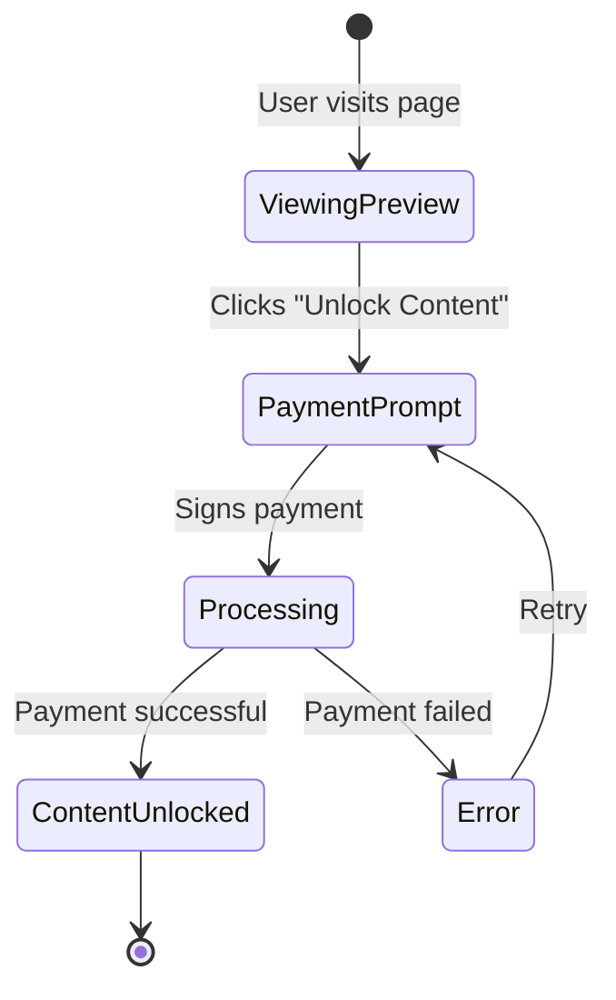

# Tutorial: Basic Paywall with Next.js

Build a complete paywall component for your Next.js application that allows users to pay for premium content access using x402 protocol.

## What You'll Build

A Next.js application with:
- A reusable `Paywall` component
- Premium content behind payments
- Payment state management
- Success/error handling
- Responsive UI with Tailwind CSS

**Live Demo Flow:**



## Prerequisites

- ✅ Completed [Installation & Setup](../00-getting-started/installation.md)
- ✅ Completed [Client Quick Start](../00-getting-started/quick-start-client.md)
- ✅ Node.js >= 18.0.0
- ✅ Basic React/Next.js knowledge
- ✅ Wallet with testnet USDC

**Time to complete:** 30-45 minutes

---

## Table of Contents

1. [Project Setup](#step-1-project-setup)
2. [Install Dependencies](#step-2-install-dependencies)
3. [Configure Environment](#step-3-configure-environment)
4. [Create Payment Context](#step-4-create-payment-context)
5. [Build Paywall Component](#step-5-build-paywall-component)
6. [Create Protected Page](#step-6-create-protected-page)
7. [Add API Route](#step-7-add-api-route)
8. [Test the Application](#step-8-test-the-application)
9. [Deployment](#deployment)
10. [Enhancements](#enhancements)

---

## Step 1: Project Setup

Create a new Next.js 14 project with TypeScript and Tailwind CSS:

```bash
# Create Next.js project
pnpx create-next-app@latest paywall-demo \
  --typescript \
  --tailwind \
  --app \
  --no-src-dir \
  --import-alias "@/*"

cd paywall-demo
```

When prompted, select:
- TypeScript: Yes
- ESLint: Yes
- Tailwind CSS: Yes
- App Router: Yes
- Customize default import alias: No

---

## Step 2: Install Dependencies

Install x402 SDK and wallet dependencies:

```bash
pnpm add @x402/fetch @x402/evm viem wagmi @tanstack/react-query
```

**Package purposes:**
- `@x402/fetch` - x402 payment client
- `@x402/evm` - EVM payment scheme
- `viem` - Ethereum utilities
- `wagmi` - React hooks for Ethereum
- `@tanstack/react-query` - State management (required by wagmi)

---

## Step 3: Configure Environment

Create `.env.local` with your configuration:

```bash
# .env.local
NEXT_PUBLIC_WALLET_CONNECT_PROJECT_ID=your_project_id_here
NEXT_PUBLIC_API_URL=http://localhost:4021
```

**Get a WalletConnect Project ID:**
1. Visit [WalletConnect Cloud](https://cloud.walletconnect.com/)
2. Create a free account
3. Create a new project
4. Copy the Project ID

---

## Step 4: Create Payment Context

Create `lib/payment-context.tsx` to manage payment state:

```typescript
// lib/payment-context.tsx
"use client";

import { createContext, useContext, useState, ReactNode } from "react";

interface PaymentState {
  isPaid: boolean;
  isProcessing: boolean;
  error: string | null;
}

interface PaymentContextType extends PaymentState {
  setIsPaid: (paid: boolean) => void;
  setIsProcessing: (processing: boolean) => void;
  setError: (error: string | null) => void;
  reset: () => void;
}

const PaymentContext = createContext<PaymentContextType | undefined>(undefined);

export function PaymentProvider({ children }: { children: ReactNode }) {
  const [state, setState] = useState<PaymentState>({
    isPaid: false,
    isProcessing: false,
    error: null,
  });

  const setIsPaid = (paid: boolean) =>
    setState((prev) => ({ ...prev, isPaid: paid }));

  const setIsProcessing = (processing: boolean) =>
    setState((prev) => ({ ...prev, isProcessing: processing }));

  const setError = (error: string | null) =>
    setState((prev) => ({ ...prev, error }));

  const reset = () =>
    setState({ isPaid: false, isProcessing: false, error: null });

  return (
    <PaymentContext.Provider
      value={{
        ...state,
        setIsPaid,
        setIsProcessing,
        setError,
        reset,
      }}
    >
      {children}
    </PaymentContext.Provider>
  );
}

export function usePayment() {
  const context = useContext(PaymentContext);
  if (!context) {
    throw new Error("usePayment must be used within PaymentProvider");
  }
  return context;
}
```

---

## Step 5: Build Paywall Component

Create `components/Paywall.tsx`:

```typescript
// components/Paywall.tsx
"use client";

import { useState } from "react";
import { useAccount, useWalletClient } from "wagmi";
import { wrapFetchWithPayment, decodePaymentResponseHeader } from "@x402/fetch";
import { ExactEvmClient } from "@x402/evm";
import { usePayment } from "@/lib/payment-context";

interface PaywallProps {
  price: string;
  description: string;
  endpoint: string;
}

export function Paywall({ price, description, endpoint }: PaywallProps) {
  const { address, isConnected } = useAccount();
  const { data: walletClient } = useWalletClient();
  const { setIsPaid, setIsProcessing, setError } = usePayment();
  const [txHash, setTxHash] = useState<string | null>(null);

  const handlePayment = async () => {
    if (!isConnected || !walletClient || !address) {
      setError("Please connect your wallet first");
      return;
    }

    setIsProcessing(true);
    setError(null);

    try {
      // Create payment client
      const account = walletClient.account;
      const fetchWithPayment = wrapFetchWithPayment(fetch, {
        schemes: [
          {
            network: "eip155:*",
            client: new ExactEvmClient(account),
          },
        ],
      });

      // Make paid request
      const response = await fetchWithPayment(
        `${process.env.NEXT_PUBLIC_API_URL}${endpoint}`,
        { method: "GET" }
      );

      // Parse payment response
      const paymentResponseHeader = response.headers.get("PAYMENT-RESPONSE");
      const paymentResponse = paymentResponseHeader
        ? decodePaymentResponseHeader(paymentResponseHeader)
        : null;

      if (response.ok && paymentResponse?.success) {
        setIsPaid(true);
        if (paymentResponse.txHash) {
          setTxHash(paymentResponse.txHash);
        }
      } else {
        throw new Error("Payment failed");
      }
    } catch (error: any) {
      console.error("Payment error:", error);
      setError(error.message || "Payment failed. Please try again.");
    } finally {
      setIsProcessing(false);
    }
  };

  return (
    <div className="bg-gradient-to-br from-purple-50 to-blue-50 dark:from-gray-800 dark:to-gray-900 rounded-lg p-8 shadow-xl max-w-md mx-auto">
      <div className="text-center mb-6">
        <div className="inline-flex items-center justify-center w-16 h-16 bg-purple-100 dark:bg-purple-900 rounded-full mb-4">
          <svg
            className="w-8 h-8 text-purple-600 dark:text-purple-400"
            fill="none"
            stroke="currentColor"
            viewBox="0 0 24 24"
          >
            <path
              strokeLinecap="round"
              strokeLinejoin="round"
              strokeWidth={2}
              d="M12 15v2m-6 4h12a2 2 0 002-2v-6a2 2 0 00-2-2H6a2 2 0 00-2 2v6a2 2 0 002 2zm10-10V7a4 4 0 00-8 0v4h8z"
            />
          </svg>
        </div>
        <h2 className="text-2xl font-bold text-gray-900 dark:text-white mb-2">
          Premium Content
        </h2>
        <p className="text-gray-600 dark:text-gray-400">{description}</p>
      </div>

      <div className="bg-white dark:bg-gray-800 rounded-lg p-6 mb-6">
        <div className="flex justify-between items-center mb-4">
          <span className="text-gray-600 dark:text-gray-400">Price</span>
          <span className="text-2xl font-bold text-purple-600 dark:text-purple-400">
            {price}
          </span>
        </div>
        <div className="flex justify-between items-center text-sm">
          <span className="text-gray-600 dark:text-gray-400">Network</span>
          <span className="text-gray-900 dark:text-white">Base Sepolia</span>
        </div>
      </div>

      {!isConnected ? (
        <p className="text-center text-sm text-gray-600 dark:text-gray-400 mb-4">
          Connect your wallet to unlock this content
        </p>
      ) : (
        <button
          onClick={handlePayment}
          disabled={!isConnected}
          className="w-full bg-gradient-to-r from-purple-600 to-blue-600 hover:from-purple-700 hover:to-blue-700 disabled:from-gray-400 disabled:to-gray-500 text-white font-semibold py-3 px-6 rounded-lg transition-all duration-200 transform hover:scale-105 disabled:scale-100 disabled:cursor-not-allowed"
        >
          {isConnected ? `Unlock for ${price}` : "Connect Wallet"}
        </button>
      )}

      {txHash && (
        <p className="mt-4 text-xs text-center text-gray-500 dark:text-gray-400">
          Transaction:{" "}
          <a
            href={`https://sepolia.basescan.org/tx/${txHash}`}
            target="_blank"
            rel="noopener noreferrer"
            className="text-purple-600 dark:text-purple-400 hover:underline"
          >
            {txHash.slice(0, 10)}...{txHash.slice(-8)}
          </a>
        </p>
      )}
    </div>
  );
}
```

---

## Step 6: Create Protected Page

Create `app/premium/page.tsx`:

```typescript
// app/premium/page.tsx
"use client";

import { Paywall } from "@/components/Paywall";
import { usePayment } from "@/lib/payment-context";

export default function PremiumPage() {
  const { isPaid, isProcessing, error } = usePayment();

  return (
    <div className="min-h-screen bg-gray-50 dark:bg-gray-900 py-12 px-4">
      <div className="max-w-4xl mx-auto">
        <h1 className="text-4xl font-bold text-center mb-8 text-gray-900 dark:text-white">
          Premium Content Access
        </h1>

        {/* Content Preview */}
        {!isPaid && !isProcessing && (
          <div className="mb-8">
            <div className="bg-white dark:bg-gray-800 rounded-lg p-8 shadow-lg mb-8">
              <h2 className="text-2xl font-semibold mb-4 text-gray-900 dark:text-white">
                The Secret to Building Successful Web3 Applications
              </h2>
              <p className="text-gray-600 dark:text-gray-400 mb-4">
                Discover the strategies and techniques used by top Web3
                developers to create applications that users love. This
                exclusive content covers...
              </p>
              <div className="relative h-32 bg-gradient-to-b from-transparent to-white dark:to-gray-800">
                <div className="absolute inset-0 flex items-center justify-center">
                  <div className="text-center">
                    <p className="text-gray-500 dark:text-gray-400 font-medium mb-2">
                      Unlock to continue reading
                    </p>
                    <svg
                      className="w-8 h-8 mx-auto text-gray-400"
                      fill="none"
                      stroke="currentColor"
                      viewBox="0 0 24 24"
                    >
                      <path
                        strokeLinecap="round"
                        strokeLinejoin="round"
                        strokeWidth={2}
                        d="M12 15v2m-6 4h12a2 2 0 002-2v-6a2 2 0 00-2-2H6a2 2 0 00-2 2v6a2 2 0 002 2zm10-10V7a4 4 0 00-8 0v4h8z"
                      />
                    </svg>
                  </div>
                </div>
              </div>
            </div>

            <Paywall
              price="$0.001 USDC"
              description="Get full access to this premium article"
              endpoint="/api/content/premium"
            />
          </div>
        )}

        {/* Loading State */}
        {isProcessing && (
          <div className="text-center py-12">
            <div className="inline-block animate-spin rounded-full h-12 w-12 border-b-2 border-purple-600"></div>
            <p className="mt-4 text-gray-600 dark:text-gray-400">
              Processing payment...
            </p>
          </div>
        )}

        {/* Error State */}
        {error && (
          <div className="bg-red-50 dark:bg-red-900/20 border border-red-200 dark:border-red-800 rounded-lg p-4 mb-8">
            <p className="text-red-800 dark:text-red-400">{error}</p>
          </div>
        )}

        {/* Premium Content */}
        {isPaid && !isProcessing && (
          <div className="bg-white dark:bg-gray-800 rounded-lg p-8 shadow-lg">
            <div className="flex items-center gap-2 mb-6">
              <svg
                className="w-6 h-6 text-green-500"
                fill="none"
                stroke="currentColor"
                viewBox="0 0 24 24"
              >
                <path
                  strokeLinecap="round"
                  strokeLinejoin="round"
                  strokeWidth={2}
                  d="M9 12l2 2 4-4m6 2a9 9 0 11-18 0 9 9 0 0118 0z"
                />
              </svg>
              <span className="text-green-600 dark:text-green-400 font-semibold">
                Content Unlocked
              </span>
            </div>

            <h2 className="text-2xl font-semibold mb-4 text-gray-900 dark:text-white">
              The Secret to Building Successful Web3 Applications
            </h2>

            <div className="prose dark:prose-invert max-w-none">
              <p className="text-gray-700 dark:text-gray-300 mb-4">
                Discover the strategies and techniques used by top Web3
                developers to create applications that users love. This
                exclusive content covers architecture patterns, user experience
                design, and monetization strategies.
              </p>

              <h3 className="text-xl font-semibold mt-6 mb-3 text-gray-900 dark:text-white">
                1. Start with User Experience
              </h3>
              <p className="text-gray-700 dark:text-gray-300 mb-4">
                The most successful Web3 applications prioritize user experience
                over technical complexity. Users don't care about the blockchain
                technology powering your app - they care about solving their
                problems efficiently.
              </p>

              <h3 className="text-xl font-semibold mt-6 mb-3 text-gray-900 dark:text-white">
                2. Implement Progressive Decentralization
              </h3>
              <p className="text-gray-700 dark:text-gray-300 mb-4">
                Don't try to decentralize everything on day one. Start with a
                centralized MVP to validate your idea, then progressively
                decentralize components as you grow. This approach reduces risk
                and allows for faster iteration.
              </p>

              <h3 className="text-xl font-semibold mt-6 mb-3 text-gray-900 dark:text-white">
                3. Choose the Right Monetization Model
              </h3>
              <p className="text-gray-700 dark:text-gray-300 mb-4">
                Micropayments with protocols like x402 allow you to monetize at
                the feature level rather than requiring upfront subscriptions.
                This lowers barriers to entry and increases conversion rates.
              </p>

              <h3 className="text-xl font-semibold mt-6 mb-3 text-gray-900 dark:text-white">
                4. Build for Multiple Chains
              </h3>
              <p className="text-gray-700 dark:text-gray-300 mb-4">
                Don't lock yourself into a single blockchain ecosystem. Use
                multi-chain protocols and abstractions that allow you to support
                Ethereum, Solana, and other networks without major refactoring.
              </p>

              <h3 className="text-xl font-semibold mt-6 mb-3 text-gray-900 dark:text-white">
                5. Focus on Developer Experience
              </h3>
              <p className="text-gray-700 dark:text-gray-300 mb-4">
                If you're building a platform or protocol, invest heavily in
                developer experience. Great documentation, clear examples, and
                helpful error messages will accelerate adoption far more than
                additional features.
              </p>
            </div>
          </div>
        )}
      </div>
    </div>
  );
}
```

---

## Step 7: Add API Route

Create `app/api/content/premium/route.ts`:

```typescript
// app/api/content/premium/route.ts
import { NextRequest, NextResponse } from "next/server";

export async function GET(request: NextRequest) {
  // In production, validate payment here
  // For this demo, we return success

  return NextResponse.json({
    success: true,
    content: {
      title: "The Secret to Building Successful Web3 Applications",
      body: "Full premium content...",
    },
  });
}
```

---

## Step 8: Test the Application

### Start Development Server

```bash
pnpm dev
```

### Configure Wallet

1. Install [Coinbase Wallet](https://www.coinbase.com/wallet) or [MetaMask](https://metamask.io/)
2. Switch to Base Sepolia testnet
3. Get testnet USDC (see [Installation Guide](../00-getting-started/installation.md#getting-testnet-funds))

### Test the Flow

1. Navigate to `http://localhost:3000/premium`
2. Click "Connect Wallet" and connect your wallet
3. Click "Unlock for $0.001 USDC"
4. Approve the transaction in your wallet
5. See the premium content unlock

**Expected behavior:**
- Paywall displays before payment
- Loading state shows during processing
- Content unlocks after successful payment
- Transaction hash displays with link to block explorer

---

## Deployment

### Deploy to Vercel

```bash
# Install Vercel CLI
pnpm add -g vercel

# Deploy
vercel

# Set environment variables
vercel env add NEXT_PUBLIC_WALLET_CONNECT_PROJECT_ID
vercel env add NEXT_PUBLIC_API_URL
```

### Production Checklist

- ✅ Set up proper API backend with payment verification
- ✅ Use production RPC endpoints
- ✅ Switch to mainnet or production testnet
- ✅ Add analytics and monitoring
- ✅ Implement error logging
- ✅ Add loading states and animations
- ✅ Test on multiple browsers and devices

---

## Enhancements

### 1. Add Wallet Connection UI

Install RainbowKit for a better wallet connection experience:

```bash
pnpm add @rainbow-me/rainbowkit
```

### 2. Persist Payment State

Save payment status to localStorage:

```typescript
useEffect(() => {
  if (isPaid) {
    localStorage.setItem(`paid-${endpoint}`, "true");
  }
}, [isPaid, endpoint]);
```

### 3. Add Multiple Payment Options

Support different payment amounts:

```typescript
<Paywall
  options={[
    { price: "$0.001", duration: "1 day" },
    { price: "$0.01", duration: "1 week" },
    { price: "$0.05", duration: "1 month" },
  ]}
/>
```

### 4. Implement Preview Mode

Show partial content before payment:

```typescript
const previewLength = 200;
const preview = content.slice(0, previewLength);
const fullContent = isPaid ? content : preview;
```

### 5. Add Social Sharing

Allow paid users to share access:

```typescript
const shareLink = generateShareLink(paymentTxHash);
// Share link grants temporary access
```

### 6. Track Analytics

Monitor conversion rates:

```typescript
useEffect(() => {
  analytics.track("paywall_viewed", {
    price,
    endpoint,
  });
}, []);

if (isPaid) {
  analytics.track("payment_completed", {
    price,
    txHash,
  });
}
```

---

## Troubleshooting

### Wallet Connection Fails

**Solutions:**
- Check WalletConnect Project ID is correct
- Verify network configuration matches
- Try clearing browser cache

### Payment Doesn't Process

**Solutions:**
- Verify wallet has USDC balance
- Check wallet has ETH for gas fees
- Ensure API endpoint is accessible
- Review browser console for errors

### Content Doesn't Unlock

**Solutions:**
- Verify payment response is being parsed correctly
- Check payment state is updating
- Ensure API route returns proper response
- Review network requests in browser dev tools

---

## Next Steps

**Explore more tutorials:**
- [API Monetization](./tutorial-api-monetization.md) - Build a paid API
- [Content Access](./tutorial-content-access.md) - Advanced content monetization

**Learn more:**
- [SDK Reference](../03-sdk-reference/README.md) - Complete API docs
- [Implementation Guide](../05-implementation-guide/README.md) - Advanced patterns
- [Production Guide](../09-appendix/production.md) - Deploy to production
