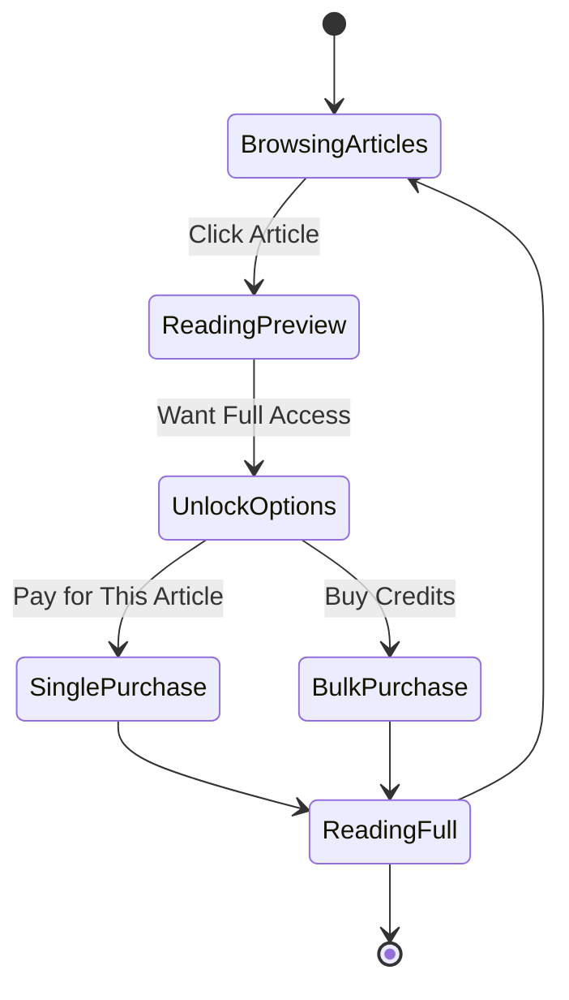

# Tutorial: Content Access & Monetization

Build a content monetization system for blogs, articles, or digital content with per-article payments, bulk access options, and user purchase tracking.

## What You'll Build

A Next.js blog platform with:
- Article preview and full access system
- Per-article micropayments
- Bulk purchase options (buy 5, get 10% off)
- User purchase history tracking
- Content library management
- Reading progress tracking

**User Flow:**



## Prerequisites

- ✅ Completed [Basic Paywall Tutorial](./tutorial-basic-paywall.md)
- ✅ Node.js >= 18.0.0, Database (PostgreSQL/SQLite)
- ✅ Basic Next.js and React knowledge
- ✅ Wallet with testnet USDC

**Time to complete:** 45-60 minutes

---

## Table of Contents

1. [Project Setup](#step-1-project-setup)
2. [Database Schema](#step-2-database-schema)
3. [Create Article Model](#step-3-create-article-model)
4. [Build Article List](#step-4-build-article-list)
5. [Implement Article Page](#step-5-implement-article-page)
6. [Add Purchase Tracking](#step-6-add-purchase-tracking)
7. [Create Library View](#step-7-create-library-view)
8. [Test the Platform](#step-8-test-the-platform)

---

## Step 1: Project Setup

```bash
mkdir content-monetization
cd content-monetization
pnpx create-next-app@latest . --typescript --tailwind --app

# Install dependencies
pnpm add @x402/fetch @x402/evm viem wagmi @tanstack/react-query
pnpm add prisma @prisma/client
pnpm add -D @types/node
```

Initialize Prisma:

```bash
pnpm prisma init
```

---

## Step 2: Database Schema

Edit `prisma/schema.prisma`:

```prisma
// prisma/schema.prisma
datasource db {
  provider = "postgresql"
  url      = env("DATABASE_URL")
}

generator client {
  provider = "prisma-client-js"
}

model Article {
  id          String   @id @default(cuid())
  title       String
  slug        String   @unique
  excerpt     String
  content     String   @db.Text
  author      String
  publishedAt DateTime @default(now())
  price       Decimal  @db.Decimal(18, 6)
  previewLength Int    @default(200)
  tags        String[]
  coverImage  String?
  readTime    Int      // in minutes
  purchases   Purchase[]

  @@index([slug])
  @@index([publishedAt])
}

model Purchase {
  id            String   @id @default(cuid())
  userAddress   String
  articleId     String
  article       Article  @relation(fields: [articleId], references: [id])
  amount        Decimal  @db.Decimal(18, 6)
  txHash        String
  network       String
  purchasedAt   DateTime @default(now())

  @@unique([userAddress, articleId])
  @@index([userAddress])
  @@index([purchasedAt])
}

model Credit {
  id           String   @id @default(cuid())
  userAddress  String
  credits      Int
  purchasedAt  DateTime @default(now())
  expiresAt    DateTime?

  @@index([userAddress])
}
```

Run migrations:

```bash
pnpm prisma migrate dev --name init
pnpm prisma generate
```

---

## Step 3: Create Article Model

Create `lib/articles.ts`:

```typescript
// lib/articles.ts
import { PrismaClient } from '@prisma/client';

const prisma = new PrismaClient();

export interface ArticlePreview {
  id: string;
  title: string;
  slug: string;
  excerpt: string;
  author: string;
  publishedAt: Date;
  price: number;
  readTime: number;
  tags: string[];
  coverImage?: string;
}

export interface FullArticle extends ArticlePreview {
  content: string;
}

export async function getArticles(): Promise<ArticlePreview[]> {
  return prisma.article.findMany({
    select: {
      id: true,
      title: true,
      slug: true,
      excerpt: true,
      author: true,
      publishedAt: true,
      price: true,
      readTime: true,
      tags: true,
      coverImage: true,
    },
    orderBy: { publishedAt: 'desc' },
  });
}

export async function getArticleBySlug(slug: string): Promise<FullArticle | null> {
  const article = await prisma.article.findUnique({
    where: { slug },
  });

  if (!article) return null;

  return {
    ...article,
    price: article.price.toNumber(),
  };
}

export async function hasUserPurchased(
  userAddress: string,
  articleId: string
): Promise<boolean> {
  const purchase = await prisma.purchase.findUnique({
    where: {
      userAddress_articleId: {
        userAddress,
        articleId,
      },
    },
  });

  return !!purchase;
}

export async function recordPurchase(
  userAddress: string,
  articleId: string,
  amount: number,
  txHash: string,
  network: string
) {
  return prisma.purchase.create({
    data: {
      userAddress,
      articleId,
      amount,
      txHash,
      network,
    },
  });
}

export async function getUserPurchases(userAddress: string) {
  return prisma.purchase.findMany({
    where: { userAddress },
    include: { article: true },
    orderBy: { purchasedAt: 'desc' },
  });
}
```

---

## Step 4: Build Article List

Create `app/articles/page.tsx`:

```typescript
// app/articles/page.tsx
import { getArticles } from '@/lib/articles';
import { ArticleCard } from '@/components/ArticleCard';

export default async function ArticlesPage() {
  const articles = await getArticles();

  return (
    <div className="min-h-screen bg-gray-50 dark:bg-gray-900 py-12 px-4">
      <div className="max-w-6xl mx-auto">
        <div className="text-center mb-12">
          <h1 className="text-4xl font-bold text-gray-900 dark:text-white mb-4">
            Premium Content Library
          </h1>
          <p className="text-gray-600 dark:text-gray-400 text-lg">
            Pay only for what you read. Micropayments starting at $0.001
          </p>
        </div>

        <div className="grid grid-cols-1 md:grid-cols-2 lg:grid-cols-3 gap-6">
          {articles.map((article) => (
            <ArticleCard key={article.id} article={article} />
          ))}
        </div>
      </div>
    </div>
  );
}
```

Create `components/ArticleCard.tsx`:

```typescript
// components/ArticleCard.tsx
import Link from 'next/link';
import { ArticlePreview } from '@/lib/articles';

interface Props {
  article: ArticlePreview;
}

export function ArticleCard({ article }: Props) {
  return (
    <Link href={`/articles/${article.slug}`}>
      <div className="bg-white dark:bg-gray-800 rounded-lg shadow-md hover:shadow-xl transition-shadow p-6 h-full flex flex-col">
        {article.coverImage && (
          
        )}

        <div className="flex items-center gap-2 text-sm text-gray-500 dark:text-gray-400 mb-2">
          <span>{article.readTime} min read</span>
          <span>•</span>
          <span>{new Date(article.publishedAt).toLocaleDateString()}</span>
        </div>

        <h2 className="text-xl font-semibold text-gray-900 dark:text-white mb-2">
          {article.title}
        </h2>

        <p className="text-gray-600 dark:text-gray-400 mb-4 flex-grow">
          {article.excerpt}
        </p>

        <div className="flex items-center justify-between pt-4 border-t border-gray-200 dark:border-gray-700">
          <div className="flex items-center gap-2">
            {article.tags.slice(0, 2).map((tag) => (
              <span
                key={tag}
                className="px-2 py-1 bg-purple-100 dark:bg-purple-900 text-purple-600 dark:text-purple-400 text-xs rounded"
              >
                {tag}
              </span>
            ))}
          </div>
          <div className="text-purple-600 dark:text-purple-400 font-semibold">
            ${article.price.toFixed(3)}
          </div>
        </div>
      </div>
    </Link>
  );
}
```

---

## Step 5: Implement Article Page

Create `app/articles/[slug]/page.tsx`:

```typescript
// app/articles/[slug]/page.tsx
"use client";

import { useState, useEffect } from 'react';
import { useAccount, useWalletClient } from 'wagmi';
import { wrapFetchWithPayment, decodePaymentResponseHeader } from '@x402/fetch';
import { ExactEvmClient } from '@x402/evm';
import { FullArticle } from '@/lib/articles';

interface Props {
  params: { slug: string };
}

export default function ArticlePage({ params }: Props) {
  const [article, setArticle] = useState<FullArticle | null>(null);
  const [isPurchased, setIsPurchased] = useState(false);
  const [isProcessing, setIsProcessing] = useState(false);
  const [error, setError] = useState<string | null>(null);

  const { address, isConnected } = useAccount();
  const { data: walletClient } = useWalletClient();

  useEffect(() => {
    fetchArticle();
    checkPurchaseStatus();
  }, [params.slug, address]);

  async function fetchArticle() {
    const response = await fetch(`/api/articles/${params.slug}`);
    const data = await response.json();
    setArticle(data.article);
  }

  async function checkPurchaseStatus() {
    if (!address) return;
    const response = await fetch(
      `/api/purchases/check?address=${address}&slug=${params.slug}`
    );
    const data = await response.json();
    setIsPurchased(data.purchased);
  }

  async function handleUnlock() {
    if (!isConnected || !walletClient || !address || !article) {
      setError("Please connect your wallet");
      return;
    }

    setIsProcessing(true);
    setError(null);

    try {
      const account = walletClient.account;
      const fetchWithPayment = wrapFetchWithPayment(fetch, {
        schemes: [
          {
            network: "eip155:*",
            client: new ExactEvmClient(account),
          },
        ],
      });

      const response = await fetchWithPayment(
        `/api/articles/${params.slug}/unlock`,
        { method: "POST" }
      );

      const paymentResponse = decodePaymentResponseHeader(
        response.headers.get("PAYMENT-RESPONSE")
      );

      if (response.ok && paymentResponse?.success) {
        setIsPurchased(true);
        // Record purchase in database
        await fetch('/api/purchases/record', {
          method: 'POST',
          headers: { 'Content-Type': 'application/json' },
          body: JSON.stringify({
            userAddress: address,
            articleId: article.id,
            amount: article.price,
            txHash: paymentResponse.txHash,
            network: 'eip155:84532',
          }),
        });
      }
    } catch (err: any) {
      setError(err.message || "Failed to unlock article");
    } finally {
      setIsProcessing(false);
    }
  }

  if (!article) return <div>Loading...</div>;

  const preview = article.content.slice(0, 200);
  const showPaywall = !isPurchased;

  return (
    <div className="min-h-screen bg-gray-50 dark:bg-gray-900 py-12 px-4">
      <article className="max-w-3xl mx-auto bg-white dark:bg-gray-800 rounded-lg shadow-lg p-8">
        <h1 className="text-4xl font-bold text-gray-900 dark:text-white mb-4">
          {article.title}
        </h1>

        <div className="flex items-center gap-4 text-sm text-gray-500 dark:text-gray-400 mb-8 pb-8 border-b">
          <span>By {article.author}</span>
          <span>•</span>
          <span>{article.readTime} min read</span>
          <span>•</span>
          <span>{new Date(article.publishedAt).toLocaleDateString()}</span>
        </div>

        <div className="prose dark:prose-invert max-w-none">
          {showPaywall ? (
            <>
              <p>{preview}...</p>
              <div className="my-8 p-8 bg-gradient-to-br from-purple-50 to-blue-50 dark:from-gray-700 dark:to-gray-800 rounded-lg text-center">
                <h3 className="text-xl font-semibold mb-4">
                  Continue Reading
                </h3>
                <p className="text-gray-600 dark:text-gray-400 mb-6">
                  Unlock the full article for ${article.price.toFixed(3)} USDC
                </p>
                {error && (
                  <p className="text-red-600 dark:text-red-400 mb-4">{error}</p>
                )}
                <button
                  onClick={handleUnlock}
                  disabled={isProcessing || !isConnected}
                  className="bg-purple-600 hover:bg-purple-700 disabled:bg-gray-400 text-white px-8 py-3 rounded-lg font-semibold"
                >
                  {isProcessing ? "Processing..." : "Unlock Now"}
                </button>
              </div>
            </>
          ) : (
            <>
              <div className="mb-4 p-4 bg-green-50 dark:bg-green-900/20 border border-green-200 dark:border-green-800 rounded-lg">
                <p className="text-green-800 dark:text-green-400 flex items-center gap-2">
                  <svg className="w-5 h-5" fill="none" stroke="currentColor" viewBox="0 0 24 24">
                    <path strokeLinecap="round" strokeLinejoin="round" strokeWidth={2} d="M9 12l2 2 4-4m6 2a9 9 0 11-18 0 9 9 0 0118 0z" />
                  </svg>
                  You have full access to this article
                </p>
              </div>
              <div dangerouslySetInnerHTML={{ __html: article.content }} />
            </>
          )}
        </div>
      </article>
    </div>
  );
}
```

---

## Step 6: Add Purchase Tracking

Create `app/api/purchases/record/route.ts`:

```typescript
// app/api/purchases/record/route.ts
import { NextRequest, NextResponse } from 'next/server';
import { recordPurchase } from '@/lib/articles';

export async function POST(request: NextRequest) {
  try {
    const { userAddress, articleId, amount, txHash, network } = await request.json();

    await recordPurchase(userAddress, articleId, amount, txHash, network);

    return NextResponse.json({ success: true });
  } catch (error) {
    console.error('Failed to record purchase:', error);
    return NextResponse.json(
      { error: 'Failed to record purchase' },
      { status: 500 }
    );
  }
}
```

Create `app/api/purchases/check/route.ts`:

```typescript
// app/api/purchases/check/route.ts
import { NextRequest, NextResponse } from 'next/server';
import { hasUserPurchased, getArticleBySlug } from '@/lib/articles';

export async function GET(request: NextRequest) {
  const { searchParams } = new URL(request.url);
  const address = searchParams.get('address');
  const slug = searchParams.get('slug');

  if (!address || !slug) {
    return NextResponse.json(
      { error: 'Missing parameters' },
      { status: 400 }
    );
  }

  const article = await getArticleBySlug(slug);
  if (!article) {
    return NextResponse.json(
      { error: 'Article not found' },
      { status: 404 }
    );
  }

  const purchased = await hasUserPurchased(address, article.id);

  return NextResponse.json({ purchased });
}
```

---

## Step 7: Create Library View

Create `app/library/page.tsx`:

```typescript
// app/library/page.tsx
"use client";

import { useState, useEffect } from 'react';
import { useAccount } from 'wagmi';
import Link from 'next/link';

interface PurchasedArticle {
  id: string;
  title: string;
  slug: string;
  excerpt: string;
  purchasedAt: string;
  amount: number;
}

export default function LibraryPage() {
  const [purchases, setPurchases] = useState<PurchasedArticle[]>([]);
  const { address, isConnected } = useAccount();

  useEffect(() => {
    if (address) {
      fetchPurchases();
    }
  }, [address]);

  async function fetchPurchases() {
    const response = await fetch(`/api/purchases?address=${address}`);
    const data = await response.json();
    setPurchases(data.purchases);
  }

  if (!isConnected) {
    return (
      <div className="min-h-screen bg-gray-50 dark:bg-gray-900 py-12 px-4">
        <div className="max-w-4xl mx-auto text-center">
          <h1 className="text-3xl font-bold mb-4">My Library</h1>
          <p className="text-gray-600 dark:text-gray-400">
            Connect your wallet to view your purchased articles
          </p>
        </div>
      </div>
    );
  }

  return (
    <div className="min-h-screen bg-gray-50 dark:bg-gray-900 py-12 px-4">
      <div className="max-w-4xl mx-auto">
        <h1 className="text-3xl font-bold mb-8">My Library</h1>

        {purchases.length === 0 ? (
          <div className="bg-white dark:bg-gray-800 rounded-lg p-8 text-center">
            <p className="text-gray-600 dark:text-gray-400 mb-4">
              You haven't purchased any articles yet
            </p>
            <Link
              href="/articles"
              className="text-purple-600 hover:text-purple-700"
            >
              Browse Articles
            </Link>
          </div>
        ) : (
          <div className="space-y-4">
            {purchases.map((purchase) => (
              <Link key={purchase.id} href={`/articles/${purchase.slug}`}>
                <div className="bg-white dark:bg-gray-800 rounded-lg p-6 hover:shadow-lg transition-shadow">
                  <div className="flex justify-between items-start">
                    <div>
                      <h2 className="text-xl font-semibold mb-2">
                        {purchase.title}
                      </h2>
                      <p className="text-gray-600 dark:text-gray-400 mb-2">
                        {purchase.excerpt}
                      </p>
                      <p className="text-sm text-gray-500">
                        Purchased {new Date(purchase.purchasedAt).toLocaleDateString()}
                      </p>
                    </div>
                    <div className="text-right">
                      <p className="text-sm text-gray-500">Paid</p>
                      <p className="font-semibold text-purple-600">
                        ${purchase.amount.toFixed(3)}
                      </p>
                    </div>
                  </div>
                </div>
              </Link>
            ))}
          </div>
        )}
      </div>
    </div>
  );
}
```

---

## Step 8: Test the Platform

### Seed Sample Articles

Create `prisma/seed.ts`:

```typescript
// prisma/seed.ts
import { PrismaClient } from '@prisma/client';

const prisma = new PrismaClient();

async function main() {
  await prisma.article.createMany({
    data: [
      {
        title: "Getting Started with Web3 Development",
        slug: "web3-development-guide",
        excerpt: "A comprehensive guide to building your first Web3 application",
        content: "Full article content here...",
        author: "Alice Johnson",
        price: 0.001,
        readTime: 5,
        tags: ["web3", "tutorial", "beginner"],
      },
      // Add more articles...
    ],
  });
}

main();
```

Run: `pnpm prisma db seed`

### Test Flow

1. Browse articles at `/articles`
2. Click an article to view preview
3. Connect wallet
4. Click "Unlock Now" to pay
5. View full article content
6. Check `/library` to see purchased articles

---

## Enhancements

### 1. Bulk Purchase Credits
Allow users to buy article credits in bulk at a discount

### 2. Subscription Model
Offer unlimited access for a monthly fee

### 3. Author Analytics
Show authors their article performance and earnings

### 4. Referral System
Reward users for sharing articles

### 5. Reading Progress
Track and resume reading progress

---

## Next Steps

- [Production Deployment](../09-appendix/production.md)
- [SDK Reference](../03-sdk-reference/README.md)
- [Implementation Guide](../05-implementation-guide/README.md)
