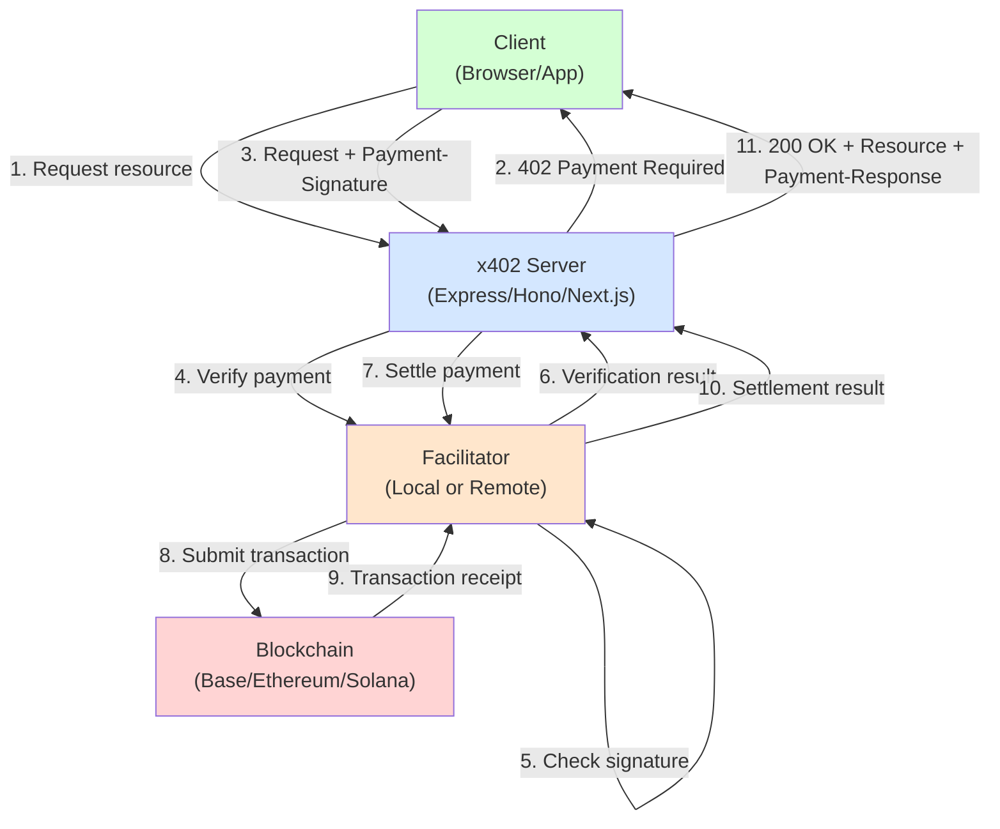

# ADR-002: Facilitator Abstraction Layer

## Status

**Accepted** - October 2024

## Context

The x402 protocol requires servers to verify payment signatures and settle transactions on the blockchain. This involves complex blockchain interactions including:

- Reading smart contract state
- Verifying cryptographic signatures (EIP-712, Ed25519, etc.)
- Submitting transactions to blockchain networks
- Waiting for transaction confirmation
- Handling gas fees and transaction failures
- Supporting multiple blockchain networks (EVM, Solana, etc.)

### The Problem

If servers handle blockchain interactions directly, they must:

1. **Manage Private Keys**: Servers need private keys to submit settlement transactions, creating security risks
2. **Maintain Blockchain Infrastructure**: Each server needs full nodes or RPC endpoints for every supported network
3. **Handle Gas Complexity**: Servers must manage gas fees, nonce management, and transaction retries
4. **Implement Multiple Protocols**: Each blockchain has different APIs (viem for EVM, web3.js for Solana, etc.)
5. **Scale Horizontally**: Blockchain state is global, making stateless server scaling difficult

### Alternative Approaches

#### Option 1: Direct Blockchain Integration

Servers interact directly with blockchains:

```typescript
// Server code
app.get('/protected', async (req, res) => {
  const payment = decodePaymentHeader(req.headers['payment-signature']);

  // Server must handle all blockchain logic
  const isValid = await viemClient.verifyTypedData({...});
  if (!isValid) return res.status(402).json({error: 'Invalid signature'});

  const tx = await viemClient.writeContract({...}); // Server pays gas!
  await viemClient.waitForTransactionReceipt({hash: tx});

  res.json({ data: protectedData });
});
```

**Problems**:
- Server needs private key (security risk)
- Server pays gas fees (cost burden)
- Each server instance needs blockchain connections
- Complex error handling in application code
- No code reuse between different server implementations

#### Option 2: Centralized Payment Service

All servers delegate to a single payment service:

```typescript
// Centralized service
const paymentService = new CentralizedPaymentService({
  apiKey: process.env.PAYMENT_SERVICE_KEY
});

app.get('/protected', async (req, res) => {
  const valid = await paymentService.verifyAndSettle(req.headers);
  if (!valid) return res.status(402).json({error: 'Payment failed'});
  res.json({ data: protectedData });
});
```

**Problems**:
- Single point of failure
- Centralization defeats blockchain benefits
- Vendor lock-in
- Privacy concerns (service sees all transactions)
- Latency (extra network hop)

#### Option 3: Facilitator Abstraction (Chosen)

Abstract payment verification and settlement behind an interface that can be implemented locally, remotely, or in hybrid fashion:

```typescript
// Facilitator interface
interface FacilitatorClient {
  verify(payload: PaymentPayload, requirements: PaymentRequirements):
    Promise<VerifyResponse>;

  settle(payload: PaymentPayload, requirements: PaymentRequirements):
    Promise<SettleResponse>;

  getSupported(): Promise<SupportedResponse>;
}
```

## Decision

**x402 V2 uses a Facilitator abstraction layer** that:

1. Defines a standard interface for payment verification and settlement
2. Allows multiple implementations (local, remote, hybrid)
3. Separates blockchain complexity from application logic
4. Enables different deployment models based on needs

### Facilitator Interface

```typescript
// From: typescript/packages/core/src/server/index.ts
export interface FacilitatorClient {
  readonly scheme: string;
  readonly x402Version: number;

  verify(
    paymentPayload: PaymentPayload,
    paymentRequirements: PaymentRequirements
  ): Promise<VerifyResponse>;

  settle(
    paymentPayload: PaymentPayload,
    paymentRequirements: PaymentRequirements
  ): Promise<SettleResponse>;

  getSupported(): Promise<SupportedResponse>;
}
```

### Implementation Types

#### Local Facilitator

For development, testing, or maximum control:

```typescript
// From: e2e/servers/express/facilitator.ts
const facilitator = new x402Facilitator();
facilitator.registerScheme(NETWORK, new ExactEvmFacilitator(viemSigner));

export class LocalFacilitatorClient implements FacilitatorClient {
  constructor(private readonly facilitator: x402Facilitator) {}

  verify(payload, requirements) {
    return this.facilitator.verify(payload, requirements);
  }

  settle(payload, requirements) {
    return this.facilitator.settle(payload, requirements);
  }

  getSupported() {
    return Promise.resolve({
      kinds: [{ x402Version: 2, scheme: "exact", network: NETWORK }],
      extensions: []
    });
  }
}
```

**Use Cases**:
- Development and testing
- Single-server deployments
- Maximum control over transaction submission
- No external dependencies

#### Remote Facilitator

For production, high availability, and shared infrastructure:

```typescript
// From: typescript/packages/core/src/http/httpFacilitatorClient.ts
export class HTTPFacilitatorClient implements FacilitatorClient {
  constructor(
    private readonly baseUrl: string,
    private readonly scheme: string
  ) {}

  async verify(payload, requirements) {
    const response = await fetch(`${this.baseUrl}/verify`, {
      method: 'POST',
      headers: { 'Content-Type': 'application/json' },
      body: JSON.stringify({ payload, requirements })
    });
    return await response.json();
  }

  async settle(payload, requirements) {
    const response = await fetch(`${this.baseUrl}/settle`, {
      method: 'POST',
      headers: { 'Content-Type': 'application/json' },
      body: JSON.stringify({ payload, requirements })
    });
    return await response.json();
  }

  async getSupported() {
    const response = await fetch(`${this.baseUrl}/supported`);
    return await response.json();
  }
}
```

**Use Cases**:
- Production deployments
- Sharing infrastructure across multiple servers
- High availability with failover
- Centralized monitoring and analytics

#### Hybrid Facilitator

Verify locally, settle remotely:

```typescript
class HybridFacilitatorClient implements FacilitatorClient {
  constructor(
    private localVerifier: x402Facilitator,
    private remoteSettler: HTTPFacilitatorClient
  ) {}

  // Fast local verification (no network call)
  verify(payload, requirements) {
    return this.localVerifier.verify(payload, requirements);
  }

  // Remote settlement (managed gas, monitoring, retries)
  settle(payload, requirements) {
    return this.remoteSettler.settle(payload, requirements);
  }

  getSupported() {
    return this.localVerifier.getSupported();
  }
}
```

**Use Cases**:
- Optimize for latency (local verify) and reliability (remote settle)
- Compliance requirements (verify locally, settle through compliant service)
- Gradual migration from local to remote

## Consequences

### Positive Consequences

#### 1. Security Benefits

Servers don't need private keys:

```typescript
// Server code - NO private keys needed
app.use(paymentMiddleware(
  routesConfig,
  remoteFacilitatorClient, // Facilitator has the keys
  schemes
));
```

**Benefits**:
- Reduced attack surface (servers can't leak keys they don't have)
- Easier key management (centralized in facilitator)
- Simpler server deployment (no secrets to manage)
- Better compliance (keys in HSM or secure environment)

#### 2. Operational Simplicity

Servers don't manage blockchain connections:

```typescript
// Before: Complex blockchain setup
const provider = new ethers.providers.JsonRpcProvider(RPC_URL);
const wallet = new ethers.Wallet(PRIVATE_KEY, provider);
const contract = new ethers.Contract(ADDRESS, ABI, wallet);

// After: Simple facilitator client
const facilitator = new HTTPFacilitatorClient(
  'https://facilitator.example.com',
  'exact'
);
```

**Benefits**:
- No RPC endpoint management
- No gas fee tracking
- No transaction retry logic
- No blockchain syncing concerns
- Facilitator handles all complexity

#### 3. Horizontal Scaling

Servers become stateless:

```typescript
// Each server instance is identical
// No shared blockchain state to coordinate
// Load balancer can distribute freely

[Client] → [Load Balancer] → [Server 1]
                           → [Server 2]  → [Facilitator]
                           → [Server 3]
```

**Benefits**:
- Simple auto-scaling
- No sticky sessions needed
- Servers can be ephemeral (containers, serverless)
- Geographic distribution easier

#### 4. Flexibility in Deployment

Choose the right model for your needs:

```typescript
// Development: Local facilitator
const devFacilitator = new LocalFacilitatorClient(
  new x402Facilitator()
);

// Production: Remote facilitator with failover
const prodFacilitator = new FailoverFacilitatorClient([
  new HTTPFacilitatorClient('https://facilitator1.example.com'),
  new HTTPFacilitatorClient('https://facilitator2.example.com')
]);

// Same server code works with both!
app.use(paymentMiddleware(routes, devFacilitator, schemes));
```

#### 5. Testability

Easy to mock for testing:

```typescript
// Mock facilitator for unit tests
class MockFacilitatorClient implements FacilitatorClient {
  verify() {
    return Promise.resolve({ success: true, reason: 'mock' });
  }

  settle() {
    return Promise.resolve({
      success: true,
      transactionHash: '0xmock',
      blockNumber: 12345,
      gasUsed: '100000'
    });
  }

  getSupported() {
    return Promise.resolve({ kinds: [], extensions: [] });
  }
}

// Test server without any blockchain
const app = createApp(new MockFacilitatorClient());
```

**Benefits**:
- Fast unit tests (no blockchain interaction)
- Deterministic testing (controlled responses)
- Test error cases easily
- No test network dependencies

#### 6. Multi-Network Support

Facilitator handles network complexity:

```typescript
// Server doesn't care about blockchain differences
const facilitator = new HTTPFacilitatorClient(
  'https://facilitator.example.com',
  'exact'
);

// Facilitator supports EVM, Solana, and others
// Server code is identical for all networks
app.use(paymentMiddleware(
  {
    "GET /evm-endpoint": { network: "eip155:8453", ... },
    "GET /solana-endpoint": { network: "solana:mainnet", ... }
  },
  facilitator, // Handles both!
  schemes
));
```

#### 7. Cost Optimization

Facilitator can batch and optimize transactions:

```typescript
// Facilitator batches multiple settlements
class BatchingFacilitator implements FacilitatorClient {
  private batch: Settlement[] = [];

  async settle(payload, requirements) {
    this.batch.push({ payload, requirements });

    // Batch settle when threshold reached
    if (this.batch.length >= 10) {
      await this.submitBatch(this.batch);
      this.batch = [];
    }

    return { success: true, ... };
  }
}
```

**Benefits**:
- Reduced gas costs (batch transactions)
- Better gas price optimization
- Transaction scheduling for lower fees
- Coordinated settlement across servers

### Negative Consequences

#### 1. Additional Network Hop

Remote facilitators add latency:

```
Without facilitator: Client → Server → Response (fast)
With facilitator:    Client → Server → Facilitator → Server → Response (slower)
```

**Impact**:
- Verify call: ~50-100ms additional latency
- Settle call: ~1-3s additional latency (blockchain transaction)

**Mitigation**:
- Use local facilitator for latency-sensitive applications
- Cache verification results when appropriate
- Use async settlement (respond before settlement completes)
- Deploy facilitator close to servers (same datacenter)

#### 2. External Dependency

Servers depend on facilitator availability:

**Risk**: If facilitator is down, payments fail.

**Mitigation**:
- Deploy facilitator with high availability
- Use multiple facilitator instances with failover
- Implement circuit breakers
- Fall back to cached verification results
- Monitor facilitator health proactively

```typescript
class ResilientFacilitatorClient implements FacilitatorClient {
  constructor(
    private primary: HTTPFacilitatorClient,
    private fallback: HTTPFacilitatorClient,
    private cache: VerificationCache
  ) {}

  async verify(payload, requirements) {
    try {
      return await this.primary.verify(payload, requirements);
    } catch (error) {
      // Try fallback
      try {
        return await this.fallback.verify(payload, requirements);
      } catch (fallbackError) {
        // Use cached result if available
        return this.cache.get(payload);
      }
    }
  }
}
```

#### 3. Trust Model Complexity

With remote facilitators, servers trust the facilitator:

**Consideration**: Servers rely on facilitator to honestly verify and settle payments.

**Mitigation**:
- Use trusted facilitator services (Coinbase, trusted third party)
- Run your own facilitator for maximum trust
- Verify settlement transactions on-chain independently
- Monitor facilitator behavior
- Use transparent facilitators with audit logs

```typescript
// Verify settlement actually happened
async function auditSettlement(settlementResponse: SettleResponse) {
  const receipt = await publicClient.getTransactionReceipt({
    hash: settlementResponse.transactionHash
  });

  if (receipt.status !== 'success') {
    throw new Error('Settlement transaction failed!');
  }

  // Log for compliance
  auditLog.record({
    timestamp: Date.now(),
    txHash: settlementResponse.transactionHash,
    verified: true
  });
}
```

#### 4. Interface Rigidity

All facilitators must implement the same interface:

**Limitation**: New features require interface changes.

**Mitigation**:
- Use `extra` and `extensions` fields for experimental features
- Version the interface (x402Version field)
- Provide adapter patterns for wrapping incompatible facilitators

```typescript
// Extend without breaking interface
interface FacilitatorClient {
  verify(payload, requirements): Promise<VerifyResponse>;
  settle(payload, requirements): Promise<SettleResponse>;
  getSupported(): Promise<SupportedResponse>;

  // Optional advanced features
  batchSettle?(payloads): Promise<BatchSettleResponse>;
  estimateGas?(requirements): Promise<GasEstimate>;
}
```

### Architecture Diagram



### Comparison Matrix

| Aspect | Direct Integration | Centralized Service | Facilitator Abstraction |
|--------|-------------------|--------------------|-----------------------|
| **Server Security** | Needs private keys | API key only | No keys needed |
| **Blockchain Expertise** | Required in each server | Vendor handles | Flexible (local or vendor) |
| **Horizontal Scaling** | Difficult (state coordination) | Easy (stateless servers) | Easy (stateless servers) |
| **Single Point of Failure** | No (each server independent) | Yes (service downtime) | Configurable (local=no, remote=yes) |
| **Vendor Lock-in** | No | Yes | No (interface-based) |
| **Latency** | Lowest (direct) | Medium (1 hop) | Configurable (local=low, remote=medium) |
| **Gas Optimization** | Per-server | Centralized | Centralized (if remote) |
| **Testing** | Hard (needs blockchain) | Medium (mock API) | Easy (mock interface) |
| **Deployment Flexibility** | Low | Medium | High |

## Implementation Examples

### Local Facilitator for Development

```typescript
// From: e2e/servers/express/facilitator.ts
import { x402Facilitator } from "@x402/core/facilitator";
import { ExactEvmFacilitator, toFacilitatorEvmSigner } from "@x402/evm";
import { createWalletClient, http, publicActions } from "viem";

const account = privateKeyToAccount(process.env.EVM_PRIVATE_KEY);
const viemClient = createWalletClient({
  account,
  chain: baseSepolia,
  transport: http()
}).extend(publicActions);

const facilitator = new x402Facilitator();
facilitator.registerScheme(
  "eip155:84532",
  new ExactEvmFacilitator(toFacilitatorEvmSigner({
    readContract: (args) => viemClient.readContract(args),
    verifyTypedData: (args) => viemClient.verifyTypedData(args),
    writeContract: (args) => viemClient.writeContract(args),
    waitForTransactionReceipt: (args) =>
      viemClient.waitForTransactionReceipt(args)
  }))
);

export const localFacilitatorClient = new LocalFacilitatorClient(facilitator);
```

### Remote Facilitator for Production

```typescript
import { HTTPFacilitatorClient } from "@x402/core/http";

// Single facilitator
const facilitator = new HTTPFacilitatorClient(
  'https://facilitator.example.com',
  'exact'
);

// Or with failover
class FailoverFacilitatorClient implements FacilitatorClient {
  constructor(private readonly endpoints: string[]) {}

  async verify(payload, requirements) {
    for (const endpoint of this.endpoints) {
      try {
        const client = new HTTPFacilitatorClient(endpoint, 'exact');
        return await client.verify(payload, requirements);
      } catch (error) {
        continue; // Try next endpoint
      }
    }
    throw new Error('All facilitators failed');
  }
}

const prodFacilitator = new FailoverFacilitatorClient([
  'https://facilitator1.example.com',
  'https://facilitator2.example.com',
  'https://facilitator3.example.com'
]);
```

## Related Decisions

- [ADR-001: Header-Based Protocol](./adr-001-header-based.md) - How payment data is transmitted
- [ADR-003: Multi-Network Architecture](./adr-003-multi-network.md) - Supporting multiple blockchains
- [ADR-004: Extension System](./adr-004-extensions.md) - Extending facilitator capabilities

## References

- Core Interface: `typescript/packages/core/src/server/index.ts`
- Local Implementation: `e2e/servers/express/facilitator.ts`
- HTTP Client: `typescript/packages/core/src/http/httpFacilitatorClient.ts`
- [Microservices Architecture Patterns](https://microservices.io/patterns/index.html)
- [Clean Architecture by Robert Martin](https://blog.cleancoder.com/uncle-bob/2012/08/13/the-clean-architecture.html)

---

*This ADR explains how x402 achieves flexibility, security, and scalability through abstraction.*
