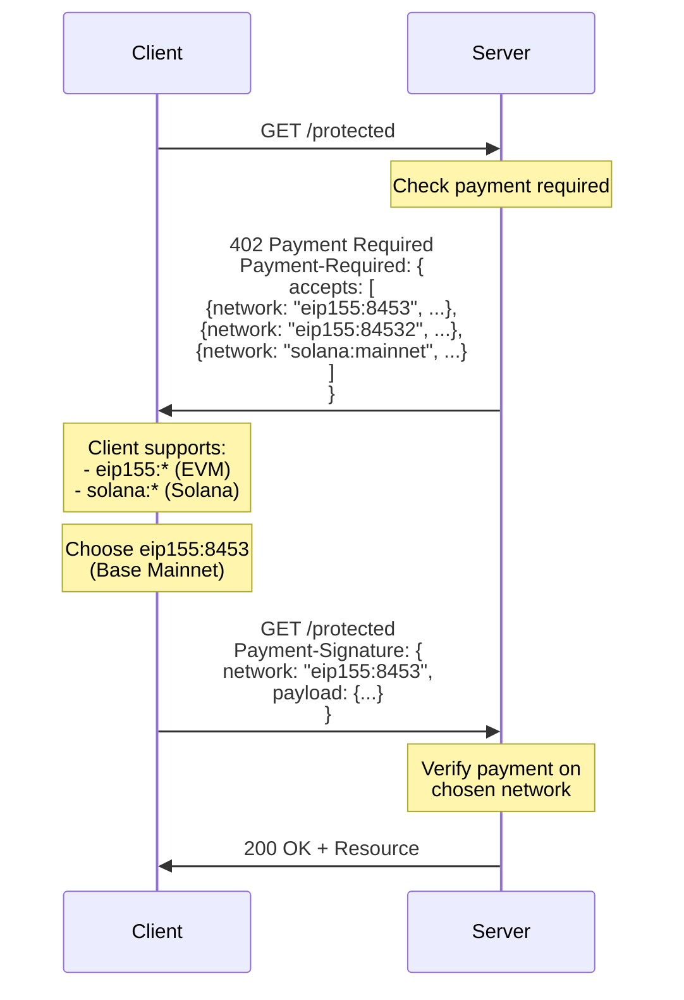

# ADR-003: Multi-Network Architecture

## Status

**Accepted** - October 2024

## Context

Blockchain payments can occur on many different networks, each with unique characteristics:

- **EVM Networks**: Ethereum, Base, Polygon, Arbitrum, Optimism (100+ networks)
- **Solana**: Different consensus, account model, and transaction format
- **Future Networks**: Bitcoin Layer 2s, Cosmos chains, Polkadot parachains, etc.

Each network has:
- Different address formats (0x... for EVM, base58 for Solana, etc.)
- Different signature schemes (ECDSA secp256k1, Ed25519, etc.)
- Different transaction structures
- Different gas/fee mechanisms
- Different smart contract platforms
- Different RPC APIs

### The Challenge

How can x402 support multiple blockchain networks without:
1. Coupling the core protocol to specific blockchains
2. Requiring different APIs for each network
3. Creating a lowest-common-denominator that limits capabilities
4. Forcing clients/servers to support networks they don't use

### Alternative Approaches

#### Option 1: Single Network Support

Only support one blockchain (e.g., Ethereum):

```typescript
// Hardcoded to Ethereum
interface PaymentRequirements {
  amount: string;
  payTo: `0x${string}`; // EVM-only address
  chainId: number; // EVM-only chain ID
}
```

**Rejected because**:
- Limits x402 to one ecosystem
- Excludes Solana, Bitcoin L2s, and future chains
- Creates barrier to adoption outside Ethereum
- Requires protocol fork for new networks

#### Option 2: Network-Specific APIs

Different API for each network:

```typescript
// EVM API
const evmPayment = new EvmX402Client(evmWallet);
await evmPayment.pay(url, { chainId: 8453 });

// Solana API (completely different)
const solanaPayment = new SolanaX402Client(solanaWallet);
await solanaPayment.pay(url, { cluster: 'mainnet-beta' });
```

**Rejected because**:
- Developers must learn multiple APIs
- Code duplication across implementations
- Difficult to abstract over multiple networks
- Poor developer experience

#### Option 3: Abstract Network Identifiers (Chosen)

Use network-agnostic identifiers with family-specific implementations:

```typescript
// Unified API, network specified by identifier
const payment = new x402Client({
  schemes: [
    {
      network: "eip155:8453", // Base (EVM family)
      client: new ExactEvmClient(evmAccount)
    },
    {
      network: "solana:mainnet", // Solana (SVM family)
      client: new ExactSvmClient(solanaKeypair)
    }
  ]
});

// Same API for all networks
await payment.pay(url, { network: "eip155:8453" });
await payment.pay(url, { network: "solana:mainnet" });
```

## Decision

**x402 V2 uses a multi-network architecture** with:

1. **Network Identifiers**: CAIP-2 format for unambiguous network identification
2. **Protocol Families**: Groups of networks sharing implementation (EVM, SVM, etc.)
3. **Family-Specific Schemes**: Payment mechanisms tailored to each family
4. **Unified Interface**: Same API regardless of network

### Network Identifier Format

x402 uses [CAIP-2](https://github.com/ChainAgnostic/CAIPs/blob/master/CAIPs/caip-2.md) network identifiers:

```
namespace:reference
```

Examples:
- `eip155:1` - Ethereum Mainnet
- `eip155:8453` - Base Mainnet
- `eip155:84532` - Base Sepolia Testnet
- `solana:mainnet` - Solana Mainnet
- `solana:devnet` - Solana Devnet

**Benefits of CAIP-2**:
- Unambiguous (no confusion between networks)
- Standardized (used by WalletConnect and other protocols)
- Extensible (new namespaces can be added)
- Human-readable (easy to understand and debug)

```typescript
// From: typescript/packages/core/src/types/index.ts
export type Network = string; // CAIP-2 format: "namespace:reference"
```

### Protocol Families

Networks are grouped into families sharing implementation approaches:

#### EVM Family (eip155)

All EVM-compatible chains share:
- Address format: `0x` + 40 hex characters
- Signature scheme: ECDSA secp256k1
- EIP-712 typed data signing
- Smart contract ABI interface
- Gas-based fee model

```typescript
// From: typescript/packages/mechanisms/evm/
export class ExactEvmClient {
  constructor(private readonly account: PrivateKeyAccount) {}

  // Works for ANY eip155:* network
  async createPayment(requirements: PaymentRequirements): Promise<PaymentPayload> {
    // EIP-712 signature logic
    const signature = await this.account.signTypedData({
      domain: {...},
      types: {...},
      message: {...}
    });

    return {
      x402Version: 2,
      scheme: "exact",
      network: requirements.network, // e.g., "eip155:8453"
      payload: { signature, deadline },
      accepted: requirements
    };
  }
}
```

**Supported Networks**: 100+ EVM chains including:
- Ethereum (mainnet, sepolia, holesky)
- Base (mainnet, sepolia)
- Optimism, Arbitrum, Polygon, Avalanche, BNB Chain, etc.

#### SVM Family (solana)

Solana Virtual Machine chains share:
- Address format: Base58-encoded public keys
- Signature scheme: Ed25519
- Transaction structure: Solana-specific
- Account-based model
- Fixed fee model

```typescript
// From: typescript/packages/mechanisms/svm/
export class ExactSvmClient {
  constructor(private readonly keypair: Keypair) {}

  // Solana-specific implementation
  async createPayment(requirements: PaymentRequirements): Promise<PaymentPayload> {
    // Ed25519 signature logic
    const signature = sign(message, this.keypair.secretKey);

    return {
      x402Version: 2,
      scheme: "exact",
      network: requirements.network, // e.g., "solana:mainnet"
      payload: { signature, deadline },
      accepted: requirements
    };
  }
}
```

**Supported Networks**:
- Solana Mainnet
- Solana Devnet
- Solana Testnet

#### Future Families

The architecture supports new families:

```typescript
// Hypothetical Bitcoin L2
export class ExactBtcClient {
  constructor(private readonly wallet: BtcWallet) {}

  async createPayment(requirements: PaymentRequirements): Promise<PaymentPayload> {
    // Bitcoin-specific signing
    const signature = this.wallet.signMessage(message);

    return {
      x402Version: 2,
      scheme: "exact",
      network: requirements.network, // e.g., "btc:mainnet"
      payload: { signature, utxos },
      accepted: requirements
    };
  }
}
```

### Unified Client Interface

Clients configure supported networks at initialization:

```typescript
// From: e2e/clients/fetch/index.ts
const fetchWithPayment = wrapFetchWithPayment(fetch, {
  schemes: [
    {
      network: "eip155:*", // Support all EVM networks
      client: new ExactEvmClient(account)
    },
    {
      network: "solana:*", // Support all Solana networks
      client: new ExactSvmClient(keypair)
    }
  ]
});

// Same API for all networks
const response1 = await fetchWithPayment('https://api.example.com/data', {
  method: 'GET'
}); // Server decides network

// Or specify network explicitly
const response2 = await fetchWithPayment('https://api.example.com/data', {
  method: 'GET',
  preferredNetwork: 'eip155:8453'
});
```

### Network Negotiation

Servers specify accepted networks, clients choose from supported options:



**Negotiation Logic**:

```typescript
// Client selects compatible network
function selectNetwork(
  serverAccepts: PaymentRequirements[],
  clientSupports: SchemeConfig[]
): PaymentRequirements | null {
  for (const requirement of serverAccepts) {
    for (const scheme of clientSupports) {
      if (matchesNetwork(requirement.network, scheme.network)) {
        return requirement;
      }
    }
  }
  return null; // No compatible network
}

// Wildcard matching
function matchesNetwork(required: string, supported: string): boolean {
  if (supported.endsWith(':*')) {
    const family = supported.slice(0, -2);
    return required.startsWith(family + ':');
  }
  return required === supported;
}
```

### Server Configuration

Servers specify networks per endpoint:

```typescript
// From: e2e/servers/express/index.ts
app.use(paymentMiddleware(
  {
    // EVM endpoint
    "GET /evm-data": {
      payTo: "0x742d35Cc6634C0532925a3b844Bc9e7595f0bEb",
      scheme: "exact",
      price: "$0.001",
      network: "eip155:8453" // Base Mainnet
    },

    // Solana endpoint
    "GET /solana-data": {
      payTo: "7KPmHQV9X...",
      scheme: "exact",
      price: "$0.001",
      network: "solana:mainnet"
    },

    // Multi-network endpoint (accepts either)
    "GET /multi-network-data": {
      payTo: "0x742d35Cc6634C0532925a3b844Bc9e7595f0bEb",
      scheme: "exact",
      price: "$0.001",
      acceptsNetworks: ["eip155:8453", "solana:mainnet"]
    }
  },
  facilitatorClient,
  [
    { network: "eip155:8453", server: new ExactEvmService() },
    { network: "solana:mainnet", server: new ExactSvmService() }
  ]
));
```

## Consequences

### Positive Consequences

#### 1. Network Agnostic Core Protocol

The core protocol doesn't know about specific blockchains:

```typescript
// Core types (from: typescript/packages/core/src/types/payments.ts)
export type PaymentRequirements = {
  scheme: string;
  network: Network; // Just a string!
  asset: string;
  amount: string;
  payTo: string;
  maxTimeoutSeconds: number;
  extra: Record<string, any>;
}
```

**Benefits**:
- Core package has zero blockchain dependencies
- Can add new networks without changing core
- Protocol versioning independent of networks
- Easier to test and maintain

#### 2. Gradual Network Adoption

Projects can start with one network and expand:

```typescript
// Day 1: Launch with Base
const client = wrapFetchWithPayment(fetch, {
  schemes: [{
    network: "eip155:8453",
    client: new ExactEvmClient(account)
  }]
});

// Day 30: Add Solana support (no breaking changes!)
const client = wrapFetchWithPayment(fetch, {
  schemes: [
    {
      network: "eip155:8453",
      client: new ExactEvmClient(account)
    },
    {
      network: "solana:mainnet",
      client: new ExactSvmClient(keypair)
    }
  ]
});

// Day 60: Add all EVM chains
const client = wrapFetchWithPayment(fetch, {
  schemes: [
    {
      network: "eip155:*", // All EVM chains!
      client: new ExactEvmClient(account)
    },
    {
      network: "solana:*",
      client: new ExactSvmClient(keypair)
    }
  ]
});
```

#### 3. Network-Specific Optimization

Each family can optimize for its blockchain:

**EVM Optimization** (EIP-712 typed signatures):
```typescript
// Gasless transfers using EIP-3009
const signature = await account.signTypedData({
  domain: {
    name: "USD Coin",
    version: "2",
    chainId: parseInt(network.split(':')[1]),
    verifyingContract: USDC_ADDRESS
  },
  types: {
    TransferWithAuthorization: [...]
  },
  message: {
    from: account.address,
    to: payTo,
    value: amount,
    validAfter: 0,
    validBefore: deadline,
    nonce: nonce
  }
});
```

**Solana Optimization** (Direct program invocation):
```typescript
// Direct SPL token transfer
const instruction = createTransferInstruction(
  fromTokenAccount,
  toTokenAccount,
  fromAuthority,
  amount
);

const transaction = new Transaction().add(instruction);
const signature = await keypair.signTransaction(transaction);
```

Each network uses its native patterns without compromising other networks.

#### 4. Client Network Selection

Clients can choose networks based on:

```typescript
function selectOptimalNetwork(
  accepts: PaymentRequirements[],
  criteria: {
    minimizeGas?: boolean;
    minimizeLatency?: boolean;
    preferredAsset?: string;
  }
): PaymentRequirements {
  if (criteria.minimizeGas) {
    // Prefer L2s (Base, Optimism) over Ethereum
    return accepts.find(a => a.network === 'eip155:8453') || accepts[0];
  }

  if (criteria.minimizeLatency) {
    // Prefer Solana (faster finality)
    return accepts.find(a => a.network.startsWith('solana:')) || accepts[0];
  }

  if (criteria.preferredAsset) {
    // Match asset
    return accepts.find(a => a.asset === criteria.preferredAsset) || accepts[0];
  }

  return accepts[0]; // Default to first
}
```

**Benefits**:
- Clients optimize for their priorities
- Cost-conscious users choose L2s
- Latency-sensitive apps choose Solana
- Users leverage existing balances

#### 5. Future-Proof Design

New networks integrate without protocol changes:

```typescript
// Adding Cosmos support (hypothetical)
import { ExactCosmosClient } from "@x402/cosmos"; // New package

const client = wrapFetchWithPayment(fetch, {
  schemes: [
    { network: "eip155:*", client: new ExactEvmClient(account) },
    { network: "solana:*", client: new ExactSvmClient(keypair) },
    { network: "cosmos:*", client: new ExactCosmosClient(wallet) } // New!
  ]
});

// Existing code continues working
// No protocol version bump needed
// No server changes required (if they accept cosmos:*)
```

#### 6. Network-Specific Features

Extensions can add network-specific capabilities:

```typescript
// EVM-specific extension: Gas estimation
interface EvmGasExtension {
  estimatedGas: string;
  maxGasPrice: string;
  gasToken: string; // ETH, MATIC, etc.
}

// Solana-specific extension: Compute units
interface SolanaComputeExtension {
  computeUnits: number;
  priorityFee: number;
}

// Included in payment requirements
const requirements: PaymentRequirements = {
  scheme: "exact",
  network: "eip155:8453",
  extensions: {
    "evm-gas": {
      estimatedGas: "100000",
      maxGasPrice: "0.1 gwei"
    }
  }
};
```

### Negative Consequences

#### 1. Network Identifier Complexity

Developers must understand CAIP-2 format:

**Challenge**: `eip155:8453` is less intuitive than "Base".

**Mitigation**:
- Provide constants: `NETWORKS.BASE_MAINNET = "eip155:8453"`
- Document network identifiers clearly
- SDK provides helper functions
- Error messages include human-readable names

```typescript
// Helper constants
export const NETWORKS = {
  // EVM
  ETHEREUM_MAINNET: "eip155:1",
  BASE_MAINNET: "eip155:8453",
  BASE_SEPOLIA: "eip155:84532",

  // Solana
  SOLANA_MAINNET: "solana:mainnet",
  SOLANA_DEVNET: "solana:devnet"
} as const;

// Use in code
const requirements = {
  network: NETWORKS.BASE_MAINNET, // Clear and type-safe
  ...
};
```

#### 2. Multiple Implementations

Each protocol family requires separate implementation:

**Challenge**:
- `@x402/evm` - EVM implementation (~2000 LOC)
- `@x402/svm` - Solana implementation (~2000 LOC)
- Future families require similar effort

**Mitigation**:
- Shared core abstracts common logic
- Reference implementations provide templates
- Community can contribute new families
- Not all projects need all families

#### 3. Cross-Chain Complexity

Supporting multiple chains increases testing surface:

**Challenge**:
- Must test each network independently
- Network-specific edge cases
- Different testnets have different faucets
- Gas/fee estimation varies by network

**Mitigation**:
- E2E test suite covers all networks systematically
- Network-specific test configurations
- Mock facilitators for unit testing
- Clear documentation of network differences

```typescript
// Test matrix
const testScenarios = [
  { client: "fetch", server: "express", network: "eip155:84532" },
  { client: "fetch", server: "express", network: "solana:devnet" },
  { client: "axios", server: "hono", network: "eip155:84532" },
  // ... comprehensive combinations
];
```

#### 4. Network Fragmentation

Users need different wallets for different networks:

**Challenge**:
- EVM users need MetaMask or similar
- Solana users need Phantom or similar
- No universal wallet (yet)

**Mitigation**:
- Support multiple wallet types in UI
- Provide clear wallet selection UI
- Detect user's available wallets
- Guide users to appropriate wallet

```typescript
// Wallet detection
async function detectWallets() {
  const wallets = [];

  if (window.ethereum) {
    wallets.push({ type: 'evm', provider: window.ethereum });
  }

  if (window.solana) {
    wallets.push({ type: 'solana', provider: window.solana });
  }

  return wallets;
}
```

#### 5. Asset Availability

Not all assets exist on all networks:

**Challenge**: USDC address differs per network:
- Ethereum: `0xA0b86991c6218b36c1d19D4a2e9Eb0cE3606eB48`
- Base: `0x833589fCD6eDb6E08f4c7C32D4f71b54bdA02913`
- Solana: `EPjFWdd5AufqSSqeM2qN1xzybapC8G4wEGGkZwyTDt1v`

**Mitigation**:
- Document asset addresses per network
- SDK provides asset constants
- Servers specify exact asset in requirements
- Bridge solutions for cross-chain transfers

```typescript
export const USDC_ADDRESSES = {
  "eip155:1": "0xA0b86991c6218b36c1d19D4a2e9Eb0cE3606eB48",
  "eip155:8453": "0x833589fCD6eDb6E08f4c7C32D4f71b54bdA02913",
  "solana:mainnet": "EPjFWdd5AufqSSqeM2qN1xzybapC8G4wEGGkZwyTDt1v"
} as const;
```

## Implementation Pattern

### Adding a New Network Family

To add support for a new blockchain family:

1. **Create mechanism package**:
```bash
mkdir -p typescript/packages/mechanisms/new-family
```

2. **Implement client**:
```typescript
// packages/mechanisms/new-family/src/client.ts
export class ExactNewFamilyClient {
  async createPayment(requirements: PaymentRequirements): Promise<PaymentPayload> {
    // Network-specific signing logic
    const signature = await this.sign(requirements);

    return {
      x402Version: 2,
      scheme: "exact",
      network: requirements.network,
      payload: { signature, ...networkSpecificData },
      accepted: requirements
    };
  }
}
```

3. **Implement server**:
```typescript
// packages/mechanisms/new-family/src/server.ts
export class ExactNewFamilyService {
  async validatePayment(payload: PaymentPayload, requirements: PaymentRequirements) {
    // Network-specific verification
    return await this.verify(payload.payload.signature);
  }
}
```

4. **Implement facilitator**:
```typescript
// packages/mechanisms/new-family/src/facilitator.ts
export class ExactNewFamilyFacilitator {
  async verify(payload: PaymentPayload, requirements: PaymentRequirements) {
    // Verify signature off-chain
  }

  async settle(payload: PaymentPayload, requirements: PaymentRequirements) {
    // Submit transaction on-chain
  }
}
```

5. **Add to ecosystem**:
- Document in SDK reference
- Add to test suite
- Provide example code
- Update network constants

## Related Decisions

- [ADR-001: Header-Based Protocol](./adr-001-header-based.md) - Network data in headers
- [ADR-002: Facilitator Abstraction](./adr-002-facilitator.md) - Network-agnostic facilitator interface
- [ADR-004: Extension System](./adr-004-extensions.md) - Network-specific extensions

## References

- [CAIP-2 Blockchain ID Specification](https://github.com/ChainAgnostic/CAIPs/blob/master/CAIPs/caip-2.md)
- [CAIP-10 Account ID Specification](https://github.com/ChainAgnostic/CAIPs/blob/master/CAIPs/caip-10.md)
- EVM Implementation: `typescript/packages/mechanisms/evm/`
- SVM Implementation: `typescript/packages/mechanisms/svm/`
- Core Types: `typescript/packages/core/src/types/index.ts`

---

*This ADR explains how x402 achieves blockchain diversity without sacrificing usability.*
