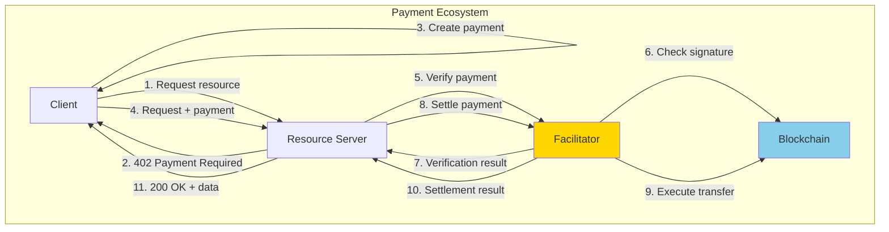
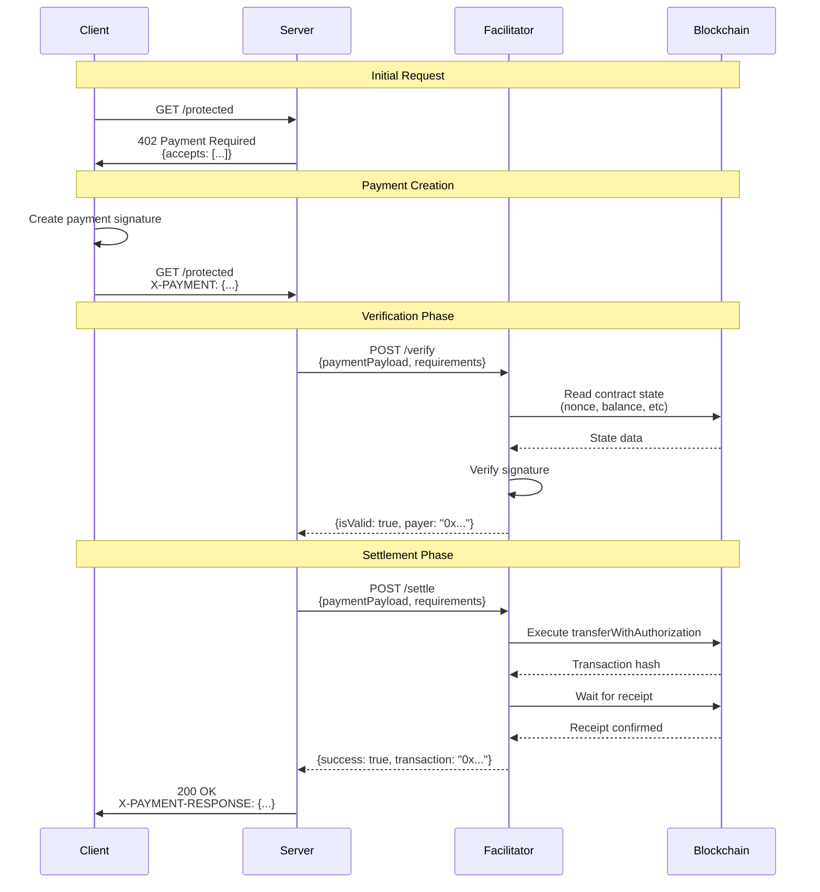
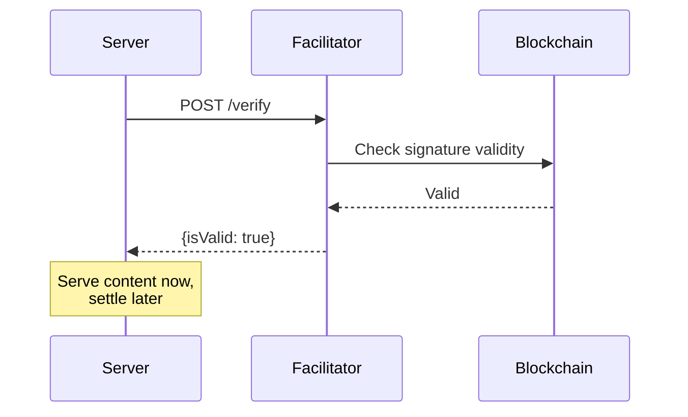

# x402 v2 Facilitator Protocol

Specification for the x402 v2 facilitator HTTP protocol.

## Overview

The facilitator protocol defines the HTTP API that facilitators must implement to verify and settle x402 payments. Facilitators act as trusted intermediaries that validate payment signatures and execute on-chain settlements on behalf of resource servers.

**Protocol Version**: 2.0
**Specification Source**: `/e2e/facilitators/text-facilitator-protocol.txt`

## Facilitator Role

Facilitators provide three core services:

1. **Payment Verification** - Validate payment signatures without on-chain execution
2. **Payment Settlement** - Execute verified payments on-chain
3. **Capability Discovery** - Advertise supported payment schemes and networks



## Protocol Requirements

### CLI Interface

Facilitators must be runnable as command-line applications:

1. **Executable via CLI** - Must be startable through `run.sh` script
2. **Logging** - Must output "Facilitator listening" when ready
3. **Exit codes** - Exit 0 for success, 1 for failure
4. **Port binding** - Must listen on configurable HTTP port

### Configuration Declaration

Facilitators must declare their capabilities in `test.config.json`:

```json
{
  "name": "facilitator-name",
  "type": "facilitator",
  "language": "typescript|go|python",
  "protocolFamilies": ["evm", "svm"],
  "x402Versions": [1, 2],
  "extensions": ["bazaar"],
  "environment": {
    "required": ["PORT", "EVM_PRIVATE_KEY"],
    "optional": ["EVM_NETWORK"]
  }
}
```

**Fields**:
- `protocolFamilies` - Blockchain families supported (EVM, SVM)
- `x402Versions` - x402 protocol versions supported ([1], [2], or [1, 2])
- `extensions` - Protocol extensions supported (e.g., "bazaar")
- `environment` - Required and optional environment variables

### Environment Configuration

**Standard Environment Variables**:
- `PORT` - HTTP server port (default: 4022)
- `EVM_PRIVATE_KEY` - Private key for EVM operations
- `SVM_PRIVATE_KEY` - Private key for Solana operations
- `EVM_NETWORK` - EVM network identifier (e.g., "eip155:84532")
- `SVM_NETWORK` - Solana network identifier (e.g., "solana:devnet")

## Required Endpoints

### POST /verify

Verify a payment signature against requirements without settling on-chain.

**Purpose**: Validate that a payment signature is correct and can be settled.

#### Request Format

```json
{
  "x402Version": 2,
  "paymentPayload": {
    "x402Version": 2,
    "scheme": "exact",
    "network": "eip155:84532",
    "payload": {
      "signature": "0x...",
      "message": {
        "amount": "100000",
        "asset": "0x833589fCD6eDb6E08f4c7C32D4f71b54bdA02913",
        "payTo": "0x742d35Cc6634C0532925a3b844Bc9e7595f0bEb",
        "nonce": "0x..."
      }
    },
    "accepted": {
      "scheme": "exact",
      "network": "eip155:84532",
      "asset": "0x833589fCD6eDb6E08f4c7C32D4f71b54bdA02913",
      "amount": "100000",
      "payTo": "0x742d35Cc6634C0532925a3b844Bc9e7595f0bEb",
      "maxTimeoutSeconds": 300,
      "extra": {}
    }
  },
  "paymentRequirements": {
    "scheme": "exact",
    "network": "eip155:84532",
    "asset": "0x833589fCD6eDb6E08f4c7C32D4f71b54bdA02913",
    "amount": "100000",
    "payTo": "0x742d35Cc6634C0532925a3b844Bc9e7595f0bEb",
    "maxTimeoutSeconds": 300,
    "extra": {
      "signerAddress": "0x...",
      "verifyingContract": "0x..."
    }
  }
}
```

**Request Fields**:
- `x402Version` - Protocol version (2)
- `paymentPayload` - Client-created payment with signature
- `paymentRequirements` - Server's payment requirements

#### Success Response (200)

**Valid Payment**:
```json
{
  "isValid": true,
  "payer": "0x1234567890abcdef1234567890abcdef12345678"
}
```

**Invalid Payment**:
```json
{
  "isValid": false,
  "invalidReason": "Invalid signature",
  "payer": "0x1234567890abcdef1234567890abcdef12345678"
}
```

**Response Fields**:
- `isValid` - Whether payment signature is valid
- `invalidReason` - Explanation if invalid (optional)
- `payer` - Address of the payer (optional)

#### Error Responses

**400 Bad Request** - Invalid request format:
```json
{
  "error": "Missing paymentPayload or paymentRequirements"
}
```

**500 Internal Server Error** - Facilitator error:
```json
{
  "error": "Failed to verify signature"
}
```

#### Verification Requirements

Facilitators must check:
1. **Signature validity** - EIP-712 or equivalent signature verification
2. **Nonce state** - Ensure payment hasn't been used before
3. **Amount correctness** - Payment amount matches requirements
4. **Asset correctness** - Payment asset matches requirements
5. **Network correctness** - Payment network matches requirements
6. **Expiry** - Payment timestamp within maxTimeoutSeconds

### POST /settle

Settle a verified payment on-chain by executing the token transfer.

**Purpose**: Execute the actual payment transaction on the blockchain.

#### Request Format

Same as `/verify` endpoint.

#### Success Response (200)

**Settlement Succeeded**:
```json
{
  "success": true,
  "transaction": "0xabcdef1234567890abcdef1234567890abcdef1234567890abcdef1234567890",
  "network": "eip155:84532",
  "payer": "0x1234567890abcdef1234567890abcdef12345678"
}
```

**Settlement Failed**:
```json
{
  "success": false,
  "errorReason": "Transaction reverted: Nonce already used",
  "network": "eip155:84532"
}
```

**Response Fields**:
- `success` - Whether settlement succeeded
- `transaction` - Transaction hash if successful
- `network` - Network where settlement occurred
- `payer` - Address of the payer (optional)
- `errorReason` - Explanation if failed (optional)

#### Error Responses

Same error format as `/verify` endpoint.

#### Settlement Requirements

Facilitators must:
1. **Verify first** - Optionally require prior verification
2. **Execute transfer** - Call contract method (e.g., `transferWithAuthorization`)
3. **Wait for confirmation** - Poll for transaction receipt
4. **Return transaction hash** - Provide on-chain proof
5. **Handle failures** - Report revert reasons

### GET /supported

Query supported payment kinds and protocol extensions.

**Purpose**: Allow servers to discover facilitator capabilities.

#### Response Format (200)

```json
{
  "kinds": [
    {
      "x402Version": 2,
      "scheme": "exact",
      "network": "eip155:84532",
      "extra": {
        "signerAddress": "0x742d35Cc6634C0532925a3b844Bc9e7595f0bEb"
      }
    },
    {
      "x402Version": 2,
      "scheme": "exact",
      "network": "eip155:8453",
      "extra": {
        "signerAddress": "0x742d35Cc6634C0532925a3b844Bc9e7595f0bEb"
      }
    }
  ],
  "extensions": ["bazaar"]
}
```

**Response Fields**:
- `kinds` - Array of supported payment schemes/networks
  - `x402Version` - Protocol version (1 or 2)
  - `scheme` - Payment scheme name (e.g., "exact")
  - `network` - Network identifier (CAIP-2 format)
  - `extra` - Scheme-specific metadata
- `extensions` - Array of supported extension names

#### Network Wildcards

Facilitators can use wildcards to indicate broad support:
- `"eip155:*"` - All EVM networks
- `"solana:*"` - All Solana networks

Servers should query facilitator with specific networks to get exact capabilities.

### GET /discovery/resources

*Optional endpoint for bazaar extension*

List resources discovered through bazaar extension interactions.

**Purpose**: Catalog available payment-protected resources.

#### Query Parameters

- `limit` (optional) - Maximum results per page (default: 100)
- `offset` (optional) - Pagination offset (default: 0)

#### Response Format (200)

```json
{
  "x402Version": 1,
  "items": [
    {
      "resource": "https://api.example.com/data",
      "type": "http",
      "x402Version": 2,
      "accepts": [
        {
          "scheme": "exact",
          "network": "eip155:84532",
          "asset": "0x833589fCD6eDb6E08f4c7C32D4f71b54bdA02913",
          "amount": "100000",
          "payTo": "0x...",
          "maxTimeoutSeconds": 300,
          "extra": {}
        }
      ],
      "discoveryInfo": {
        "input": {
          "method": "GET",
          "url": "/data",
          "headers": {},
          "body": null
        },
        "output": {
          "status": 200,
          "headers": {},
          "body": "{\"result\":\"data\"}"
        }
      },
      "lastUpdated": "2024-01-15T10:30:00Z",
      "metadata": {}
    }
  ],
  "pagination": {
    "limit": 100,
    "offset": 0,
    "total": 1
  }
}
```

**Note**: Only facilitators supporting the bazaar extension need to implement this endpoint.

### GET /health

Health check endpoint for monitoring.

**Purpose**: Allow test harness and monitoring systems to check facilitator status.

#### Response Format (200)

**Minimal Response**:
```json
{
  "status": "ok"
}
```

**Extended Response** (optional):
```json
{
  "status": "ok",
  "network": "eip155:84532",
  "facilitator": "typescript",
  "version": "2.0.0",
  "extensions": ["bazaar"],
  "address": "0x742d35Cc6634C0532925a3b844Bc9e7595f0bEb"
}
```

#### Health Check Criteria

Facilitators should verify:
- HTTP server is responsive
- Database connections are healthy (if applicable)
- RPC endpoints are accessible
- Required environment variables are set

### POST /close

Graceful shutdown endpoint for test harness.

**Purpose**: Allow test harness to cleanly stop facilitator processes.

#### Response Format (200)

```json
{
  "message": "Facilitator shutting down gracefully"
}
```

#### Shutdown Behavior

1. Return HTTP response
2. Close open connections
3. Flush pending transactions (if applicable)
4. Exit process with code 0

**Note**: This endpoint is primarily for testing. Production facilitators may omit it or require authentication.

## Payment Flow Sequences

### Full Verify + Settle Flow



### Verify-Only Flow

Some implementations may verify without immediate settlement:



## Network Support

### Protocol Families

**EVM (Ethereum Virtual Machine)**:
- Network format: `eip155:<chainId>` (CAIP-2)
- Examples:
  - `eip155:1` - Ethereum Mainnet
  - `eip155:8453` - Base Mainnet
  - `eip155:84532` - Base Sepolia
- Signature scheme: EIP-712 typed data
- Settlement: Smart contract calls (e.g., `transferWithAuthorization`)

**SVM (Solana Virtual Machine)**:
- Network format: `solana:<network>` (CAIP-2)
- Examples:
  - `solana:mainnet` - Solana Mainnet
  - `solana:devnet` - Solana Devnet
- Signature scheme: Ed25519
- Settlement: Solana transactions

### Advertising Network Support

Facilitators advertise networks via `/supported` endpoint:

```json
{
  "kinds": [
    {"x402Version": 2, "scheme": "exact", "network": "eip155:84532"},
    {"x402Version": 2, "scheme": "exact", "network": "eip155:8453"},
    {"x402Version": 2, "scheme": "exact", "network": "solana:devnet"}
  ]
}
```

Servers match their required network against supported networks.

## Extension Support

Extensions augment the core protocol with additional functionality.

### Bazaar Extension

**Purpose**: Resource discovery and cataloging

**Implementation Requirements**:
1. Extract discovery info from payment payloads/requirements
2. Store discovered resources in catalog
3. Implement `GET /discovery/resources` endpoint
4. Include "bazaar" in `/supported` extensions array

**Discovery Info Extraction**:
- v2: `paymentPayload.extensions.bazaar` contains discovery info
- v1: `paymentRequirements.outputSchema` contains output samples

### Future Extensions

The protocol supports additional extensions:
- **session-tokens** - Session-based payment amortization
- **streaming** - Continuous micropayments
- **multi-asset** - Multiple asset settlement

Facilitators advertise extension support in `/supported` response.

## Security Considerations

### Signature Verification

**Requirements**:
- Use proper cryptographic libraries (go-ethereum, viem, etc.)
- Verify EIP-712 domain separator
- Check signature expiry
- Validate nonce uniqueness

**Attack Prevention**:
- Replay attacks - Check nonce state on-chain
- Signature malleability - Use deterministic signature schemes
- Front-running - Use nonces tied to specific operations

### Private Key Management

**Facilitator Keys**:
- Store securely (HSM, key management service)
- Rotate periodically
- Use separate keys per environment
- Never log or expose keys

**Gas Management**:
- Monitor ETH balance for gas fees
- Implement gas price limits
- Use EIP-1559 for predictable fees
- Set up balance alerts

### Network Security

**RPC Endpoints**:
- Use authenticated endpoints
- Implement retry with exponential backoff
- Monitor endpoint health
- Have fallback providers

**HTTP Security**:
- Use HTTPS in production
- Implement rate limiting
- Validate request schemas
- Sanitize error messages

### Settlement Validation

**Pre-Settlement Checks**:
- Verify payment signature
- Check contract addresses
- Validate amounts and assets
- Ensure nonce is unused

**Post-Settlement**:
- Verify transaction success
- Check receipt status
- Log settlement details
- Handle revert reasons

## Implementation Guide

### Required Functionality

Minimal facilitator must implement:

1. **POST /verify** - Signature verification
2. **POST /settle** - On-chain settlement
3. **GET /supported** - Capability advertisement
4. **GET /health** - Health check
5. **Startup logging** - Output "Facilitator listening"
6. **Graceful shutdown** - Handle SIGTERM/SIGINT

### Optional Features

Enhanced facilitators may add:

1. **Extension support** - Bazaar, session-tokens, etc.
2. **V1 compatibility** - Support legacy x402 v1
3. **Multi-network** - Support multiple blockchains
4. **Caching** - Cache verification results
5. **Metrics** - Prometheus, StatsD, etc.
6. **Authentication** - API keys for access control

### Testing Compliance

To verify protocol compliance:

```bash
# Via E2E test harness
cd /e2e
pnpm test -d --facilitator=your-facilitator

# Manual testing
curl http://localhost:4022/health
curl http://localhost:4022/supported
```

Test scenarios should cover:
- Valid payment verification
- Invalid signature detection
- Used nonce detection
- Successful settlement
- Failed settlement handling
- Network mismatch handling
- Extension support (if applicable)

## Error Handling

### Standard Error Format

```json
{
  "error": "Human-readable error message"
}
```

### HTTP Status Codes

- `200 OK` - Request processed (check `isValid` or `success` in body)
- `400 Bad Request` - Invalid request format
- `500 Internal Server Error` - Facilitator error
- `503 Service Unavailable` - Facilitator not ready

**Note**: Verification and settlement responses use 200 OK with `isValid`/`success` fields rather than HTTP status codes for consistency.

### Common Error Scenarios

**Verification Errors**:
- "Invalid signature" - Signature doesn't match payer
- "Nonce already used" - Payment already settled
- "Insufficient balance" - Payer lacks funds
- "Expired signature" - Timestamp beyond maxTimeoutSeconds

**Settlement Errors**:
- "Transaction reverted" - On-chain execution failed
- "Insufficient gas" - Facilitator lacks ETH for gas
- "RPC connection failed" - Network communication error
- "Payment not verified" - Settlement without verification

## Reference Implementations

### TypeScript Facilitator

**Path**: `/e2e/facilitators/typescript/`
**Documentation**: [TypeScript Facilitator](../07-reference-implementations/typescript-facilitator.md)

**Features**:
- Full protocol compliance
- Bazaar extension support
- V1 backward compatibility
- In-memory payment tracking

### Go Facilitator

**Path**: `/e2e/facilitators/go/`
**Documentation**: [Go Facilitator](../07-reference-implementations/go-facilitator.md)

**Features**:
- Real blockchain operations
- High-performance implementation
- Production-ready error handling
- V1 backward compatibility

## Protocol Versioning

### Version Negotiation

Clients and servers specify supported versions:
- Clients: Declare supported versions in capabilities
- Servers: Implement specific version
- Facilitators: Support one or more versions

### Version-Specific Behavior

**V1 Differences**:
- No top-level `x402Version` in facilitator requests
- No `accepted` field in payment payload
- Resource info in requirements instead of separate `resource` field

**V2 Improvements**:
- Explicit version in all requests
- Payment includes full requirements accepted
- Better extension support
- Cleaner separation of concerns

## Related Documentation

- [TypeScript Facilitator](../07-reference-implementations/typescript-facilitator.md) - TypeScript reference implementation
- [Go Facilitator](../07-reference-implementations/go-facilitator.md) - Go reference implementation
- [Core Types](../03-sdk-reference/core/types.md) - Type definitions
- [Payment Flows](../02-protocol-flows/) - End-to-end payment sequences
- [EVM Mechanism](../03-sdk-reference/mechanisms/evm.md) - EVM-specific details

## Specification Source

The complete facilitator protocol specification is maintained in:

**Path**: `/e2e/facilitators/text-facilitator-protocol.txt`

This documentation is derived from that specification. In case of conflicts, the text specification is authoritative.
