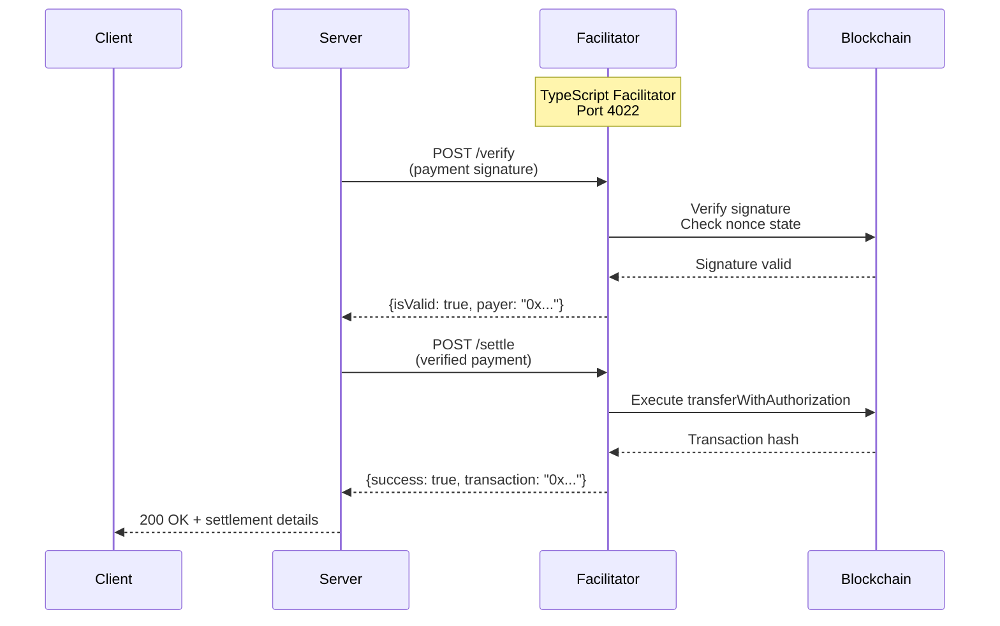
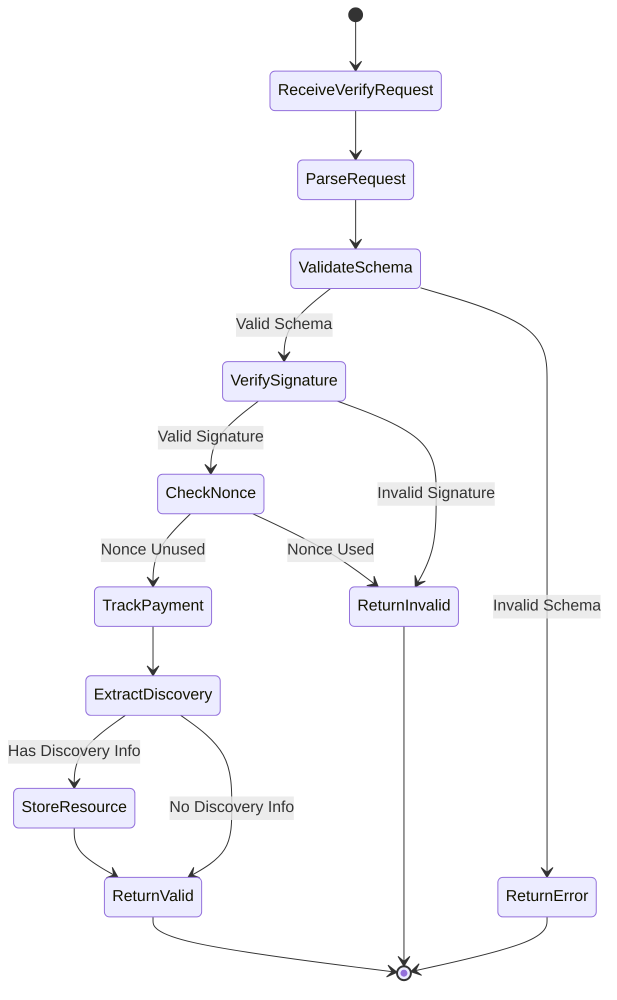
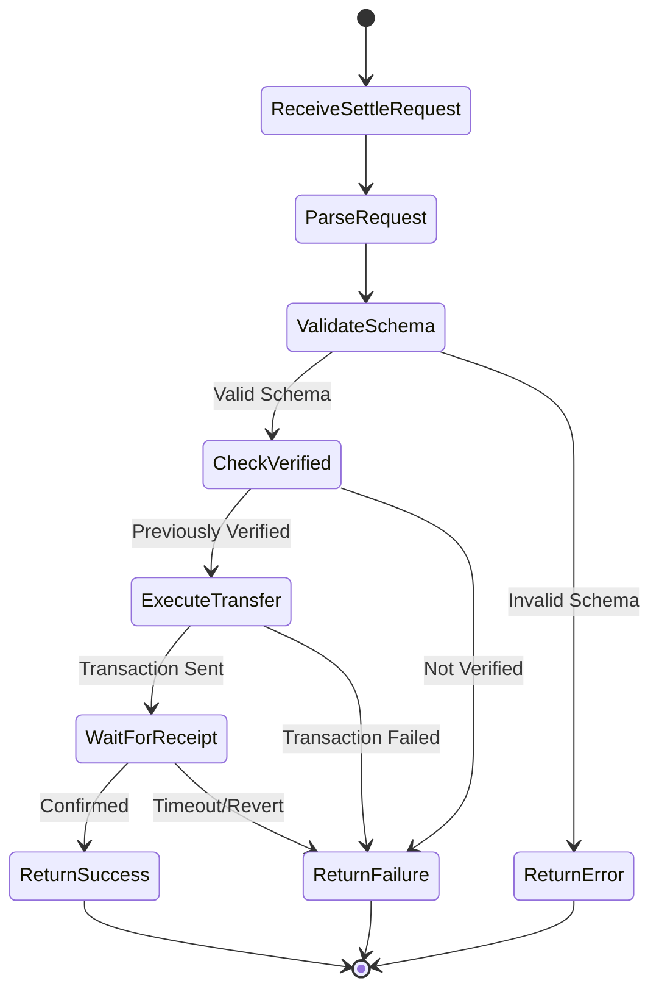

# TypeScript Facilitator Reference Implementation

Reference implementation of a standalone x402 v2 facilitator HTTP service in TypeScript.

## Location

**Path**: `/e2e/facilitators/typescript/`

**Key Files**:
- `index.ts` - Main facilitator HTTP server
- `package.json` - Dependencies and scripts
- `test.config.json` - Test configuration
- `run.sh` - Execution script for test harness

## Overview

The TypeScript facilitator is a standalone HTTP service that verifies and settles x402 v2 payments. It serves as a reference implementation for building custom facilitators and demonstrates integration with the x402 TypeScript SDK.

**Features**:
- EVM payment verification using EIP-712 signatures
- On-chain settlement via `transferWithAuthorization`
- Bazaar extension support for resource discovery
- Verified payment tracking (verify → settle flow)
- Discovery resource cataloging
- V1 backward compatibility

## Architecture

The facilitator acts as a trusted intermediary between clients and servers, verifying payment signatures and executing on-chain settlements.



## Configuration

### Environment Variables

**Required**:
- `EVM_PRIVATE_KEY` - Private key for the facilitator's EVM account (must have ETH for gas)
- `PORT` - HTTP server port (default: `4022`)

**Optional**:
- `EVM_NETWORK` - Network identifier (default: `eip155:84532` for Base Sepolia)

### Test Configuration

**File**: `test.config.json`

```json
{
  "name": "typescript",
  "type": "facilitator",
  "language": "typescript",
  "protocolFamilies": ["evm"],
  "x402Versions": [2],
  "extensions": ["bazaar"],
  "environment": {
    "required": ["PORT", "EVM_PRIVATE_KEY"],
    "optional": ["EVM_NETWORK"]
  }
}
```

### Supported Networks

- **Base Sepolia** (`eip155:84532`) - Default testnet
- **EVM Networks** - Any EVM-compatible network via wildcard `eip155:*`

## Endpoints

### POST /verify

Verify a payment signature against requirements without settling on-chain.

**Request**:
```json
{
  "x402Version": 2,
  "paymentPayload": {
    "x402Version": 2,
    "scheme": "exact",
    "network": "eip155:84532",
    "payload": {
      "signature": "0x...",
      "message": {
        "amount": "100000",
        "asset": "0x833589fCD6eDb6E08f4c7C32D4f71b54bdA02913",
        "payTo": "0x742d35Cc6634C0532925a3b844Bc9e7595f0bEb"
      }
    },
    "accepted": { /* full requirements */ }
  },
  "paymentRequirements": {
    "scheme": "exact",
    "network": "eip155:84532",
    "asset": "0x833589fCD6eDb6E08f4c7C32D4f71b54bdA02913",
    "amount": "100000",
    "payTo": "0x742d35Cc6634C0532925a3b844Bc9e7595f0bEb",
    "maxTimeoutSeconds": 300,
    "extra": {
      "signerAddress": "0x...",
      "verifyingContract": "0x..."
    }
  }
}
```

**Success Response** (200):
```json
{
  "isValid": true,
  "payer": "0x1234..."
}
```

**Invalid Response** (200):
```json
{
  "isValid": false,
  "invalidReason": "Invalid signature",
  "payer": "0x1234..."
}
```

**Error Response** (400/500):
```json
{
  "error": "Missing paymentPayload or paymentRequirements"
}
```

**Behavior**:
- Verifies EIP-712 signature using Viem
- Tracks verified payments for settle validation
- Extracts and stores bazaar discovery info if present
- Returns payer address when valid

### POST /settle

Settle a verified payment on-chain by executing the token transfer.

**Request**: Same format as `/verify`

**Success Response** (200):
```json
{
  "success": true,
  "transaction": "0xabcd...",
  "network": "eip155:84532",
  "payer": "0x1234..."
}
```

**Failure Response** (200):
```json
{
  "success": false,
  "errorReason": "Payment was not verified first",
  "network": "eip155:84532"
}
```

**Error Response** (400/500):
```json
{
  "error": "Missing paymentPayload or paymentRequirements"
}
```

**Behavior**:
- Validates payment was verified first
- Executes `transferWithAuthorization` on USDC contract
- Waits for transaction confirmation
- Returns transaction hash and payer address

### GET /supported

Query supported payment schemes, networks, and extensions.

**Response** (200):
```json
{
  "kinds": [
    {
      "x402Version": 2,
      "scheme": "exact",
      "network": "eip155:84532",
      "extra": {}
    }
  ],
  "extensions": ["bazaar"]
}
```

**Behavior**:
- Returns all supported payment kinds
- Indicates bazaar extension support
- Used by servers to configure payment options

### GET /discovery/resources

List all discovered resources from bazaar extension interactions.

**Query Parameters**:
- `limit` (optional) - Maximum results per page (default: 100)
- `offset` (optional) - Pagination offset (default: 0)

**Response** (200):
```json
{
  "x402Version": 1,
  "items": [
    {
      "resource": "https://api.example.com/endpoint",
      "type": "http",
      "x402Version": 2,
      "accepts": [
        {
          "scheme": "exact",
          "network": "eip155:84532",
          "asset": "0x833589fCD6eDb6E08f4c7C32D4f71b54bdA02913",
          "amount": "100000",
          "payTo": "0x...",
          "maxTimeoutSeconds": 300,
          "extra": {}
        }
      ],
      "discoveryInfo": {
        "input": {
          "method": "GET",
          "url": "/endpoint",
          "headers": {},
          "body": null
        },
        "output": {
          "status": 200,
          "headers": {},
          "body": "{\"data\":\"example\"}"
        }
      },
      "lastUpdated": "2024-01-15T10:30:00Z",
      "metadata": {}
    }
  ],
  "pagination": {
    "limit": 100,
    "offset": 0,
    "total": 1
  }
}
```

**Behavior**:
- Returns resources discovered during verify operations
- Supports pagination for large catalogs
- Tracks discovery metadata and timestamps

### GET /health

Health check endpoint for monitoring and test harness.

**Response** (200):
```json
{
  "status": "ok",
  "network": "eip155:84532",
  "facilitator": "typescript",
  "version": "2.0.0",
  "extensions": ["bazaar"],
  "discoveredResources": 5
}
```

**Behavior**:
- Returns facilitator status
- Includes configuration details
- Shows discovered resource count

### POST /close

Graceful shutdown endpoint for test harness.

**Response** (200):
```json
{
  "message": "Facilitator shutting down gracefully"
}
```

**Behavior**:
- Terminates the process with exit code 0
- Allows test harness to cleanly stop facilitator
- Gives 100ms for response to be sent

## Implementation Details

### SDK Integration

The facilitator uses the x402 TypeScript SDK for core functionality:

```typescript
import { x402Facilitator } from "@x402/core/facilitator";
import { ExactEvmFacilitator, toFacilitatorEvmSigner } from "@x402/evm";
import { ExactEvmFacilitatorV1 } from "@x402/evm/v1";
import { BAZAAR } from "@x402/extensions/bazaar";

// Initialize facilitator with EVM support
const facilitator = new x402Facilitator()
  .registerScheme("eip155:*", new ExactEvmFacilitator(signer))
  .registerSchemeV1("base-sepolia", new ExactEvmFacilitatorV1(signer))
  .registerExtension(BAZAAR);
```

### Viem Client Setup

Uses Viem for blockchain interactions:

```typescript
import { createWalletClient, http, publicActions } from "viem";
import { privateKeyToAccount } from "viem/accounts";
import { baseSepolia } from "viem/chains";

const account = privateKeyToAccount(process.env.EVM_PRIVATE_KEY);
const viemClient = createWalletClient({
  account,
  chain: baseSepolia,
  transport: http(),
}).extend(publicActions);

const signer = toFacilitatorEvmSigner({
  readContract: viemClient.readContract,
  verifyTypedData: viemClient.verifyTypedData,
  writeContract: viemClient.writeContract,
  waitForTransactionReceipt: viemClient.waitForTransactionReceipt,
});
```

### Payment Tracking

Tracks verified payments to enforce verify-before-settle flow:

```typescript
const verifiedPayments = new Map<string, number>();

function createPaymentHash(paymentPayload: PaymentPayload): string {
  return crypto
    .createHash("sha256")
    .update(JSON.stringify(paymentPayload))
    .digest("hex");
}

// In /verify endpoint
if (response.isValid) {
  const paymentHash = createPaymentHash(paymentPayload);
  verifiedPayments.set(paymentHash, Date.now());
}

// In /settle endpoint
const paymentHash = createPaymentHash(paymentPayload);
if (!verifiedPayments.has(paymentHash)) {
  return res.json({
    success: false,
    errorReason: "Payment was not verified first"
  });
}
```

### Discovery Resource Cataloging

Extracts and stores bazaar discovery information:

```typescript
import { extractDiscoveryInfo, type DiscoveryInfo } from "@x402/extensions/bazaar";

const discoveredResources = new Map<string, DiscoveredResource>();

// In /verify endpoint
const discoveryInfo = extractDiscoveryInfo(
  paymentPayload,
  paymentRequirements
);

if (discoveryInfo) {
  const resourceUrl = paymentRequirements.extra?.resourceUrl;
  discoveredResources.set(resourceUrl, {
    resource: resourceUrl,
    type: "http",
    x402Version: paymentPayload.x402Version,
    accepts: [paymentRequirements],
    discoveryInfo,
    lastUpdated: new Date().toISOString(),
    metadata: {}
  });
}
```

## Running Locally

### Installation

```bash
cd /e2e/facilitators/typescript
pnpm install
```

### Configuration

Create `.env` file or export environment variables:

```bash
export EVM_PRIVATE_KEY=0x...
export PORT=4022
```

### Start Server

```bash
# Development mode
pnpm dev

# Production mode
pnpm start

# Via test harness script
./run.sh
```

### Expected Output

```
╔════════════════════════════════════════════════════════╗
║           x402 TypeScript Facilitator                  ║
╠════════════════════════════════════════════════════════╣
║  Server:     http://localhost:4022                     ║
║  Network:    eip155:84532                              ║
║  Address:    0x742d35Cc6634C0532925a3b844Bc9e7595f0bEb ║
║  Extensions: bazaar                                    ║
║                                                        ║
║  Endpoints:                                            ║
║  • POST /verify              (verify payment)         ║
║  • POST /settle              (settle payment)         ║
║  • GET  /supported           (get supported kinds)    ║
║  • GET  /discovery/resources (list discovered)        ║
║  • GET  /health              (health check)           ║
║  • POST /close               (shutdown server)        ║
╚════════════════════════════════════════════════════════╝

Facilitator listening
```

## Testing

### Unit Testing

```bash
cd /e2e/facilitators/typescript
pnpm test
```

### Integration Testing

Via E2E test harness:

```bash
cd /e2e
pnpm test -d --facilitator=typescript
```

### Manual Testing

**Verify Endpoint**:
```bash
curl -X POST http://localhost:4022/verify \
  -H "Content-Type: application/json" \
  -d '{
    "paymentPayload": {...},
    "paymentRequirements": {...}
  }'
```

**Health Check**:
```bash
curl http://localhost:4022/health
```

## Protocol Compliance

The facilitator implements the x402 v2 facilitator protocol specification.

**Specification**: `/e2e/facilitators/text-facilitator-protocol.txt`

### Verification Flow



### Settlement Flow



## Integration

### Using with Express Server

The TypeScript Express server is configured to use this facilitator by default in E2E tests:

```typescript
import { FacilitatorClient } from "@x402/core/types";

const facilitatorClient: FacilitatorClient = {
  verify: async (payload, requirements) => {
    const response = await fetch("http://localhost:4022/verify", {
      method: "POST",
      headers: { "Content-Type": "application/json" },
      body: JSON.stringify({
        x402Version: 2,
        paymentPayload: payload,
        paymentRequirements: requirements
      })
    });
    return response.json();
  },
  settle: async (payload, requirements) => {
    const response = await fetch("http://localhost:4022/settle", {
      method: "POST",
      headers: { "Content-Type": "application/json" },
      body: JSON.stringify({
        x402Version: 2,
        paymentPayload: payload,
        paymentRequirements: requirements
      })
    });
    return response.json();
  },
  getSupported: async () => {
    const response = await fetch("http://localhost:4022/supported");
    return response.json();
  }
};
```

### Using with Custom Implementations

Any client or server can use this facilitator by making HTTP requests to the endpoints documented above.

## Security Considerations

**Private Key Management**:
- Store `EVM_PRIVATE_KEY` securely (environment variables, secrets manager)
- Never commit private keys to version control
- Use separate keys for development and production

**Network Security**:
- Run facilitator behind firewall in production
- Use HTTPS for all facilitator endpoints
- Implement rate limiting to prevent abuse

**Transaction Security**:
- Facilitator must have sufficient ETH for gas fees
- Monitor facilitator balance to prevent settlement failures
- Validate all payment parameters before settlement

**Verify-Before-Settle**:
- Settlement requires prior verification
- Prevents replay attacks and unauthorized settlements
- Payment hashes tracked in-memory (cleared on restart)

## Performance Characteristics

**Throughput**:
- Verification: ~50-100 requests/second
- Settlement: Limited by blockchain confirmation time (~2-5 seconds per transaction)

**Latency**:
- Verification: ~10-50ms
- Settlement: ~2-5 seconds (blockchain dependent)

**Resource Usage**:
- Memory: ~50-100MB base + ~1KB per tracked payment
- CPU: Low (signature verification is fast)
- Network: Depends on RPC endpoint reliability

## Troubleshooting

**"EVM_PRIVATE_KEY environment variable is required"**
- Set the `EVM_PRIVATE_KEY` environment variable
- Ensure it's a valid hex private key with `0x` prefix

**"Failed to connect to RPC"**
- Check network connectivity to Base Sepolia RPC
- Use a reliable RPC endpoint (Alchemy, Infura, etc.)
- Verify network identifier is correct

**"Insufficient gas"**
- Facilitator account needs ETH for gas fees
- Get testnet ETH from Base Sepolia faucet
- Monitor account balance

**"Payment was not verified first"**
- Ensure `/verify` is called before `/settle`
- Payment tracking is in-memory only (cleared on restart)
- Check payment hash is correct

## Related Documentation

- [Go Facilitator](./go-facilitator.md) - Go implementation for comparison
- [Facilitator Protocol](../08-architecture/facilitator-protocol.md) - Protocol specification
- [Express Server](./typescript-express-server.md) - Server integration example
- [E2E Test Harness](./test-harness.md) - Testing infrastructure
- [Bazaar Extension](../03-sdk-reference/extensions/bazaar.md) - Discovery extension

## Source Code

**Location**: `/e2e/facilitators/typescript/index.ts`

View the complete source code in the repository for implementation details.
