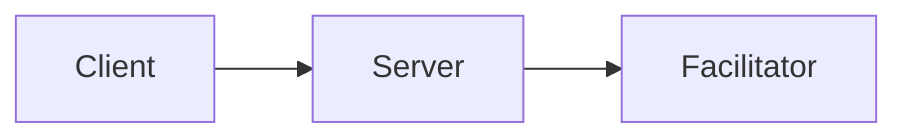

# Documentation Style Guide

This guide ensures consistency across all x402 documentation.

## Terminology

Use the exact terms from the [glossary](./09-appendix/glossary.md). Do not invent synonyms.

### Core Components

| Correct | Incorrect |
|---------|-----------|
| x402Client | X402Client, x402 client, Client class |
| x402ResourceServer | ResourceServer, x402Server, server class |
| x402Facilitator | Facilitator class, x402 facilitator |
| HTTPFacilitatorClient | HTTP Facilitator Client, FacilitatorClient |

### Payment Concepts

| Correct | Incorrect |
|---------|-----------|
| payment payload | payment object, signed payment |
| payment requirements | payment options, payment config |
| payment scheme | payment method, payment type |
| exact scheme | Exact, exact payment |

### Network Identifiers

| Correct | Incorrect |
|---------|-----------|
| `eip155:84532` | Base Sepolia, base-sepolia, chain 84532 |
| `eip155:8453` | Base Mainnet, base-mainnet |
| CAIP-2 identifier | chain ID (when referring to the full format) |

Always use CAIP-2 format in code examples: `eip155:<chainId>` or `solana:<genesisHash>`.

### Operations

| Correct | Incorrect |
|---------|-----------|
| verify | validate, check |
| settle | execute, finalize, complete |
| register scheme | add scheme, install scheme |

### HTTP Headers

| Correct | Incorrect |
|---------|-----------|
| `PAYMENT-SIGNATURE` | Payment-Signature, payment signature header |
| `PAYMENT-REQUIRED` | Payment-Required, payment requirements header |
| `PAYMENT-RESPONSE` | Payment-Response, settlement header |

## Voice and Tone

### Be Direct

Write in second person, active voice.

```markdown
<!-- Good -->
Create a client and register the EVM scheme:

<!-- Avoid -->
The developer should create a client and the EVM scheme should be registered:
```

### Be Concise

Omit unnecessary words.

```markdown
<!-- Good -->
The client signs payment authorizations locally.

<!-- Avoid -->
What the client does is it signs payment authorizations on the local machine.
```

### Explain Why

Don't just document what - explain why it matters.

```markdown
<!-- Good -->
Register schemes before making requests. Unregistered schemes cause silent failures
that are difficult to debug.

<!-- Avoid -->
Register schemes before making requests.
```

## Code Examples

### Complete Imports

Always include full imports. Never use `...` to abbreviate.

```typescript
// Good
import { x402Client } from "@x402/core/client";
import { registerExactEvmScheme } from "@x402/evm/exact/client";
import { wrapFetchWithPayment } from "@x402/fetch";
import { privateKeyToAccount } from "viem/accounts";

// Avoid
import { x402Client } from "@x402/core/client";
// ... other imports
```

### Runnable Examples

Code examples must be copy-paste runnable with appropriate setup.

```typescript
// Good - complete and runnable
const client = new x402Client();
registerExactEvmScheme(client, { signer: privateKeyToAccount(privateKey) });

const fetchWithPayment = wrapFetchWithPayment(fetch, client);
const response = await fetchWithPayment("http://server/protected");

// Avoid - missing setup
const response = await fetchWithPayment("http://server/protected");
```

### V2 Patterns Only

Always use V2 registration patterns, never V1 class instantiation.

```typescript
// CORRECT (V2)
const client = new x402Client();
registerExactEvmScheme(client, { signer });

// WRONG (V1 - never use)
const client = new ExactEvmClient(signer);
```

## Formatting

### Headings

Use sentence case for headings.

```markdown
<!-- Good -->
## Server lifecycle hooks

<!-- Avoid -->
## Server Lifecycle Hooks
```

Exception: Product names and acronyms retain their case (x402, EVM, CAIP-2).

### Lists

Use bullet points for unordered items, numbered lists for sequential steps.

```markdown
<!-- Unordered (no sequence) -->
Components that support hooks:
- x402Client
- x402ResourceServer
- x402Facilitator

<!-- Ordered (sequence matters) -->
1. Create the client
2. Register schemes
3. Make requests
```

### Tables

Use tables for structured comparisons.

```markdown
| Hook | Can Abort | Can Recover |
|------|-----------|-------------|
| onBeforeVerify | Yes | No |
| onAfterVerify | No | No |
```

### Code Blocks

Always specify the language.

````markdown
```typescript
// TypeScript code
```

```bash
# Shell commands
```

```json
{ "config": "value" }
```
````

## Diagrams

### Mermaid Only

Use Mermaid for all diagrams. Never use ASCII art.

```markdown
<!-- Good -->


<!-- Avoid -->
```
Client ---> Server ---> Facilitator
```
```

### Diagram Reference

For Mermaid syntax, see: https://gist.github.com/ChristopherA/bffddfdf7b1502215e44cec9fb766dfd

Common diagram types:
- `flowchart LR/TD` - Flow diagrams
- `sequenceDiagram` - Interaction sequences
- `classDiagram` - Class structures

## Links

### Internal Links

Use relative paths for internal links.

```markdown
<!-- Good -->
See [glossary](./09-appendix/glossary.md)
See [architecture](../01-overview/architecture.md)

<!-- Avoid -->
See [glossary](/docs/09-appendix/glossary.md)
```

### External Links

Use descriptive link text.

```markdown
<!-- Good -->
See the [EIP-3009 specification](https://eips.ethereum.org/EIPS/eip-3009)

<!-- Avoid -->
See https://eips.ethereum.org/EIPS/eip-3009
```

## Callouts

Use GitHub-flavored callouts for important information.

```markdown
> [!NOTE]
> Additional context that may be helpful.

> [!TIP]
> Helpful suggestion for best practices.

> [!IMPORTANT]
> Critical information users must know.

> [!WARNING]
> Potential pitfall or dangerous action.

> [!CAUTION]
> Negative consequences of an action.
```

## What to Avoid

### No Emojis

Never use emojis in documentation unless explicitly requested.

### No Marketing Language

Avoid superlatives and promotional language.

```markdown
<!-- Avoid -->
x402 is an incredibly powerful, revolutionary protocol...

<!-- Good -->
x402 enables programmatic micropayments for API access.
```

### No Time Estimates

Never include time estimates or scheduling language.

```markdown
<!-- Avoid -->
This will take about 30 minutes to implement.

<!-- Good -->
Implementation requires these steps:
```

### No Legacy Patterns

Never document V1/legacy patterns. Always use current V2 APIs.

## File Structure

### Document Header

Every doc starts with a VERIFIED marker and title.

```markdown
<!-- VERIFIED: abc1234 -->
# Document Title

Brief introduction explaining what this document covers.
```

### Section Order

1. Introduction/Overview
2. Prerequisites (if any)
3. Quick Start / Basic Usage
4. Detailed Sections
5. Advanced Topics
6. Next Steps / Related Docs

## Review Checklist

Before finalizing any documentation:

- [ ] All terminology matches glossary
- [ ] Code examples are complete and runnable
- [ ] Uses V2 patterns only
- [ ] Mermaid for diagrams (no ASCII)
- [ ] No emojis
- [ ] All internal links resolve
- [ ] VERIFIED marker present
